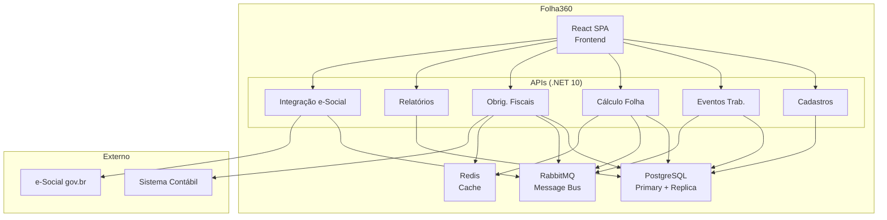

# Arquitetura do Folha360

Bem-vindo à documentação de arquitetura de software do **Folha360** — sistema de folha de pagamento compatível com e-Social v. S-1.3.

## 🎯 Visão Geral

O Folha360 é um sistema distribuído e modular para processamento de folha de pagamento, desenvolvido em **.NET 10 + React + PostgreSQL**, projetado para suportar **100.000+ funcionários** com processamento mensal em **menos de 2 horas**.

### Stack Tecnológica
| Camada | Tecnologia |
|---|---|
| Backend | .NET 10 (C#) — APIs RESTful |
| Frontend | React SPA (Vite) |
| Banco de Dados | PostgreSQL 16 |
| Cache | Redis 7 |
| Mensageria | RabbitMQ 3.13 |
| Containerização | Docker + Kubernetes |
| Observabilidade | Seq + Prometheus + Grafana |

### Módulos do Sistema
1. **Cadastros** — Funcionários, empresas, cargos, rubricas
2. **Eventos Trabalhistas** — Admissão, férias, afastamentos, desligamentos (S-2200, S-2230, S-2299)
3. **Cálculo da Folha** — Remuneração, descontos, holerites (S-1200/S-1210) — [ADR-007](outputs/arquitetura/adr-007-motor-calculo-folha.md) | [Runbook](outputs/instrucoes/runbook-f04-processamento.md)
4. **Obrigações Fiscais** — IRRF, INSS, FGTS (S-5001/S-5002)
5. **Relatórios** — Holerites, DIRF, RAIS, exportações
6. **Integração e-Social** — Envio de eventos, consulta de recibos

---

## 📚 Estrutura da Documentação

### 🏛️ Visões Arquiteturais (C4)
- [Visão em Camadas](outputs/arquitetura/layered-architecture.md) — Arquitetura em 4 camadas lógicas
- [Fronteiras de Componentes](outputs/arquitetura/component-boundaries.md) — Bounded contexts e responsabilidades
- [Fronteiras de Integração](outputs/arquitetura/integration-boundaries.md) — Contratos, mensageria e riscos
- [Visão de Deployment](outputs/arquitetura/deployment-view.md) — Infraestrutura e containers
- [Visão de Runtime](outputs/arquitetura/runtime-view.md) — Fluxos de execução e sequências

### ✅ Decisões de Arquitetura (ADRs)
- [ADR-001: Monólito Modular](outputs/arquitetura/adr-001-monolito-modular.md)
- [ADR-002: RabbitMQ como Message Broker](outputs/arquitetura/adr-002-rabbitmq-message-broker.md)
- [ADR-003: Schema por Tenant](outputs/arquitetura/adr-003-schema-por-tenant.md)
- [ADR-004: Processamento Assíncrono da Folha](outputs/arquitetura/adr-004-processamento-assincrono-folha.md)
- [ADR-005: Redis para Cache de Tabelas](outputs/arquitetura/adr-005-redis-cache-tabelas.md)

### 🔍 Análises e Avaliações
- [Cenários de Atributos de Qualidade](outputs/arquitetura/quality-attribute-scenarios.md) — Performance, segurança, disponibilidade
- [Registro de Riscos](outputs/arquitetura/architecture-risk-register.md) — Heatmap e mitigações
- [Matriz de Tradeoffs](outputs/arquitetura/tradeoff-matrix.md) — Análise comparativa de decisões
- [Opções Arquiteturais](outputs/arquitetura/architecture-options.md) — Decisões em aberto

---

## 🚀 Comece Por Aqui

| Perfil | Leitura Recomendada |
|---|---|
| **Desenvolvedor Backend** | [Layered Architecture](outputs/arquitetura/layered-architecture.md) → [Component Boundaries](outputs/arquitetura/component-boundaries.md) → [ADR-001](outputs/arquitetura/adr-001-monolito-modular.md) |
| **Desenvolvedor Frontend** | [Layered Architecture](outputs/arquitetura/layered-architecture.md) → [Runtime View](outputs/arquitetura/runtime-view.md) |
| **DevOps / SRE** | [Deployment View](outputs/arquitetura/deployment-view.md) → [Quality Scenarios](outputs/arquitetura/quality-attribute-scenarios.md) → [Risk Register](outputs/arquitetura/architecture-risk-register.md) |
| **Arquiteto / Tech Lead** | Leitura completa na ordem da sidebar |
| **Product Owner / PM** | Home → [Quality Scenarios](outputs/arquitetura/quality-attribute-scenarios.md) → [Risk Register](outputs/arquitetura/architecture-risk-register.md) |

---

## 📊 Diagrama Geral da Arquitetura

---

## 🔗 Links Rápidos
- [Contexto do Projeto](../inputs/prompts/folha360.md)
- [Templates de Arquitetura](../../../templates/)
- [Skills de Arquitetura](../../../agents/skills/)

---

*Última atualização: Junho 2026 | Versão dos layouts e-Social: S-1.3 (cons. até NT 06.2026)*
