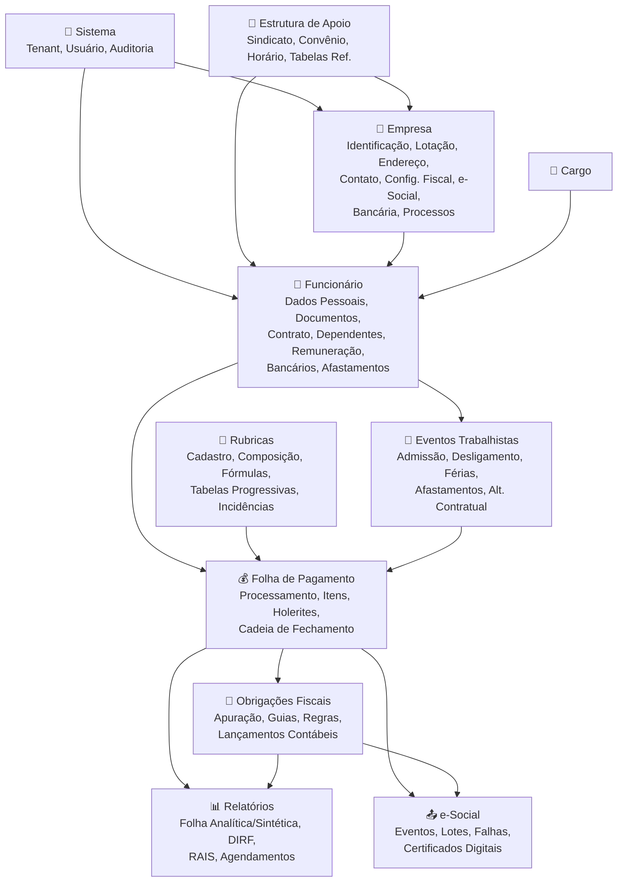

# 📊 Folha360 — Agrupamento de Cadastros e Processos

> **Objetivo**: Organizar todos os registros do sistema em grupos funcionais hierárquicos, 
> com mapeamento completo de endpoints, payloads e propriedades para servir de base à 
> construção dos formulários e telas do sistema.
>
> **Data**: 26/06/2026  
> **Base**: Mapeamento completo das entidades do backend (Domain + Infrastructure + Presentation + Application)  
> **Versão**: 2.0

---

## 🗂️ Estrutura de Agrupamento

Cada grupo representa um contexto funcional do Departamento Pessoal. Os subgrupos organizam 
os registros que compõem cada contexto. Para cada subgrupo são listados os endpoints REST 
e os payloads (comandos/DTOs) com todas as propriedades.

---

## 1. 🏢 Empresa

Agrupa todos os cadastros e configurações da empresa/empregador.

### 1.1 Identificação da Empresa

**Controller**: `EmpresasController` — Base: `/api/empresas`

| Método | Rota | Auth | Request | Response |
|--------|------|------|---------|----------|
| `GET` | `/api/empresas` | Consulta | `ListarEmpresasQuery` (query) | `PaginatedResult<EmpresaDto>` |
| `GET` | `/api/empresas/{id}` | Consulta | — | `EmpresaDto` |
| `POST` | `/api/empresas` | Operador | `CriarEmpresaCommand` (body) | `EmpresaDto` |
| `PUT` | `/api/empresas/{id}` | Operador | `AtualizarEmpresaCommand` (body) | `EmpresaDto` |
| `DELETE` | `/api/empresas/{id}` | Operador | — | `204 NoContent` |

**Query Params (Listar)**:
| Parâmetro | Tipo | Descrição |
|-----------|------|-----------|
| `Page` | `int` | Página (default: 1) |
| `PageSize` | `int` | Itens por página (default: 20) |
| `OrderBy` | `string?` | Campo de ordenação |
| `Cnpj` | `string?` | Filtro por CNPJ |
| `RazaoSocial` | `string?` | Filtro por Razão Social |
| `RegimeTributario` | `string?` | Filtro por Regime Tributário |

**Payload — CriarEmpresaCommand**:
| Campo | Tipo | Obrig. | Descrição |
|-------|------|--------|-----------|
| `Cnpj` | `string` | ✅ | CNPJ da empresa (14 dígitos) |
| `RazaoSocial` | `string` | ✅ | Razão Social |
| `NomeFantasia` | `string?` | | Nome Fantasia |
| `Cnae` | `string?` | | Código CNAE principal |
| `RegimeTributario` | `string` | ✅ | Simples Nacional / Lucro Presumido / Lucro Real |
| `Fpas` | `string?` | | Código FPAS |
| `CodigoTerceiros` | `string?` | | Código de Terceiros (S-1000) |
| `ClassificacaoTributaria` | `string?` | | Classificação tributária |
| `MatrizFilial` | `string?` | | Indicador Matriz/Filial |
| `CnpjMatriz` | `string?` | | CNPJ da matriz (se filial) |
| `EnderecoLogradouro` | `string?` | | Logradouro |
| `EnderecoNumero` | `string?` | | Número |
| `EnderecoComplemento` | `string?` | | Complemento |
| `EnderecoBairro` | `string?` | | Bairro |
| `EnderecoCep` | `string?` | | CEP |
| `EnderecoMunicipio` | `string?` | | Município |
| `EnderecoUf` | `string?` | | UF |
| `Telefone` | `string?` | | Telefone |
| `Email` | `string?` | | E-mail |

**Payload — AtualizarEmpresaCommand**: Mesmos campos de `CriarEmpresaCommand` (exceto `Cnpj`, não alterável).

**Response — EmpresaDto**:
| Campo | Tipo | Descrição |
|-------|------|-----------|
| `Id` | `Guid` | Identificador único |
| `TenantId` | `Guid` | Tenant vinculado |
| `Cnpj` | `string` | CNPJ |
| `RazaoSocial` | `string` | Razão Social |
| `NomeFantasia` | `string?` | Nome Fantasia |
| `Cnae` | `string?` | CNAE |
| `RegimeTributario` | `string` | Regime Tributário |
| `Fpas` | `string?` | FPAS |
| `CodigoTerceiros` | `string?` | Código Terceiros |
| `ClassificacaoTributaria` | `string?` | Classificação Tributária |
| `MatrizFilial` | `string?` | Matriz/Filial |
| `CnpjMatriz` | `string?` | CNPJ Matriz |
| `EnderecoLogradouro`..`EnderecoUf` | `string?` | Campos de endereço |
| `Telefone` | `string?` | Telefone |
| `Email` | `string?` | E-mail |
| `CreatedAt` | `DateTime` | Data de criação |
| `UpdatedAt` | `DateTime` | Data de atualização |

---

### 1.2 Lotação

**Controller**: `LotacoesController` — Base: `/api/lotacoes`

| Método | Rota | Auth | Request | Response |
|--------|------|------|---------|----------|
| `GET` | `/api/lotacoes` | Consulta | `ListarLotacoesQuery` (query) | `PaginatedResult<LotacaoDto>` |
| `GET` | `/api/lotacoes/{id}` | Consulta | — | `LotacaoDto` |
| `POST` | `/api/lotacoes` | Operador | `CriarLotacaoCommand` (body) | `LotacaoDto` |
| `PUT` | `/api/lotacoes/{id}` | Operador | `AtualizarLotacaoCommand` (body) | `LotacaoDto` |
| `DELETE` | `/api/lotacoes/{id}` | Operador | — | `204` |

**Query Params (Listar)**: `Page`, `PageSize`, `OrderBy`, `EmpresaId?`, `Codigo?`, `Descricao?`

**Payload — CriarLotacaoCommand**:
| Campo | Tipo | Obrig. | Descrição |
|-------|------|--------|-----------|
| `EmpresaId` | `Guid` | ✅ | Empresa vinculada |
| `Codigo` | `string` | ✅ | Código da lotação |
| `Descricao` | `string` | ✅ | Descrição |
| `TipoEsocial` | `string?` | | Tipo e-Social (Matriz/Filial/Obra/Estabelecimento/Unidade/Gerencial) |

**Response — LotacaoDto**: `Id`, `EmpresaId`, `Codigo`, `Descricao`, `TipoEsocial?`, `CreatedAt`, `UpdatedAt`

---

### 1.3 Endereço

**Controller**: `EmpresasEnderecosController` — Base: `/api/empresas/{empresaId}/enderecos`

| Método | Rota | Auth | Request | Response |
|--------|------|------|---------|----------|
| `GET` | `/api/empresas/{empresaId}/enderecos` | Consulta | — | `IEnumerable<EnderecoEmpresa>` |
| `GET` | `.../{id}` | Consulta | — | `EnderecoEmpresa` |
| `POST` | `...` | Operador | `EnderecoEmpresa` (body) | `EnderecoEmpresa` |
| `DELETE` | `.../{id}` | Operador | — | `204` |

**Payload/Response — EnderecoEmpresa**:
| Campo | Tipo | Obrig. | Descrição |
|-------|------|--------|-----------|
| `Id` | `Guid` | — | Identificador |
| `EmpresaId` | `Guid` | ✅ | Empresa |
| `Tipo` | `string` | ✅ | Principal / Fiscal / Cobrança / Entrega / Obra |
| `Logradouro` | `string` | ✅ | Logradouro |
| `Numero` | `string?` | | Número |
| `Complemento` | `string?` | | Complemento |
| `Bairro` | `string?` | | Bairro |
| `Cep` | `string?` | | CEP |
| `MunicipioId` | `Guid?` | | Município (IBGE) |
| `Uf` | `string?` | | UF |
| `Estrangeiro` | `bool` | | Endereço no exterior |
| `Pais` | `string?` | | País (se estrangeiro) |

---

### 1.4 Contato

**Controller**: `EmpresasContatosController` — Base: `/api/empresas/{empresaId}/contatos`

| Método | Rota | Auth | Request | Response |
|--------|------|------|---------|----------|
| `GET` | `/api/empresas/{empresaId}/contatos` | Consulta | — | `IEnumerable<ContatoEmpresa>` |
| `GET` | `.../{id}` | Consulta | — | `ContatoEmpresa` |
| `POST` | `...` | Operador | `ContatoEmpresa` (body) | `ContatoEmpresa` |
| `DELETE` | `.../{id}` | Operador | — | `204` |

**Payload/Response — ContatoEmpresa**:
| Campo | Tipo | Obrig. | Descrição |
|-------|------|--------|-----------|
| `Id` | `Guid` | — | Identificador |
| `EmpresaId` | `Guid` | ✅ | Empresa |
| `Tipo` | `string` | ✅ | Diretor / Gerente / Sócio / Presidente / Procurador / Contador / RH / TI / Preposto |
| `Nome` | `string` | ✅ | Nome do contato |
| `Cpf` | `string?` | | CPF (criptografado) |
| `Cargo` | `string?` | | Cargo |
| `Email` | `string?` | | E-mail |
| `Telefone` | `string?` | | Telefone fixo |
| `Celular` | `string?` | | Celular |
| `ContatoPrincipal` | `bool` | | É o contato principal? |
| `Ativo` | `bool` | | Ativo? |
| `DataInicioVigencia` | `DateOnly?` | | Início da vigência |
| `DataFimVigencia` | `DateOnly?` | | Fim da vigência |

---

### 1.5 Configuração Fiscal

> **Nota**: As configurações fiscais fazem parte da entidade `Empresa` e são gerenciadas via 
> `PUT /api/empresas/{id}` (seção 1.1). Os campos fiscais no `AtualizarEmpresaCommand` são:

| Campo | Tipo | Descrição |
|-------|------|-----------|
| `RegimeTributario` | `string` | Simples Nacional / Lucro Presumido / Lucro Real |
| `ClassificacaoTributaria` | `string?` | Classificação tributária |
| `Fpas` | `string?` | Código FPAS |
| `CodigoTerceiros` | `string?` | Código de Terceiros (S-1000) |
| `Cnae` | `string?` | CNAE principal |

---

### 1.6 Configuração e-Social

**Controller**: `EmpresasConfigESocialController` — Base: `/api/empresas/{empresaId}/config-esocial`

| Método | Rota | Auth | Request | Response |
|--------|------|------|---------|----------|
| `GET` | `/api/empresas/{empresaId}/config-esocial` | Contador | — | `ConfiguracaoESocial` |
| `PUT` | `...` | Admin | `ConfiguracaoESocial` (body) | `204` |

**Payload/Response — ConfiguracaoESocial**:
| Campo | Tipo | Obrig. | Descrição |
|-------|------|--------|-----------|
| `Id` | `Guid` | — | Identificador |
| `EmpresaId` | `Guid` | ✅ | Empresa |
| `Ambiente` | `string` | ✅ | Produção / Produção Restrita |
| `CertificadoDigitalTipo` | `string?` | | A1 / A3 |
| `CertificadoVencimento` | `DateOnly?` | | Vencimento do certificado |
| `VersaoLayout` | `string?` | | Versão do layout e-Social |
| `CodigoTransmissor` | `string?` | | Código do transmissor |
| `GrupoEsocial` | `string?` | | Grupo e-Social (1-4) |
| `DataInicioObrigatoriedade` | `DateOnly?` | | Data início obrigatoriedade |

---

### 1.7 Configuração Bancária da Empresa

**Controller**: `EmpresasConfiguracoesBancariasController` — Base: `/api/empresas/{empresaId}/configuracoes-bancarias`

| Método | Rota | Auth | Request | Response |
|--------|------|------|---------|----------|
| `GET` | `/api/empresas/{empresaId}/configuracoes-bancarias` | Consulta | — | `IEnumerable<ConfiguracaoBancariaEmpresa>` |
| `GET` | `.../{id}` | Consulta | — | `ConfiguracaoBancariaEmpresa` |
| `POST` | `...` | Operador | `ConfiguracaoBancariaEmpresa` (body) | `ConfiguracaoBancariaEmpresa` |
| `DELETE` | `.../{id}` | Operador | — | `204` |

**Payload/Response — ConfiguracaoBancariaEmpresa**:
| Campo | Tipo | Obrig. | Descrição |
|-------|------|--------|-----------|
| `Id` | `Guid` | — | Identificador |
| `EmpresaId` | `Guid` | ✅ | Empresa |
| `BancoId` | `Guid` | ✅ | Banco (referência `BancoFebraban`) |
| `Agencia` | `string` | ✅ | Agência |
| `AgenciaDv` | `string?` | | Dígito da agência |
| `Conta` | `string` | ✅ | Conta |
| `ContaDv` | `string?` | | Dígito da conta |
| `TipoConta` | `string` | ✅ | Corrente / Poupança |
| `ChavePix` | `string?` | | Chave PIX (criptografada) |
| `Finalidade` | `string` | ✅ | Folha / Tributos / Fornecedor / Geral |
| `Ativa` | `bool` | | Conta ativa? |

---

### 1.8 Configurações Gerais

**Controller**: `EmpresasConfiguracoesGeraisController` — Base: `/api/empresas/{empresaId}/configuracoes-gerais`

| Método | Rota | Auth | Request | Response |
|--------|------|------|---------|----------|
| `GET` | `/api/empresas/{empresaId}/configuracoes-gerais` | Consulta | — | `IEnumerable<ConfiguracaoGeral>` |
| `PUT` | `...` | Operador | `Dictionary<string,string>` (body) | `204` |

**Response — ConfiguracaoGeral**:
| Campo | Tipo | Descrição |
|-------|------|-----------|
| `Id` | `Guid` | Identificador |
| `EmpresaId` | `Guid` | Empresa |
| `Chave` | `string` | Chave do parâmetro |
| `Valor` | `string` | Valor do parâmetro |

**Chaves típicas**: `DiaPagamento`, `PercentualAdiantamento`, `PercentualVT`, `AbonoPecuniario`, `ToleranciaPonto`

---

### 1.9 Processos Administrativos / Judiciais

**Controller**: `ProcessosAdministrativosController` — Base: `/api/processos-administrativos`

| Método | Rota | Auth | Request | Response |
|--------|------|------|---------|----------|
| `GET` | `/api/processos-administrativos` | Consulta | `empresaId?`, `tipo?` (query) | `IEnumerable<ProcessoAdministrativo>` |
| `GET` | `.../{id}` | Consulta | — | `ProcessoAdministrativo` |
| `POST` | `...` | Operador | `ProcessoAdministrativo` (body) | `ProcessoAdministrativo` |
| `PUT` | `.../{id}` | Operador | `ProcessoAdministrativo` (body) | `204` |
| `DELETE` | `.../{id}` | Operador | — | `204` |
| `GET` | `.../{id}/rubricas` | Consulta | — | `IEnumerable<RubricaProcesso>` |
| `POST` | `.../{id}/rubricas` | Operador | `RubricaProcesso` (body) | `RubricaProcesso` |
| `DELETE` | `.../{id}/rubricas/{rpId}` | Operador | — | `204` |

**Payload/Response — ProcessoAdministrativo**:
| Campo | Tipo | Obrig. | Descrição |
|-------|------|--------|-----------|
| `Id` | `Guid` | — | Identificador |
| `EmpresaId` | `Guid` | ✅ | Empresa |
| `NumeroProcesso` | `string` | ✅ | Número do processo |
| `Tipo` | `string` | ✅ | Administrativo / Judicial |
| `Orgao` | `string?` | | Órgão |
| `DataInicio` | `DateTime?` | | Data de início |
| `DataFim` | `DateTime?` | | Data de fim |
| `Observacao` | `string?` | | Observações |

**Payload — RubricaProcesso** (vínculo N:N):
| Campo | Tipo | Obrig. | Descrição |
|-------|------|--------|-----------|
| `RubricaId` | `Guid` | ✅ | Rubrica vinculada |
| `ProcessoAdministrativoId` | `Guid` | ✅ | Processo |

---

## 2. 👤 Funcionário

Agrupa todos os dados relacionados ao trabalhador.

### 2.1 Dados do Funcionário

**Controller**: `FuncionariosController` — Base: `/api/funcionarios`

| Método | Rota | Auth | Request | Response |
|--------|------|------|---------|----------|
| `GET` | `/api/funcionarios` | Consulta | `ListarFuncionariosQuery` (query) | `PaginatedResult<FuncionarioDto>` |
| `GET` | `/api/funcionarios/{id}` | Consulta | — | `FuncionarioDto` |
| `POST` | `/api/funcionarios` | Operador | `CriarFuncionarioCommand` (body) | `FuncionarioDto` |
| `PUT` | `/api/funcionarios/{id}` | Operador | `AtualizarFuncionarioCommand` (body) | `FuncionarioDto` |
| `DELETE` | `/api/funcionarios/{id}` | Operador | — | `204` |

**Query Params (Listar)**: `Page`, `PageSize`, `OrderBy`, `EmpresaId?`, `Status?`, `CargoId?`, `LotacaoId?`, `Nome?`

**Payload — CriarFuncionarioCommand**:
| Campo | Tipo | Obrig. | Descrição |
|-------|------|--------|-----------|
| `EmpresaId` | `Guid` | ✅ | Empresa |
| `Nome` | `string` | ✅ | Nome completo |
| `Cpf` | `string` | ✅ | CPF (11 dígitos) |
| `DataAdmissao` | `DateOnly` | ✅ | Data de admissão |
| `CargoId` | `Guid` | ✅ | Cargo |
| `LotacaoId` | `Guid` | ✅ | Lotação |
| `SalarioBase` | `decimal` | ✅ | Salário base |
| `DataNascimento` | `DateOnly?` | | Data de nascimento |
| `Sexo` | `string?` | | Masculino / Feminino |
| `EstadoCivil` | `string?` | | Solteiro / Casado / Divorciado / Viúvo / União Estável |
| `Nacionalidade` | `string?` | | Nacionalidade |
| `NomeMae` | `string?` | | Nome da mãe |
| `NomePai` | `string?` | | Nome do pai |
| `TipoContrato` | `string?` | | Tipo de contrato |
| `JornadaHorasSemanais` | `int?` | | Jornada semanal (horas) |
| `EnderecoLogradouro` | `string?` | | Logradouro residencial |
| `EnderecoNumero` | `string?` | | Número |
| `EnderecoComplemento` | `string?` | | Complemento |
| `EnderecoBairro` | `string?` | | Bairro |
| `EnderecoCep` | `string?` | | CEP |
| `EnderecoMunicipio` | `string?` | | Município |
| `EnderecoUf` | `string?` | | UF |
| `Telefone` | `string?` | | Telefone |
| `Email` | `string?` | | E-mail |

**Response — FuncionarioDto**:
| Campo | Tipo | Descrição |
|-------|------|-----------|
| `Id` | `Guid` | Identificador |
| `EmpresaId` | `Guid` | Empresa |
| `Nome` | `string` | Nome |
| `CpfMascarado` | `string` | CPF mascarado (ex: `***.456.789-**`) |
| `DataNascimento` | `DateOnly?` | Data de nascimento |
| `Sexo` | `string?` | Sexo |
| `EstadoCivil` | `string?` | Estado civil |
| `Nacionalidade` | `string?` | Nacionalidade |
| `NomeMae` | `string?` | Nome da mãe |
| `NomePai` | `string?` | Nome do pai |
| `DataAdmissao` | `DateOnly` | Data de admissão |
| `DataDesligamento` | `DateOnly?` | Data de desligamento |
| `Status` | `string` | Status (Ativo / Inativo / Bloqueado) |
| `CargoId` | `Guid` | Cargo |
| `LotacaoId` | `Guid` | Lotação |
| `SalarioBase` | `decimal` | Salário base |
| `TipoContrato` | `string?` | Tipo de contrato |
| `JornadaHorasSemanais` | `int?` | Jornada semanal |
| `CreatedAt` | `DateTime` | Data de criação |
| `UpdatedAt` | `DateTime` | Data de atualização |

---

### 2.2 Documentos

**Controller**: `DocumentosController` — Base: `/api/documentos`

| Método | Rota | Auth | Request | Response |
|--------|------|------|---------|----------|
| `GET` | `/api/documentos?funcionarioId=` | Consulta | `funcionarioId` (query) | `IEnumerable<Documento>` |
| `GET` | `/api/documentos/{id}` | Consulta | — | `Documento` |
| `POST` | `/api/documentos` | Operador | `Documento` (body) | `Documento` |
| `PUT` | `/api/documentos/{id}` | Operador | `Documento` (body) | `204` |
| `DELETE` | `/api/documentos/{id}` | Operador | — | `204` |

**Payload/Response — Documento**:
| Campo | Tipo | Obrig. | Descrição |
|-------|------|--------|-----------|
| `Id` | `Guid` | — | Identificador |
| `FuncionarioId` | `Guid` | ✅ | Funcionário |
| `Tipo` | `string` | ✅ | CPF / RG / CNH / CTPS / PIS-PASEP / NIS-NIT / Título Eleitor / Certidão / RNE-CIE |
| `Numero` | `string` | ✅ | Número do documento (criptografado) |
| `DataEmissao` | `DateOnly?` | | Data de emissão |
| `DataValidade` | `DateOnly?` | | Data de validade |
| `OrgaoEmissor` | `string?` | | Órgão emissor |
| `UfEmissor` | `string?` | | UF de emissão |
| `ArquivoPath` | `string?` | | Caminho do arquivo anexo (MinIO) |

---

### 2.3 Contrato de Trabalho

**Controller**: `FuncionariosContratoController` — Base: `/api/funcionarios/{funcionarioId}/contrato`

| Método | Rota | Auth | Request | Response |
|--------|------|------|---------|----------|
| `GET` | `/api/funcionarios/{funcionarioId}/contrato` | Consulta | — | `ContratoTrabalho` |
| `POST` | `...` | Operador | `ContratoTrabalho` (body) | `ContratoTrabalho` |
| `PUT` | `...` | Operador | `ContratoTrabalho` (body) | `204` |

**Payload/Response — ContratoTrabalho**:
| Campo | Tipo | Obrig. | Descrição |
|-------|------|--------|-----------|
| `Id` | `Guid` | — | Identificador |
| `FuncionarioId` | `Guid` | ✅ | Funcionário |
| `EmpresaId` | `Guid` | ✅ | Empresa |
| `LotacaoId` | `Guid?` | | Lotação |
| `CargoId` | `Guid?` | | Cargo (CBO) |
| `HorarioTrabalhoId` | `Guid?` | | Horário de trabalho |
| `SindicatoId` | `Guid?` | | Sindicato |
| `DataAdmissao` | `DateOnly` | ✅ | Data de admissão |
| `DataDesligamento` | `DateOnly?` | | Data de desligamento |
| `TipoAdmissao` | `string?` | | Tipo de admissão |
| `TipoContrato` | `string` | ✅ | CLT Indeterminado / Determinado / Experiência / Aprendiz / Estágio / Intermitente / Temporário / PJ / Cooperado / Autônomo |
| `DataTerminoContrato` | `DateOnly?` | | Data de término (contrato determinado) |
| `SalarioBase` | `decimal` | ✅ | Salário base (criptografado) |
| `TipoSalario` | `string` | ✅ | Mensalista / Horista / Diarista / Semanalista / Tarefa |
| `CargaHorariaSemanal` | `int?` | | Carga horária semanal |
| `CategoriaTrabalhador` | `string?` | | Categoria do trabalhador |
| `IndicativoAdmissao` | `string?` | | Indicativo de admissão (e-Social) |
| `Status` | `string` | ✅ | Ativo / Inativo |

---

### 2.4 Dependentes

**Controller**: `DependentesController` — Base: `/api/dependentes`

| Método | Rota | Auth | Request | Response |
|--------|------|------|---------|----------|
| `GET` | `/api/dependentes?funcionarioId=` | Consulta | `funcionarioId` (query) | `IEnumerable<Dependente>` |
| `GET` | `/api/dependentes/{id}` | Consulta | — | `Dependente` |
| `POST` | `/api/dependentes` | Operador | `Dependente` (body) | `Dependente` |
| `PUT` | `/api/dependentes/{id}` | Operador | `Dependente` (body) | `204` |
| `DELETE` | `/api/dependentes/{id}` | Operador | — | `204` |

**Payload/Response — Dependente**:
| Campo | Tipo | Obrig. | Descrição |
|-------|------|--------|-----------|
| `Id` | `Guid` | — | Identificador |
| `FuncionarioId` | `Guid` | ✅ | Funcionário |
| `Nome` | `string` | ✅ | Nome do dependente |
| `Cpf` | `string` | ✅ | CPF (criptografado) |
| `DataNascimento` | `DateOnly` | ✅ | Data de nascimento |
| `Tipo` | `string` | ✅ | Filho / Enteado / Cônjuge / Pais / Irmão / Curatela / Pensão |
| `GrauParentesco` | `string?` | | Grau de parentesco |
| `DependenteIrrf` | `bool` | | Dependente para IRRF? |
| `DependenteSalarioFamilia` | `bool` | | Dependente para Salário-Família? |
| `PensaoAlimenticiaValor` | `decimal?` | | Valor da pensão alimentícia |
| `PensaoAlimenticiaPercentual` | `decimal?` | | Percentual da pensão |

---

### 2.5 Remuneração e Benefícios

**Controller**: `FuncionariosRemuneracaoController` — Base: `/api/funcionarios/{funcionarioId}/remuneracao`

| Método | Rota | Auth | Request | Response |
|--------|------|------|---------|----------|
| `GET` | `/api/funcionarios/{funcionarioId}/remuneracao` | Consulta | — | `RemuneracaoBeneficio` |
| `PUT` | `...` | Operador | `RemuneracaoBeneficio` (body) | `204` |

**Payload/Response — RemuneracaoBeneficio**:
| Campo | Tipo | Obrig. | Descrição |
|-------|------|--------|-----------|
| `Id` | `Guid` | — | Identificador |
| `FuncionarioId` | `Guid` | ✅ | Funcionário |
| `ConvenioId` | `Guid?` | | Convênio vinculado |
| `SalarioBase` | `decimal` | ✅ | Salário base (criptografado) |
| `ValorHora` | `decimal?` | | Valor da hora |
| `AdicionalInsalubridade` | `decimal?` | | % Adicional de insalubridade |
| `AdicionalPericulosidade` | `decimal?` | | % Adicional de periculosidade |
| `AdicionalNoturnoPercentual` | `decimal?` | | % Adicional noturno |
| `AdicionalTransferenciaPercentual` | `decimal?` | | % Adicional de transferência |
| `ValeTransporte` | `bool` | | Recebe vale-transporte? |
| `ValeTransporteValor` | `decimal?` | | Valor do VT |
| `ValeRefeicao` | `bool` | | Recebe vale-refeição? |
| `ValeRefeicaoValorDiario` | `decimal?` | | Valor diário do VR |
| `PlanoSaude` | `bool` | | Possui plano de saúde? |
| `PlanoSaudeValor` | `decimal?` | | Valor do plano de saúde |
| `PlanoOdontologico` | `bool` | | Possui plano odontológico? |
| `PlanoOdontologicoValor` | `decimal?` | | Valor do plano odontológico |
| `SeguroVida` | `bool` | | Possui seguro de vida? |
| `SeguroVidaValor` | `decimal?` | | Valor do seguro de vida |
| `PrevidenciaPrivada` | `bool` | | Possui previdência privada? |
| `PrevidenciaPrivadaValor` | `decimal?` | | Valor da previdência privada |

---

### 2.6 Dados Bancários do Funcionário

**Controller**: `FuncionariosDadosBancariosController` — Base: `/api/funcionarios/{funcionarioId}/dados-bancarios`

| Método | Rota | Auth | Request | Response |
|--------|------|------|---------|----------|
| `GET` | `/api/funcionarios/{funcionarioId}/dados-bancarios` | Consulta | — | `IEnumerable<DadosBancariosFuncionario>` |
| `GET` | `.../{id}` | Consulta | — | `DadosBancariosFuncionario` |
| `POST` | `...` | Operador | `DadosBancariosFuncionario` (body) | `DadosBancariosFuncionario` |
| `DELETE` | `.../{id}` | Operador | — | `204` |

**Payload/Response — DadosBancariosFuncionario**:
| Campo | Tipo | Obrig. | Descrição |
|-------|------|--------|-----------|
| `Id` | `Guid` | — | Identificador |
| `FuncionarioId` | `Guid` | ✅ | Funcionário |
| `BancoId` | `Guid` | ✅ | Banco (referência `BancoFebraban`) |
| `Agencia` | `string` | ✅ | Agência |
| `AgenciaDv` | `string?` | | Dígito da agência |
| `Conta` | `string` | ✅ | Conta |
| `ContaDv` | `string?` | | Dígito da conta |
| `TipoConta` | `string` | ✅ | Corrente / Poupança / Salário |
| `ChavePix` | `string?` | | Chave PIX (criptografada) |
| `ContaPrincipal` | `bool` | | É a conta principal? |

---

### 2.7 Movimentação Fixa

**Controller**: `FuncionariosMovimentacaoFixaController` — Base: `/api/funcionarios/{funcionarioId}/movimentacao-fixa`

| Método | Rota | Auth | Request | Response |
|--------|------|------|---------|----------|
| `GET` | `/api/funcionarios/{funcionarioId}/movimentacao-fixa` | Consulta | — | `IEnumerable<MovimentacaoFixa>` |
| `GET` | `.../{id}` | Consulta | — | `MovimentacaoFixa` |
| `POST` | `...` | Operador | `MovimentacaoFixa` (body) | `MovimentacaoFixa` |
| `DELETE` | `.../{id}` | Operador | — | `204` |

**Payload/Response — MovimentacaoFixa**:
| Campo | Tipo | Obrig. | Descrição |
|-------|------|--------|-----------|
| `Id` | `Guid` | — | Identificador |
| `FuncionarioId` | `Guid` | ✅ | Funcionário |
| `RubricaId` | `Guid` | ✅ | Rubrica |
| `Descricao` | `string?` | | Descrição |
| `Quantidade` | `decimal?` | | Quantidade (ex: horas) |
| `Valor` | `decimal` | ✅ | Valor |

---

### 2.8 Movimentação Mensal

**Controller**: `FuncionariosMovimentacaoMensalController` — Base: `/api/funcionarios/{funcionarioId}/movimentacao-mensal`

| Método | Rota | Auth | Request | Response |
|--------|------|------|---------|----------|
| `GET` | `/api/funcionarios/{funcionarioId}/movimentacao-mensal?mes=` | Consulta | `mes` (query) | `IEnumerable<MovimentacaoMensal>` |
| `POST` | `...` | Operador | `MovimentacaoMensal` (body) | `MovimentacaoMensal` |
| `DELETE` | `.../{id}` | Operador | — | `204` |

**Payload/Response — MovimentacaoMensal**:
| Campo | Tipo | Obrig. | Descrição |
|-------|------|--------|-----------|
| `Id` | `Guid` | — | Identificador |
| `FuncionarioId` | `Guid` | ✅ | Funcionário |
| `RubricaId` | `Guid` | ✅ | Rubrica |
| `Descricao` | `string?` | | Descrição |
| `MesAno` | `string` | ✅ | Mês/Ano (formato `MM/AAAA`) |
| `Quantidade` | `decimal?` | | Quantidade |
| `Valor` | `decimal` | ✅ | Valor |

---

### 2.9 Afastamentos

**Controller**: `FuncionariosAfastamentosController` — Base: `/api/funcionarios/{funcionarioId}/afastamentos`

| Método | Rota | Auth | Request | Response |
|--------|------|------|---------|----------|
| `GET` | `/api/funcionarios/{funcionarioId}/afastamentos` | Consulta | — | `IEnumerable<AfastamentoFuncionario>` |
| `GET` | `.../{id}` | Consulta | — | `AfastamentoFuncionario` |
| `POST` | `...` | Operador | `AfastamentoFuncionario` (body) | `AfastamentoFuncionario` |
| `DELETE` | `.../{id}` | Operador | — | `204` |

**Payload/Response — AfastamentoFuncionario**:
| Campo | Tipo | Obrig. | Descrição |
|-------|------|--------|-----------|
| `Id` | `Guid` | — | Identificador |
| `FuncionarioId` | `Guid` | ✅ | Funcionário |
| `Tipo` | `string` | ✅ | Doença / Acidente Trabalho / Maternidade / Paternidade / Serviço Militar / Mandato Sindical / Suspensão / Férias / Licença / Outros |
| `DataInicio` | `DateOnly` | ✅ | Data de início |
| `DataFimPrevista` | `DateOnly?` | | Data fim prevista |
| `DataFimEfetiva` | `DateOnly?` | | Data fim efetiva |
| `NumeroAtestadoCid` | `string?` | | Número do atestado / CID |
| `Observacoes` | `string?` | | Observações |

---

### 2.10 Informações e-Social do Funcionário

**Controller**: `FuncionariosInfoESocialController` — Base: `/api/funcionarios/{funcionarioId}/info-esocial`

| Método | Rota | Auth | Request | Response |
|--------|------|------|---------|----------|
| `GET` | `/api/funcionarios/{funcionarioId}/info-esocial` | Consulta | — | `InfoESocialFuncionario` |
| `PUT` | `...` | Operador | `InfoESocialFuncionario` (body) | `204` |

**Payload/Response — InfoESocialFuncionario**:
| Campo | Tipo | Obrig. | Descrição |
|-------|------|--------|-----------|
| `Id` | `Guid` | — | Identificador |
| `FuncionarioId` | `Guid` | ✅ | Funcionário |
| `IndicadorDeficiencia` | `bool` | | Pessoa com deficiência? |
| `TipoDeficiencia` | `string?` | | Tipo de deficiência |
| `DataEmissaoLaudoDeficiencia` | `DateOnly?` | | Data do laudo |
| `Reservista` | `bool` | | É reservista? |
| `PrimeiroEmprego` | `bool` | | Primeiro emprego? |
| `TrabalhadorAposentado` | `bool` | | Trabalhador aposentado? |
| `RegistroProfissional` | `string?` | | Registro profissional |

---

## 3. 💼 Cargo

**Controller**: `CargosController` — Base: `/api/cargos`

| Método | Rota | Auth | Request | Response |
|--------|------|------|---------|----------|
| `GET` | `/api/cargos` | Consulta | `ListarCargosQuery` (query) | `PaginatedResult<CargoDto>` |
| `GET` | `/api/cargos/{id}` | Consulta | — | `CargoDto` |
| `POST` | `/api/cargos` | Operador | `CriarCargoCommand` (body) | `CargoDto` |
| `PUT` | `/api/cargos/{id}` | Operador | `AtualizarCargoCommand` (body) | `CargoDto` |
| `DELETE` | `/api/cargos/{id}` | Operador | — | `204` |

**Query Params (Listar)**: `Page`, `PageSize`, `OrderBy`, `EmpresaId?`, `Nome?`

**Payload — CriarCargoCommand**:
| Campo | Tipo | Obrig. | Descrição |
|-------|------|--------|-----------|
| `EmpresaId` | `Guid` | ✅ | Empresa |
| `Nome` | `string` | ✅ | Nome do cargo |
| `Cbo` | `string` | ✅ | Código CBO (6 dígitos) |
| `Descricao` | `string?` | | Descrição da função |
| `SalarioBaseMinimo` | `decimal?` | | Salário base mínimo |
| `SalarioBaseMaximo` | `decimal?` | | Salário base máximo |

**Response — CargoDto**: `Id`, `EmpresaId`, `Nome`, `Cbo`, `Descricao?`, `SalarioBaseMinimo?`, `SalarioBaseMaximo?`, `CreatedAt`, `UpdatedAt`

---

## 4. 📐 Estrutura de Apoio

### 4.1 Sindicato

**Controller**: `SindicatosController` — Base: `/api/sindicatos`

| Método | Rota | Auth | Request | Response |
|--------|------|------|---------|----------|
| `GET` | `/api/sindicatos?empresaId=` | Consulta | `empresaId?` (query) | `IEnumerable<Sindicato>` |
| `GET` | `/api/sindicatos/{id}` | Consulta | — | `Sindicato` |
| `POST` | `/api/sindicatos` | Operador | `Sindicato` (body) | `Sindicato` |
| `PUT` | `/api/sindicatos/{id}` | Operador | `Sindicato` (body) | `204` |
| `DELETE` | `/api/sindicatos/{id}` | Operador | — | `204` |

**Payload/Response — Sindicato**:
| Campo | Tipo | Obrig. | Descrição |
|-------|------|--------|-----------|
| `Id` | `Guid` | — | Identificador |
| `EmpresaId` | `Guid` | ✅ | Empresa |
| `Codigo` | `string` | ✅ | Código do sindicato |
| `Nome` | `string` | ✅ | Nome do sindicato |
| `Cnpj` | `string?` | | CNPJ do sindicato |
| `Tipo` | `string?` | | Patronal / Laboral |
| `ContribuicaoSindicalPercentual` | `decimal` | ✅ | % Contribuição Sindical |
| `ContribuicaoAssistencialPercentual` | `decimal` | ✅ | % Contribuição Assistencial |

---

### 4.2 Convênio

**Controller**: `ConveniosController` — Base: `/api/convenios`

| Método | Rota | Auth | Request | Response |
|--------|------|------|---------|----------|
| `GET` | `/api/convenios?empresaId=` | Consulta | `empresaId?` (query) | `IEnumerable<Convenio>` |
| `GET` | `/api/convenios/{id}` | Consulta | — | `Convenio` |
| `POST` | `/api/convenios` | Operador | `Convenio` (body) | `Convenio` |
| `PUT` | `/api/convenios/{id}` | Operador | `Convenio` (body) | `204` |
| `DELETE` | `/api/convenios/{id}` | Operador | — | `204` |

**Payload/Response — Convenio**:
| Campo | Tipo | Obrig. | Descrição |
|-------|------|--------|-----------|
| `Id` | `Guid` | — | Identificador |
| `EmpresaId` | `Guid` | ✅ | Empresa |
| `Nome` | `string` | ✅ | Nome do convênio |
| `Tipo` | `string` | ✅ | Plano de Saúde / Odontológico / VR / VA / VT / Seguro de Vida / Previdência Privada / Outros |
| `Operadora` | `string?` | | Operadora |
| `ValorMensal` | `decimal` | ✅ | Valor mensal |
| `PercentualEmpresa` | `decimal` | ✅ | % Custeado pela empresa |
| `PercentualFuncionario` | `decimal` | ✅ | % Custeado pelo funcionário |

---

### 4.3 Horário de Trabalho

**Controller**: `HorariosTrabalhoController` — Base: `/api/horarios-trabalho`

| Método | Rota | Auth | Request | Response |
|--------|------|------|---------|----------|
| `GET` | `/api/horarios-trabalho?empresaId=` | Consulta | `empresaId?` (query) | `IEnumerable<HorarioTrabalho>` |
| `GET` | `/api/horarios-trabalho/{id}` | Consulta | — | `HorarioTrabalho` |
| `POST` | `/api/horarios-trabalho` | Operador | `HorarioTrabalho` (body) | `HorarioTrabalho` |
| `PUT` | `/api/horarios-trabalho/{id}` | Operador | `HorarioTrabalho` (body) | `204` |
| `DELETE` | `/api/horarios-trabalho/{id}` | Operador | — | `204` |

**Payload/Response — HorarioTrabalho**:
| Campo | Tipo | Obrig. | Descrição |
|-------|------|--------|-----------|
| `Id` | `Guid` | — | Identificador |
| `EmpresaId` | `Guid` | ✅ | Empresa |
| `Codigo` | `string` | ✅ | Código |
| `Descricao` | `string` | ✅ | Descrição |
| `Tipo` | `string` | ✅ | Fixo / Flexível / Turno / Escala |
| `CargaHorariaDiaria` | `int` | ✅ | Carga horária diária (minutos) |
| `CargaHorariaSemanal` | `int` | ✅ | Carga horária semanal (minutos) |
| `InicioJornada` | `TimeOnly` | ✅ | Início da jornada |
| `FimJornada` | `TimeOnly` | ✅ | Fim da jornada |
| `InicioIntervalo` | `TimeOnly?` | | Início do intervalo |
| `FimIntervalo` | `TimeOnly?` | | Fim do intervalo |
| `ToleranciaAtrasoMinutos` | `int` | ✅ | Tolerância de atraso (minutos) |

---

### 4.4 Tabelas de Referência (Lookups)

| Controller | Rota | Query Params | Response |
|-----------|------|-------------|----------|
| `CbosController` | `GET /api/cbos` | `filtro?`, `apenasAtivos` | `List<CboDto>` |
| `NaturezasJuridicasController` | `GET /api/naturezas-juridicas` | `apenasAtivos` | `List<NaturezaJuridicaDto>` |
| `MunicipiosController` | `GET /api/municipios` | `page`, `pageSize`, `uf?`, `nome?`, `apenasAtivos` | `PaginatedResult<MunicipioIBGEDto>` |
| `BancosController` | `GET /api/bancos` | `filtro?`, `apenasAtivos` | `List<BancoFebrabanDto>` |

**CboDto**: `Id` (Guid), `Codigo` (string, 6 dígitos), `Titulo` (string), `Ativo` (bool)

**NaturezaJuridicaDto**: `Id` (Guid), `Codigo` (string), `Descricao` (string), `Ativo` (bool)

**MunicipioIBGEDto**: `Id` (Guid), `CodigoIbge` (string, 7 dígitos), `Nome` (string), `Uf` (string), `CodigoUf` (string), `Ativo` (bool)

**BancoFebrabanDto**: `Id` (Guid), `Codigo` (string), `Nome` (string), `Ativo` (bool)

---

## 5. 🧮 Rubricas

### 5.1 Cadastro de Rubricas

**Controller**: `RubricasController` — Base: `/api/rubricas`

| Método | Rota | Auth | Request | Response |
|--------|------|------|---------|----------|
| `GET` | `/api/rubricas` | Consulta | `ListarRubricasQuery` (query) | `PaginatedResult<RubricaDto>` |
| `GET` | `/api/rubricas/{id}` | Consulta | — | `RubricaDto` |
| `POST` | `/api/rubricas` | Operador | `CriarRubricaCommand` (body) | `RubricaDto` |
| `PUT` | `/api/rubricas/{id}` | Operador | `AtualizarRubricaCommand` (body) | `RubricaDto` |
| `DELETE` | `/api/rubricas/{id}` | Operador | — | `204` |

**Query Params (Listar)**: `Page`, `PageSize`, `OrderBy`, `EmpresaId?`, `Natureza?`, `TipoEsocial?`, `TipoCalculo?`, `GrupoRubricaId?`, `Ativo?`

**Payload — CriarRubricaCommand**:
| Campo | Tipo | Obrig. | Descrição |
|-------|------|--------|-----------|
| `EmpresaId` | `Guid` | ✅ | Empresa |
| `GrupoRubricaId` | `Guid?` | | Grupo de rubrica |
| `Codigo` | `string` | ✅ | Código da rubrica |
| `Descricao` | `string` | ✅ | Descrição |
| `DescricaoAbreviada` | `string?` | | Descrição abreviada |
| `Natureza` | `string` | ✅ | Vencimento / Desconto / Informativa (9 naturezas) |
| `TipoEsocial` | `string?` | | Tipo e-Social (Tabela 03) |
| `EnviarEsocial` | `bool` | | Enviar ao e-Social? (default: true) |
| `IncideInss` | `bool` | | Incide INSS? |
| `IncideIrrf` | `bool` | | Incide IRRF? |
| `IncideFgts` | `bool` | | Incide FGTS? |
| `IncideContribuicaoSindical` | `bool` | | Incide Contrib. Sindical? |
| `IncideDecimoTerceiro` | `bool` | | Incide 13º? |
| `IncideFerias` | `bool` | | Incide Férias? |
| `IncideAvisoPrevio` | `bool` | | Incide Aviso Prévio? |
| `IncideRescisao` | `bool` | | Incide Rescisão? |
| `IncideDissidio` | `bool` | | Incide Dissídio? |
| `IncideSalarioMaternidade` | `bool` | | Incide Sal. Maternidade? |
| `IncideAuxilioDoenca` | `bool` | | Incide Aux. Doença? |
| `IncideAdiantamento` | `bool` | | Incide Adiantamento? |
| `TipoCalculo` | `string` | ✅ | Valor Fixo / Percentual / Fórmula / Tabela Progressiva / Média / Composição / Horas / Dias / Proporcional / Mínimo / Teto (11 tipos) |
| `FormulaCalculo` | `string?` | | Expressão da fórmula (NCalc) |
| `ValorFixo` | `decimal?` | | Valor fixo |
| `Percentual` | `decimal?` | | Percentual |
| `RubricaBaseId` | `Guid?` | | Rubrica base |
| `OrdemCalculo` | `int` | ✅ | Ordem de cálculo |
| `OrdemExibicao` | `int` | ✅ | Ordem de exibição |
| `PrioridadeDesconto` | `int?` | | Prioridade de desconto |
| `TetoMaximo` | `decimal?` | | Teto máximo |
| `PisoMinimo` | `decimal?` | | Piso mínimo |
| `Ativo` | `bool` | | Ativo? (default: true) |
| `DataInicioVigencia` | `DateOnly?` | | Início da vigência |
| `DataFimVigencia` | `DateOnly?` | | Fim da vigência |
| `Observacao` | `string?` | | Observações |

**Response — RubricaDto**: Todos os campos acima + `Id`, `CreatedAt`, `UpdatedAt`

---

### 5.2 Grupo de Rubricas

**Controller**: `GruposRubricaController` — Base: `/api/grupos-rubrica`

| Método | Rota | Auth | Request | Response |
|--------|------|------|---------|----------|
| `GET` | `/api/grupos-rubrica` | Consulta | `ListarGruposRubricaQuery` (query) | `PaginatedResult<GrupoRubricaDto>` |
| `GET` | `.../{id}` | Consulta | — | `GrupoRubricaDto` |
| `POST` | `...` | Operador | `CriarGrupoRubricaCommand` (body) | `GrupoRubricaDto` |
| `PUT` | `.../{id}` | Operador | `AtualizarGrupoRubricaCommand` (body) | `GrupoRubricaDto` |
| `DELETE` | `.../{id}` | Operador | — | `204` |

**Payload — CriarGrupoRubricaCommand**:
| Campo | Tipo | Obrig. | Descrição |
|-------|------|--------|-----------|
| `EmpresaId` | `Guid` | ✅ | Empresa |
| `Codigo` | `string` | ✅ | Código |
| `Descricao` | `string` | ✅ | Descrição |
| `Natureza` | `string` | ✅ | Vencimento / Desconto / Informativa |
| `OrdemExibicao` | `int` | ✅ | Ordem de exibição |

**Response — GrupoRubricaDto**: `Id`, `EmpresaId`, `Codigo`, `Descricao`, `Natureza`, `OrdemExibicao`, `CreatedAt`, `UpdatedAt`

---

### 5.3 Composição de Rubricas

**Sub-rota**: `/api/rubricas/{id}/composicao`

| Método | Rota | Auth | Request | Response |
|--------|------|------|---------|----------|
| `GET` | `/api/rubricas/{id}/composicao` | Consulta | — | `List<RubricaComposicaoDto>` |
| `POST` | `...` | Operador | `AdicionarComponenteCommand` (body) | `RubricaComposicaoDto` |
| `DELETE` | `.../{compId}` | Operador | — | `204` |

**Payload — AdicionarComponenteCommand**:
| Campo | Tipo | Obrig. | Descrição |
|-------|------|--------|-----------|
| `RubricaPrincipalId` | `Guid` | ✅ | Rubrica principal |
| `RubricaComponenteId` | `Guid` | ✅ | Rubrica componente |
| `Operador` | `string` | | `+` ou `-` (default: `+`) |
| `PercentualComposicao` | `decimal?` | | Percentual de composição |
| `Ordem` | `int` | ✅ | Ordem |
| `Obrigatorio` | `bool` | | Obrigatório? (default: true) |

**Response — RubricaComposicaoDto**: `Id`, `RubricaPrincipalId`, `RubricaComponenteId`, `Operador`, `PercentualComposicao?`, `Ordem`, `Obrigatorio`, `RubricaPrincipalCodigo?`, `RubricaComponenteCodigo?`, `CreatedAt`, `UpdatedAt`

---

### 5.4 Fórmulas

**Sub-rota**: `/api/rubricas/{id}/formula`

| Método | Rota | Auth | Request | Response |
|--------|------|------|---------|----------|
| `GET` | `/api/rubricas/{id}/formula` | Consulta | — | `RubricaFormulaDto` |
| `PUT` | `...` | Operador | `AtualizarRubricaFormulaCommand` (body) | `RubricaFormulaDto` |

**Payload — AtualizarRubricaFormulaCommand**:
| Campo | Tipo | Obrig. | Descrição |
|-------|------|--------|-----------|
| `RubricaId` | `Guid` | ✅ | Rubrica |
| `Expressao` | `string` | ✅ | Expressão NCalc |
| `Parametros` | `string?` | | Parâmetros da fórmula |
| `DescricaoFormal` | `string?` | | Descrição formal da fórmula |

**Response — RubricaFormulaDto**: `Id`, `RubricaId`, `Expressao`, `Parametros?`, `DescricaoFormal?`, `Versao`, `CreatedAt`, `UpdatedAt`

---

### 5.5 Tabelas Progressivas

**Controller**: `TabelasProgressivasController` — Base: `/api/tabelas-progressivas`

| Método | Rota | Auth | Request | Response |
|--------|------|------|---------|----------|
| `GET` | `/api/tabelas-progressivas` | Consulta | `ListarFaixasProgressivasQuery` (query) | `List<RubricaTabelaProgressivaDto>` |
| `POST` | `...` | Operador | `CriarFaixaProgressivaCommand` (body) | `RubricaTabelaProgressivaDto` |
| `PUT` | `.../{id}` | Operador | `AtualizarFaixaProgressivaCommand` (body) | `RubricaTabelaProgressivaDto` |
| `DELETE` | `.../{id}` | Operador | — | `204` |

**Payload — CriarFaixaProgressivaCommand**:
| Campo | Tipo | Obrig. | Descrição |
|-------|------|--------|-----------|
| `RubricaId` | `Guid` | ✅ | Rubrica (ex: IRRF, INSS) |
| `AnoVigencia` | `int` | ✅ | Ano de vigência |
| `FaixaDe` | `decimal` | ✅ | Valor inicial da faixa |
| `FaixaAte` | `decimal?` | | Valor final da faixa |
| `Aliquota` | `decimal` | ✅ | Alíquota (%) |
| `Deducao` | `decimal` | ✅ | Dedução |
| `Ordem` | `int` | ✅ | Ordem da faixa |

**Response — RubricaTabelaProgressivaDto**: `Id`, `RubricaId`, `AnoVigencia`, `FaixaDe`, `FaixaAte?`, `Aliquota`, `Deducao`, `Ordem`, `CreatedAt`, `UpdatedAt`

---

### 5.6 Incidências

**Sub-rota**: `/api/rubricas/{id}/incidencias`

| Método | Rota | Auth | Request | Response |
|--------|------|------|---------|----------|
| `GET` | `/api/rubricas/{id}/incidencias` | Consulta | — | `List<RubricaIncidenciaDto>` |
| `POST` | `...` | Operador | `AdicionarIncidenciaCommand` (body) | `RubricaIncidenciaDto` |
| `DELETE` | `.../{incId}` | Operador | — | `204` |

**Payload — AdicionarIncidenciaCommand**:
| Campo | Tipo | Obrig. | Descrição |
|-------|------|--------|-----------|
| `RubricaId` | `Guid` | ✅ | Rubrica |
| `TipoIncidencia` | `string` | ✅ | INSS / IRRF / FGTS / Sindical / 13º / Férias / Aviso Prévio / Rescisão / Dissídio / Sal. Maternidade / Aux. Doença / Adiantamento |

**Response — RubricaIncidenciaDto**: `Id`, `RubricaId`, `TipoIncidencia`, `CreatedAt`, `UpdatedAt`

---

### 5.7 Histórico de Alterações

**Sub-rota**: `/api/rubricas/{id}/historico`

| Método | Rota | Auth | Request | Response |
|--------|------|------|---------|----------|
| `GET` | `/api/rubricas/{id}/historico` | Consulta | `ListarHistoricoRubricaQuery` (query) | `PaginatedResult<RubricaHistoricoDto>` |

**Response — RubricaHistoricoDto**: `Id`, `RubricaId`, `DadosAnteriores?`, `DadosNovos`, `Motivo?`, `UsuarioId`, `CreatedAt`, `UpdatedAt`

---

### 5.8 Conformidade e Simulação

| Método | Rota | Auth | Request | Response |
|--------|------|------|---------|----------|
| `GET` | `/api/rubricas/conformidade?empresaId=` | Contador | `empresaId` (query) | `List<ConformidadeRubricaDto>` |
| `POST` | `/api/rubricas/simular` | Contador | `SimularRubricaCommand` (body) | `SimulacaoResultadoDto` |

**Payload — SimularRubricaCommand**:
| Campo | Tipo | Obrig. | Descrição |
|-------|------|--------|-----------|
| `EmpresaId` | `Guid` | ✅ | Empresa |
| `SalarioBase` | `decimal` | ✅ | Salário base para simulação |
| `TipoContrato` | `string?` | | Tipo de contrato |
| `QuantidadeHoras` | `decimal?` | | Quantidade de horas |
| `QuantidadeDias` | `decimal?` | | Quantidade de dias |
| `RubricasIds` | `List<Guid>` | ✅ | Rubricas a simular |

**Response — SimulacaoResultadoDto**:
| Campo | Tipo | Descrição |
|-------|------|-----------|
| `ValoresPorRubrica` | `Dictionary<Guid, decimal>` | Valor calculado por rubrica |
| `TotalVencimentos` | `decimal` | Total de vencimentos |
| `TotalDescontos` | `decimal` | Total de descontos |
| `Liquido` | `decimal` | Valor líquido |
| `BaseInss` | `decimal` | Base INSS |
| `BaseIrrf` | `decimal` | Base IRRF |
| `BaseFgts` | `decimal` | Base FGTS |
| `Erros` | `List<string>` | Lista de erros |

**Response — ConformidadeRubricaDto**: `RubricaId`, `Codigo`, `Descricao`, `TipoEsocial?`, `Problema`

---

## 6. 📅 Eventos Trabalhistas

### 6.1 Admissão

**Controller**: `AdmissoesController` — Base: `/api/admissoes`

| Método | Rota | Auth | Request | Response |
|--------|------|------|---------|----------|
| `GET` | `/api/admissoes` | Consulta | `page`, `pageSize`, `funcionarioId?` (query) | `PaginatedResult<AdmissaoDto>` |
| `GET` | `/api/admissoes/{id}` | Consulta | — | `AdmissaoDto` |
| `POST` | `/api/admissoes` | Operador | `CriarAdmissaoCommand` (body) | `AdmissaoDto` |
| `PUT` | `/api/admissoes/{id}` | Operador | `AtualizarAdmissaoCommand` (body) | `AdmissaoDto` |
| `DELETE` | `/api/admissoes/{id}` | Admin | — | `204` |

**Payload — CriarAdmissaoCommand**:
| Campo | Tipo | Obrig. | Descrição |
|-------|------|--------|-----------|
| `FuncionarioId` | `Guid` | ✅ | Funcionário |
| `EmpresaId` | `Guid` | ✅ | Empresa |
| `DataAdmissao` | `DateOnly` | ✅ | Data de admissão |
| `CargoId` | `Guid` | ✅ | Cargo |
| `SalarioInicial` | `decimal` | ✅ | Salário inicial |
| `TipoContrato` | `string` | ✅ | Indeterminado / Determinado / Experiência / Temporário / Intermitente |
| `PeriodoExperienciaMeses` | `int?` | | Período de experiência (meses) |

**Response — AdmissaoDto**: `Id`, `FuncionarioId`, `EmpresaId`, `DataAdmissao`, `CargoId`, `SalarioInicial`, `TipoContrato`, `PeriodoExperienciaMeses?`, `XmlContent?`, `CreatedAt`, `UpdatedAt`

---

### 6.2 Desligamento

**Controller**: `DesligamentosController` — Base: `/api/desligamentos`

| Método | Rota | Auth | Request | Response |
|--------|------|------|---------|----------|
| `GET` | `/api/desligamentos` | Consulta | `page`, `pageSize`, `funcionarioId?` | `PaginatedResult<DesligamentoDto>` |
| `GET` | `.../{id}` | Consulta | — | `DesligamentoDto` |
| `POST` | `...` | Operador | `CriarDesligamentoCommand` (body) | `DesligamentoDto` |
| `PUT` | `.../{id}` | Operador | `AtualizarDesligamentoCommand` (body) | `DesligamentoDto` |
| `DELETE` | `.../{id}` | Admin | — | `204` |

**Payload — CriarDesligamentoCommand**:
| Campo | Tipo | Obrig. | Descrição |
|-------|------|--------|-----------|
| `FuncionarioId` | `Guid` | ✅ | Funcionário |
| `EmpresaId` | `Guid` | ✅ | Empresa |
| `DataDesligamento` | `DateOnly` | ✅ | Data de desligamento |
| `MotivoDesligamento` | `string` | ✅ | Sem Justa Causa / Com Justa Causa / Pedido Demissão / Término Contrato / Acordo Mútuo / Aposentadoria / Morte |
| `VerbasRescisorias` | `string?` | | Verbas rescisórias |

**Response — DesligamentoDto**: `Id`, `FuncionarioId`, `EmpresaId`, `DataDesligamento`, `MotivoDesligamento`, `VerbasRescisorias?`, `XmlContent?`, `CreatedAt`, `UpdatedAt`

---

### 6.3 Férias (Evento)

**Controller**: `FeriasController` — Base: `/api/ferias`

| Método | Rota | Auth | Request | Response |
|--------|------|------|---------|----------|
| `GET` | `/api/ferias` | Consulta | `page`, `pageSize`, `funcionarioId?` | `PaginatedResult<FeriasDto>` |
| `GET` | `.../{id}` | Consulta | — | `FeriasDto` |
| `POST` | `...` | Operador | `CriarFeriasCommand` (body) | `FeriasDto` |
| `PUT` | `.../{id}` | Operador | `AtualizarFeriasCommand` (body) | `FeriasDto` |
| `DELETE` | `.../{id}` | Admin | — | `204` |

**Payload — CriarFeriasCommand**:
| Campo | Tipo | Obrig. | Descrição |
|-------|------|--------|-----------|
| `FuncionarioId` | `Guid` | ✅ | Funcionário |
| `EmpresaId` | `Guid` | ✅ | Empresa |
| `DataInicio` | `DateOnly` | ✅ | Data de início |
| `DiasGozo` | `int` | ✅ | Dias de gozo |
| `PeriodoAquisitivoInicio` | `DateOnly` | ✅ | Início do período aquisitivo |
| `PeriodoAquisitivoFim` | `DateOnly` | ✅ | Fim do período aquisitivo |
| `TipoFerias` | `string` | ✅ | Normais / Coletivas / Antecipadas / Dobro |

**Response — FeriasDto**: `Id`, `FuncionarioId`, `EmpresaId`, `DataInicio`, `DiasGozo`, `PeriodoAquisitivoInicio`, `PeriodoAquisitivoFim`, `TipoFerias`, `XmlContent?`, `CreatedAt`, `UpdatedAt`

---

### 6.4 Afastamento (Evento)

**Controller**: `AfastamentosController` (Eventos) — Base: `/api/afastamentos`

| Método | Rota | Auth | Request | Response |
|--------|------|------|---------|----------|
| `GET` | `/api/afastamentos` | Consulta | `page`, `pageSize`, `funcionarioId?` | `PaginatedResult<AfastamentoDto>` |
| `GET` | `.../{id}` | Consulta | — | `AfastamentoDto` |
| `POST` | `...` | Operador | `CriarAfastamentoCommand` (body) | `AfastamentoDto` |
| `PUT` | `.../{id}` | Operador | `AtualizarAfastamentoCommand` (body) | `AfastamentoDto` |
| `DELETE` | `.../{id}` | Admin | — | `204` |

**Payload — CriarAfastamentoCommand**:
| Campo | Tipo | Obrig. | Descrição |
|-------|------|--------|-----------|
| `FuncionarioId` | `Guid` | ✅ | Funcionário |
| `EmpresaId` | `Guid` | ✅ | Empresa |
| `DataInicio` | `DateOnly` | ✅ | Data de início |
| `DataFimPrevista` | `DateOnly` | ✅ | Data fim prevista |
| `TipoAfastamento` | `string` | ✅ | Doença / Acidente Trabalho / Maternidade / Paternidade / Serviço Militar / Suspensão |
| `Cid` | `string?` | | Código CID (criptografado) |

**Response — AfastamentoDto**: `Id`, `FuncionarioId`, `EmpresaId`, `DataInicio`, `DataFimPrevista`, `DataFimEfetiva?`, `TipoAfastamento`, `Cid?`, `XmlContent?`, `CreatedAt`, `UpdatedAt`

---

### 6.5 Alteração Contratual

**Controller**: `AlteracoesContratuaisController` — Base: `/api/alteracoes-contratuais`

| Método | Rota | Auth | Request | Response |
|--------|------|------|---------|----------|
| `GET` | `/api/alteracoes-contratuais` | Consulta | `page`, `pageSize`, `funcionarioId?` | `PaginatedResult<AlteracaoContratualDto>` |
| `GET` | `.../{id}` | Consulta | — | `AlteracaoContratualDto` |
| `POST` | `...` | Operador | `CriarAlteracaoContratualCommand` (body) | `AlteracaoContratualDto` |
| `PUT` | `.../{id}` | Operador | `AtualizarAlteracaoContratualCommand` (body) | `AlteracaoContratualDto` |
| `DELETE` | `.../{id}` | Admin | — | `204` |

**Payload — CriarAlteracaoContratualCommand**:
| Campo | Tipo | Obrig. | Descrição |
|-------|------|--------|-----------|
| `FuncionarioId` | `Guid` | ✅ | Funcionário |
| `EmpresaId` | `Guid` | ✅ | Empresa |
| `DataAlteracao` | `DateOnly` | ✅ | Data da alteração |
| `CamposAlterados` | `string?` | | Campos alterados (JSON) |
| `ValorAnterior` | `string?` | | Valor anterior (JSON) |
| `ValorNovo` | `string?` | | Valor novo (JSON) |

**Response — AlteracaoContratualDto**: `Id`, `FuncionarioId`, `EmpresaId`, `DataAlteracao`, `CamposAlterados?`, `ValorAnterior?`, `ValorNovo?`, `XmlContent?`, `CreatedAt`, `UpdatedAt`

---

### 6.6 Eventos Agregados do Funcionário

**Controller**: `EventosTrabalhistasController` — Base: `/api/eventos-trabalhistas`

| Método | Rota | Auth | Response |
|--------|------|------|----------|
| `GET` | `/api/eventos-trabalhistas/funcionario/{id}` | Consulta | `EventosFuncionarioDto` |

**Response — EventosFuncionarioDto**: `FuncionarioId` (Guid), `Eventos` (List<EventoFuncionarioItemDto>)
**EventoFuncionarioItemDto**: `TipoEvento` (string), `Id` (Guid), `DataEvento` (DateOnly), `Descricao` (string)

---

## 7. 💰 Folha de Pagamento

**Controller**: `ProcessamentoController` — Base: `/api/folha`

| Método | Rota | Auth | Request | Response |
|--------|------|------|---------|----------|
| `POST` | `/api/folha/processar` | Operador | `IniciarProcessamentoCommand` (body) | `202 ProcessamentoResponse` |
| `GET` | `/api/folha/processamento/{id}` | Consulta | — | `ProcessamentoResponse` |
| `POST` | `/api/folha/processamento/{id}/cancelar` | Operador | — | `200` |
| `POST` | `/api/folha/reprocessar` | Operador | `ReprocessarFolhaCommand` (body) | `202 ProcessamentoResponse` |
| `GET` | `/api/folha/processamento/{id}/itens?funcionarioId=` | Consulta | `funcionarioId?` (query) | `List<ItemFolhaResponse>` |
| `POST` | `/api/folha/{id}/reabrir` | Operador | `ReabrirProcessamentoRequest` (body) | `202 ReaberturaStatusResponse` |
| `GET` | `/api/folha/{id}/reabertura/status` | Consulta | — | `ReaberturaStatusResponse` |
| `GET` | `/api/folha/{empresaId}/{periodo}/historico` | Consulta | — | `List<HistoricoProcessamentoResponse>` |
| `GET` | `/api/folha/fechamento/{empresaId}/{periodo}` | Consulta | — | `ReaberturaStatusResponse` |

**Payload — IniciarProcessamentoCommand**:
| Campo | Tipo | Obrig. | Descrição |
|-------|------|--------|-----------|
| `EmpresaId` | `Guid` | ✅ | Empresa |
| `Periodo` | `string` | ✅ | Período (MM/AAAA) |
| `TipoCalculo` | `string` | ✅ | Mensal / Férias / 13º / Rescisão / Dissídio / Complementar / Auxílio Doença / Salário Maternidade / Acordo / Estágio / RPA |

**Payload — ReprocessarFolhaCommand**: `ProcessamentoId` (Guid)

**Payload — ReabrirProcessamentoRequest**: `ProcessamentoId` (Guid), `Motivo` (string), `Autor` (Guid)

**Response — ProcessamentoResponse**:
| Campo | Tipo | Descrição |
|-------|------|-----------|
| `Id` | `Guid` | Identificador |
| `EmpresaId` | `Guid` | Empresa |
| `Periodo` | `string` | Período |
| `TipoCalculo` | `string` | Tipo de cálculo |
| `Status` | `string` | Pendente / Em Processamento / Concluído / Falho / Cancelado / Reaberta |
| `Versao` | `int` | Versão do processamento |
| `TotalFuncionarios` | `int` | Total de funcionários |
| `FuncionariosProcessados` | `int` | Funcionários processados |
| `FuncionariosComErro` | `int` | Funcionários com erro |
| `TotalVencimentos` | `decimal` | Total de vencimentos |
| `TotalDescontos` | `decimal` | Total de descontos |
| `TotalLiquido` | `decimal` | Total líquido |
| `DataInicio` | `DateTime?` | Data/hora de início |
| `DataFim` | `DateTime?` | Data/hora de fim |
| `Erro` | `string?` | Mensagem de erro |

**Response — ItemFolhaResponse**:
| Campo | Tipo | Descrição |
|-------|------|-----------|
| `Id` | `Guid` | Identificador |
| `RubricaId` | `Guid` | Rubrica |
| `CodigoRubrica` | `string` | Código da rubrica |
| `DescricaoRubrica` | `string` | Descrição da rubrica |
| `Fase` | `string` | Vencimentos / Bases / Descontos / Totais |
| `BaseCalculo` | `decimal` | Base de cálculo |
| `Valor` | `decimal` | Valor calculado |
| `FormulaAplicada` | `string?` | Fórmula aplicada |
| `Ordem` | `int` | Ordem |

**Response — ReaberturaStatusResponse**: `ReaberturaId`, `Estado`, `EtapaAtual`, `DataInicio`, `Erro?`

**Response — HistoricoProcessamentoResponse**: `ProcessamentoId`, `Versao`, `Status`, `DataInicio`, `DataFim?`, `ReabertoPor?`, `MotivoReabertura?`, `ReabertoEm?`

---

### Holerites (Processamento)

**Controller**: `HoleriteController` — Base: `/api/folha/holerites`

| Método | Rota | Auth | Response |
|--------|------|------|----------|
| `GET` | `/api/folha/holerites/{processamentoId}` | Consulta | `List<HoleriteResponse>` |
| `GET` | `/api/folha/holerites/{processamentoId}/{funcionarioId}` | Consulta | PDF (File) |

**Response — HoleriteResponse**: `FuncionarioId`, `NomeFuncionario`, `MinioKey`, `DataGeracao`, `DownloadUrl`

---

## 11. 🧾 Obrigações Fiscais

### 11.1 Regras Fiscais

**Controller**: `RegraFiscalController` — Base: `/api/fiscais/regras`

| Método | Rota | Auth | Request | Response |
|--------|------|------|---------|----------|
| `GET` | `/api/fiscais/regras?tributo=` | Contador/Admin | `tributo?` (query) | `Result<List<RegraFiscalDto>>` |
| `POST` | `/api/fiscais/regras` | Admin | `CriarRegraFiscalCommand` (body) | `Result<RegraFiscalDto>` |

**Payload — CriarRegraFiscalCommand**:
| Campo | Tipo | Obrig. | Descrição |
|-------|------|--------|-----------|
| `Tributo` | `string` | ✅ | IRRF / INSS / FGTS / Contrib. Sindical / PIS / COFINS / CSLL / ISS |
| `Versao` | `int` | ✅ | Versão da regra |
| `VigenciaInicio` | `string` | ✅ | Início da vigência |
| `VigenciaFim` | `string?` | | Fim da vigência |
| `Parametros` | `string` | ✅ | Parâmetros (JSON) |
| `CodigoReceita` | `string` | ✅ | Código da receita |

**Response — RegraFiscalDto**: `Id`, `Tributo`, `Versao`, `VigenciaInicio`, `VigenciaFim?`, `CodigoReceita`, `Ativo`

---

### 11.2 Guias de Recolhimento

**Controller**: `GuiaController` — Base: `/api/fiscais/guias`

| Método | Rota | Auth | Request | Response |
|--------|------|------|---------|----------|
| `GET` | `/api/fiscais/guias/{empresaId}/{periodo}` | Contador/Operador/Admin | — | `Result<List<GuiaRecolhimentoDto>>` |
| `GET` | `.../{empresaId}/{periodo}/{tributo}` | Contador/Operador/Admin | — | PDF (File) |
| `GET` | `.../{empresaId}/{periodo}/{tributo}/dados` | Contador/Admin | — | `Result<GuiaRecolhimentoDto>` |
| `POST` | `/api/fiscais/guias/{guiaId}/registrar-pagamento` | Contador/Admin | `RegistrarPagamentoGuiaCommand` (body) | `Result<bool>` |

**Payload — RegistrarPagamentoGuiaCommand**:
| Campo | Tipo | Obrig. | Descrição |
|-------|------|--------|-----------|
| `GuiaId` | `Guid` | ✅ | ID da guia |
| `ValorPago` | `decimal` | ✅ | Valor pago |
| `DataPagamento` | `DateTime` | ✅ | Data do pagamento |

**Response — GuiaRecolhimentoDto**: `Id`, `TipoGuia`, `Tributo`, `Valor`, `DataVencimento`, `Status`, `DownloadUrl?`

**Response — ResumoApuracaoDto**: `EmpresaId`, `Periodo`, `ProcessamentoId`, `Status`, `TotaisPorTributo` (Dictionary<string,decimal>), `Guias` (List<GuiaRecolhimentoDto>), `DataApuracao`

**Response — ApuracaoFiscalDto**: `Id`, `EmpresaId`, `Periodo`, `Tributo`, `BaseCalculo`, `Aliquota`, `ValorDevido`, `Status`, `DataVencimento`

**Response — StatusFiscalDto**: `UltimoPeriodo?`, `GuiasPendentes` (int), `GuiasVencidas` (int), `ProximosVencimentos` (List<DateTime>)

**Response — ExportacaoDto**: `Id`, `Formato`, `DownloadUrl?`, `DataGeracao`

---

## 12. 📤 e-Social

### 12.1 Lotes

**Controller**: `LoteController` — Base: `/api/esocial`

| Método | Rota | Auth | Request | Response |
|--------|------|------|---------|----------|
| `POST` | `/api/esocial/lotes/enviar` | Anônimo | `EnviarLoteCommand` (body) | `Result<LoteEnvioResultDto>` |
| `GET` | `/api/esocial/lotes/{empresaId}?inicio=&fim=` | Anônimo | `inicio?`, `fim?` (query) | `List<LoteDto>` |
| `GET` | `/api/esocial/lotes/{loteId}/eventos` | Anônimo | — | `List<EventoEsocialDto>` |

**Payload — EnviarLoteCommand**:
| Campo | Tipo | Obrig. | Descrição |
|-------|------|--------|-----------|
| `EmpresaId` | `Guid` | ✅ | Empresa |
| `TipoAmbiente` | `string` | ✅ | Produção / Homologação |

**Response — LoteEnvioResultDto**: `LoteId`, `Protocolo`, `QuantidadeEventos`, `Status`

**Response — LoteDto**: `Id`, `EmpresaId`, `TipoAmbiente`, `Status`, `ProtocoloEnvio?`, `QuantidadeEventos`, `DataEnvio?`, `DataProcessamento?`, `CriadoEm`

**Response — EventoEsocialDto**: `Id`, `EmpresaId`, `FuncionarioId?`, `TipoEvento`, `Status`, `IdEvento`, `LoteId?`, `CriadoEm`, `ProcessadoEm?`

---

### 12.2 Falhas

**Controller**: `FalhaController` — Base: `/api/esocial`

| Método | Rota | Auth | Response |
|--------|------|------|----------|
| `POST` | `/api/esocial/falhas/{falhaId}/reprocessar` | Anônimo | `Result<bool>` |
| `GET` | `/api/esocial/falhas` | Anônimo | `List<FalhaEsocialDto>` |

**Response — FalhaEsocialDto**: `Id`, `EventoId`, `TipoErro`, `CodigoErro?`, `MensagemErro`, `Tentativas`, `DataUltimaTentativa`, `ResolvidoEm?`

---

### 12.3 Certificados Digitais

**Controller**: `CertificadoController` — Base: `/api/esocial`

| Método | Rota | Auth | Request | Response |
|--------|------|------|---------|----------|
| `POST` | `/api/esocial/certificados?empresaId=` | Anônimo | `CertificadoUploadRequest` (body), `empresaId` (query) | `Result<CertificadoDto>` |
| `POST` | `/api/esocial/certificados/a3/testar?empresaId=` | Anônimo | `CertificadoA3TestRequest` (body), `empresaId` (query) | `Result<CertificadoDto>` |
| `GET` | `/api/esocial/certificados/status?empresaId=` | Anônimo | `empresaId` (query) | `CertificadoDto` |
| `GET` | `/api/esocial/health` | Anônimo | — | `{ status, module, timestamp }` |

**Payload — CertificadoUploadRequest**:
| Campo | Tipo | Obrig. | Descrição |
|-------|------|--------|-----------|
| `ArquivoPfx` | `byte[]` | ✅ | Arquivo PFX do certificado |
| `Senha` | `string` | ✅ | Senha do certificado |

**Payload — CertificadoA3TestRequest**:
| Campo | Tipo | Obrig. | Descrição |
|-------|------|--------|-----------|
| `Pin` | `string` | ✅ | PIN do token/certificado A3 |

**Response — CertificadoDto**: `Id`, `Tipo`, `Emitente`, `Cnpj`, `DataExpiracao`, `DiasRestantes`, `Ativo`, `Expirado`

---

## 13. 📊 Relatórios e Exportações

### 13.1 Folha Analítica e Sintética

**Controller**: `FolhaController` — Base: `/api/relatorios`

| Método | Rota | Auth | Query Params | Response |
|--------|------|------|-------------|----------|
| `GET` | `/api/relatorios/folha-analitica/{empresaId}/{periodo}` | Operador | `departamentoId?`, `tipoCalculo?`, `page`, `pageSize`, `formato?` | `FolhaAnaliticaDto` |
| `GET` | `/api/relatorios/folha-sintetica/{empresaId}/{periodo}` | Operador | `departamentoId?`, `formato?` | `FolhaSinteticaDto` |

**Response — FolhaAnaliticaDto**:
| Campo | Tipo | Descrição |
|-------|------|-----------|
| `EmpresaId` | `Guid` | Empresa |
| `Periodo` | `string` | Período |
| `Funcionarios` | `List<FuncionarioFolhaDto>` | Lista de funcionários |

**FuncionarioFolhaDto**: `FuncionarioId`, `Nome`, `Departamento`, `Vencimentos` (List<RubricaItemDto>), `Descontos` (List<RubricaItemDto>), `TotalVencimentos`, `TotalDescontos`, `Liquido`

**Response — FolhaSinteticaDto**: `EmpresaId`, `Periodo`, `TotaisPorRubrica` (List<RubricaTotalDto>), `TotaisPorDepartamento` (List<DepartamentoTotalDto>)

**RubricaTotalDto**: `Codigo`, `Nome`, `Natureza`, `Valor`
**DepartamentoTotalDto**: `DepartamentoId`, `Nome`, `TotalVencimentos`, `TotalDescontos`, `Liquido`

---

### 13.2 Resumos

**Controller**: `ResumoController` — Base: `/api/relatorios`

| Método | Rota | Auth | Query Params | Response |
|--------|------|------|-------------|----------|
| `GET` | `/api/relatorios/resumo-mensal/{empresaId}/{periodo}` | Contador | `formato?` | `ResumoMensalDto` |
| `GET` | `/api/relatorios/resumo-anual/{empresaId}/{ano}` | Contador | `formato?` | `ResumoAnualDto` |

**Response — ResumoMensalDto**:
| Campo | Tipo | Descrição |
|-------|------|-----------|
| `EmpresaId` | `Guid` | Empresa |
| `Periodo` | `string` | Período |
| `TotalFuncionarios` | `int` | Total de funcionários |
| `TotalVencimentos` | `decimal` | Total de vencimentos |
| `TotalDescontos` | `decimal` | Total de descontos |
| `TotalLiquido` | `decimal` | Total líquido |
| `TotalIrrf` | `decimal` | Total IRRF |
| `TotalInss` | `decimal` | Total INSS |
| `TotalFgts` | `decimal` | Total FGTS |
| `VariacaoVencimentos` | `decimal` | Variação vs. mês anterior |
| `VariacaoPercentual` | `decimal` | Variação percentual |

**Response — ResumoAnualDto**: `EmpresaId`, `Ano`, `Meses` (List<ResumoMensalDto>), `TotalAnualVencimentos`, `TotalAnualDescontos`, `TotalAnualLiquido`, `MediaMensalVencimentos`

---

### 13.3 Relatórios Legais

**Controller**: `RelatoriosLegaisController` — Base: `/api/relatorios`

| Método | Rota | Auth | Query Params | Response |
|--------|------|------|-------------|----------|
| `GET` | `/api/relatorios/dirf/{empresaId}/{ano}` | Contador | `formato?` | `IReadOnlyList<DirfDto>` |
| `GET` | `/api/relatorios/rais/{empresaId}/{ano}` | Contador | `formato?` | `IReadOnlyList<RaisDto>` |

**Response — DirfDto**: `FuncionarioId`, `Cpf`, `Nome`, `RendimentosTributaveis`, `RendimentosIsentos`, `IrrfRetido`, `DecimoTerceiro`, `Ferias` (todos decimal)

**Response — RaisDto**: `FuncionarioId`, `Cpf`, `Nome`, `PisPasep`, `DataAdmissao?`, `DataDesligamento?`, `MotivoDesligamento`, `RemuneracaoJaneiro`..`RemuneracaoDezembro` (12 decimais), `RemuneracaoTotal`, `DecimoTerceiro`

---

### 13.4 Holerites (Relatórios)

**Controller**: `HoleritesController` — Base: `/api/relatorios/holerites`

| Método | Rota | Auth | Request | Response |
|--------|------|------|---------|----------|
| `POST` | `/api/relatorios/holerites/lote` | Operador | `GerarHoleritesLoteCommand` (body) | `202 { lote_id, status_url }` |
| `GET` | `/api/relatorios/holerites/lote/{loteId}/status` | Operador | — | `LoteStatusDto` |
| `GET` | `/api/relatorios/holerites/{empresaId}/{periodo}` | Operador | — | `{ empresa_id, periodo, holerites[] }` |

**Payload — GerarHoleritesLoteCommand**: `EmpresaId` (Guid), `Periodo` (string), `FuncionarioIds?` (List<Guid>)

**Response — LoteStatusDto**: `LoteId`, `Status`, `ProgressoPercentual`, `EstimativaSegundos`, `Erros?` (List<string>)

**Response — HoleriteDto** (Relatórios): `EmpresaId`, `NomeEmpresa`, `CnpjEmpresa`, `LogoEmpresaUrl?`, `FuncionarioId`, `NomeFuncionario`, `Cargo`, `Periodo`, `Vencimentos` (List<RubricaItemDto>), `Descontos` (List<RubricaItemDto>), `TotalVencimentos`, `TotalDescontos`, `BaseInss`, `BaseFgts`, `BaseIrrf`, `Liquido`

**RubricaItemDto**: `Codigo`, `Nome`, `Valor`

---

### 13.5 Agendamentos

**Controller**: `AgendamentosController` — Base: `/api/relatorios/agendamentos`

| Método | Rota | Auth | Request | Response |
|--------|------|------|---------|----------|
| `POST` | `/api/relatorios/agendamentos` | Operador | `CriarAgendamentoCommand` (body) | `201 { id }` |
| `GET` | `/api/relatorios/agendamentos/{empresaId}` | Operador | — | `IReadOnlyList<AgendamentoDto>` |
| `PUT` | `/api/relatorios/agendamentos/{id}` | Operador | `AtualizarAgendamentoCommand` (body) | `204` |
| `DELETE` | `/api/relatorios/agendamentos/{id}` | Operador | — | `204` |
| `GET` | `/api/relatorios/agendamentos/{id}/historico` | Operador | — | `IReadOnlyList<ExecucaoDto>` |
| `POST` | `/api/relatorios/agendamentos/{id}/executar` | Admin | — | `202` |

**Payload — CriarAgendamentoCommand**: `EmpresaId` (Guid), `TipoRelatorio` (string), `Formato` (string: Pdf/Csv/Xml/Json), `Recorrencia` (string, cron), `Destinatarios` (List<string>)

**Payload — AtualizarAgendamentoCommand**: `AgendamentoId` (Guid), `Recorrencia?`, `Formato?`, `Destinatarios?`, `Ativo?`

---

### 13.6 Email

**Controller**: `EmailController` — Base: `/api/relatorios`

| Método | Rota | Auth | Request | Response |
|--------|------|------|---------|----------|
| `POST` | `/api/relatorios/enviar-email` | Operador | `EnviarEmailCommand` (body) | `{ mensagem }` |

**Payload — EnviarEmailCommand**: `EmpresaId` (Guid), `TipoRelatorio` (string), `Periodo` (string), `Formato` (string), `Destinatarios` (List<string>), `Assunto?`, `Mensagem?`

---

### 13.7 Materialized Views

**Controller**: `MaterializedViewsController` — Base: `/api/relatorios/materialized-views`

| Método | Rota | Auth | Request | Response |
|--------|------|------|---------|----------|
| `POST` | `/api/relatorios/materialized-views/refresh` | Admin | `RefreshViewsCommand` (body) | `{ mensagem }` |

**Payload — RefreshViewsCommand**: `EmpresaId` (Guid), `Periodo` (string)

---

## 14. 🔐 Sistema (Cross-Cutting)

### 14.1 Autenticação

**Controller**: `AuthController` — Base: `/api/auth`

| Método | Rota | Auth | Request | Response |
|--------|------|------|---------|----------|
| `POST` | `/api/auth/login` | Anônimo | `LoginRequest` (body) | `LoginResponse` |
| `POST` | `/api/auth/refresh` | Autorizado | — | `SessionResponse` |

**Payload — LoginRequest**:
| Campo | Tipo | Obrig. | Descrição |
|-------|------|--------|-----------|
| `Email` | `string` | ✅ | E-mail |
| `Password` | `string` | ✅ | Senha |

**Response — LoginResponse**:
| Campo | Tipo | Descrição |
|-------|------|-----------|
| `AccessToken` | `string` | Token JWT de acesso |
| `RefreshToken` | `string` | Token de refresh |
| `ExpiresAt` | `DateTime` | Data/hora de expiração |
| `User` | `UserDto` | Dados do usuário |
| `Tenants` | `List<TenantDto>` | Tenants disponíveis |

**UserDto**: `Id` (string), `Nome` (string), `Email` (string), `Roles` (string[])

**TenantDto**: `Id` (string), `Nome` (string), `Slug` (string)

---

### 14.2 Health Check

**Controller**: `HealthController` — Base: `/health`

| Método | Rota | Auth | Response |
|--------|------|------|----------|
| `GET` | `/health` | Anônimo | `HealthResponse` |
| `GET` | `/health/ready` | Anônimo | `{ status: "Ready" }` |
| `GET` | `/health/live` | Anônimo | `{ status: "Alive" }` |

**Response — HealthResponse**: `Status` (string), `Services` (Dictionary<string, HealthItem>)
**HealthItem**: `Status` (string), `Description` (string?), `Duration` (TimeSpan)

---

## 📋 Índice Geral de Grupos

| # | Grupo | Subgrupos | Entidades | Endpoints |
|---|-------|-----------|-----------|-----------|
| 1 | 🏢 **Empresa** | 9 | 9 | ~35 |
| 2 | 👤 **Funcionário** | 10 | 10 | ~35 |
| 3 | 💼 **Cargo** | 1 | 1 | 5 |
| 4 | 📐 **Estrutura de Apoio** | 4 | 7 | ~20 |
| 5 | 🧮 **Rubricas** | 8 | 7 | ~25 |
| 6 | 📅 **Eventos Trabalhistas** | 6 | 5 | 26 |
| 7 | 💰 **Folha de Pagamento** | 2 | 4 | 11 |
| 11 | 🧾 **Obrigações Fiscais** | 2 | 4 | 6 |
| 12 | 📤 **e-Social** | 3 | 4 | 8 |
| 13 | 📊 **Relatórios** | 7 | 3+6 views | 15 |
| 14 | 🔐 **Sistema** | 2 | 3 | 5 |

> **Nota**: Os grupos 8 (Férias Cálculo), 9 (Décimo Terceiro) e 10 (Rescisão) são variações do 
> grupo 7 (Folha de Pagamento) com `TipoCalculo` específico — compartilham os mesmos endpoints.

---

## 🔗 Mapa de Relacionamentos entre Grupos

---

> **Versão 2.0** — Documento atualizado com mapeamento completo de **~180 endpoints**, 
> incluindo payloads (comandos/DTOs) com todas as propriedades, tipos e obrigatoriedades, 
> servindo como referência para construção de formulários e integração frontend.
