# 🧭 Folha360 — Workflow da Jornada do Usuário

> **Objetivo**: Mapear a jornada completa dos usuários do Folha360, organizada por perfil de acesso,
> fluxos de trabalho e sequência lógica de operações no Departamento Pessoal.
>
> **Data**: 27/06/2026  
> **Base**: Agrupamento de Cadastros e Processos v2.0 + Estrutura de Endpoints  
> **Versão**: 1.0

---

## 👥 Perfis de Usuário (Personas)

| Perfil | Quem é | Principais Tarefas | Nível de Acesso |
|--------|--------|--------------------|-----------------|
| **Admin** | Administrador do sistema / TI | Configurar tenants, gerenciar usuários, certificados digitais, parâmetros globais | Total |
| **Operador DP** | Analista de Departamento Pessoal | Cadastrar empresas e funcionários, lançar eventos, processar folha, gerar holerites | Operador |
| **Contador** | Contador / Escritório contábil | Apurar tributos, gerar guias, DIRF, RAIS, configurar regras fiscais, enviar e-Social | Contador |
| **Consulta** | Gestor / RH / Funcionário | Visualizar holerites, consultar dados cadastrais, acompanhar eventos | Consulta |

---

## 🗺️ Visão Geral das Jornadas

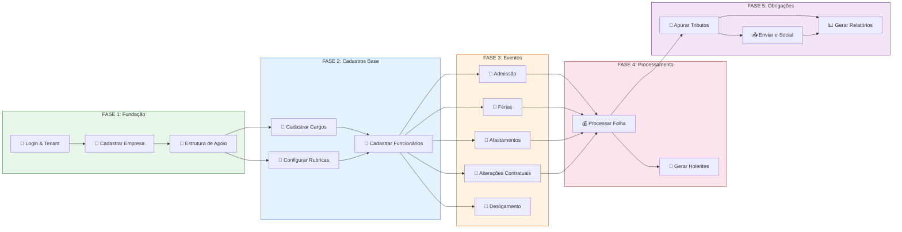

---

## 📋 Jornada 1: Admin — Configuração Inicial do Sistema

**Perfil**: Admin  
**Duração estimada**: 1-2 horas (setup único)  
**Objetivo**: Deixar o sistema pronto para uso pelo Departamento Pessoal

### Diagrama da Jornada

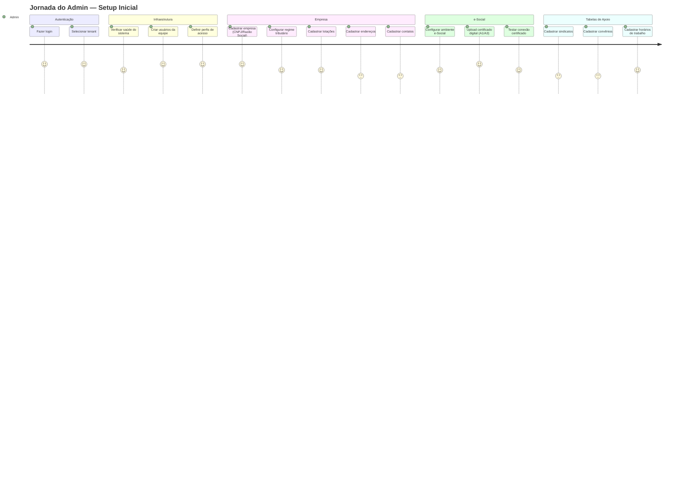

### Fluxo Detalhado

| # | Etapa | Endpoint | Ação |
|---|-------|----------|------|
| 1 | **Login** | `POST /api/auth/login` | Autenticar com e-mail e senha |
| 2 | **Selecionar Tenant** | `POST /api/auth/refresh` | Selecionar empresa/tenant ativo |
| 3 | **Health Check** | `GET /health` | Verificar status dos serviços |
| 4 | **Criar Empresa** | `POST /api/empresas` | Cadastrar CNPJ, Razão Social, regime tributário |
| 5 | **Configurar e-Social** | `PUT /api/empresas/{id}/config-esocial` | Definir ambiente, certificado, transmissor |
| 6 | **Upload Certificado** | `POST /api/esocial/certificados` | Enviar arquivo PFX do certificado digital |
| 7 | **Cadastrar Lotações** | `POST /api/lotacoes` | Criar matriz, filiais, obras |
| 8 | **Cadastrar Sindicatos** | `POST /api/sindicatos` | Registrar sindicatos patronais e laborais |
| 9 | **Cadastrar Convênios** | `POST /api/convenios` | Plano de saúde, odontológico, VR, VT |
| 10 | **Cadastrar Horários** | `POST /api/horarios-trabalho` | Definir jornadas padrão |

---

## 📋 Jornada 2: Operador DP — Cadastro de Funcionário (End-to-End)

**Perfil**: Operador DP  
**Duração estimada**: 15-20 minutos por funcionário  
**Objetivo**: Cadastrar um novo funcionário com todos os dados necessários para processar a folha

### Diagrama da Jornada

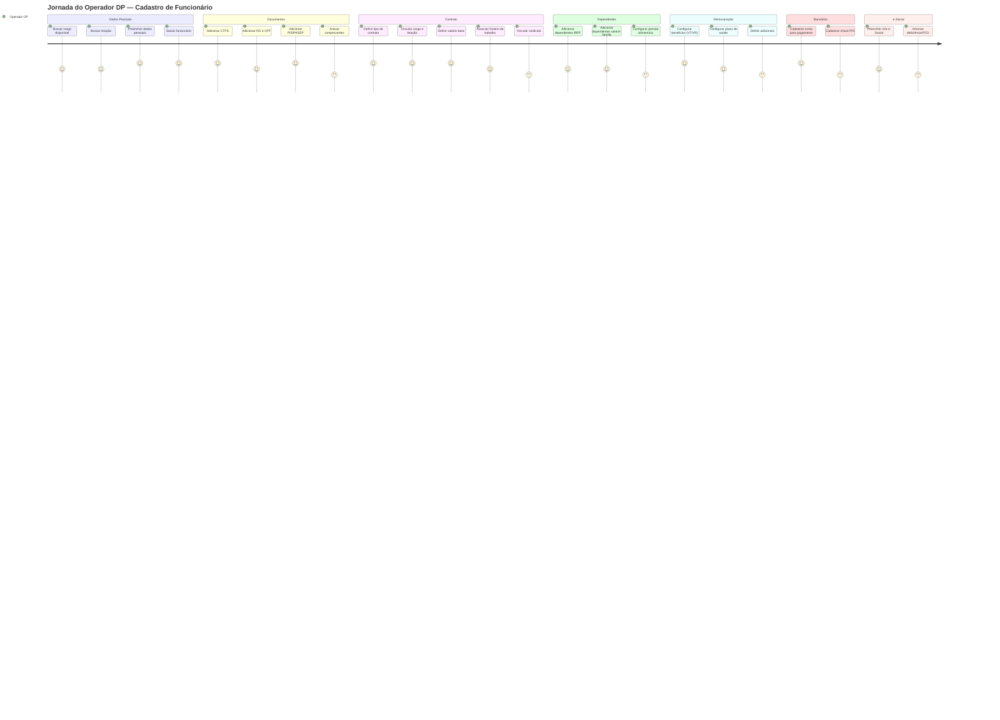

### Fluxo Detalhado

| # | Etapa | Endpoint | Ação |
|---|-------|----------|------|
| 1 | **Listar Cargos** | `GET /api/cargos?empresaId=` | Buscar cargos disponíveis |
| 2 | **Listar Lotações** | `GET /api/lotacoes?empresaId=` | Buscar lotações disponíveis |
| 3 | **Criar Funcionário** | `POST /api/funcionarios` | Nome, CPF, data admissão, cargo, lotação, salário |
| 4 | **Adicionar Documentos** | `POST /api/documentos` | CPF, RG, CTPS, PIS/PASEP, CNH, Título |
| 5 | **Criar Contrato** | `POST /api/funcionarios/{id}/contrato` | Tipo contrato, salário, horário, sindicato |
| 6 | **Adicionar Dependentes** | `POST /api/dependentes` | Filhos, cônjuge, pensão |
| 7 | **Configurar Remuneração** | `PUT /api/funcionarios/{id}/remuneracao` | VT, VR, plano saúde, adicionais |
| 8 | **Cadastrar Dados Bancários** | `POST /api/funcionarios/{id}/dados-bancarios` | Banco, agência, conta, PIX |
| 9 | **Preencher Info e-Social** | `PUT /api/funcionarios/{id}/info-esocial` | PCD, reservista, primeiro emprego |
| 10 | **Adicionar Mov. Fixa** | `POST /api/funcionarios/{id}/movimentacao-fixa` | Rubricas fixas mensais |

---

## 📋 Jornada 3: Operador DP — Configuração de Rubricas

**Perfil**: Operador DP  
**Duração estimada**: 2-4 horas (setup inicial), 15-30 min (manutenção)  
**Objetivo**: Configurar o plano de rubricas para cálculo correto da folha

### Diagrama da Jornada

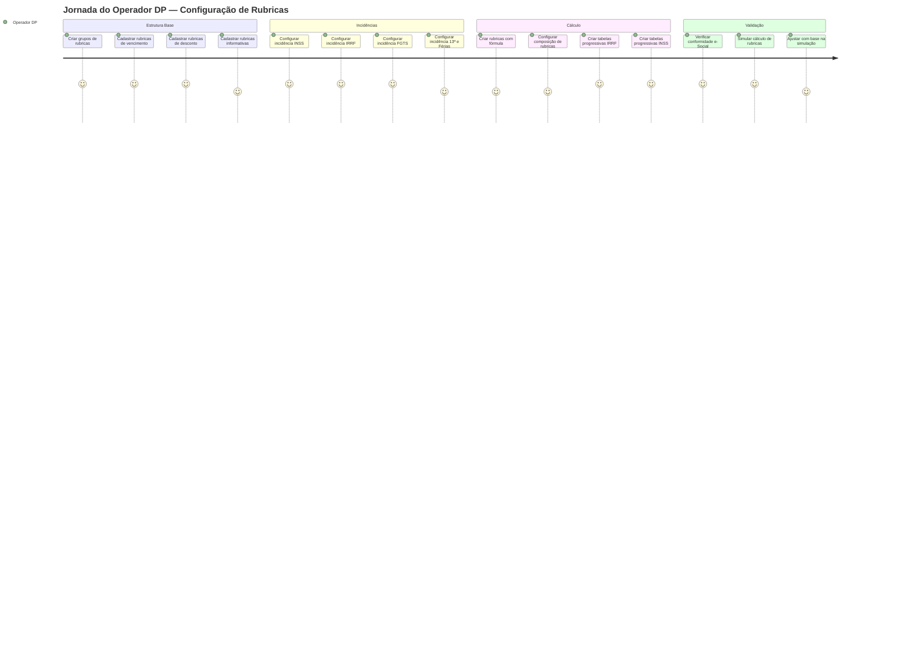

### Fluxo Detalhado

| # | Etapa | Endpoint | Ação |
|---|-------|----------|------|
| 1 | **Criar Grupos** | `POST /api/grupos-rubrica` | Agrupar por natureza (Vencimento/Desconto/Informativa) |
| 2 | **Criar Rubricas** | `POST /api/rubricas` | Código, descrição, natureza, tipo cálculo, incidências |
| 3 | **Configurar Incidências** | `POST /api/rubricas/{id}/incidencias` | INSS, IRRF, FGTS, Sindical, 13º, Férias, etc. |
| 4 | **Criar Fórmulas** | `PUT /api/rubricas/{id}/formula` | Expressão NCalc para rubricas calculadas |
| 5 | **Configurar Composição** | `POST /api/rubricas/{id}/composicao` | Rubricas que compõem outras (ex: salário base + adicionais) |
| 6 | **Criar Tabelas Progressivas** | `POST /api/tabelas-progressivas` | Faixas IRRF e INSS por ano vigência |
| 7 | **Verificar Conformidade** | `GET /api/rubricas/conformidade` | Validar contra Tabela 03 do e-Social |
| 8 | **Simular Cálculo** | `POST /api/rubricas/simular` | Testar com salário base, verificar resultados |

---

## 📋 Jornada 4: Operador DP — Ciclo Mensal da Folha

**Perfil**: Operador DP  
**Duração estimada**: 2-4 horas por processamento  
**Objetivo**: Executar o ciclo completo de processamento da folha de pagamento mensal

### Diagrama da Jornada

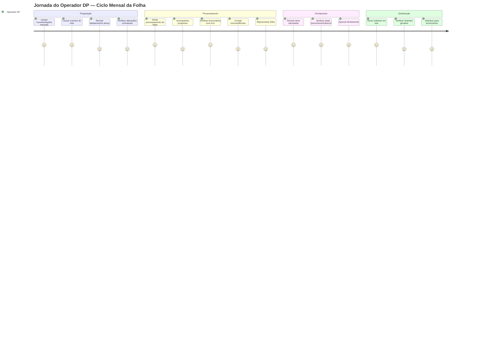

### Fluxo Detalhado

| # | Etapa | Endpoint | Ação |
|---|-------|----------|------|
| 1 | **Lançar Mov. Mensal** | `POST /api/funcionarios/{id}/movimentacao-mensal` | Horas extras, faltas, comissões do mês |
| 2 | **Verificar Afastamentos** | `GET /api/funcionarios/{id}/afastamentos` | Confirmar afastamentos ativos no período |
| 3 | **Iniciar Processamento** | `POST /api/folha/processar` | Disparar cálculo para empresa e período |
| 4 | **Acompanhar Status** | `GET /api/folha/processamento/{id}` | Monitorar progresso, verificar erros |
| 5 | **Verificar Itens** | `GET /api/folha/processamento/{id}/itens` | Revisar itens calculados por funcionário |
| 6 | **Reprocessar (se necessário)** | `POST /api/folha/reprocessar` | Corrigir e recalcular |
| 7 | **Reabrir (se necessário)** | `POST /api/folha/{id}/reabrir` | Reabrir folha fechada com justificativa |
| 8 | **Verificar Histórico** | `GET /api/folha/{empresaId}/{periodo}/historico` | Consultar versões anteriores |
| 9 | **Gerar Holerites** | `POST /api/relatorios/holerites/lote` | Gerar PDFs em lote |
| 10 | **Acompanhar Geração** | `GET /api/relatorios/holerites/lote/{id}/status` | Verificar progresso da geração |

---

## 📋 Jornada 5: Contador — Obrigações Fiscais e e-Social

**Perfil**: Contador  
**Duração estimada**: 3-5 horas por período  
**Objetivo**: Apurar tributos, gerar guias, enviar eventos ao e-Social e gerar relatórios legais

### Diagrama da Jornada

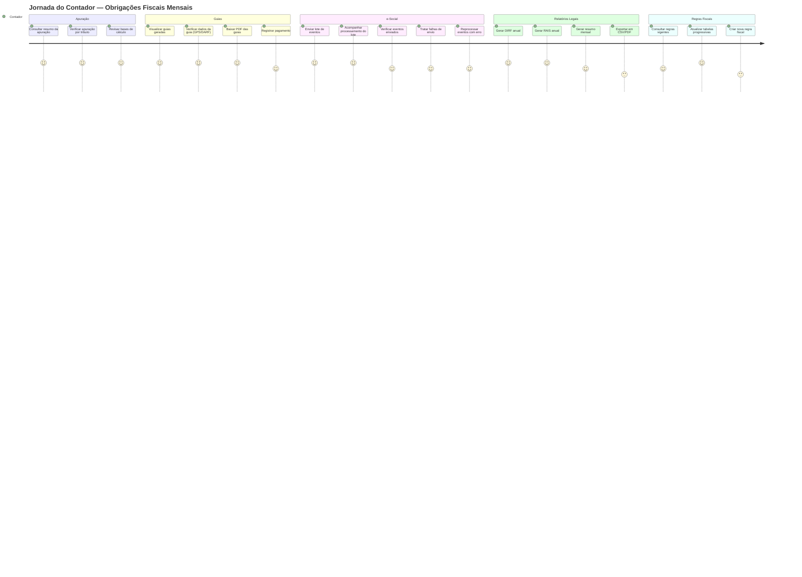

### Fluxo Detalhado

| # | Etapa | Endpoint | Ação |
|---|-------|----------|------|
| 1 | **Consultar Resumo** | `GET /api/fiscais/guias/{empresaId}/{periodo}` | Ver todas as guias do período |
| 2 | **Ver Detalhe Guia** | `GET /api/fiscais/guias/{empresaId}/{periodo}/{tributo}/dados` | Dados completos da guia |
| 3 | **Baixar PDF Guia** | `GET /api/fiscais/guias/{empresaId}/{periodo}/{tributo}` | Download do PDF para pagamento |
| 4 | **Registrar Pagamento** | `POST /api/fiscais/guias/{guiaId}/registrar-pagamento` | Informar valor pago e data |
| 5 | **Enviar Lote e-Social** | `POST /api/esocial/lotes/enviar` | Enviar eventos pendentes |
| 6 | **Acompanhar Lote** | `GET /api/esocial/lotes/{empresaId}` | Verificar status do envio |
| 7 | **Verificar Falhas** | `GET /api/esocial/falhas` | Listar eventos com erro |
| 8 | **Reprocessar Falha** | `POST /api/esocial/falhas/{id}/reprocessar` | Tentar reenvio |
| 9 | **Gerar DIRF** | `GET /api/relatorios/dirf/{empresaId}/{ano}` | Relatório anual IRRF |
| 10 | **Gerar RAIS** | `GET /api/relatorios/rais/{empresaId}/{ano}` | Relatório anual RAIS |
| 11 | **Consultar Regras** | `GET /api/fiscais/regras?tributo=` | Ver regras fiscais ativas |
| 12 | **Criar/Atualizar Regra** | `POST /api/fiscais/regras` | Nova versão de regra fiscal |

---

## 📋 Jornada 6: Operador DP — Gestão de Eventos Trabalhistas

**Perfil**: Operador DP  
**Duração estimada**: 10-30 minutos por evento  
**Objetivo**: Registrar eventos da vida funcional do trabalhador

### Diagrama da Jornada

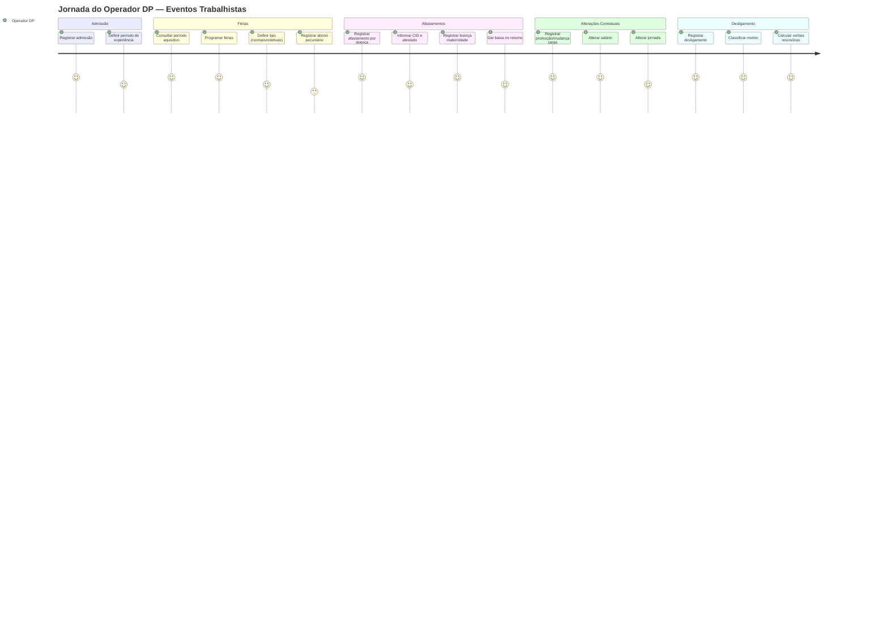

### Fluxo Detalhado

| # | Etapa | Endpoint | Ação |
|---|-------|----------|------|
| 1 | **Registrar Admissão** | `POST /api/admissoes` | Funcionário, empresa, data, cargo, salário |
| 2 | **Programar Férias** | `POST /api/ferias` | Data início, dias gozo, período aquisitivo |
| 3 | **Registrar Afastamento** | `POST /api/afastamentos` | Tipo, data início/fim, CID |
| 4 | **Registrar Alteração** | `POST /api/alteracoes-contratuais` | Campos alterados, valores anterior/novo |
| 5 | **Registrar Desligamento** | `POST /api/desligamentos` | Data, motivo, verbas rescisórias |
| 6 | **Consultar Eventos** | `GET /api/eventos-trabalhistas/funcionario/{id}` | Timeline completa do funcionário |

---

## 📋 Jornada 7: Consulta — Visualização de Holerites e Dados

**Perfil**: Consulta (Gestor / Funcionário)  
**Duração estimada**: 2-5 minutos  
**Objetivo**: Consultar holerites, dados cadastrais e acompanhar eventos

### Diagrama da Jornada

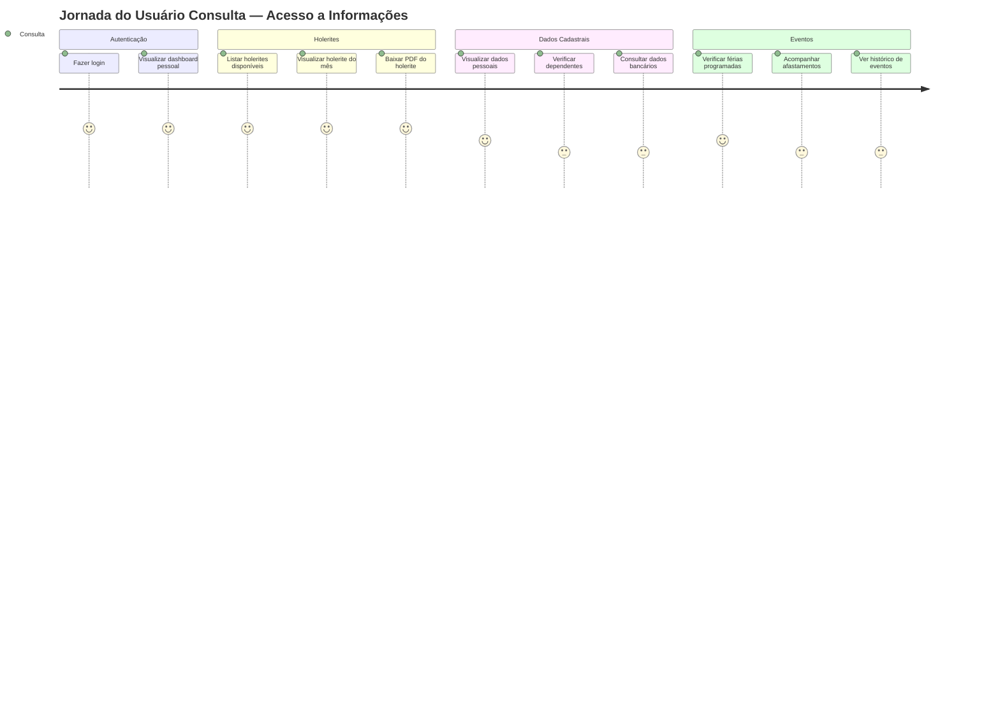

### Fluxo Detalhado

| # | Etapa | Endpoint | Ação |
|---|-------|----------|------|
| 1 | **Login** | `POST /api/auth/login` | Autenticar com e-mail e senha |
| 2 | **Listar Holerites** | `GET /api/folha/holerites/{processamentoId}` | Ver holerites disponíveis |
| 3 | **Baixar Holerite** | `GET /api/folha/holerites/{processamentoId}/{funcionarioId}` | Download do PDF |
| 4 | **Ver Dados Pessoais** | `GET /api/funcionarios/{id}` | Consultar cadastro |
| 5 | **Ver Dependentes** | `GET /api/dependentes?funcionarioId=` | Listar dependentes |
| 6 | **Ver Eventos** | `GET /api/eventos-trabalhistas/funcionario/{id}` | Timeline de eventos |

---

## 📋 Jornada 8: Contador — Fechamento Mensal Completo

**Perfil**: Contador  
**Duração estimada**: 4-6 horas  
**Objetivo**: Executar o fechamento contábil e fiscal do mês

### Diagrama da Jornada

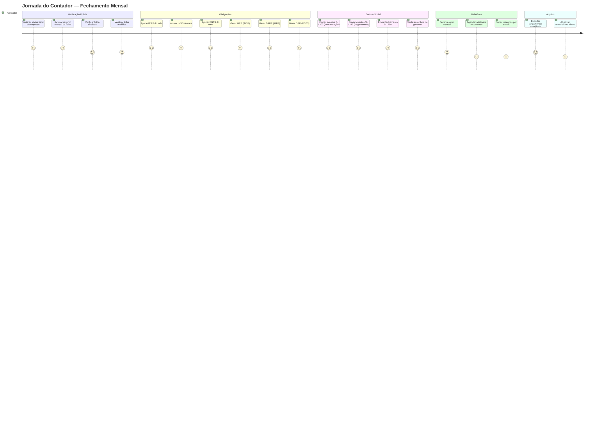

### Fluxo Detalhado

| # | Etapa | Endpoint | Ação |
|---|-------|----------|------|
| 1 | **Status Fiscal** | `GET /api/fiscais/apuracao/status/{empresaId}` | Ver pendências e vencimentos |
| 2 | **Resumo Mensal** | `GET /api/relatorios/resumo-mensal/{empresaId}/{periodo}` | Visão consolidada |
| 3 | **Folha Sintética** | `GET /api/relatorios/folha-sintetica/{empresaId}/{periodo}` | Totais por rubrica |
| 4 | **Folha Analítica** | `GET /api/relatorios/folha-analitica/{empresaId}/{periodo}` | Detalhe por funcionário |
| 5 | **Verificar Guias** | `GET /api/fiscais/guias/{empresaId}/{periodo}` | Listar todas as guias |
| 6 | **Registrar Pagamentos** | `POST /api/fiscais/guias/{guiaId}/registrar-pagamento` | Baixar guias pagas |
| 7 | **Enviar e-Social** | `POST /api/esocial/lotes/enviar` | Lote com eventos do período |
| 8 | **Refresh Views** | `POST /api/relatorios/materialized-views/refresh` | Atualizar views materializadas |
| 9 | **Agendar Relatórios** | `POST /api/relatorios/agendamentos` | Configurar envio automático |
| 10 | **Enviar Email** | `POST /api/relatorios/enviar-email` | Enviar relatórios para diretoria |

---

## 📋 Jornada 9: Operador DP — Rescisão de Funcionário

**Perfil**: Operador DP  
**Duração estimada**: 20-30 minutos  
**Objetivo**: Processar o desligamento completo de um funcionário

### Diagrama da Jornada

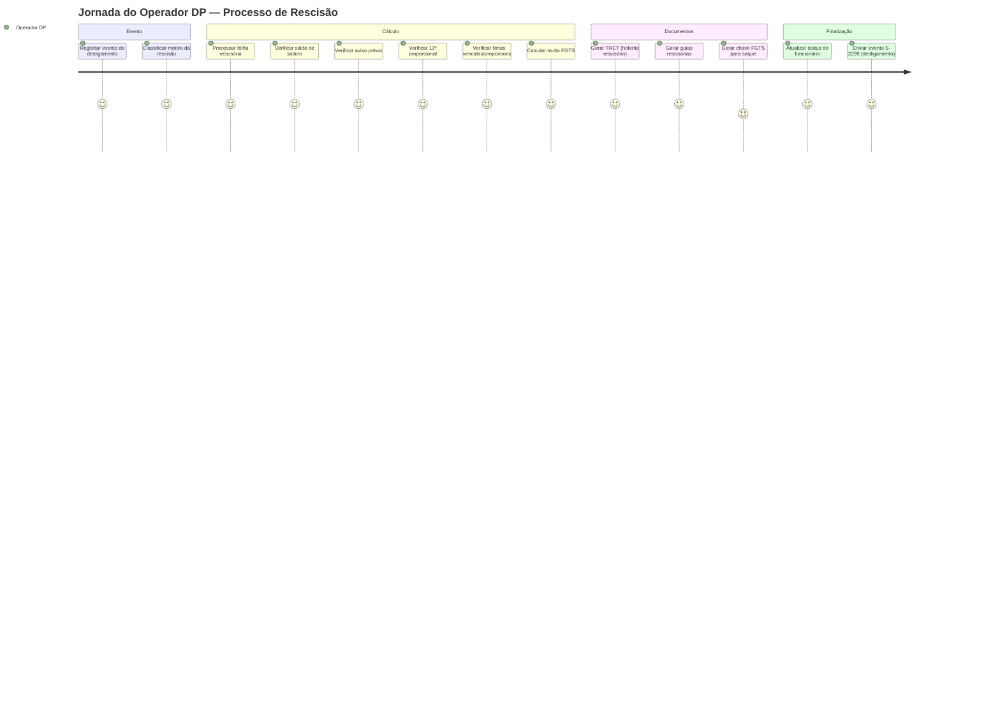

### Fluxo Detalhado

| # | Etapa | Endpoint | Ação |
|---|-------|----------|------|
| 1 | **Registrar Desligamento** | `POST /api/desligamentos` | Data, motivo, verbas rescisórias |
| 2 | **Processar Folha Rescisão** | `POST /api/folha/processar` | TipoCalculo = Rescisao |
| 3 | **Verificar Itens** | `GET /api/folha/processamento/{id}/itens` | Revisar verbas calculadas |
| 4 | **Gerar Holerite** | `GET /api/folha/holerites/{processamentoId}/{funcionarioId}` | TRCT em PDF |
| 5 | **Atualizar Funcionário** | `PUT /api/funcionarios/{id}` | Data desligamento, status inativo |

---

## 📋 Jornada 10: Operador DP — Décimo Terceiro Salário

**Perfil**: Operador DP  
**Duração estimada**: 1-2 horas  
**Objetivo**: Processar o 13º salário dos funcionários

### Diagrama da Jornada

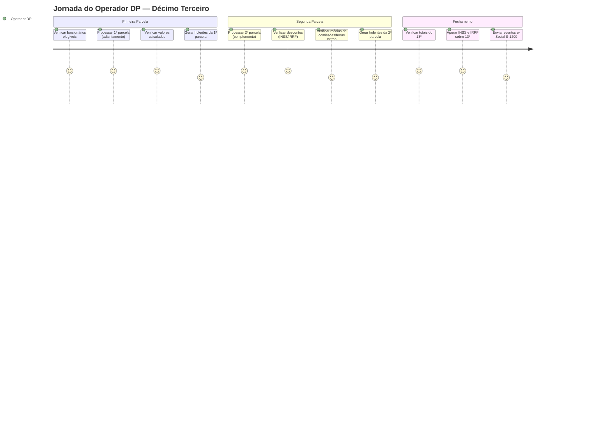

### Fluxo Detalhado

| # | Etapa | Endpoint | Ação |
|---|-------|----------|------|
| 1 | **Processar 1ª Parcela** | `POST /api/folha/processar` | TipoCalculo = DecimoTerceiro (1ª parcela) |
| 2 | **Verificar Itens** | `GET /api/folha/processamento/{id}/itens` | Revisar adiantamentos |
| 3 | **Processar 2ª Parcela** | `POST /api/folha/processar` | TipoCalculo = DecimoTerceiro (2ª parcela) |
| 4 | **Verificar Totais** | `GET /api/folha/processamento/{id}` | Conferir totais |
| 5 | **Gerar Holerites** | `POST /api/relatorios/holerites/lote` | PDFs do 13º |

---

## 📊 Matriz de Jornadas por Perfil

| Jornada | Admin | Operador DP | Contador | Consulta |
|---------|-------|-------------|----------|----------|
| 1. Setup Inicial | ✅ | — | — | — |
| 2. Cadastro de Funcionário | — | ✅ | — | — |
| 3. Configuração de Rubricas | — | ✅ | ✅ | — |
| 4. Ciclo Mensal da Folha | — | ✅ | — | — |
| 5. Obrigações Fiscais e e-Social | — | — | ✅ | — |
| 6. Eventos Trabalhistas | — | ✅ | — | — |
| 7. Consulta de Holerites | — | — | — | ✅ |
| 8. Fechamento Mensal | — | — | ✅ | — |
| 9. Rescisão | — | ✅ | — | — |
| 10. Décimo Terceiro | — | ✅ | — | — |

---

## 🔄 Linha do Tempo — Ciclo Anual do DP

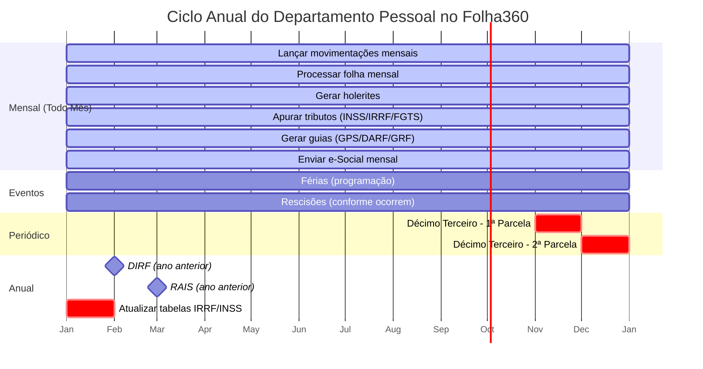

---

## 🎯 Pontos de Decisão e Ramificações

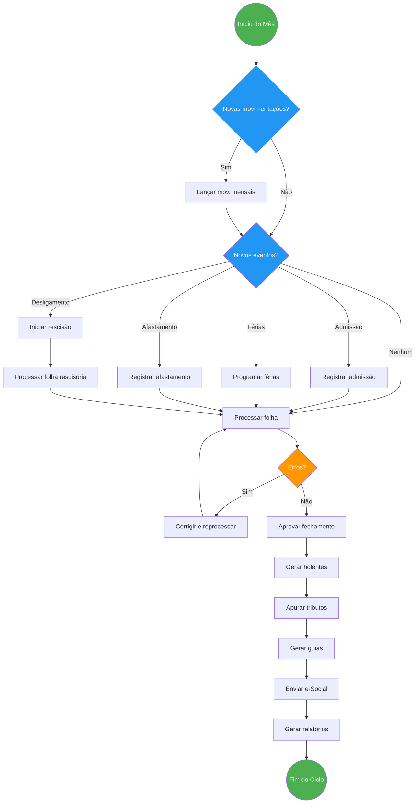

---

> **Versão 1.0** — Documento que mapeia **10 jornadas completas** de usuário, cobrindo 
> **4 perfis** (Admin, Operador DP, Contador, Consulta), com diagramas de jornada, 
> fluxos detalhados com endpoints, e visão do ciclo anual do Departamento Pessoal.
