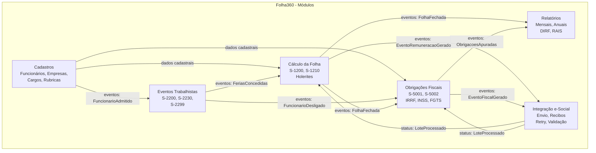

# Component Boundaries — Folha360

## Summary
Definição das fronteiras entre os 6 módulos de domínio do Folha360 com responsabilidades, contratos e regras de dependência explícitas. Cada módulo é um bounded context no sentido DDD, com seu próprio aggregate root e linguagem ubíqua. A comunicação entre módulos se dá por eventos de domínio (assíncrono) e chamadas de API síncronas apenas quando estritamente necessário.

> **Atualização (Junho 2026)**: O módulo Cadastros foi expandido com o subsistema de rubricas (composição hierárquica, fórmulas NCalc, 11 tipos de cálculo, tabelas progressivas). Ver [ADR-006](./adr-006-subsistema-rubricas.md) e [database-model-rubricas](../rubricas/database-model-rubricas.md).

## Visão Geral dos Componentes

## Fronteiras por Componente

| Componente | Responsabilidade | Inputs/Outputs | Owns Data? | Depende de | Notas |
|---|---|---|---|---|---|
| **Cadastros** | CRUD de funcionários, empresas, cargos, rubricas, lotações. Fonte da verdade para dados mestres. Inclui subsistema de rubricas com composição hierárquica, fórmulas NCalc, tabelas progressivas (IRRF/INSS), e 11 naturezas de rubrica. | IN: comandos CRUD; OUT: eventos `FuncionarioCadastrado`, `EmpresaCadastrada`, `RubricaAlterada`, `RubricaCriada`, `TabelaProgressivaAtualizada` | Sim: `Funcionario`, `Empresa`, `Cargo`, `Rubrica`, `GrupoRubrica`, `RubricaComposicao`, `RubricaFormula`, `RubricaIncidencia`, `RubricaTabelaProgressiva`, `RubricaHistorico`, `Lotacao`, `Dependente` | Nenhum (módulo raiz) | Dados sensíveis (CPF, CTPS) criptografados em repouso. Rubricas devem seguir Tabela 03 do e-Social. Composição hierárquica com detecção de ciclos. Fórmulas em sandbox NCalc com timeout 100ms. Versionamento completo de alterações. |
| **Eventos Trabalhistas** | Registro de eventos de vida do funcionário: admissão (S-2200), férias (S-2230), afastamentos, desligamentos (S-2299). | IN: comandos de registro + eventos `FuncionarioCadastrado`; OUT: eventos `FuncionarioAdmitido`, `FeriasConcedidas`, `FuncionarioDesligado` | Sim: `EventoTrabalhista`, `Admissao`, `Ferias`, `Afastamento`, `Desligamento` | Cadastros (leitura: dados do funcionário) | Cada evento gera um evento e-Social correspondente. Validação de prazos legais (ex.: 30 dias para admissão). |
| **Cálculo da Folha** | Processamento mensal: cálculo de vencimentos, descontos, benefícios. Geração de holerites. Eventos S-1200/S-1210. Motor de cálculo com 4 fases e suporte a 11 tipos de cálculo (mensal, férias, 13º, rescisão, dissídio, complementar, auxílio-doença, salário-maternidade, acordo, estágio, RPA). | IN: comando `ProcessarFolha` + eventos `FeriasConcedidas`, `AfastamentoIniciado`; OUT: eventos `FolhaFechada`, `EventoRemuneracaoGerado` | Sim: `FolhaMensal`, `FolhaRubrica`, `Holerite`, `ProcessamentoFolha` | Cadastros (leitura: rubricas, composições, fórmulas, tabelas progressivas, funcionários); Eventos Trabalhistas (leitura: eventos do mês) | Processamento em lote paralelizado (PLINQ/Task Parallel). Cache Redis de rubricas com invalidação pub/sub. Idempotente. Motor de cálculo com `MotorCalculo`, `AvaliadorExpressao`, `ResolvedorComposicao`, `AplicadorTabelaProgressiva`, `CalculadorMedia`, `AvaliadorCondicional`. |
| **Obrigações Fiscais** | Apuração de IRRF, INSS, FGTS, contribuições. Geração de guias (GPS, DARF). Eventos S-5001/S-5002. | IN: evento `FolhaFechada`; OUT: eventos `ObrigacoesApuradas`, `EventoFiscalGerado` | Sim: `ApuracaoFiscal`, `Guia`, `EventoFiscal` | Cálculo da Folha (leitura: valores calculados); Cadastros (leitura: dados empresa) | Regras fiscais mudam anualmente — usar strategy pattern para versionamento de cálculo. |
| **Relatórios** | Geração de relatórios gerenciais: holerites, resumo mensal/anual, DIRF, RAIS. Exportação CSV/PDF. | IN: eventos `FolhaFechada`, `ObrigacoesApuradas`; OUT: arquivos PDF/CSV | Não (leitura de outros módulos via API/replicação) | Cálculo da Folha (leitura); Obrigações Fiscais (leitura); Cadastros (leitura) | Read-only. Pode usar réplicas de leitura para não impactar sistemas transacionais. |
| **Integração e-Social** | Envio de eventos ao e-Social gov.br, consulta de recibos, tratamento de erros/reprocessamento, validação XSD. | IN: eventos `EventoRemuneracaoGerado`, `EventoFiscalGerado`; OUT: status `LoteProcessado` | Sim: `LoteESocial`, `EventoEnviado`, `ReciboGoverno` | Cálculo da Folha (leitura: eventos S-1200); Obrigações Fiscais (leitura: eventos S-5001); Cadastros (leitura: dados empresa) | Único módulo com acesso externo (HTTPS → e-Social). Retry com exponential backoff. Certificado digital A1. |

## Regras de Dependência

1. **Cadastros** é o módulo raiz — não depende de nenhum outro.
2. **Eventos Trabalhistas** e **Cálculo da Folha** dependem de Cadastros (somente leitura).
3. **Cálculo da Folha** depende de Eventos Trabalhistas (leitura de eventos do período).
4. **Obrigações Fiscais** depende de Cálculo da Folha (valores calculados).
5. **Relatórios** depende de Cálculo da Folha e Obrigações Fiscais (somente leitura).
6. **Integração e-Social** depende de Cálculo da Folha e Obrigações Fiscais (eventos a enviar).
7. **Comunicação entre módulos**: Preferencialmente assíncrona (eventos de domínio via message bus). Síncrona apenas para consultas pontuais.

## Dependency Issues Identificados

| Issue | Severidade | Descrição | Sugestão |
|---|---|---|---|
| Acoplamento Cadastros → Todos | Média | Todos os módulos leem dados de Cadastros. Se Cadastros ficar indisponível, todos param. | Replicar dados cadastrais (cache/materialized view) nos módulos consumidores. Cache Redis de rubricas com invalidação pub/sub mitiga impacto. |
| Ordem de processamento | Alta | Folha → Fiscais → e-Social é sequencial. Falha no meio interrompe a cadeia. | Usar saga pattern com compensação; cada etapa publica evento de conclusão. Tabela `CadeiaFechamento` para tracking cross-módulo. |
| Relatórios lendo dados transacionais | Média | Consultas pesadas podem impactar o desempenho do sistema transacional. | Criar banco de leitura separado (read replica PostgreSQL) para relatórios. |
| Complexidade do motor de cálculo | Alta | Motor com 4 fases, 11 tipos de cálculo, composição hierárquica e fórmulas NCalc aumenta complexidade de manutenção e debug. | Testes unitários com cobertura > 90%; simulador de cálculo para validação prévia; logging detalhado por fase. |
| Inconsistência de rubricas entre cálculo e e-Social | Alta | Rubrica alterada após início do cálculo ou não mapeada para Tabela 03 gera divergência no envio. | Snapshot de rubricas no momento do cálculo; validação de conformidade contínua; endpoint `GET /api/rubricas/conformidade`. |

## Evidence vs Assumptions

**Evidências**:
- Os 6 módulos emergem naturalmente dos eventos e-Social obrigatórios (S-2200, S-1200, S-5001, etc.)
- Stack .NET + PostgreSQL suporta bem a separação em bounded contexts

**Assumptions**:
- Cada módulo terá seu próprio schema/tabelas no PostgreSQL (separação lógica)
- Message bus (RabbitMQ) disponível para comunicação assíncrona
- Volume de eventos e-Social justifica fila dedicada

## Recommended Next Skill
`integration-boundary-mapper` — para mapear contratos e riscos de integração entre os módulos e com o e-Social externo.
