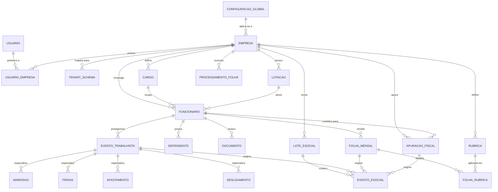

# Database Model — Folha360

## Summary
Modelo de banco de dados relacional PostgreSQL para o sistema Folha360, organizado por bounded context (6 módulos) com estratégia de multi-tenant via **schema por tenant** (ADR-003). Cada módulo possui suas próprias tabelas dentro do schema do tenant. O schema `public` contém tabelas compartilhadas (usuários, configurações globais, fila de eventos). Dados sensíveis (CPF, salários, documentos) são identificados para criptografia em repouso (AES-256). Todas as tabelas incluem colunas de auditoria para conformidade LGPD.

> **Atualização (Junho 2026)**: O subsistema de rubricas foi significativamente expandido. A tabela `rubrica` original foi substituída por um modelo completo com 7 tabelas. Consulte o [modelo de dados detalhado das rubricas](../rubricas/database-model-rubricas.md) para a especificação completa.

---

## Entity-Relationship Diagram



---

## Table Definitions by Module

### Schema Architecture

```
PostgreSQL
├── public                          ← Shared across all tenants
│   ├── usuario
│   ├── empresa
│   ├── usuario_empresa
│   ├── configuracao_global
│   └── tenant_schema
├── tenant_001                      ← Empresa 1
│   ├── funcionario
│   ├── dependente
│   ├── documento
│   ├── cargo
│   ├── lotacao
│   ├── rubrica
│   ├── evento_trabalhista
│   ├── admissao / ferias / afastamento / desligamento
│   ├── folha_mensal
│   ├── folha_rubrica
│   ├── processamento_folha
│   ├── apuracao_fiscal
│   ├── lote_esocial
│   └── evento_esocial
├── tenant_002                      ← Empresa 2
│   └── (mesmas tabelas)
└── ...
```

---

### Module: Cadastros

| Table | Columns | PK | FK | Indexes | Notes |
|---|---|---|---|---|---|
| **funcionario** | `id` (uuid), `tenant_id` (uuid), `empresa_id` (uuid), `cargo_id` (uuid, nullable), `lotacao_id` (uuid, nullable), `nome` (varchar 200), `cpf` (varchar 11 encrypted), `pis_pasep` (varchar 11 encrypted), `ctps_numero` (varchar 20 encrypted), `ctps_serie` (varchar 10 encrypted), `data_nascimento` (date), `email` (varchar 200), `telefone` (varchar 20), `data_admissao` (date), `data_desligamento` (date, nullable), `status` (varchar 20), `created_at` (timestamptz), `updated_at` (timestamptz), `created_by` (uuid), `deleted_at` (timestamptz, nullable) | `id` PK | `empresa_id` → `public.empresa(id)`, `cargo_id` → `cargo(id)`, `lotacao_id` → `lotacao(id)` | `idx_func_status` (status), `idx_func_cpf` (cpf — hash index), `idx_func_empresa` (empresa_id) | CPF, PIS, CTPS criptografados (AES-256). Soft delete via `deleted_at`. |
| **dependente** | `id` (uuid), `funcionario_id` (uuid), `nome` (varchar 200), `cpf` (varchar 11 encrypted), `data_nascimento` (date), `tipo` (varchar 30), `created_at` (timestamptz), `updated_at` (timestamptz) | `id` PK | `funcionario_id` → `funcionario(id)` | `idx_dep_func` (funcionario_id) | Tipos: filho, conjuge, pais. CPF criptografado. |
| **documento** | `id` (uuid), `funcionario_id` (uuid), `tipo` (varchar 30), `numero` (varchar 50 encrypted), `data_emissao` (date), `data_validade` (date, nullable), `arquivo_path` (varchar 500), `created_at` (timestamptz) | `id` PK | `funcionario_id` → `funcionario(id)` | `idx_doc_func` (funcionario_id), `idx_doc_tipo` (tipo) | RG, CNH, Reservista, etc. Número criptografado. |
| **cargo** | `id` (uuid), `empresa_id` (uuid), `nome` (varchar 150), `cbo` (varchar 10), `descricao` (text), `salario_base` (numeric 18,2), `created_at` (timestamptz), `updated_at` (timestamptz) | `id` PK | `empresa_id` → `public.empresa(id)` | `idx_cargo_empresa` (empresa_id), `idx_cargo_cbo` (cbo) | CBO compatível com e-Social. |
| **lotacao** | `id` (uuid), `empresa_id` (uuid), `codigo` (varchar 30), `descricao` (varchar 200), `created_at` (timestamptz), `updated_at` (timestamptz) | `id` PK | `empresa_id` → `public.empresa(id)` | `idx_lot_empresa` (empresa_id) | Departamento, filial, setor. |
| **rubrica** | `id` (uuid), `empresa_id` (uuid), `codigo` (varchar 20), `descricao` (varchar 200), `natureza` (varchar 20), `incide_inss` (boolean), `incide_irrf` (boolean), `incide_fgts` (boolean), `tipo_esocial` (varchar 10), `created_at` (timestamptz), `updated_at` (timestamptz) | `id` PK | `empresa_id` → `public.empresa(id)` | `idx_rub_empresa` (empresa_id), `idx_rub_codigo` (codigo) | ⚠️ **Modelo expandido**. A tabela `rubrica` foi estendida com 30+ colunas e 6 tabelas de apoio. Consulte [database-model-rubricas.md](../rubricas/database-model-rubricas.md). Natureza: Vencimento/Desconto/Beneficio/Informativo/Provisao/Base/Complemento/Reembolso/Estagio. `tipo_esocial` compatível com Tabela 03 e-Social. |

### Module: Eventos Trabalhistas

| Table | Columns | PK | FK | Indexes | Notes |
|---|---|---|---|---|---|
| **evento_trabalhista** | `id` (uuid), `funcionario_id` (uuid), `tipo` (varchar 30), `data_evento` (date), `data_registro` (timestamptz), `status` (varchar 20), `observacao` (text), `created_at` (timestamptz), `updated_at` (timestamptz) | `id` PK | `funcionario_id` → `funcionario(id)` | `idx_evt_func` (funcionario_id), `idx_evt_tipo_data` (tipo, data_evento), `idx_evt_status` (status) | Tipos: ADMISSAO, FERIAS, AFASTAMENTO, DESLIGAMENTO. |
| **admissao** | `id` (uuid), `evento_trabalhista_id` (uuid), `data_admissao` (date), `tipo_contrato` (varchar 30), `salario_contratual` (numeric 18,2), `cbo` (varchar 10), `regime_trabalhista` (varchar 20), `created_at` (timestamptz) | `id` PK | `evento_trabalhista_id` → `evento_trabalhista(id)` UNIQUE | `idx_adm_evento` (evento_trabalhista_id) | 1:1 com evento. Dados para S-2200. |
| **ferias** | `id` (uuid), `evento_trabalhista_id` (uuid), `periodo_aquisitivo_inicio` (date), `periodo_aquisitivo_fim` (date), `data_inicio` (date), `data_fim` (date), `dias_gozo` (int), `dias_abono` (int), `created_at` (timestamptz) | `id` PK | `evento_trabalhista_id` → `evento_trabalhista(id)` UNIQUE | `idx_fer_evento` (evento_trabalhista_id) | 1:1 com evento. Dados para S-2230. |
| **afastamento** | `id` (uuid), `evento_trabalhista_id` (uuid), `tipo_afastamento` (varchar 30), `data_inicio` (date), `data_fim` (date, nullable), `cid` (varchar 10, nullable), `created_at` (timestamptz) | `id` PK | `evento_trabalhista_id` → `evento_trabalhista(id)` UNIQUE | `idx_afa_evento` (evento_trabalhista_id) | Tipos: doenca, acidente, maternidade, etc. |
| **desligamento** | `id` (uuid), `evento_trabalhista_id` (uuid), `data_desligamento` (date), `tipo_desligamento` (varchar 30), `motivo` (varchar 200), `aviso_previo` (varchar 20), `created_at` (timestamptz) | `id` PK | `evento_trabalhista_id` → `evento_trabalhista(id)` UNIQUE | `idx_des_evento` (evento_trabalhista_id) | Dados para S-2299. |

### Module: Cálculo da Folha

| Table | Columns | PK | FK | Indexes | Notes |
|---|---|---|---|---|---|
| **processamento_folha** | `id` (uuid), `empresa_id` (uuid), `periodo` (varchar 7), `status` (varchar 20), `data_inicio` (timestamptz), `data_fim` (timestamptz, nullable), `total_funcionarios` (int), `total_vencimentos` (numeric 18,2), `total_descontos` (numeric 18,2), `total_liquido` (numeric 18,2), `log` (jsonb), `created_at` (timestamptz), `updated_at` (timestamptz) | `id` PK | `empresa_id` → `public.empresa(id)` | `idx_proc_empresa_periodo` (empresa_id, periodo) UNIQUE, `idx_proc_status` (status) | Idempotência: UNIQUE (empresa_id, periodo). Status: INICIADO, PROCESSANDO, CONCLUIDO, ERRO. |
| **folha_mensal** | `id` (uuid), `processamento_folha_id` (uuid), `funcionario_id` (uuid), `periodo` (varchar 7), `total_vencimentos` (numeric 18,2), `total_descontos` (numeric 18,2), `liquido` (numeric 18,2 encrypted), `base_inss` (numeric 18,2), `base_irrf` (numeric 18,2), `base_fgts` (numeric 18,2), `valor_inss` (numeric 18,2), `valor_irrf` (numeric 18,2), `valor_fgts` (numeric 18,2), `created_at` (timestamptz) | `id` PK | `processamento_folha_id` → `processamento_folha(id)`, `funcionario_id` → `funcionario(id)` | `idx_folha_func_periodo` (funcionario_id, periodo), `idx_folha_proc` (processamento_folha_id) | `liquido` criptografado (salário). |
| **folha_rubrica** | `id` (uuid), `folha_mensal_id` (uuid), `rubrica_id` (uuid), `valor` (numeric 18,2), `tipo` (varchar 20), `referencia` (varchar 200), `created_at` (timestamptz) | `id` PK | `folha_mensal_id` → `folha_mensal(id)`, `rubrica_id` → `rubrica(id)` | `idx_fr_folha` (folha_mensal_id) | Detalhamento de cada rubrica aplicada. Tipo: vencimento/desconto. |

### Module: Obrigações Fiscais

| Table | Columns | PK | FK | Indexes | Notes |
|---|---|---|---|---|---|
| **apuracao_fiscal** | `id` (uuid), `empresa_id` (uuid), `periodo` (varchar 7), `processamento_folha_id` (uuid), `total_remuneracao` (numeric 18,2), `total_inss` (numeric 18,2), `total_irrf` (numeric 18,2), `total_fgts` (numeric 18,2), `status` (varchar 20), `created_at` (timestamptz), `updated_at` (timestamptz) | `id` PK | `empresa_id` → `public.empresa(id)`, `processamento_folha_id` → `processamento_folha(id)` | `idx_apu_empresa_periodo` (empresa_id, periodo) UNIQUE | Status: PENDENTE, APURADO, ENVIADO. |
| **guia** | `id` (uuid), `apuracao_fiscal_id` (uuid), `tipo` (varchar 20), `codigo_barras` (varchar 48), `valor` (numeric 18,2), `data_vencimento` (date), `data_pagamento` (date, nullable), `status` (varchar 20), `created_at` (timestamptz) | `id` PK | `apuracao_fiscal_id` → `apuracao_fiscal(id)` | `idx_guia_apu` (apuracao_fiscal_id) | Tipos: GPS, DARF, FGTS. |

### Module: Relatórios (Read-only — Views Materializadas)

| Table/View | Columns | Source | Notes |
|---|---|---|---|
| **vw_resumo_folha_mensal** | `periodo`, `empresa_id`, `total_funcionarios`, `total_vencimentos`, `total_descontos`, `total_liquido` | Agregação de `folha_mensal` + `processamento_folha` | Materialized view atualizada após fechamento. |
| **vw_dirf_anual** | `ano`, `funcionario_id`, `cpf`, `total_rendimentos`, `total_irrf`, `total_inss` | Agregação anual de `folha_mensal` | Base para DIRF. |

### Module: Integração e-Social

| Table | Columns | PK | FK | Indexes | Notes |
|---|---|---|---|---|---|
| **lote_esocial** | `id` (uuid), `empresa_id` (uuid), `protocolo` (varchar 50, nullable), `status` (varchar 20), `tipo` (varchar 20), `data_envio` (timestamptz, nullable), `data_processamento` (timestamptz, nullable), `recibo_hash` (varchar 64, nullable), `erro_mensagem` (text, nullable), `created_at` (timestamptz), `updated_at` (timestamptz) | `id` PK | `empresa_id` → `public.empresa(id)` | `idx_lote_status` (status), `idx_lote_protocolo` (protocolo), `idx_lote_empresa` (empresa_id) | Status: PENDENTE, ENVIADO, PROCESSADO, ERRO. |
| **evento_esocial** | `id` (uuid), `lote_esocial_id` (uuid, nullable), `empresa_id` (uuid), `tipo_evento` (varchar 10), `xml_conteudo` (xml), `status` (varchar 20), `recibo_numero` (varchar 50, nullable), `evento_origem_id` (uuid, nullable), `evento_origem_tipo` (varchar 30, nullable), `erro_codigo` (varchar 10, nullable), `erro_descricao` (text, nullable), `tentativas_envio` (int DEFAULT 0), `created_at` (timestamptz), `updated_at` (timestamptz) | `id` PK | `lote_esocial_id` → `lote_esocial(id)`, `empresa_id` → `public.empresa(id)` | `idx_es_tipo_status` (tipo_evento, status), `idx_es_lote` (lote_esocial_id), `idx_es_origem` (evento_origem_id, evento_origem_tipo) | `tipo_evento`: S-1200, S-1210, S-2200, S-2230, S-2299, S-5001, S-5002. |

### Public Schema (Shared)

| Table | Columns | PK | FK | Indexes | Notes |
|---|---|---|---|---|---|
| **empresa** | `id` (uuid), `cnpj` (varchar 14), `razao_social` (varchar 200), `nome_fantasia` (varchar 200), `cnae` (varchar 10), `regime_tributario` (varchar 30), `fpas` (varchar 10), `schema_tenant` (varchar 50), `matriz_id` (uuid, nullable), `status` (varchar 20), `created_at` (timestamptz), `updated_at` (timestamptz) | `id` PK | `matriz_id` → `empresa(id)` | `idx_emp_cnpj` (cnpj) UNIQUE, `idx_emp_schema` (schema_tenant) UNIQUE | `schema_tenant`: nome do schema no PostgreSQL. `matriz_id`: nullable para matriz; FK para filiais. |
| **usuario** | `id` (uuid), `email` (varchar 200), `senha_hash` (varchar 256), `nome` (varchar 200), `perfil` (varchar 30), `status` (varchar 20), `ultimo_login` (timestamptz, nullable), `created_at` (timestamptz), `updated_at` (timestamptz) | `id` PK | — | `idx_usr_email` (email) UNIQUE | Perfis: admin, operador, contador, consulta. |
| **usuario_empresa** | `id` (uuid), `usuario_id` (uuid), `empresa_id` (uuid), `perfil` (varchar 30), `created_at` (timestamptz) | `id` PK | `usuario_id` → `usuario(id)`, `empresa_id` → `empresa(id)` | `idx_ue_usuario_empresa` (usuario_id, empresa_id) UNIQUE | Associação N:N com perfil específico por empresa. |
| **configuracao_global** | `id` (uuid), `chave` (varchar 100), `valor` (text), `empresa_id` (uuid, nullable), `created_at` (timestamptz), `updated_at` (timestamptz) | `id` PK | `empresa_id` → `empresa(id)` | `idx_cfg_chave_empresa` (chave, empresa_id) UNIQUE | Configurações globais ou por empresa. Ex.: tabelas IRRF, INSS. |
| **tenant_schema** | `id` (uuid), `empresa_id` (uuid), `schema_name` (varchar 50), `status` (varchar 20), `data_criacao` (timestamptz), `data_exclusao` (timestamptz, nullable) | `id` PK | `empresa_id` → `empresa(id)` UNIQUE | `idx_ts_schema` (schema_name) UNIQUE | Rastreia criação/exclusão de schemas. |
| **audit_log** | `id` (bigserial), `schema_name` (varchar 50), `table_name` (varchar 100), `record_id` (uuid), `action` (varchar 10), `old_data` (jsonb, nullable), `new_data` (jsonb, nullable), `changed_by` (uuid), `changed_at` (timestamptz) | `id` PK | — | `idx_audit_table_record` (schema_name, table_name, record_id), `idx_audit_at` (changed_at) | Trilha de auditoria imutável (LGPD). Append-only. |

---

## Multi-Tenant Strategy

- **Strategy**: Schema por Tenant (ADR-003)
- **Rationale**: Isolamento forte exigido pela LGPD; < 50 empresas esperadas; backup/restore individual; exclusão via `DROP SCHEMA tenant_XXX CASCADE`
- **Implementation**:
  - `public.empresa.schema_tenant` mapeia cada empresa para seu schema
  - `public.tenant_schema` rastreia criação/exclusão de schemas
  - Aplicação resolve schema via JWT claim `tenant_id` → consulta `empresa` → obtém `schema_tenant`
  - EF Core `DbContext` configura `search_path` dinamicamente por requisição
  - Migrations executadas via script que itera sobre todos os schemas ativos

---

## Sensitive Data & LGPD

| Column | Table | Sensitivity | Protection |
|---|---|---|---|
| `cpf` | `funcionario` | Altíssima | AES-256 criptografia em repouso; hash index para busca exata |
| `pis_pasep` | `funcionario` | Alta | AES-256 criptografia em repouso |
| `ctps_numero` | `funcionario` | Alta | AES-256 criptografia em repouso |
| `ctps_serie` | `funcionario` | Alta | AES-256 criptografia em repouso |
| `cpf` | `dependente` | Alta | AES-256 criptografia em repouso |
| `numero` | `documento` | Alta | AES-256 criptografia em repouso |
| `liquido` | `folha_mensal` | Alta | AES-256 criptografia em repouso (salário) |
| `senha_hash` | `usuario` | Altíssima | SHA-256 + salt |

- **Audit trail**: `public.audit_log` registra toda operação de INSERT/UPDATE/DELETE em qualquer schema. Append-only, imutável.
- **Data retention**: Dados fiscais (folha, apuração) retidos por 5 anos (exigência legal). Dados pessoais podem ser excluídos via `DROP SCHEMA` ou soft delete (`deleted_at`).
- **Deletion procedure**: 
  1. Soft delete: `UPDATE funcionario SET deleted_at = NOW()` → dados anonimizados em 7 dias
  2. Hard delete: `DROP SCHEMA tenant_XXX CASCADE` → exclusão total da empresa
  3. `audit_log` mantém registro da exclusão

---

## Index Strategy

| Index | Table | Columns | Type | Reason |
|---|---|---|---|---|
| **P1** | `funcionario` | `(empresa_id, status)` | B-tree | Hot query: listar funcionários ativos por empresa |
| **P1** | `folha_mensal` | `(funcionario_id, periodo)` | B-tree | Hot query: consultar holerite específico |
| **P1** | `processamento_folha` | `(empresa_id, periodo)` | UNIQUE B-tree | Idempotência + consulta de status |
| **P1** | `evento_esocial` | `(tipo_evento, status)` | B-tree | Consulta de eventos pendentes para envio |
| **P1** | `audit_log` | `(schema_name, table_name, record_id)` | B-tree | Rastreamento de alterações por registro |
| **P2** | `evento_trabalhista` | `(funcionario_id, tipo, data_evento)` | B-tree | Consulta de eventos do funcionário no período |
| **P2** | `lote_esocial` | `(status)` | B-tree | Filtro de lotes pendentes/erro |
| **P2** | `folha_rubrica` | `(folha_mensal_id)` | B-tree | JOIN com folha_mensal |
| **P2** | `funcionario` | `(cpf)` | Hash | Busca exata por CPF (hash index para coluna criptografada) |
| **P3** | `documento` | `(funcionario_id, tipo)` | B-tree | Consulta de documentos específicos |
| **P3** | `apuracao_fiscal` | `(empresa_id, periodo)` | UNIQUE B-tree | Idempotência fiscal |

---

## Migration Plan

### 1. Initial Migration (`001_InitialCreate`)
- Criar schema `public` com tabelas compartilhadas (`empresa`, `usuario`, `usuario_empresa`, `configuracao_global`, `tenant_schema`, `audit_log`)
- Criar template schema `tenant_template` com todas as tabelas dos 6 módulos
- Criar índices primários (P1)
- Habilitar extensões: `pgcrypto` (criptografia), `uuid-ossp` (UUIDs)

### 2. Seed Data (`002_SeedData`)
- Inserir perfis de usuário padrão (admin, operador, contador, consulta)
- Inserir rubricas padrão compatíveis com Tabela 03 e-Social
- Inserir tabelas progressivas IRRF/INSS vigentes em `configuracao_global`

### 3. Tenant Provisioning (runtime, não migration)
- `SELECT create_tenant_schema(p_empresa_id)` → clona `tenant_template` como `tenant_NNN`
- `SELECT drop_tenant_schema(p_empresa_id)` → `DROP SCHEMA tenant_NNN CASCADE` (LGPD exclusão)

### 4. Future Migrations
- EF Core migrations aplicadas sequencialmente em todos os schemas ativos via script
- Versionamento semântico de schema (ex.: `tenant_001` com versão `v1.2.0`)
- Rollback suportado via migration `Down()` method

---

## Evidence vs Assumptions

**Evidence** (baseado em artefatos existentes):
- 6 módulos definidos em [Component Boundaries](./component-boundaries.md)
- Agregados de domínio definidos em [Layered Architecture](./layered-architecture.md)
- Decisão multi-tenant: Schema por Tenant ([ADR-003](./adr-003-schema-por-tenant.md))
- Stack: PostgreSQL + EF Core ([folha360.md](../inputs/prompts/folha360.md))
- LGPD: criptografia em repouso + audit log ([Quality Scenarios](./quality-attribute-scenarios.md))

**Assumptions**:
- PostgreSQL 16 com extensões `pgcrypto` e `uuid-ossp` disponíveis
- Volume de 100K funcionários distribuídos em < 50 tenants
- EF Core 9 com suporte a schema dinâmico por requisição
- Índices hash suportados para busca exata de CPF criptografado

---

## Risks or Tradeoffs

| Risk | Severity | Mitigation |
|---|---|---|
| **Migrations em N schemas podem falhar parcialmente** | Alta | Script transacional; rollback por schema; validação pós-migration |
| **Hash index para CPF criptografado pode ter colisões** | Baixa | Usar hash SHA-256 truncado; validação dupla na aplicação |
| **Criptografia AES-256 impacta performance de queries** | Média | Criptografar apenas colunas sensíveis; cache Redis para consultas frequentes |
| **Crescimento do `audit_log`** | Média | Particionamento por mês; arquivamento após 5 anos; compressão |
| **Template schema pode divergir dos schemas ativos** | Média | Versionamento de schema; reconciliação periódica; CI/CD valida |

## Recommended Next Skill
`deployment-view-writer` — para mapear o PostgreSQL (primary + replica) e schemas nos nós de infraestrutura.
