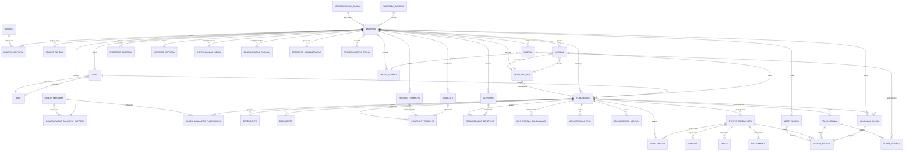

# Database Model — Folha360

## Summary
Modelo de banco de dados relacional PostgreSQL para o sistema Folha360, organizado por bounded context (6 módulos) com estratégia de multi-tenant via **schema por tenant** (ADR-003). Cada módulo possui suas próprias tabelas dentro do schema do tenant. O schema `public` contém tabelas compartilhadas (usuários, configurações globais, fila de eventos) e **tabelas de domínio compartilhado** (CBO, Natureza Jurídica, Municípios IBGE, Bancos Febraban) usadas como lookups por todos os tenants. Dados sensíveis (CPF, salários, documentos) são identificados para criptografia em repouso (AES-256). Todas as tabelas incluem colunas de auditoria para conformidade LGPD.

> **Atualização (Junho 2026)**: O subsistema de rubricas foi significativamente expandido. A tabela `rubrica` original foi substituída por um modelo completo com 7 tabelas. Consulte o [modelo de dados detalhado das rubricas](../rubricas/database-model-rubricas.md) para a especificação completa.
>
> **Atualização (Junho 2026) — Cadastros Expandidos**: Com base no levantamento completo de cadastros do Departamento Pessoal ([cadastros-folha360v1.md](../../inputs/cadastros-folha360v1.md)), o modelo de dados foi expandido com **9 novas tabelas de domínio compartilhado** (CBO, natureza_juridica, municipio_ibge, banco_febraban, sindicato, convenio, horario_trabalho, grupo_rubrica, processo_administrativo) e **expansão significativa** das tabelas de empresa (lotacao, configuracao_bancaria_empresa, endereco_empresa, contato_empresa, configuracao_geral, configuracao_esocial) e funcionario (dados_bancarios_funcionario, contrato_trabalho, remuneracao_beneficio, afastamento, info_esocial_funcionario, movimentacao_fixa, movimentacao_mensal).

---

## Entity-Relationship Diagram


```mermaid
erDiagram
    %% === PUBLIC SCHEMA (shared) ===
    USUARIO ||--o{ USUARIO_EMPRESA : "pertence a"
    EMPRESA ||--o{ USUARIO_EMPRESA : "possui"
    EMPRESA ||--o{ TENANT_SCHEMA : "mapeia para"
    CONFIGURACAO_GLOBAL ||--o{ EMPRESA : "aplica-se a"

    %% === PUBLIC SCHEMA (shared domain tables) ===
    CBO ||--o{ CARGO : "classifica"
    NATUREZA_JURIDICA ||--o{ EMPRESA : "tipifica"
    MUNICIPIO_IBGE ||--o{ EMPRESA : "localiza"
    MUNICIPIO_IBGE ||--o{ FUNCIONARIO : "naturalidade"
    MUNICIPIO_IBGE ||--o{ LOTACAO : "localiza"
    BANCO_FEBRABAN ||--o{ CONFIGURACAO_BANCARIA_EMPRESA : "referencia"
    BANCO_FEBRABAN ||--o{ DADOS_BANCARIOS_FUNCIONARIO : "referencia"

    %% === TENANT SCHEMA (por empresa) ===
    EMPRESA ||--o{ FUNCIONARIO : "emprega"
    EMPRESA ||--o{ RUBRICA : "define"
    EMPRESA ||--o{ CARGO : "define"
    EMPRESA ||--o{ LOTACAO : "possui"
    EMPRESA ||--o{ CONFIGURACAO_BANCARIA_EMPRESA : "possui"
    EMPRESA ||--o{ ENDERECO_EMPRESA : "possui"
    EMPRESA ||--o{ CONTATO_EMPRESA : "possui"
    EMPRESA ||--o{ CONFIGURACAO_GERAL : "configurada por"
    EMPRESA ||--o{ CONFIGURACAO_ESOCIAL : "configurada por"
    EMPRESA ||--o{ SINDICATO : "vinculada a"
    EMPRESA ||--o{ CONVENIO : "oferece"
    EMPRESA ||--o{ HORARIO_TRABALHO : "define"
    EMPRESA ||--o{ PROCESSO_ADMINISTRATIVO : "parte em"
    EMPRESA ||--o{ GRUPO_RUBRICA : "agrupa"

    FUNCIONARIO ||--o{ DEPENDENTE : "possui"
    FUNCIONARIO ||--o{ DOCUMENTO : "possui"
    FUNCIONARIO ||--o{ DADOS_BANCARIOS_FUNCIONARIO : "possui"
    FUNCIONARIO ||--o{ CONTRATO_TRABALHO : "regido por"
    FUNCIONARIO ||--o{ REMUNERACAO_BENEFICIO : "recebe"
    FUNCIONARIO ||--o{ AFASTAMENTO : "registra"
    FUNCIONARIO ||--o{ INFO_ESOCIAL_FUNCIONARIO : "complementa"
    FUNCIONARIO ||--o{ MOVIMENTACAO_FIXA : "possui"
    FUNCIONARIO ||--o{ MOVIMENTACAO_MENSAL : "possui"

    CARGO ||--o{ FUNCIONARIO : "ocupa"
    CARGO }o--|| CBO : "referencia"
    LOTACAO ||--o{ FUNCIONARIO : "aloca"
    LOTACAO }o--|| MUNICIPIO_IBGE : "localizada em"
    HORARIO_TRABALHO ||--o{ CONTRATO_TRABALHO : "define jornada"
    SINDICATO ||--o{ CONTRATO_TRABALHO : "representa"
    CONVENIO ||--o{ REMUNERACAO_BENEFICIO : "concedido"

    FUNCIONARIO ||--o{ EVENTO_TRABALHISTA : "protagoniza"
    EVENTO_TRABALHISTA ||--o{ ADMISSAO : "especializa"
    EVENTO_TRABALHISTA ||--o{ FERIAS : "especializa"
    EVENTO_TRABALHISTA ||--o{ AFASTAMENTO : "especializa"
    EVENTO_TRABALHISTA ||--o{ DESLIGAMENTO : "especializa"

    FUNCIONARIO ||--o{ FOLHA_MENSAL : "recebe"
    FOLHA_MENSAL ||--o{ FOLHA_RUBRICA : "detalha"
    RUBRICA ||--o{ FOLHA_RUBRICA : "aplicada em"
    RUBRICA }o--|| GRUPO_RUBRICA : "pertence a"
    EMPRESA ||--o{ PROCESSAMENTO_FOLHA : "executa"

    EMPRESA ||--o{ APURACAO_FISCAL : "apura"
    FUNCIONARIO ||--o{ APURACAO_FISCAL : "contribui para"

    EMPRESA ||--o{ LOTE_ESOCIAL : "envia"
    LOTE_ESOCIAL ||--o{ EVENTO_ESOCIAL : "contem"
    EVENTO_TRABALHISTA ||--o{ EVENTO_ESOCIAL : "origina"
    FOLHA_MENSAL ||--o{ EVENTO_ESOCIAL : "origina"
    APURACAO_FISCAL ||--o{ EVENTO_ESOCIAL : "origina"
```

---

## Table Definitions by Module

### Schema Architecture

```
PostgreSQL
├── public                          ← Shared across all tenants
│   ├── usuario
│   ├── empresa
│   ├── usuario_empresa
│   ├── configuracao_global
│   ├── tenant_schema
│   ├── audit_log
│   │
│   ├── cbo                         ← Domínio compartilhado (lookup)
│   ├── natureza_juridica           ← Domínio compartilhado (lookup)
│   ├── municipio_ibge              ← Domínio compartilhado (lookup)
│   └── banco_febraban              ← Domínio compartilhado (lookup)
│
├── tenant_001                      ← Empresa 1
│   ├── funcionario
│   ├── dependente
│   ├── documento
│   ├── dados_bancarios_funcionario
│   ├── contrato_trabalho
│   ├── remuneracao_beneficio
│   ├── afastamento
│   ├── info_esocial_funcionario
│   ├── movimentacao_fixa
│   ├── movimentacao_mensal
│   ├── cargo
│   ├── lotacao
│   ├── configuracao_bancaria_empresa
│   ├── endereco_empresa
│   ├── contato_empresa
│   ├── configuracao_geral
│   ├── configuracao_esocial
│   ├── sindicato
│   ├── convenio
│   ├── horario_trabalho
│   ├── grupo_rubrica
│   ├── processo_administrativo
│   ├── rubrica
│   ├── evento_trabalhista
│   ├── admissao / ferias / afastamento / desligamento
│   ├── folha_mensal
│   ├── folha_rubrica
│   ├── processamento_folha
│   ├── apuracao_fiscal
│   ├── lote_esocial
│   └── evento_esocial
├── tenant_002                      ← Empresa 2
│   └── (mesmas tabelas)
└── ...
```

---

---

### Public Schema: Shared Domain Tables (Lookups)

Estas tabelas residem no schema `public` e são compartilhadas por todos os tenants como tabelas de referência (lookup). São mantidas centralizadamente e atualizadas conforme mudanças legais (ex.: nova tabela IRRF, novos municípios IBGE).

| Table | Columns | PK | Indexes | Notes |
|---|---|---|---|---|
| **cbo** | `id` (uuid), `codigo` (varchar 6), `titulo` (varchar 300), `ativo` (boolean), `created_at` (timestamptz), `updated_at` (timestamptz) | `id` PK | `idx_cbo_codigo` (codigo) UNIQUE | Classificação Brasileira de Ocupações. Fonte: MTb. Seed com CBOs oficiais. |
| **natureza_juridica** | `id` (uuid), `codigo` (varchar 10), `descricao` (varchar 300), `ativo` (boolean), `created_at` (timestamptz), `updated_at` (timestamptz) | `id` PK | `idx_nj_codigo` (codigo) UNIQUE | Natureza jurídica conforme Tabela 21 do e-Social. |
| **municipio_ibge** | `id` (uuid), `codigo_ibge` (varchar 7), `nome` (varchar 200), `uf` (varchar 2), `codigo_uf` (varchar 2), `ativo` (boolean), `created_at` (timestamptz), `updated_at` (timestamptz) | `id` PK | `idx_mun_codigo` (codigo_ibge) UNIQUE, `idx_mun_uf` (uf) | Municípios brasileiros conforme IBGE. Usado para naturalidade, endereços, lotações. |
| **banco_febraban** | `id` (uuid), `codigo` (varchar 5), `nome` (varchar 200), `ativo` (boolean), `created_at` (timestamptz), `updated_at` (timestamptz) | `id` PK | `idx_banco_codigo` (codigo) UNIQUE | Bancos conforme Febraban. Usado em contas bancárias da empresa e funcionários. |

### Module: Cadastros (Tenant Schema)

#### Cadastros de Apoio (por Tenant)

| Table | Columns | PK | FK | Indexes | Notes |
|---|---|---|---|---|---|
| **sindicato** | `id` (uuid), `empresa_id` (uuid), `codigo` (varchar 20), `nome` (varchar 300), `cnpj` (varchar 14), `tipo` (varchar 20), `contribuicao_sindical_percentual` (numeric 5,2), `contribuicao_assistencial_percentual` (numeric 5,2), `ativo` (boolean), `created_at` (timestamptz), `updated_at` (timestamptz) | `id` PK | `empresa_id` → `public.empresa(id)` | `idx_sind_empresa` (empresa_id), `idx_sind_codigo` (empresa_id, codigo) UNIQUE | Tipos: PATRONAL, LABORAL. Percentuais usados no cálculo da folha. |
| **convenio** | `id` (uuid), `empresa_id` (uuid), `nome` (varchar 200), `tipo` (varchar 30), `operadora` (varchar 200), `valor_mensal` (numeric 18,2), `percentual_empresa` (numeric 5,2), `percentual_funcionario` (numeric 5,2), `ativo` (boolean), `created_at` (timestamptz), `updated_at` (timestamptz) | `id` PK | `empresa_id` → `public.empresa(id)` | `idx_conv_empresa` (empresa_id) | Tipos: PLANO_SAUDE, PLANO_ODONTOLOGICO, VALE_REFEICAO, VALE_ALIMENTACAO, VALE_TRANSPORTE, SEGURO_VIDA, PREVIDENCIA_PRIVADA, OUTROS. |
| **horario_trabalho** | `id` (uuid), `empresa_id` (uuid), `codigo` (varchar 20), `descricao` (varchar 200), `tipo` (varchar 20), `carga_horaria_diaria_minutos` (int), `carga_horaria_semanal_minutos` (int), `inicio_jornada` (time), `fim_jornada` (time), `inicio_intervalo` (time), `fim_intervalo` (time), `tolerancia_atraso_minutos` (int), `ativo` (boolean), `created_at` (timestamptz), `updated_at` (timestamptz) | `id` PK | `empresa_id` → `public.empresa(id)` | `idx_horario_empresa` (empresa_id), `idx_horario_codigo` (empresa_id, codigo) UNIQUE | Tipos: FIXO, FLEXIVEL, TURNO, ESCALA. |
| **grupo_rubrica** | `id` (uuid), `empresa_id` (uuid), `codigo` (varchar 20), `descricao` (varchar 200), `natureza` (varchar 20), `ordem_exibicao` (int), `ativo` (boolean), `created_at` (timestamptz), `updated_at` (timestamptz) | `id` PK | `empresa_id` → `public.empresa(id)` | `idx_gr_empresa` (empresa_id), `idx_gr_codigo` (empresa_id, codigo) UNIQUE | Natureza: VENCIMENTO, DESCONTO, INFORMATIVA. Agrupamento para organização de holerites e relatórios. |
| **processo_administrativo** | `id` (uuid), `empresa_id` (uuid), `numero` (varchar 50), `tipo` (varchar 20), `orgao` (varchar 200), `data_inicio` (date), `data_fim` (date, nullable), `observacoes` (text), `ativo` (boolean), `created_at` (timestamptz), `updated_at` (timestamptz) | `id` PK | `empresa_id` → `public.empresa(id)` | `idx_pa_empresa` (empresa_id), `idx_pa_numero` (numero) | Tipos: ADMINISTRATIVO, JUDICIAL. Vinculado a rubricas via tabela associativa `processo_rubrica`. |
| **processo_rubrica** | `id` (uuid), `processo_administrativo_id` (uuid), `rubrica_id` (uuid), `created_at` (timestamptz) | `id` PK | `processo_administrativo_id` → `processo_administrativo(id)`, `rubrica_id` → `rubrica(id)` | `idx_pr_unique` (processo_administrativo_id, rubrica_id) UNIQUE | Relacionamento N:N entre processos e rubricas. |

#### Empresa (Expanded)

| Table | Columns | PK | FK | Indexes | Notes |
|---|---|---|---|---|---|
| **funcionario** | `id` (uuid), `tenant_id` (uuid), `empresa_id` (uuid), `cargo_id` (uuid, nullable), `lotacao_id` (uuid, nullable), `nome` (varchar 200), `cpf` (varchar 11 encrypted), `data_nascimento` (date), `sexo` (varchar 20), `estado_civil` (varchar 20), `nacionalidade` (varchar 100), `naturalidade_municipio_id` (uuid, nullable), `nome_pai` (varchar 200), `nome_mae` (varchar 200), `raca_cor` (varchar 20), `grau_instrucao` (varchar 30), `email_pessoal` (varchar 200), `email_corporativo` (varchar 200), `telefone_fixo` (varchar 20), `celular_principal` (varchar 20), `celular_secundario` (varchar 20), `endereco_logradouro` (varchar 200), `endereco_numero` (varchar 10), `endereco_complemento` (varchar 100), `endereco_bairro` (varchar 100), `endereco_cep` (varchar 8), `endereco_municipio_id` (uuid, nullable), `endereco_uf` (varchar 2), `endereco_estrangeiro` (boolean), `endereco_pais` (varchar 100), `status` (varchar 20), `created_at` (timestamptz), `updated_at` (timestamptz), `created_by` (uuid), `deleted_at` (timestamptz, nullable) | `id` PK | `empresa_id` → `public.empresa(id)`, `cargo_id` → `cargo(id)`, `lotacao_id` → `lotacao(id)`, `naturalidade_municipio_id` → `public.municipio_ibge(id)`, `endereco_municipio_id` → `public.municipio_ibge(id)` | `idx_func_status` (status), `idx_func_cpf` (cpf — hash index), `idx_func_empresa` (empresa_id), `idx_func_nome` (nome) | CPF criptografado (AES-256). Soft delete via `deleted_at`. Raça/Cor: BRANCA, PRETA, PARDA, AMARELA, INDIGENA. Grau de Instrução: FUNDAMENTAL, MEDIO, SUPERIOR, POS_GRADUACAO, MESTRADO, DOUTORADO. |
| **dependente** | `id` (uuid), `funcionario_id` (uuid), `nome` (varchar 200), `cpf` (varchar 11 encrypted), `data_nascimento` (date), `tipo` (varchar 30), `grau_parentesco` (varchar 30), `dependente_irrf` (boolean), `dependente_salario_familia` (boolean), `dependente_plano_saude` (boolean), `pensao_valor_fixo` (numeric 18,2, nullable), `pensao_percentual` (numeric 5,2, nullable), `pensao_data_inicio` (date, nullable), `pensao_data_fim` (date, nullable), `created_at` (timestamptz), `updated_at` (timestamptz) | `id` PK | `funcionario_id` → `funcionario(id)` | `idx_dep_func` (funcionario_id) | Tipos: FILHO, ENTEADO, CONJUGE, PAIS, IRMAO, CURATELA, PENSAO_ALIMENTICIA. CPF criptografado. |
| **documento** | `id` (uuid), `funcionario_id` (uuid), `tipo` (varchar 30), `numero` (varchar 50 encrypted), `data_emissao` (date), `data_validade` (date, nullable), `orgao_emissor` (varchar 50), `uf_emissor` (varchar 2), `arquivo_path` (varchar 500), `created_at` (timestamptz) | `id` PK | `funcionario_id` → `funcionario(id)` | `idx_doc_func` (funcionario_id), `idx_doc_tipo` (tipo) | Tipos: CPF, RG, CNH, CTPS, PIS_PASEP, NIS_NIT, TITULO_ELEITOR, CERTIDAO_NASCIMENTO, CERTIDAO_CASAMENTO, RNE_CIE, RESERVISTA. Número criptografado. |
| **dados_bancarios_funcionario** | `id` (uuid), `funcionario_id` (uuid), `banco_id` (uuid), `agencia` (varchar 10), `agencia_dv` (varchar 2), `conta` (varchar 20), `conta_dv` (varchar 2), `tipo_conta` (varchar 20), `chave_pix` (varchar 100), `conta_principal` (boolean), `created_at` (timestamptz), `updated_at` (timestamptz) | `id` PK | `funcionario_id` → `funcionario(id)`, `banco_id` → `public.banco_febraban(id)` | `idx_dbf_func` (funcionario_id) | Tipos: CORRENTE, POUPANCA, SALARIO. Apenas uma conta principal por funcionário. |
| **contrato_trabalho** | `id` (uuid), `funcionario_id` (uuid), `empresa_id` (uuid), `lotacao_id` (uuid, nullable), `cargo_id` (uuid, nullable), `horario_trabalho_id` (uuid, nullable), `sindicato_id` (uuid, nullable), `data_admissao` (date), `data_desligamento` (date, nullable), `tipo_admissao` (varchar 20), `tipo_contrato` (varchar 30), `data_termino_contrato` (date, nullable), `salario_base` (numeric 18,2 encrypted), `tipo_salario` (varchar 20), `carga_horaria_semanal` (int), `categoria_trabalhador` (varchar 30), `indicativo_admissao` (varchar 20), `status` (varchar 20), `created_at` (timestamptz), `updated_at` (timestamptz) | `id` PK | `funcionario_id` → `funcionario(id)` UNIQUE, `empresa_id` → `public.empresa(id)`, `lotacao_id` → `lotacao(id)`, `cargo_id` → `cargo(id)`, `horario_trabalho_id` → `horario_trabalho(id)`, `sindicato_id` → `sindicato(id)` | `idx_ct_func` (funcionario_id), `idx_ct_empresa` (empresa_id) | Tipo de Contrato: CLT_INDETERMINADO, CLT_DETERMINADO, CLT_EXPERIENCIA, APRENDIZ, ESTAGIO, INTERMITENTE, TEMPORARIO, PJ, COOPERADO, AUTONOMO. Categoria: EMPREGADO, EMPREGADO_DOMESTICO, CONTRIBUINTE_INDIVIDUAL, etc. Salário criptografado. |
| **remuneracao_beneficio** | `id` (uuid), `funcionario_id` (uuid), `convenio_id` (uuid, nullable), `salario_base` (numeric 18,2 encrypted), `valor_hora` (numeric 18,2, nullable), `adicional_insalubridade` (numeric 18,2, nullable), `adicional_periculosidade` (numeric 18,2, nullable), `adicional_noturno_percentual` (numeric 5,2, nullable), `adicional_transferencia_percentual` (numeric 5,2, nullable), `vale_transporte` (boolean), `vale_transporte_valor` (numeric 18,2, nullable), `vale_refeicao` (boolean), `vale_refeicao_valor_diario` (numeric 18,2, nullable), `plano_saude` (boolean), `plano_saude_valor` (numeric 18,2, nullable), `plano_odontologico` (boolean), `plano_odontologico_valor` (numeric 18,2, nullable), `seguro_vida` (boolean), `seguro_vida_valor` (numeric 18,2, nullable), `previdencia_privada` (boolean), `previdencia_privada_valor` (numeric 18,2, nullable), `created_at` (timestamptz), `updated_at` (timestamptz) | `id` PK | `funcionario_id` → `funcionario(id)` UNIQUE, `convenio_id` → `convenio(id)` | `idx_rb_func` (funcionario_id) | 1:1 com funcionário. Valores usados como base para rubricas no cálculo da folha. Salário criptografado. |
| **afastamento** | `id` (uuid), `funcionario_id` (uuid), `tipo` (varchar 30), `data_inicio` (date), `data_fim_prevista` (date, nullable), `data_fim_efetiva` (date, nullable), `numero_atestado_cid` (varchar 20, nullable), `observacoes` (text), `created_at` (timestamptz), `updated_at` (timestamptz) | `id` PK | `funcionario_id` → `funcionario(id)` | `idx_afast_func` (funcionario_id), `idx_afast_datas` (funcionario_id, data_inicio) | Tipos: DOENCA, ACIDENTE_TRABALHO, MATERNIDADE, PATERNIDADE, SERVICO_MILITAR, MANDATO_SINDICAL, SUSPENSAO, FERIAS, LICENCA_NAO_REMUNERADA, OUTROS. |
| **info_esocial_funcionario** | `id` (uuid), `funcionario_id` (uuid), `indicador_deficiencia` (boolean), `tipo_deficiencia` (varchar 30, nullable), `data_emissao_laudo_deficiencia` (date, nullable), `reservista` (boolean), `primeiro_emprego` (boolean), `trabalhador_aposentado` (boolean), `registro_profissional` (varchar 50, nullable), `created_at` (timestamptz), `updated_at` (timestamptz) | `id` PK | `funcionario_id` → `funcionario(id)` UNIQUE | `idx_ies_func` (funcionario_id) | 1:1 com funcionário. Dados complementares para eventos e-Social. Tipo Deficiência: FISICA, AUDITIVA, VISUAL, INTELECTUAL, MULTIPLA, REABILITADO. |
| **movimentacao_fixa** | `id` (uuid), `funcionario_id` (uuid), `rubrica_id` (uuid), `descricao` (varchar 200), `quantidade` (numeric 18,4, nullable), `valor` (numeric 18,2), `created_at` (timestamptz), `updated_at` (timestamptz) | `id` PK | `funcionario_id` → `funcionario(id)`, `rubrica_id` → `rubrica(id)` | `idx_mf_func` (funcionario_id), `idx_mf_func_rubrica` (funcionario_id, rubrica_id) UNIQUE | Rubricas fixas mensais do funcionário (ex.: vale-transporte, plano de saúde). Aplicadas automaticamente a cada mês. |
| **movimentacao_mensal** | `id` (uuid), `funcionario_id` (uuid), `rubrica_id` (uuid), `descricao` (varchar 200), `mes_ano` (varchar 7), `quantidade` (numeric 18,4, nullable), `valor` (numeric 18,2), `created_at` (timestamptz), `updated_at` (timestamptz) | `id` PK | `funcionario_id` → `funcionario(id)`, `rubrica_id` → `rubrica(id)` | `idx_mm_func_mes` (funcionario_id, mes_ano), `idx_mm_func_rubrica_mes` (funcionario_id, rubrica_id, mes_ano) UNIQUE | Rubricas específicas de um mês (ex.: horas extras de janeiro, comissão de fevereiro). |
| **cargo** | `id` (uuid), `empresa_id` (uuid), `cbo_id` (uuid, nullable), `nome` (varchar 150), `descricao_funcao` (text), `salario_base_minimo` (numeric 18,2), `salario_base_maximo` (numeric 18,2), `ativo` (boolean), `created_at` (timestamptz), `updated_at` (timestamptz) | `id` PK | `empresa_id` → `public.empresa(id)`, `cbo_id` → `public.cbo(id)` | `idx_cargo_empresa` (empresa_id) | CBO vinculado para classificação e-Social. Faixa salarial do cargo. |
| **lotacao** | `id` (uuid), `empresa_id` (uuid), `codigo` (varchar 30), `descricao` (varchar 200), `tipo_lotacao` (varchar 20), `cnpj_proprio` (varchar 14, nullable), `inscricao_cei` (varchar 20, nullable), `municipio_id` (uuid, nullable), `endereco_logradouro` (varchar 200), `endereco_numero` (varchar 10), `endereco_complemento` (varchar 100), `endereco_bairro` (varchar 100), `endereco_cep` (varchar 8), `fpas_especifico` (varchar 10, nullable), `cnae_especifico` (varchar 10, nullable), `aliquota_rat_especifica` (numeric 3,0, nullable), `ativa` (boolean), `created_at` (timestamptz), `updated_at` (timestamptz) | `id` PK | `empresa_id` → `public.empresa(id)`, `municipio_id` → `public.municipio_ibge(id)` | `idx_lot_empresa` (empresa_id), `idx_lot_codigo` (empresa_id, codigo) UNIQUE | Tipo Lotação: MATRIZ, FILIAL, OBRA, ESTABELECIMENTO, UNIDADE, GERENCIAL. Configurações fiscais específicas por lotação. |
| **configuracao_bancaria_empresa** | `id` (uuid), `empresa_id` (uuid), `banco_id` (uuid), `agencia` (varchar 10), `agencia_dv` (varchar 2), `conta` (varchar 20), `conta_dv` (varchar 2), `tipo_conta` (varchar 20), `chave_pix` (varchar 100), `finalidade` (varchar 30), `ativa` (boolean), `created_at` (timestamptz), `updated_at` (timestamptz) | `id` PK | `empresa_id` → `public.empresa(id)`, `banco_id` → `public.banco_febraban(id)` | `idx_cbe_empresa` (empresa_id) | Finalidades: FOLHA_PAGAMENTO, TRIBUTOS, FORNECEDOR, GERAL. Múltiplas contas por empresa. |
| **endereco_empresa** | `id` (uuid), `empresa_id` (uuid), `tipo` (varchar 20), `logradouro` (varchar 200), `numero` (varchar 10), `complemento` (varchar 100), `bairro` (varchar 100), `cep` (varchar 8), `municipio_id` (uuid), `uf` (varchar 2), `estrangeiro` (boolean), `pais` (varchar 100, nullable), `created_at` (timestamptz), `updated_at` (timestamptz) | `id` PK | `empresa_id` → `public.empresa(id)`, `municipio_id` → `public.municipio_ibge(id)` | `idx_ee_empresa` (empresa_id) | Tipos: PRINCIPAL, FISCAL, COBRANCA, ENTREGA, OBRA. |
| **contato_empresa** | `id` (uuid), `empresa_id` (uuid), `tipo` (varchar 30), `nome` (varchar 200), `cpf` (varchar 11 encrypted), `cargo` (varchar 100), `email` (varchar 200), `telefone` (varchar 20), `celular` (varchar 20), `contato_principal` (boolean), `ativo` (boolean), `data_inicio_vigencia` (date, nullable), `data_fim_vigencia` (date, nullable), `created_at` (timestamptz), `updated_at` (timestamptz) | `id` PK | `empresa_id` → `public.empresa(id)` | `idx_ce_empresa` (empresa_id) | Tipos: DIRETOR, GERENTE, SOCIO, PRESIDENTE, PROCURADOR, CONTADOR, RH, TI, PREPOSTO. CPF criptografado. |
| **configuracao_geral** | `id` (uuid), `empresa_id` (uuid), `chave` (varchar 100), `valor` (text), `created_at` (timestamptz), `updated_at` (timestamptz) | `id` PK | `empresa_id` → `public.empresa(id)` | `idx_cg_empresa_chave` (empresa_id, chave) UNIQUE | Configurações chave-valor: dia_pagamento, percentual_adiantamento_salarial, percentual_vale_transporte, abono_pecuniario_permitido, dias_maximos_abono, tolerancia_ponto_minutos. |
| **configuracao_esocial** | `id` (uuid), `empresa_id` (uuid), `ambiente` (varchar 20), `certificado_digital_tipo` (varchar 2), `certificado_vencimento` (date), `versao_layout` (varchar 10), `codigo_transmissor` (varchar 20), `grupo_esocial` (varchar 1), `data_inicio_obrigatoriedade` (date), `created_at` (timestamptz), `updated_at` (timestamptz) | `id` PK | `empresa_id` → `public.empresa(id)` UNIQUE | `idx_ces_empresa` (empresa_id) | 1:1 com empresa. Ambiente: PRODUCAO, PRODUCAO_RESTRITA. Certificado: A1, A3. Grupo: 1, 2, 3, 4. |

### Module: Eventos Trabalhistas

| Table | Columns | PK | FK | Indexes | Notes |
|---|---|---|---|---|---|
| **evento_trabalhista** | `id` (uuid), `funcionario_id` (uuid), `tipo` (varchar 30), `data_evento` (date), `data_registro` (timestamptz), `status` (varchar 20), `observacao` (text), `created_at` (timestamptz), `updated_at` (timestamptz) | `id` PK | `funcionario_id` → `funcionario(id)` | `idx_evt_func` (funcionario_id), `idx_evt_tipo_data` (tipo, data_evento), `idx_evt_status` (status) | Tipos: ADMISSAO, FERIAS, AFASTAMENTO, DESLIGAMENTO. |
| **admissao** | `id` (uuid), `evento_trabalhista_id` (uuid), `data_admissao` (date), `tipo_contrato` (varchar 30), `salario_contratual` (numeric 18,2), `cbo` (varchar 10), `regime_trabalhista` (varchar 20), `created_at` (timestamptz) | `id` PK | `evento_trabalhista_id` → `evento_trabalhista(id)` UNIQUE | `idx_adm_evento` (evento_trabalhista_id) | 1:1 com evento. Dados para S-2200. |
| **ferias** | `id` (uuid), `evento_trabalhista_id` (uuid), `periodo_aquisitivo_inicio` (date), `periodo_aquisitivo_fim` (date), `data_inicio` (date), `data_fim` (date), `dias_gozo` (int), `dias_abono` (int), `created_at` (timestamptz) | `id` PK | `evento_trabalhista_id` → `evento_trabalhista(id)` UNIQUE | `idx_fer_evento` (evento_trabalhista_id) | 1:1 com evento. Dados para S-2230. |
| **afastamento** | `id` (uuid), `evento_trabalhista_id` (uuid), `tipo_afastamento` (varchar 30), `data_inicio` (date), `data_fim` (date, nullable), `cid` (varchar 10, nullable), `created_at` (timestamptz) | `id` PK | `evento_trabalhista_id` → `evento_trabalhista(id)` UNIQUE | `idx_afa_evento` (evento_trabalhista_id) | Tipos: doenca, acidente, maternidade, etc. |
| **desligamento** | `id` (uuid), `evento_trabalhista_id` (uuid), `data_desligamento` (date), `tipo_desligamento` (varchar 30), `motivo` (varchar 200), `aviso_previo` (varchar 20), `created_at` (timestamptz) | `id` PK | `evento_trabalhista_id` → `evento_trabalhista(id)` UNIQUE | `idx_des_evento` (evento_trabalhista_id) | Dados para S-2299. |

### Module: Cálculo da Folha

| Table | Columns | PK | FK | Indexes | Notes |
|---|---|---|---|---|---|
| **processamento_folha** | `id` (uuid), `empresa_id` (uuid), `periodo` (varchar 7), `status` (varchar 20), `data_inicio` (timestamptz), `data_fim` (timestamptz, nullable), `total_funcionarios` (int), `total_vencimentos` (numeric 18,2), `total_descontos` (numeric 18,2), `total_liquido` (numeric 18,2), `log` (jsonb), `created_at` (timestamptz), `updated_at` (timestamptz) | `id` PK | `empresa_id` → `public.empresa(id)` | `idx_proc_empresa_periodo` (empresa_id, periodo) UNIQUE, `idx_proc_status` (status) | Idempotência: UNIQUE (empresa_id, periodo). Status: INICIADO, PROCESSANDO, CONCLUIDO, ERRO. |
| **folha_mensal** | `id` (uuid), `processamento_folha_id` (uuid), `funcionario_id` (uuid), `periodo` (varchar 7), `total_vencimentos` (numeric 18,2), `total_descontos` (numeric 18,2), `liquido` (numeric 18,2 encrypted), `base_inss` (numeric 18,2), `base_irrf` (numeric 18,2), `base_fgts` (numeric 18,2), `valor_inss` (numeric 18,2), `valor_irrf` (numeric 18,2), `valor_fgts` (numeric 18,2), `created_at` (timestamptz) | `id` PK | `processamento_folha_id` → `processamento_folha(id)`, `funcionario_id` → `funcionario(id)` | `idx_folha_func_periodo` (funcionario_id, periodo), `idx_folha_proc` (processamento_folha_id) | `liquido` criptografado (salário). |
| **folha_rubrica** | `id` (uuid), `folha_mensal_id` (uuid), `rubrica_id` (uuid), `valor` (numeric 18,2), `tipo` (varchar 20), `referencia` (varchar 200), `created_at` (timestamptz) | `id` PK | `folha_mensal_id` → `folha_mensal(id)`, `rubrica_id` → `rubrica(id)` | `idx_fr_folha` (folha_mensal_id) | Detalhamento de cada rubrica aplicada. Tipo: vencimento/desconto. |

### Module: Obrigações Fiscais

| Table | Columns | PK | FK | Indexes | Notes |
|---|---|---|---|---|---|
| **apuracao_fiscal** | `id` (uuid), `empresa_id` (uuid), `periodo` (varchar 7), `processamento_folha_id` (uuid), `total_remuneracao` (numeric 18,2), `total_inss` (numeric 18,2), `total_irrf` (numeric 18,2), `total_fgts` (numeric 18,2), `status` (varchar 20), `created_at` (timestamptz), `updated_at` (timestamptz) | `id` PK | `empresa_id` → `public.empresa(id)`, `processamento_folha_id` → `processamento_folha(id)` | `idx_apu_empresa_periodo` (empresa_id, periodo) UNIQUE | Status: PENDENTE, APURADO, ENVIADO. |
| **guia** | `id` (uuid), `apuracao_fiscal_id` (uuid), `tipo` (varchar 20), `codigo_barras` (varchar 48), `valor` (numeric 18,2), `data_vencimento` (date), `data_pagamento` (date, nullable), `status` (varchar 20), `created_at` (timestamptz) | `id` PK | `apuracao_fiscal_id` → `apuracao_fiscal(id)` | `idx_guia_apu` (apuracao_fiscal_id) | Tipos: GPS, DARF, FGTS. |

### Module: Relatórios (Read-only — Views Materializadas)

| Table/View | Columns | Source | Notes |
|---|---|---|---|
| **vw_resumo_folha_mensal** | `periodo`, `empresa_id`, `total_funcionarios`, `total_vencimentos`, `total_descontos`, `total_liquido` | Agregação de `folha_mensal` + `processamento_folha` | Materialized view atualizada após fechamento. |
| **vw_dirf_anual** | `ano`, `funcionario_id`, `cpf`, `total_rendimentos`, `total_irrf`, `total_inss` | Agregação anual de `folha_mensal` | Base para DIRF. |

### Module: Integração e-Social

| Table | Columns | PK | FK | Indexes | Notes |
|---|---|---|---|---|---|
| **lote_esocial** | `id` (uuid), `empresa_id` (uuid), `protocolo` (varchar 50, nullable), `status` (varchar 20), `tipo` (varchar 20), `data_envio` (timestamptz, nullable), `data_processamento` (timestamptz, nullable), `recibo_hash` (varchar 64, nullable), `erro_mensagem` (text, nullable), `created_at` (timestamptz), `updated_at` (timestamptz) | `id` PK | `empresa_id` → `public.empresa(id)` | `idx_lote_status` (status), `idx_lote_protocolo` (protocolo), `idx_lote_empresa` (empresa_id) | Status: PENDENTE, ENVIADO, PROCESSADO, ERRO. |
| **evento_esocial** | `id` (uuid), `lote_esocial_id` (uuid, nullable), `empresa_id` (uuid), `tipo_evento` (varchar 10), `xml_conteudo` (xml), `status` (varchar 20), `recibo_numero` (varchar 50, nullable), `evento_origem_id` (uuid, nullable), `evento_origem_tipo` (varchar 30, nullable), `erro_codigo` (varchar 10, nullable), `erro_descricao` (text, nullable), `tentativas_envio` (int DEFAULT 0), `created_at` (timestamptz), `updated_at` (timestamptz) | `id` PK | `lote_esocial_id` → `lote_esocial(id)`, `empresa_id` → `public.empresa(id)` | `idx_es_tipo_status` (tipo_evento, status), `idx_es_lote` (lote_esocial_id), `idx_es_origem` (evento_origem_id, evento_origem_tipo) | `tipo_evento`: S-1200, S-1210, S-2200, S-2230, S-2299, S-5001, S-5002. |

### Public Schema (Shared)

| Table | Columns | PK | FK | Indexes | Notes |
|---|---|---|---|---|---|
| **empresa** | `id` (uuid), `cnpj` (varchar 14), `razao_social` (varchar 200), `nome_fantasia` (varchar 200), `cnae_principal` (varchar 10), `indicador_matriz_filial` (varchar 10), `cnpj_matriz` (varchar 14, nullable), `inscricao_estadual` (varchar 20), `inscricao_municipal` (varchar 20), `codigo_efd_reinf` (varchar 20), `natureza_juridica_id` (uuid, nullable), `porte_empresa` (varchar 20), `telefone` (varchar 20), `email` (varchar 200), `regime_tributario` (varchar 30), `classificacao_tributaria` (varchar 30), `fpas` (varchar 10), `codigo_terceiros` (varchar 10), `aliquota_rat` (numeric 3,0), `fator_fap` (numeric 5,4), `optante_simples_nacional` (boolean), `anexo_simples_nacional` (varchar 5), `optante_cprb` (boolean), `cprb_vigencia_inicio` (date, nullable), `cprb_vigencia_fim` (date, nullable), `inscricao_cei` (varchar 20, nullable), `schema_tenant` (varchar 50), `matriz_id` (uuid, nullable), `status` (varchar 20), `created_at` (timestamptz), `updated_at` (timestamptz) | `id` PK | `matriz_id` → `empresa(id)`, `natureza_juridica_id` → `natureza_juridica(id)` | `idx_emp_cnpj` (cnpj) UNIQUE, `idx_emp_schema` (schema_tenant) UNIQUE | Indicador: MATRIZ, FILIAL. Porte: MEI, ME, EPP, DEMAIS, GRANDE_EMPRESA. Regime: SIMPLES_NACIONAL, LUCRO_PRESUMIDO, LUCRO_REAL. RAT: 1, 2, 3. Anexo Simples: I, II, III, IV, V, VI. |
| **usuario** | `id` (uuid), `email` (varchar 200), `senha_hash` (varchar 256), `nome` (varchar 200), `perfil` (varchar 30), `status` (varchar 20), `ultimo_login` (timestamptz, nullable), `created_at` (timestamptz), `updated_at` (timestamptz) | `id` PK | — | `idx_usr_email` (email) UNIQUE | Perfis: admin, operador, contador, consulta. |
| **usuario_empresa** | `id` (uuid), `usuario_id` (uuid), `empresa_id` (uuid), `perfil` (varchar 30), `created_at` (timestamptz) | `id` PK | `usuario_id` → `usuario(id)`, `empresa_id` → `empresa(id)` | `idx_ue_usuario_empresa` (usuario_id, empresa_id) UNIQUE | Associação N:N com perfil específico por empresa. |
| **configuracao_global** | `id` (uuid), `chave` (varchar 100), `valor` (text), `empresa_id` (uuid, nullable), `created_at` (timestamptz), `updated_at` (timestamptz) | `id` PK | `empresa_id` → `empresa(id)` | `idx_cfg_chave_empresa` (chave, empresa_id) UNIQUE | Configurações globais ou por empresa. Ex.: tabelas IRRF, INSS. |
| **tenant_schema** | `id` (uuid), `empresa_id` (uuid), `schema_name` (varchar 50), `status` (varchar 20), `data_criacao` (timestamptz), `data_exclusao` (timestamptz, nullable) | `id` PK | `empresa_id` → `empresa(id)` UNIQUE | `idx_ts_schema` (schema_name) UNIQUE | Rastreia criação/exclusão de schemas. |
| **audit_log** | `id` (bigserial), `schema_name` (varchar 50), `table_name` (varchar 100), `record_id` (uuid), `action` (varchar 10), `old_data` (jsonb, nullable), `new_data` (jsonb, nullable), `changed_by` (uuid), `changed_at` (timestamptz) | `id` PK | — | `idx_audit_table_record` (schema_name, table_name, record_id), `idx_audit_at` (changed_at) | Trilha de auditoria imutável (LGPD). Append-only. |

---

## Multi-Tenant Strategy

- **Strategy**: Schema por Tenant (ADR-003)
- **Rationale**: Isolamento forte exigido pela LGPD; < 50 empresas esperadas; backup/restore individual; exclusão via `DROP SCHEMA tenant_XXX CASCADE`
- **Implementation**:
  - `public.empresa.schema_tenant` mapeia cada empresa para seu schema
  - `public.tenant_schema` rastreia criação/exclusão de schemas
  - Aplicação resolve schema via JWT claim `tenant_id` → consulta `empresa` → obtém `schema_tenant`
  - EF Core `DbContext` configura `search_path` dinamicamente por requisição
  - Migrations executadas via script que itera sobre todos os schemas ativos

---

## Sensitive Data & LGPD

| Column | Table | Sensitivity | Protection |
|---|---|---|---|
| `cpf` | `funcionario` | Altíssima | AES-256 criptografia em repouso; hash index para busca exata |
| `cpf` | `dependente` | Alta | AES-256 criptografia em repouso |
| `cpf` | `contato_empresa` | Alta | AES-256 criptografia em repouso |
| `salario_base` | `contrato_trabalho` | Alta | AES-256 criptografia em repouso |
| `salario_base` | `remuneracao_beneficio` | Alta | AES-256 criptografia em repouso |
| `numero` | `documento` | Alta | AES-256 criptografia em repouso |
| `liquido` | `folha_mensal` | Alta | AES-256 criptografia em repouso (salário) |
| `senha_hash` | `usuario` | Altíssima | SHA-256 + salt |
| `chave_pix` | `dados_bancarios_funcionario` | Alta | AES-256 criptografia em repouso |
| `chave_pix` | `configuracao_bancaria_empresa` | Alta | AES-256 criptografia em repouso |

- **Audit trail**: `public.audit_log` registra toda operação de INSERT/UPDATE/DELETE em qualquer schema. Append-only, imutável.
- **Data retention**: Dados fiscais (folha, apuração) retidos por 5 anos (exigência legal). Dados pessoais podem ser excluídos via `DROP SCHEMA` ou soft delete (`deleted_at`).
- **Deletion procedure**: 
  1. Soft delete: `UPDATE funcionario SET deleted_at = NOW()` → dados anonimizados em 7 dias
  2. Hard delete: `DROP SCHEMA tenant_XXX CASCADE` → exclusão total da empresa
  3. `audit_log` mantém registro da exclusão

---

## Index Strategy

| Index | Table | Columns | Type | Reason |
|---|---|---|---|---|
| **P1** | `funcionario` | `(empresa_id, status)` | B-tree | Hot query: listar funcionários ativos por empresa |
| **P1** | `folha_mensal` | `(funcionario_id, periodo)` | B-tree | Hot query: consultar holerite específico |
| **P1** | `processamento_folha` | `(empresa_id, periodo)` | UNIQUE B-tree | Idempotência + consulta de status |
| **P1** | `evento_esocial` | `(tipo_evento, status)` | B-tree | Consulta de eventos pendentes para envio |
| **P1** | `audit_log` | `(schema_name, table_name, record_id)` | B-tree | Rastreamento de alterações por registro |
| **P2** | `evento_trabalhista` | `(funcionario_id, tipo, data_evento)` | B-tree | Consulta de eventos do funcionário no período |
| **P2** | `lote_esocial` | `(status)` | B-tree | Filtro de lotes pendentes/erro |
| **P2** | `folha_rubrica` | `(folha_mensal_id)` | B-tree | JOIN com folha_mensal |
| **P2** | `funcionario` | `(cpf)` | Hash | Busca exata por CPF (hash index para coluna criptografada) |
| **P2** | `contrato_trabalho` | `(funcionario_id)` | B-tree | Hot query: contrato vigente do funcionário |
| **P2** | `movimentacao_fixa` | `(funcionario_id)` | B-tree | Rubricas fixas do funcionário |
| **P2** | `movimentacao_mensal` | `(funcionario_id, mes_ano)` | B-tree | Rubricas mensais do funcionário no período |
| **P2** | `afastamento` | `(funcionario_id, data_inicio)` | B-tree | Histórico de afastamentos |
| **P2** | `convenio` | `(empresa_id)` | B-tree | Convênios por empresa |
| **P2** | `sindicato` | `(empresa_id)` | B-tree | Sindicatos por empresa |
| **P3** | `documento` | `(funcionario_id, tipo)` | B-tree | Consulta de documentos específicos |
| **P3** | `apuracao_fiscal` | `(empresa_id, periodo)` | UNIQUE B-tree | Idempotência fiscal |
| **P3** | `configuracao_bancaria_empresa` | `(empresa_id)` | B-tree | Contas bancárias por empresa |
| **P3** | `endereco_empresa` | `(empresa_id)` | B-tree | Endereços por empresa |
| **P3** | `contato_empresa` | `(empresa_id)` | B-tree | Contatos por empresa |
| **P3** | `dados_bancarios_funcionario` | `(funcionario_id)` | B-tree | Dados bancários do funcionário |

---

## Migration Plan

### 1. Initial Migration (`001_InitialCreate`)
- Criar schema `public` com tabelas compartilhadas (`empresa`, `usuario`, `usuario_empresa`, `configuracao_global`, `tenant_schema`, `audit_log`)
- Criar tabelas de domínio compartilhado no `public`: `cbo`, `natureza_juridica`, `municipio_ibge`, `banco_febraban`
- Criar template schema `tenant_template` com todas as tabelas dos 6 módulos (incluindo as 20+ tabelas expandidas de cadastros)
- Criar índices primários (P1)
- Habilitar extensões: `pgcrypto` (criptografia), `uuid-ossp` (UUIDs)

### 2. Seed Data (`002_SeedData`)
- Inserir perfis de usuário padrão (admin, operador, contador, consulta)
- Inserir CBOs oficiais (MTb) na tabela `public.cbo`
- Inserir naturezas jurídicas (Tabela 21 e-Social) na tabela `public.natureza_juridica`
- Inserir municípios IBGE (5.570 registros) na tabela `public.municipio_ibge`
- Inserir bancos Febraban na tabela `public.banco_febraban`
- Inserir rubricas padrão compatíveis com Tabela 03 e-Social
- Inserir tabelas progressivas IRRF/INSS vigentes em `configuracao_global`

### 3. Tenant Provisioning (runtime, não migration)
- `SELECT create_tenant_schema(p_empresa_id)` → clona `tenant_template` como `tenant_NNN`
- `SELECT drop_tenant_schema(p_empresa_id)` → `DROP SCHEMA tenant_NNN CASCADE` (LGPD exclusão)

### 4. Future Migrations
- EF Core migrations aplicadas sequencialmente em todos os schemas ativos via script
- Versionamento semântico de schema (ex.: `tenant_001` com versão `v1.2.0`)
- Rollback suportado via migration `Down()` method

---

## Evidence vs Assumptions

**Evidence** (baseado em artefatos existentes):
- 6 módulos definidos em [Component Boundaries](./component-boundaries.md)
- Agregados de domínio definidos em [Layered Architecture](./layered-architecture.md)
- Decisão multi-tenant: Schema por Tenant ([ADR-003](./adr-003-schema-por-tenant.md))
- Stack: PostgreSQL + EF Core ([folha360.md](../inputs/prompts/folha360.md))
- LGPD: criptografia em repouso + audit log ([Quality Scenarios](./quality-attribute-scenarios.md))

**Assumptions**:
- PostgreSQL 16 com extensões `pgcrypto` e `uuid-ossp` disponíveis
- Volume de 100K funcionários distribuídos em < 50 tenants
- EF Core 9 com suporte a schema dinâmico por requisição
- Índices hash suportados para busca exata de CPF criptografado

---

## Risks or Tradeoffs

| Risk | Severity | Mitigation |
|---|---|---|
| **Migrations em N schemas podem falhar parcialmente** | Alta | Script transacional; rollback por schema; validação pós-migration |
| **Hash index para CPF criptografado pode ter colisões** | Baixa | Usar hash SHA-256 truncado; validação dupla na aplicação |
| **Criptografia AES-256 impacta performance de queries** | Média | Criptografar apenas colunas sensíveis; cache Redis para consultas frequentes |
| **Crescimento do `audit_log`** | Média | Particionamento por mês; arquivamento após 5 anos; compressão |
| **Template schema pode divergir dos schemas ativos** | Média | Versionamento de schema; reconciliação periódica; CI/CD valida |

## Recommended Next Skill
`deployment-view-writer` — para mapear o PostgreSQL (primary + replica) e schemas nos nós de infraestrutura.
