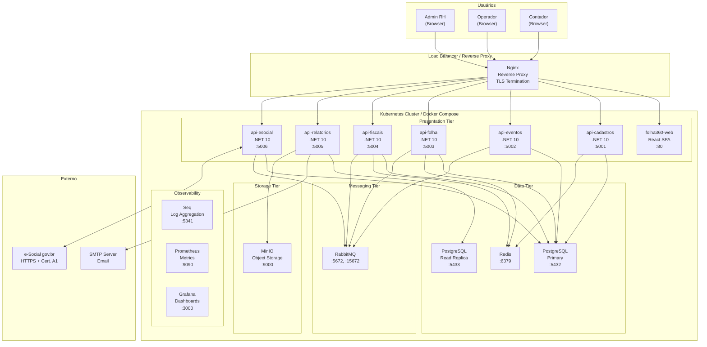

# Deployment View — Folha360

## Summary
Mapeamento dos elementos de software do Folha360 em nós de infraestrutura, containers e processos. A implantação segue o modelo de **monólito modular** containerizado com Docker Compose para ambientes de desenvolvimento/homologação e Kubernetes para produção. Cada módulo de domínio é um container independente, com banco de dados PostgreSQL compartilhado (schemas separados por módulo).

## Diagrama de Deployment

## Tabela de Elementos

| Elemento | Runs Where | Scale Unit | Statefulness | Security Notes | Observability |
|---|---|---|---|---|---|
| **folha360-web** | Container Nginx (servindo estáticos) ou CDN | 2+ réplicas (stateless) | Stateless | HTTPS only; CSP headers; sem acesso direto a DB | Google Analytics; logs de acesso Nginx |
| **api-cadastros** | Container .NET 10 (`mcr.microsoft.com/dotnet/aspnet:10.0`) | 2+ réplicas | Stateless (state no PG + Redis) | JWT validation; dados sensíveis criptografados; audit log | Serilog → Seq; health checks `/healthz` |
| **api-eventos** | Container .NET 10 | 2+ réplicas | Stateless | JWT validation; validação de prazos legais | Serilog → Seq; métricas de eventos processados |
| **api-folha** | Container .NET 10 | 3+ réplicas (pico no fechamento) | Stateless (cache Redis) | JWT validation; acesso a dados financeiros restrito | Serilog → Seq; métricas de tempo de cálculo; alerta se >2h |
| **api-fiscais** | Container .NET 10 | 2+ réplicas | Stateless | JWT validation; dados fiscais sensíveis | Serilog → Seq; métricas de apuração |
| **api-relatorios** | Container .NET 10 | 2+ réplicas | Stateless (lê réplica) | JWT validation; watermarks em PDFs | Serilog → Seq; métricas de geração |
| **api-esocial** | Container .NET 10 | 2+ réplicas | Stateless (mensagens no RMQ) | Certificado digital A1 montado via secret; HTTPS mutual TLS para gov.br | Serilog → Seq; métricas de envio/erro; alerta de falha |
| **PostgreSQL Primary** | Container PostgreSQL 16 ou instância gerenciada | 1 (com failover) | Stateful | TLS; criptografia em repouso (AES-256); backup diário criptografado | Prometheus exporter; slow query log |
| **PostgreSQL Replica** | Container PostgreSQL 16 | 1+ (read-only) | Stateful (réplica) | Mesmo nível do Primary | Lag de replicação monitorado |
| **Redis** | Container Redis 7 | 1 (com Sentinel) | Stateful | Auth password; sem exposição externa | Prometheus exporter; hit rate |
| **RabbitMQ** | Container RabbitMQ 3.13 | 2+ (cluster) | Stateful (mensagens persistentes) | TLS; vhost por ambiente; filas com TTL | Prometheus exporter; dead-letter metrics |
| **MinIO** | Container MinIO | 1 (modo single-node) | Stateful | TLS; access key; bucket policies | Prometheus exporter |
| **Nginx** | Container Nginx | 2+ réplicas | Stateless | TLS termination; rate limiting; WAF rules | Access logs → Seq |
| **Seq** | Container Datalust Seq | 1 | Stateful | Auth interna; sem exposição externa | Self-monitoring |
| **Prometheus** | Container Prometheus | 1 | Stateful (TSDB) | Auth básica | Alertmanager |
| **Grafana** | Container Grafana | 1 | Stateless (config em volume) | OAuth2; dashboards read-only | Self-monitoring |

## Deployment Risks

| Risco | Severidade | Descrição | Mitigação |
|---|---|---|---|
| **Single point of failure no PostgreSQL** | Crítico | Primary único. Falha = sistema todo parado. | Patroni + etcd para auto-failover; backups a cada 1h; RPO < 1h |
| **Pico de carga no fechamento** | Alto | 100K funcionários processados simultaneamente sobrecarrega APIs e DB. | HPA (Horizontal Pod Autoscaler) no Kubernetes; scale baseado em CPU e fila RMQ; agendamento de fechamento por lote |
| **Certificado digital expirado** | Crítico | Sem certificado A1 válido, envio ao e-Social é rejeitado. | Monitor de expiração com alerta 30 dias antes; renovação automatizada (se possível) |
| **Vazamento de dados sensíveis** | Crítico | Dados de RH (salários, documentos) são alvo de ataques. | Network policies (K8s); TLS everywhere; criptografia em repouso; audit log imutável; pentest periódico |
| **Latência de replicação PostgreSQL** | Médio | Relatórios podem mostrar dados desatualizados se lag > 30s. | Alertas de lag; fallback para primary se lag crítico |

## Ambientes

| Ambiente | Infra | Dados | Finalidade |
|---|---|---|---|
| **dev** | Docker Compose local | Dados sintéticos (100 func.) | Desenvolvimento individual |
| **hom** | Docker Compose / K8s namespace | Dados anonimizados (10K func.) | Testes de integração, QA |
| **prod** | Kubernetes (on-premise / cloud privada) | Dados reais (100K+ func.) | Produção |

## Evidence vs Assumptions

**Evidências**:
- Stack .NET 10 + PostgreSQL + React definida no contexto do projeto
- Docker Compose viável para dev/hom
- e-Social exige certificado digital A1 (ICP-Brasil)

**Assumptions**:
- Kubernetes disponível para produção (on-premise ou cloud privada)
- Equipe de infraestrutura disponível para gerenciar cluster K8s
- PostgreSQL gerenciado com Patroni ou Cloud SQL

## Recommended Next Skill
`runtime-view-writer` — para descrever os fluxos de execução principais (cálculo da folha, envio e-Social).
