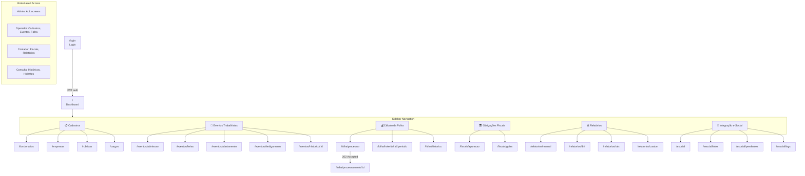

# Frontend Prototype — Folha360

## Summary
Protótipo de frontend para o sistema Folha360, cobrindo os 6 módulos de domínio com **28 telas** distribuídas por bounded context. A navegação é baseada em sidebar com menu hierárquico e role-based access (admin, operador, contador, consulta). O layout segue padrão **dashboard administrativo** com header fixo, sidebar colapsável e área de conteúdo com breadcrumb. Stack: React 18 + Vite + React Router 6 + CSS Modules/Tailwind. A prototipagem cobre inventário de telas, fluxo de navegação, árvore de componentes, wireframes das 5 telas mais críticas e cross-cutting concerns (LGPD, WCAG 2.1 AA, responsivo).

---

## Screen Inventory by Module

### Module: Cadastros

| Screen | Route | Role | Key Actions | API Endpoints |
|---|---|---|---|---|
| **Lista de Funcionários** | `/funcionarios` | admin, operador | Buscar, filtrar, paginar, exportar CSV | `GET /api/cadastros/funcionarios` |
| **Cadastro de Funcionário** | `/funcionarios/novo` | admin, operador | Criar com validação CPF/CTPS/PIS, upload docs | `POST /api/cadastros/funcionarios` |
| **Edição de Funcionário** | `/funcionarios/:id` | admin, operador | Editar dados, adicionar dependentes, histórico | `GET/PUT /api/cadastros/funcionarios/:id` |
| **Lista de Empresas** | `/empresas` | admin | CRUD matriz/filiais, regime tributário | `GET /api/cadastros/empresas` |
| **Rubricas** | `/rubricas` | admin | CRUD rubricas, natureza, incidências (e-Social Tabela 03) | `GET/POST /api/cadastros/rubricas` |
| **Cargos e Lotações** | `/cargos` | admin, operador | CRUD cargos (CBO), lotações (departamentos) | `GET/POST /api/cadastros/cargos` |

### Module: Eventos Trabalhistas

| Screen | Route | Role | Key Actions | API Endpoints |
|---|---|---|---|---|
| **Registrar Admissão** | `/eventos/admissao` | admin, operador | Selecionar funcionário, preencher dados S-2200 | `POST /api/eventos/admissao` |
| **Gerenciar Férias** | `/eventos/ferias` | admin, operador | Conceder férias, abono, período aquisitivo (S-2230) | `POST /api/eventos/ferias` |
| **Registrar Afastamento** | `/eventos/afastamento` | admin, operador | Tipo, CID, datas (doença, acidente, maternidade) | `POST /api/eventos/afastamento` |
| **Registrar Desligamento** | `/eventos/desligamento` | admin | Tipo, motivo, aviso prévio (S-2299) | `POST /api/eventos/desligamento` |
| **Histórico de Eventos** | `/eventos/historico/:funcionarioId` | admin, operador, consulta | Timeline de eventos do funcionário | `GET /api/eventos?funcionarioId=` |

### Module: Cálculo da Folha

| Screen | Route | Role | Key Actions | API Endpoints |
|---|---|---|---|---|
| **Processar Folha** | `/folha/processar` | admin, operador | Selecionar período/empresa, iniciar processamento | `POST /api/folha/processar` |
| **Acompanhar Processamento** | `/folha/processamento/:id` | admin, operador | Barra de progresso, ETA, funcionários processados (SignalR) | `GET /api/folha/processamento/:id/status` |
| **Holerite** | `/folha/holerite/:funcionarioId/:periodo` | admin, operador, consulta | Visualizar holerite detalhado, imprimir, exportar PDF | `GET /api/folha/holerite` |
| **Histórico de Folhas** | `/folha/historico` | admin, operador, consulta | Listar folhas por período, empresa; totais | `GET /api/folha/historico` |

### Module: Obrigações Fiscais

| Screen | Route | Role | Key Actions | API Endpoints |
|---|---|---|---|---|
| **Apuração Fiscal** | `/fiscais/apuracao` | admin, contador | Visualizar apuração por período (IRRF, INSS, FGTS) | `GET /api/fiscais/apuracao` |
| **Guias de Recolhimento** | `/fiscais/guias` | admin, contador | Emitir GPS, DARF; registrar pagamento | `GET/PUT /api/fiscais/guias` |

### Module: Relatórios

| Screen | Route | Role | Key Actions | API Endpoints |
|---|---|---|---|---|
| **Relatório Mensal** | `/relatorios/mensal` | admin, contador | Gerar resumo mensal por empresa; exportar PDF/CSV | `GET /api/relatorios/mensal` |
| **DIRF Anual** | `/relatorios/dirf` | admin, contador | Gerar DIRF anual; exportar CSV | `GET /api/relatorios/dirf` |
| **RAIS** | `/relatorios/rais` | admin, contador | Gerar RAIS; exportar formato gov.br | `GET /api/relatorios/rais` |
| **Relatórios Customizados** | `/relatorios/custom` | admin, contador | Selecionar campos, filtros, período; exportar | `POST /api/relatorios/custom` |

### Module: Integração e-Social

| Screen | Route | Role | Key Actions | API Endpoints |
|---|---|---|---|---|
| **Painel e-Social** | `/esocial` | admin | Visão geral: lotes pendentes, enviados, erros | `GET /api/esocial/dashboard` |
| **Lotes Enviados** | `/esocial/lotes` | admin | Listar lotes, status, protocolo, recibo | `GET /api/esocial/lotes` |
| **Eventos Pendentes** | `/esocial/pendentes` | admin | Eventos com erro, reprocessar, corrigir | `GET/POST /api/esocial/eventos` |
| **Log de Envios** | `/esocial/logs` | admin | Histórico completo de envios e respostas | `GET /api/esocial/logs` |

### Shared Screens

| Screen | Route | Role | Key Actions | API Endpoints |
|---|---|---|---|---|
| **Login** | `/login` | Todos | Autenticação JWT (email + senha) | `POST /auth/login` |
| **Dashboard** | `/` | Todos | Cards resumo (funcionários ativos, folha do mês, eventos pendentes, prazos e-Social) | `GET /api/dashboard` |
| **Perfil do Usuário** | `/perfil` | Todos | Alterar senha, preferências | `GET/PUT /auth/perfil` |

---

## Navigation Flow



### Role-Based Menu Visibility

| Menu Item | Admin | Operador | Contador | Consulta |
|---|---|---|---|---|
| 📋 Cadastros | ✅ Full CRUD | ✅ Listar, criar, editar | ❌ | ❌ |
| 📅 Eventos Trabalhistas | ✅ Todos | ✅ Registrar | ❌ | ✅ Histórico |
| 💰 Cálculo da Folha | ✅ Processar | ✅ Processar | ❌ | ✅ Holerites |
| 🏛️ Obrigações Fiscais | ✅ Apurar, guias | ❌ | ✅ Apurar, guias | ❌ |
| 📊 Relatórios | ✅ Todos | ❌ | ✅ Todos | ❌ |
| 🔗 Integração e-Social | ✅ Todos | ❌ | ❌ | ❌ |

---

## Component Tree (Critical Screens)

### Screen: Dashboard (`/`)

```
AppLayout
├── Header
│   ├── Logo (Folha360)
│   ├── TenantSelector (dropdown empresa)
│   ├── NotificationBell (badge com pendências e-Social)
│   └── UserMenu (avatar, perfil, sair)
├── Sidebar
│   ├── MenuItem (Cadastros) → expande subitens
│   ├── MenuItem (Eventos Trabalhistas)
│   ├── MenuItem (Cálculo da Folha)
│   ├── MenuItem (Obrigações Fiscais)
│   ├── MenuItem (Relatórios)
│   └── MenuItem (Integração e-Social)
├── ContentArea
│   ├── PageHeader (título "Dashboard" + período atual)
│   └── DashboardGrid
│       ├── StatCard (Funcionários Ativos)
│       ├── StatCard (Folha do Mês — status)
│       ├── StatCard (Eventos Pendentes e-Social)
│       ├── StatCard (Próximo Vencimento Fiscal)
│       ├── RecentActivityList (últimas ações)
│       └── PendingESocialAlerts (alertas de prazo)
└── Footer
    └── VersionInfo + LegalLinks
```

### Screen: Lista de Funcionários (`/funcionarios`)

```
AppLayout
├── Header (shared)
├── Sidebar (shared)
├── ContentArea
│   ├── PageHeader
│   │   ├── Breadcrumb (Home > Cadastros > Funcionários)
│   │   └── ActionButtons
│   │       ├── Button "Novo Funcionário" (primary)
│   │       └── Button "Exportar CSV" (secondary)
│   ├── FilterBar
│   │   ├── SearchInput (nome, CPF)
│   │   ├── SelectFilter (status: ativo/inativo/todos)
│   │   ├── SelectFilter (empresa — multi-tenant)
│   │   └── Button "Filtrar"
│   ├── DataTable
│   │   ├── ColumnHeader (Nome, CPF*, Cargo, Lotação, Status, Ações)
│   │   ├── TableRow (com StatusBadge)
│   │   └── EmptyState (quando sem resultados)
│   ├── Pagination
│   │   ├── PageInfo ("1-20 de 1.234")
│   │   └── PageControls (prev, next, page numbers)
│   └── LoadingOverlay (durante fetch)
└── Footer (shared)
```

### Screen: Processar Folha (`/folha/processar`)

```
AppLayout
├── Header (shared)
├── Sidebar (shared)
├── ContentArea
│   ├── PageHeader
│   │   ├── Breadcrumb (Home > Folha > Processar)
│   │   └── StatusBadge (último processamento)
│   ├── ProcessForm
│   │   ├── SelectEmpresa (dropdown)
│   │   ├── SelectPeriodo (month/year picker)
│   │   ├── InfoBox (funcionários ativos, última folha)
│   │   └── Button "Iniciar Processamento" (primary, com confirmação)
│   └── ProcessingHistory
│       └── DataTable (período, status, duração, ações)
└── Footer (shared)
```

### Screen: Acompanhar Processamento (`/folha/processamento/:id`)

```
AppLayout
├── Header (shared)
├── Sidebar (shared)
├── ContentArea
│   ├── PageHeader
│   │   ├── Breadcrumb (Home > Folha > Processamento #12345)
│   │   └── StatusBadge (INICIADO | PROCESSANDO | CONCLUIDO | ERRO)
│   ├── ProgressSection
│   │   ├── ProgressBar (percentual concluído)
│   │   ├── StatGrid
│   │   │   ├── StatItem (Funcionários Processados / Total)
│   │   │   ├── StatItem (Tempo Decorrido)
│   │   │   └── StatItem (ETA — tempo estimado)
│   │   └── StatusMessage (ex.: "Processando lote 45/100...")
│   ├── ErrorLog (apenas se status=ERRO)
│   │   └── ErrorList (lotes com falha, mensagens)
│   └── ActionBar (após concluído)
│       ├── Button "Ver Resumo"
│       └── Button "Ir para Obrigações Fiscais"
└── Footer (shared)
```

### Screen: Holerite (`/folha/holerite/:funcionarioId/:periodo`)

```
AppLayout
├── Header (shared)
├── Sidebar (shared)
├── ContentArea
│   ├── PageHeader
│   │   ├── Breadcrumb (Home > Folha > Holerite)
│   │   └── ActionButtons
│   │       ├── Button "Imprimir" (secondary)
│   │       └── Button "Exportar PDF" (secondary)
│   ├── HoleriteCard (simula documento impresso)
│   │   ├── CompanyHeader (logo, CNPJ, razão social)
│   │   ├── EmployeeInfo (nome, cargo, lotação, CPF*)
│   │   ├── PeriodInfo (mês/ano de referência)
│   │   ├── RubricTable
│   │   │   ├── SectionHeader "Vencimentos"
│   │   │   ├── RubricRow (código, descrição, valor)
│   │   │   ├── SectionHeader "Descontos"
│   │   │   ├── RubricRow (código, descrição, valor)
│   │   │   ├── Divider
│   │   │   ├── TotalRow "Total Vencimentos"
│   │   │   ├── TotalRow "Total Descontos"
│   │   │   └── TotalRow "Líquido" (destaque)
│   │   ├── FooterInfo (base INSS, base IRRF, FGTS)
│   │   └── Watermark "DOCUMENTO OFICIAL — Folha360"
│   └── PrintStyles (CSS @media print)
└── Footer (shared)
```

---

## Shared Components

| Component | Used By | Props | Notes |
|---|---|---|---|
| **AppLayout** | Todas as telas | `children` | Header + Sidebar + Content + Footer |
| **Header** | AppLayout | `user`, `tenant`, `notifications` | Fixo no topo, z-index alto |
| **Sidebar** | AppLayout | `menuItems`, `currentPath`, `userRole` | Colapsável (tablet), role-based filtering |
| **DataTable** | Listas (funcionários, eventos, lotes, etc.) | `columns`, `rows`, `onSort`, `onRowClick`, `emptyState` | Ordenação, seleção de linha |
| **FilterBar** | Listas com busca | `filters[]`, `onFilterChange` | SearchInput + SelectFilter + DateRange |
| **Pagination** | DataTable | `page`, `totalPages`, `totalItems`, `onPageChange` | Info + controles |
| **StatusBadge** | Várias telas | `status`, `type` | Cores: verde=concluído, amarelo=processando, vermelho=erro |
| **StatCard** | Dashboard, processamento | `title`, `value`, `icon`, `trend`, `color` | Card com valor destacado |
| **ProgressBar** | Processamento | `percent`, `label`, `showETA` | Animada, com gradiente |
| **Breadcrumb** | PageHeader | `items[]` | Navegação hierárquica |
| **ConfirmDialog** | Ações destrutivas | `title`, `message`, `onConfirm`, `onCancel` | Modal de confirmação |
| **EmptyState** | DataTable, listas | `icon`, `title`, `description`, `action?` | Quando não há dados |
| **LoadingOverlay** | Telas com fetch | `visible` | Spinner + overlay semi-transparente |
| **FormField** | Formulários | `label`, `name`, `type`, `error`, `mask?` | Input com validação e máscara |
| **TenantSelector** | Header | `tenants[]`, `currentTenant`, `onChange` | Dropdown de empresa (multi-tenant) |
| **NotificationBell** | Header | `count`, `notifications[]` | Badge com dropdown de notificações |

---

## Wireframe Mockups

### 1. Dashboard (`/`)

```
┌──────────────────────────────────────────────────────────────────┐
│ 🏢 Folha360  [Empresa: ABC Ltda ▼]  🔔3  [👤 Admin ▼]         │
├──────────┬───────────────────────────────────────────────────────┤
│ 📋 Cadastros │  Dashboard                          Período: 06/2026 │
│   Funcionários│                                                      │
│   Empresas    │  ┌──────────┐ ┌──────────┐ ┌──────────┐ ┌────────┐ │
│   Rubricas    │  │👥 1.234   │ │💰 R$ 2.1M│ │📤 45     │ │📅 15/06 │ │
│   Cargos      │  │Ativos     │ │Folha Mês │ │Pendentes │ │Venc. GPS│ │
│ 📅 Eventos    │  └──────────┘ └──────────┘ └──────────┘ └────────┘ │
│ 💰 Folha      │                                                      │
│ 🏛️ Fiscais   │  📋 Atividade Recente                                │
│ 📊 Relatórios │  ┌─────────────────────────────────────────────────┐ │
│ 🔗 e-Social   │  │ 10:45  Folha 05/2026 concluída                  │ │
│               │  │ 09:30  3 novos funcionários cadastrados          │ │
│               │  │ 08:15  Lote e-Social #887 processado com sucesso │ │
│               │  └─────────────────────────────────────────────────┘ │
│               │                                                      │
│               │  ⚠️ Alertas e-Social                                 │
│               │  ┌─────────────────────────────────────────────────┐ │
│               │  │ ⚠️  S-1200 — 5 eventos com erro de validação    │ │
│               │  │ ⚠️  Certificado digital expira em 45 dias       │ │
│               │  └─────────────────────────────────────────────────┘ │
├──────────┴───────────────────────────────────────────────────────┤
│ Folha360 v1.0  |  © 2026  |  LGPD  |  Termos de Uso              │
└──────────────────────────────────────────────────────────────────┘
```

### 2. Lista de Funcionários (`/funcionarios`)

```
┌──────────────────────────────────────────────────────────────────┐
│ 🏢 Folha360  [Empresa: ABC Ltda ▼]  🔔3  [👤 Admin ▼]         │
├──────────┬───────────────────────────────────────────────────────┤
│ 📋 Cadastros │  Home > Cadastros > Funcionários                    │
│   Funcionários│  [+ Novo Funcionário]  [Exportar CSV]               │
│   Empresas    │                                                      │
│   Rubricas    │  🔍 Buscar...  [Status: Todos ▼]  [Empresa ▼] [Filtrar]│
│   Cargos      │                                                      │
│ 📅 Eventos    │  ┌─────────────────────────────────────────────────┐ │
│ 💰 Folha      │  │ Nome          CPF*         Cargo     Status     │ │
│ 🏛️ Fiscais   │  │ João Silva    ***.123.***  Analista  🟢 Ativo  │ │
│ 📊 Relatórios │  │ Maria Souza   ***.456.***  Gerente   🟢 Ativo  │ │
│ 🔗 e-Social   │  │ Pedro Lima    ***.789.***  Operador  🟡 Férias │ │
│               │  │ Ana Costa     ***.012.***  Diretora  🔴 Inativo│ │
│               │  └─────────────────────────────────────────────────┘ │
│               │  Mostrando 1-4 de 1.234  [<] [1] [2] ... [62] [>]  │
├──────────┴───────────────────────────────────────────────────────┤
│ Folha360 v1.0  |  © 2026  |  LGPD  |  Termos de Uso              │
└──────────────────────────────────────────────────────────────────┘
```

### 3. Acompanhar Processamento (`/folha/processamento/:id`)

```
┌──────────────────────────────────────────────────────────────────┐
│ 🏢 Folha360  [Empresa: ABC Ltda ▼]  🔔3  [👤 Admin ▼]         │
├──────────┬───────────────────────────────────────────────────────┤
│ 📋 Cadastros │  Home > Folha > Processamento #12345    🟡 PROCESSANDO│
│ 📅 Eventos    │                                                      │
│ 💰 Folha      │  ████████████████░░░░░░░░░░░░░░  62%                │
│   Processar   │                                                      │
│   Histórico   │  ┌──────────────┬──────────────┬──────────────────┐ │
│ 🏛️ Fiscais   │  │ 👥 62.000    │ ⏱️ 01:15:32  │ ⏳ ETA: 00:42:18 │ │
│ 📊 Relatórios │  │ Processados  │ Tempo Decor. │ Tempo Estimado   │ │
│ 🔗 e-Social   │  └──────────────┴──────────────┴──────────────────┘ │
│               │                                                      │
│               │  Processando lote 62/100 — Funcionários 61.001-62.000│
│               │                                                      │
│               │  ┌─────────────────────────────────────────────────┐ │
│               │  │ ✅ Lotes 1-60 concluídos                        │ │
│               │  │ 🔄 Lote 61 processando...                       │ │
│               │  │ ⏳ Lotes 62-100 aguardando                      │ │
│               │  └─────────────────────────────────────────────────┘ │
├──────────┴───────────────────────────────────────────────────────┤
│ Folha360 v1.0  |  © 2026  |  LGPD  |  Termos de Uso              │
└──────────────────────────────────────────────────────────────────┘
```

### 4. Holerite (`/folha/holerite/:funcionarioId/:periodo`)

```
┌──────────────────────────────────────────────────────────────────┐
│ 🏢 Folha360  [Empresa: ABC Ltda ▼]  🔔3  [👤 Admin ▼]         │
├──────────┬───────────────────────────────────────────────────────┤
│ 📋 Cadastros │  Home > Folha > Holerite           [🖨️ Imprimir] [📥 PDF]│
│ 📅 Eventos    │                                                      │
│ 💰 Folha      │  ┌─────────────────────────────────────────────────┐ │
│ 🏛️ Fiscais   │  │  ABC LTDA — CNPJ: 00.000.000/0001-00           │ │
│ 📊 Relatórios │  │  Funcionário: João Silva    CPF: ***.123.456-** │ │
│ 🔗 e-Social   │  │  Cargo: Analista | Lotação: Financeiro          │ │
│               │  │  Período: 05/2026                                │ │
│               │  │  ─────────────────────────────────────────────  │ │
│               │  │  VENCIMENTOS                          VALOR     │ │
│               │  │  001 — Salário Base                R$ 5.000,00  │ │
│               │  │  002 — Horas Extras 50%             R$   850,00  │ │
│               │  │  003 — Vale Transporte              R$   350,00  │ │
│               │  │  ─────────────────────────────────────────────  │ │
│               │  │  DESCONTOS                            VALOR     │ │
│               │  │  101 — INSS                         R$   660,00  │ │
│               │  │  102 — IRRF                         R$   425,00  │ │
│               │  │  103 — Vale Transporte              R$   300,00  │ │
│               │  │  ─────────────────────────────────────────────  │ │
│               │  │  Total Vencimentos                  R$ 6.200,00  │ │
│               │  │  Total Descontos                    R$ 1.385,00  │ │
│               │  │  LÍQUIDO A RECEBER                  R$ 4.815,00  │ │
│               │  │  ─────────────────────────────────────────────  │ │
│               │  │  Base INSS: R$ 6.200,00 | Base IRRF: R$ 5.540,00│ │
│               │  │  FGTS: R$ 496,00                                 │ │
│               │  │                                                  │ │
│               │  │  [DOCUMENTO OFICIAL — Folha360 — ÁGUA]           │ │
│               │  └─────────────────────────────────────────────────┘ │
├──────────┴───────────────────────────────────────────────────────┤
│ Folha360 v1.0  |  © 2026  |  LGPD  |  Termos de Uso              │
└──────────────────────────────────────────────────────────────────┘
```

### 5. Painel e-Social (`/esocial`)

```
┌──────────────────────────────────────────────────────────────────┐
│ 🏢 Folha360  [Empresa: ABC Ltda ▼]  🔔3  [👤 Admin ▼]         │
├──────────┬───────────────────────────────────────────────────────┤
│ 📋 Cadastros │  Home > e-Social > Painel                           │
│ 📅 Eventos    │                                                      │
│ 💰 Folha      │  ┌──────────┐ ┌──────────┐ ┌──────────┐ ┌────────┐ │
│ 🏛️ Fiscais   │  │ ✅ 1.250  │ │ 📤 45     │ │ ❌ 12     │ │ 🔄 3   │ │
│ 📊 Relatórios │  │ Enviados  │ │ Pendentes │ │ Com Erro  │ │ Em Fila│ │
│ 🔗 e-Social   │  └──────────┘ └──────────┘ └──────────┘ └────────┘ │
│   Painel      │                                                      │
│   Lotes       │  📊 Últimos Lotes                                    │
│   Pendentes   │  ┌─────────────────────────────────────────────────┐ │
│   Logs        │  │ Lote #890  S-1200  ✅ Processado   10/06 14:30  │ │
│               │  │ Lote #889  S-5001  ✅ Processado   10/06 11:15  │ │
│               │  │ Lote #888  S-2200  ❌ Erro Valid.  09/06 16:45  │ │
│               │  └─────────────────────────────────────────────────┘ │
│               │                                                      │
│               │  ⚠️ Eventos com Erro (12)                            │
│               │  ┌─────────────────────────────────────────────────┐ │
│               │  │ S-1200  João Silva     Erro: campo obrigatório   │ │
│               │  │ S-1200  Maria Souza    Erro: valor inválido      │ │
│               │  └─────────────────────────────────────────────────┘ │
│               │  [Reprocessar Todos]  [Corrigir Individualmente]     │
├──────────┴───────────────────────────────────────────────────────┤
│ Folha360 v1.0  |  © 2026  |  LGPD  |  Termos de Uso              │
└──────────────────────────────────────────────────────────────────┘
```

---

## Responsive Breakpoints

| Breakpoint | Width | Layout Changes |
|---|---|---|
| **Desktop** | ≥ 1440px | Sidebar expandida (240px), tabelas com todas colunas, dashboard com 4 cards por linha |
| **Tablet Landscape** | ≥ 1024px | Sidebar reduzida (64px — ícones), tabelas com colunas essenciais, 2 cards por linha |
| **Tablet Portrait** | ≥ 768px | Sidebar colapsada (toggle hamburger), tabelas com scroll horizontal, 1 card por linha |
| **Mobile** | < 768px | Sidebar oculta (drawer), cards empilhados, tabelas viram cards, formulários full-width |

---

## LGPD & Accessibility

### LGPD — Data Masking

| Campo | Máscara | Onde Aplicar |
|---|---|---|
| CPF | `***.123.456-**` | Tabelas, holerites, relatórios |
| CTPS | `******/****` | Ficha do funcionário |
| PIS/PASEP | `***.*****.**-*` | Ficha do funcionário |
| Salário (líquido) | `R$ ****,**` (apenas em listas; visível no holerite com watermark) | Listas de funcionários |
| Documentos (RG, CNH) | `**.***.***-*` | Ficha do funcionário |

### Watermark
- Todo documento impresso/PDF exibe: `"DOCUMENTO OFICIAL — Folha360 — USUÁRIO: {nome} — {data/hora}"` em marca d'água diagonal

### Accessibility (WCAG 2.1 AA)

| Requisito | Implementação |
|---|---|
| **Contraste** | Texto: mínimo 4.5:1; Componentes UI: 3:1. Paleta indigo + deep orange validada |
| **Navegação por teclado** | Tab order lógica; focus ring visível; atalhos: `Ctrl+K` = busca, `Esc` = fechar modal |
| **Aria labels** | `aria-label` em ícones; `aria-describedby` em campos com erro; `role="alert"` em notificações |
| **Screen reader** | Tabelas com `caption`; gráficos com descrição textual; breadcrumb com `aria-label="breadcrumb"` |
| **Redução de movimento** | `prefers-reduced-motion` desabilita animações; ProgressBar sem animação se preferência |
| **Zoom** | Suporte a 200% sem quebra de layout; texto escalável com `rem` |

---

## Evidence vs Assumptions

**Evidence** (baseado em artefatos de arquitetura):
- 6 módulos definidos em [Component Boundaries](./component-boundaries.md) com responsabilidades e dados
- Presentation layer definida em [Layered Architecture](./layered-architecture.md): React SPA + .NET API Controllers
- Fluxos de usuário mapeados em [Runtime View](./runtime-view.md): Admin inicia processamento, acompanha progresso
- Cenário U1 em [Quality Scenarios](./quality-attribute-scenarios.md): Dashboard de progresso com SignalR
- Multi-tenant definido em [ADR-003](./adr-003-schema-por-tenant.md): TenantSelector no header
- JWT auth definido em [Architecture Options](./architecture-options.md): Option B (ASP.NET Core Identity + JWT)

**Assumptions**:
- React 18 + Vite + React Router 6 como stack frontend (consistente com [Architecture Options](./architecture-options.md) Option A)
- CSS Modules ou Tailwind para estilização (a decidir na tech spec)
- SignalR para atualização em tempo real do progresso (consistente com cenário U1)
- Biblioteca de componentes base: shadcn/ui (React) ou custom — a decidir na tech spec
- Design system com paleta indigo + deep orange (consistente com MkDocs Material theme)

---

## Risks or Tradeoffs

| Risk | Severity | Mitigation |
|---|---|---|
| **28 telas é um escopo grande para MVP** | Média | Priorizar: Dashboard + Cadastros (6 telas) + Processar Folha (2 telas) = 9 telas para MVP |
| **DataTable com 100K registros** | Alta | Server-side pagination, virtual scrolling, busca com debounce 300ms |
| **Máscara LGPD vs usabilidade** | Baixa | Toggle "revelar" com senha adicional para admin; audit log registra cada revelação |
| **SignalR em multi-instância** | Média | Configurar Redis backplane para SignalR (já temos Redis no deployment) |
| **Complexidade de formulários e-Social** | Média | Formulários wizard (multi-step) para admissão/desligamento; validação progressiva |

## Recommended Next Skill
`cria-prd` — para formalizar o PRD do módulo de Cadastros (módulo raiz, 6 telas), utilizando este inventário de telas como base para os requisitos de interface. Depois: `cria-techspec` → `criar-tasks` → `executar-task`.
