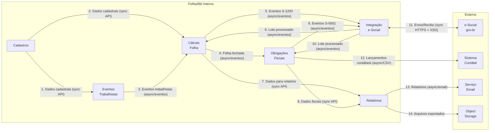

# Integration Boundaries — Folha360

## Summary
Mapeamento das fronteiras de integração entre os módulos internos do Folha360 e com sistemas externos (e-Social gov.br, sistemas de contabilidade). Cada fronteira define produtor, consumidor, contrato (schema/API), modo de comunicação (síncrono/assíncrono) e riscos associados.

> **Atualização (Junho 2026)**: Adicionadas fronteiras do subsistema de rubricas: Cadastros → Cálculo Folha (composições, fórmulas, tabelas progressivas), Cadastros → e-Social (S-1010, S-1070), e cache Redis com invalidação pub/sub. Ver [runtime-view-calculo-rubricas](../rubricas/runtime-view-calculo-rubricas.md).

## Mapa de Integrações



## Matriz de Fronteiras

| # | Boundary | Producer | Consumer | Contract | Sync/Async | Ownership | Risco |
|---|---|---|---|---|---|---|---|
| 1 | **Cadastros → Eventos Trab.** | Cadastros API | Eventos Trabalhistas | REST API: `GET /api/funcionarios/{id}`, `GET /api/empresas/{cnpj}` | Síncrono (leitura) | Cadastros | Baixo — dados estáveis, baixa latência |
| 2 | **Cadastros → Cálculo Folha** | Cadastros API | Cálculo da Folha | REST API: `GET /api/rubricas?vigencia=`, `GET /api/funcionarios/{id}/dados-contratuais` | Síncrono (leitura) | Cadastros | Médio — no fechamento, alto volume de consultas |
| 3 | **Eventos Trab. → Cálculo Folha** | Eventos Trabalhistas | Cálculo da Folha | Evento: `FuncionarioAdmitido`, `FeriasConcedidas`, `AfastamentoIniciado`, `FuncionarioDesligado` | Assíncrono (RabbitMQ) | Eventos Trab. | Alto — eventos devem estar processados antes do cálculo |
| 4 | **Cálculo Folha → Obrig. Fiscais** | Cálculo da Folha | Obrigações Fiscais | Evento: `FolhaFechada { periodo, empresaId, totalRemuneracao, totalDesconto }` | Assíncrono (RabbitMQ) | Cálculo da Folha | Alto — base para impostos e guias |
| 5 | **Cálculo Folha → Integração e-Social** | Cálculo da Folha | Integração e-Social | Evento: `EventoRemuneracaoGerado { tipo: S-1200/S-1210, xml, funcionarioId, periodo }` | Assíncrono (RabbitMQ) | Cálculo da Folha | Crítico — obrigação legal de envio |
| 6 | **Obrig. Fiscais → Integração e-Social** | Obrigações Fiscais | Integração e-Social | Evento: `EventoFiscalGerado { tipo: S-5001/S-5002, xml, empresaId, periodo }` | Assíncrono (RabbitMQ) | Obrigações Fiscais | Crítico — obrigação legal de envio |
| 7 | **Cálculo Folha → Relatórios** | Cálculo da Folha | Relatórios | REST API: `GET /api/folha/{periodo}/resumo` (read replica) | Síncrono (leitura) | Cálculo da Folha | Baixo — consultas em réplica de leitura |
| 8 | **Obrig. Fiscais → Relatórios** | Obrigações Fiscais | Relatórios | REST API: `GET /api/fiscais/{periodo}/apuracao` (read replica) | Síncrono (leitura) | Obrigações Fiscais | Baixo — consultas em réplica de leitura |
| 9 | **Integração e-Social → Cálculo Folha** | Integração e-Social | Cálculo da Folha | Evento: `LoteProcessado { protocolo, status, recibos[] }` | Assíncrono (RabbitMQ) | Integração e-Social | Médio — atualização de status |
| 10 | **Integração e-Social → Obrig. Fiscais** | Integração e-Social | Obrigações Fiscais | Evento: `LoteProcessado { protocolo, status, recibos[] }` | Assíncrono (RabbitMQ) | Integração e-Social | Médio — atualização de status |
| 11 | **Folha360 → e-Social gov.br** | Integração e-Social | e-Social (governo) | HTTPS + SOAP: envio de lote XML (schema XSD v. S-1.3); consulta de recibo | Síncrono (HTTPS) | Governo (externo) | Crítico — dependência externa; cert. digital; prazos legais |
| 12 | **Obrig. Fiscais → Contábil** | Obrigações Fiscais | Sistema Contábil | Arquivo CSV/XML: lançamentos contábeis por período | Assíncrono (arquivo/SFTP) | Obrigações Fiscais | Baixo — processo batch mensal |
| 13 | **Relatórios → Email** | Relatórios | Serviço de Email | SMTP/API: PDF anexado para admin/contador | Assíncrono (SMTP) | Relatórios | Baixo — entrega de relatórios |
| 14 | **Relatórios → Object Storage** | Relatórios | Object Storage (MinIO/S3) | S3 API: arquivos PDF/CSV exportados | Síncrono (S3 API) | Relatórios | Baixo — armazenamento de exportações |
| 15 | **Cadastros → Cálculo Folha (Rubricas)** | Cadastros API | Cálculo da Folha | REST API: `GET /api/rubricas?vigencia=`, `GET /api/rubricas/{id}/composicao`, `GET /api/rubricas/{id}/formula`, `GET /api/tabelas-progressivas?ano=` | Síncrono (leitura com cache Redis) | Cadastros | Alto — rubricas, composições e fórmulas são a base de todo o cálculo |
| 16 | **Cadastros → Redis (Cache)** | Cadastros API | Redis | Evento: `RubricaAlterada`, `RubricaCriada`, `TabelaProgressivaAtualizada` → invalidação de cache | Assíncrono (Redis pub/sub) | Cadastros | Médio — cache inconsistente gera cálculos errados |
| 17 | **Cadastros → e-Social (S-1010/S-1070)** | Cadastros API | Integração e-Social | Evento: `TabelaRubricaAtualizada { empresaId, rubricas[] }`, `ProcessoAdministrativoCriado { empresaId, processo }` | Assíncrono (RabbitMQ) | Cadastros | Alto — obrigação legal de envio da Tabela de Rubricas |

## Riscos de Contrato

| Risco | Fronteira | Descrição | Mitigação |
|---|---|---|---|
| **Schema XSD desatualizado** | #11 | Layouts e-Social mudam (NT — Notas Técnicas). Schema antigo causa rejeição. | Versionar schemas; CI/CD monitora portal e-Social; testes de validação XSD automatizados |
| **Indisponibilidade do e-Social** | #11 | Portal gov.br fora do ar no prazo de envio. | Retry com exponential backoff (1min, 5min, 15min, 1h); fila dead-letter; alerta operacional |
| **Inconsistência de rubricas** | #2, #15 | Rubrica alterada no Cadastros após início do cálculo; composição ou fórmula modificada durante processamento. | Snapshot de rubricas no momento do cálculo; evento `RubricaAlterada` invalida cache Redis via pub/sub; versionamento de fórmulas (`rubrica_formula.versao`) |
| **Perda de eventos** | #3, #4, #5, #6, #16, #17 | Falha no RabbitMQ causa perda de eventos de domínio. | Persistência de mensagens; confirmação de publicação; dead-letter queue; reconciliação batch |
| **Divergência fiscal** | #4, #12 | Diferença entre valores calculados e lançamentos contábeis. | Conciliação automática; relatório de divergências; bloqueio de fechamento se não conciliado |
| **Fórmula maliciosa ou com erro** | #15 | Fórmula NCalc com loop infinito ou acesso a recursos indevidos causa degradação ou crash. | Sandbox com timeout 100ms e memory limit; whitelist de funções permitidas; validador de sintaxe pré-execução |
| **Tabela progressiva desatualizada** | #15 | Tabela de IRRF/INSS não atualizada para o ano corrente gera cálculos fiscais incorretos. | Versionamento anual de tabelas; script de seed com tabelas oficiais; alerta de vigência; endpoint de consulta de conformidade |

## Análise de Risco de Coordenação

A coordenação entre fronteiras é o principal vetor de falha em sistemas com processamento sequencial como o Folha360. Abaixo, analisamos cada padrão de coordenação necessário.

### Cadeia de Processamento Sequencial (Fronteiras #3 → #4 → #5/#6)

```
Eventos Trab. ──(#3)──> Cálculo Folha ──(#4)──> Obrig. Fiscais ──(#6)──> e-Social
                                │                                       │
                                └──────────────(#5)─────────────────────┘
```

**Risco**: Esta cadeia é uma **saga sequencial sem compensação automática**. Se Obrigações Fiscais falhar após Cálculo Folha ter publicado `FolhaFechada`, o sistema fica em estado inconsistente: a folha está fechada mas os impostos não foram apurados.

**Avaliação de severidade**: **Alta** — impacto direto em obrigações legais (atraso no envio ao e-Social, recolhimento de impostos).

**Padrão recomendado**: **Saga com compensação**. Cada etapa deve:
1. Publicar evento de conclusão (já implementado)
2. Publicar evento de falha com motivo
3. Manter estado do processamento em tabela de tracking (`ProcessamentoFolha.status`)
4. Permitir reprocessamento manual a partir do ponto de falha

**O que já existe**: `ProcessamentoFolha` com status (INICIADO, CONCLUIDO) — cobre parcialmente.
**O que falta**: Tabela de tracking cross-módulo (`CadeiaFechamento`) que registre o progresso em cada fronteira; mecanismo de retry automático entre fronteiras; alerta se cadeia não completa em 4h.

### Padrão de Orquestração vs Choreography

| Fronteira | Padrão Atual | Avaliação | Recomendação |
|---|---|---|---|
| #3 Eventos Trab. → Cálculo Folha | Choreography (eventos) | Adequado. Eventos trabalhistas são independentes e podem ocorrer a qualquer momento. | Manter choreography. |
| #4 Cálculo Folha → Obrig. Fiscais | Choreography (`FolhaFechada`) | **Insuficiente**. A apuração fiscal **deve** ocorrer após a folha; não é opcional. | Adicionar **orquestrador de fechamento** (saga orchestrator) que garanta a sequência e lide com falhas. |
| #5/#6 → Integração e-Social | Choreography (eventos) | Adequado para o fluxo normal. Cada evento pode ser enviado independentemente. | Manter choreography, mas adicionar reconciliação batch para detectar eventos não enviados. |
| #1/#2 Cadastros → Consumidores | Síncrono (REST API) | **Risco de acoplamento temporal**. Se Cadastros ficar indisponível, todos os módulos param. | Adicionar cache local com TTL nos consumidores; publicar eventos `CadastroAlterado` para invalidação. |

### Dependência Circular Lógica

```
Cálculo Folha ──(FolhaFechada)──> Obrigações Fiscais ──(ObrigacoesApuradas)──> Relatórios
     ↑                                                                              │
     └──────────────────────────(LoteProcessado)────────────────────────────────────┘
     └──────────────────────────(LoteProcessado)──> Obrigações Fiscais ─────────────┘
```

**Risco**: `LoteProcessado` (fronteiras #9 e #10) volta do e-Social para Cálculo Folha e Obrigações Fiscais, criando um ciclo de feedback. Se o status for PROCESSADO_COM_ERRO, o módulo de origem precisa reagir — mas não há contrato definido para essa reação.

**Recomendação**: Definir contrato explícito para `LoteProcessado` com status machine:
- `PROCESSADO` → apenas registro de log
- `PROCESSADO_COM_ERRO` → notificar módulo de origem com `eventoId` e `motivoRecusa`; módulo de origem decide se reenvia ou marca como erro permanente
- `NAO_PROCESSADO` → reagendar envio automaticamente

## Recomendações de Fronteira

### Recomendações Críticas (implementar antes do primeiro deploy)

| # | Recomendação | Fronteira(s) | Justificativa | Esforço |
|---|---|---|---|---|
| **R1** | Implementar **Saga Orchestrator de Fechamento** | #3, #4, #5, #6 | Sem orquestração, falha no meio da cadeia deixa o sistema em estado inconsistente. Impacto legal (atraso e-Social). | Grande (3-5 dias) |
| **R2** | Adicionar **cache local com invalidação por evento** nos consumidores de Cadastros | #1, #2 | Cadastros é single point of failure para todos os módulos. Cache local reduz acoplamento temporal. | Médio (2-3 dias) |
| **R3** | Criar **tabela de tracking cross-módulo** (`CadeiaFechamento`) | #3 → #4 → #5/#6 | Visibilidade do progresso da cadeia; permite reprocessamento a partir do ponto de falha; alerta de SLA. | Médio (2 dias) |

### Recomendações Importantes (implementar no primeiro mês)

| # | Recomendação | Fronteira(s) | Justificativa | Esforço |
|---|---|---|---|---|
| **R4** | Definir contrato de **status machine para `LoteProcessado`** | #9, #10 | O ciclo de feedback do e-Social não tem contrato explícito; módulos não sabem como reagir a erros. | Pequeno (1 dia) |
| **R5** | Implementar **reconciliação batch diária** de eventos não enviados | #5, #6, #11 | Safety net para eventos perdidos entre Cálculo/Obrigações e Integração e-Social. | Médio (2 dias) |
| **R6** | Versionar schemas XSD do e-Social e automatizar detecção de NT (Notas Técnicas) | #11 | Mudanças no layout do e-Social quebram o contrato sem aviso. CI/CD deve monitorar portal. | Médio (2-3 dias) |

### Recomendações de Melhoria Contínua

| # | Recomendação | Fronteira(s) | Justificativa |
|---|---|---|---|
| **R7** | Migrar integração contábil (#12) de CSV/SFTP para API REST com webhook de confirmação | #12 | CSV é frágil; sem confirmação de recebimento, não há garantia de entrega. |
| **R8** | Adicionar **circuit breaker** nas chamadas síncronas (#1, #2, #7, #8) | #1, #2, #7, #8 | Evitar cascata de falhas quando um módulo fica indisponível. |
| **R9** | Criar **sandbox e-Social** para testes de integração sem depender do ambiente gov.br | #11 | Testes de contrato não devem depender de ambiente externo. |

## Tradeoffs Explícitos

| Tradeoff | Decisão | Consequência Aceita | Alternativa Rejeitada |
|---|---|---|---|
| **Simplicidade vs Resiliência na cadeia de fechamento** | Começar com choreography (eventos), evoluir para saga orchestrator | Risco de inconsistência no curto prazo; correção manual necessária em falhas | Saga orchestrator desde o início (mais complexo, atrasa MVP) |
| **Consistência vs Disponibilidade em Cadastros** | Disponibilidade: cache local nos consumidores com TTL | Dados cadastrais podem estar até 5min desatualizados nos consumidores | Leitura sempre síncrona de Cadastros (consistente mas frágil) |
| **Acoplamento com e-Social** | Acoplamento alto inevitável (obrigação legal) | Sistema depende de serviço externo não controlável; downtime do gov.br = downtime do envio | Nenhuma — é uma restrição regulatória, não uma escolha arquitetural |
| **Schema por tenant vs Complexidade cross-tenant** | Schema por tenant (ADR-003) | Queries cross-tenant (ex.: relatório consolidado) são mais complexas e exigem UNION ou replicação | Discriminator column (mais simples para cross-tenant, mas isolamento fraco) |

## Consequências Operacionais e de Deployment

### Impacto das Fronteiras no Deployment

1. **Ordem de deploy importa**: Cadastros deve ser deployado antes dos consumidores. Se Eventos Trabalhistas sobe antes de Cadastros, chamadas REST para `GET /api/funcionarios/{id}` falham.
2. **Breaking changes em API REST**: Exigem deploy coordenado ou versionamento de endpoint (`/api/v2/`). Sem versionamento, deploy de Cadastros pode quebrar Cálculo Folha e Eventos Trabalhistas simultaneamente.
3. **Eventos de domínio são deploy-independent**: Módulos podem ser deployados em qualquer ordem para eventos assíncronos — mensagens ficam na fila até o consumidor estar pronto.
4. **Migração de schema cross-tenant**: Alterações no schema de eventos (ex.: novo campo em `FolhaFechada`) exigem migração em N schemas. Script de migração deve ser executado antes do deploy dos consumidores.

### Impacto das Fronteiras na Operação

1. **Monitoramento**: Cada fronteira (#1 a #14) precisa de health check e métricas (latência, taxa de erro, throughput). Sem visibilidade por fronteira, é impossível identificar gargalos.
2. **Alertas críticos**:
   - Fronteira #11 (e-Social): latência > 30s ou taxa de erro > 5% → alerta imediato
   - Fronteira #4 (Folha → Fiscais): `FolhaFechada` publicado mas não consumido em 30min → alerta
   - Fronteira #5/#6 (→ e-Social): eventos acumulados na fila > 100 → alerta
3. **Certificado digital A1**: Exclusivo da fronteira #11. Renovação anual; expiração bloqueia todos os envios. Necessário processo operacional de renovação com 30 dias de antecedência.
4. **Multi-tenancy nas fronteiras**: Cada fronteira precisa propagar `tenantId`. Eventos de domínio devem conter `tenantId` no envelope. Chamadas REST devem incluir header `X-Tenant-Id`.

## Ownership & Governança

- **Cada módulo é dono do seu contrato** (o producer define o schema e versiona)
- **Breaking changes exigem versionamento** (ex.: `/api/v1/` → `/api/v2/`)
- **Eventos de domínio são imutáveis** — use novo tipo de evento para mudanças
- **Integração com e-Social (#11)** é o único ponto de contato externo — requer monitoramento 24/7 no fechamento

## Evidence vs Assumptions

**Evidências**:
- e-Social exige envio de eventos S-1200, S-1210, S-5001, S-5002 (obrigação legal)
- Layouts S-1.3 definem schemas XSD específicos para cada evento

**Assumptions**:
- RabbitMQ disponível e confiável como message bus central
- Sistema contábil externo aceita CSV/XML como formato de integração
- Certificado digital A1 disponível para autenticação no e-Social

## Recommended Next Skill

**`deployment-view-writer`** — para mapear como esses módulos e integrações são implantados em infraestrutura.

**Rationale**: As 14 fronteiras mapeadas neste documento expõem dependências operacionais críticas que precisam ser modeladas no deployment:
- A ordem de deploy importa (Cadastros antes dos consumidores)
- A fronteira #11 (e-Social) exige conectividade externa e certificado digital — o deployment view precisa mostrar o network path e onde o certificado é montado
- O RabbitMQ (ADR-002) é o backbone assíncrono de 8 fronteiras — o deployment view deve mostrar cluster, filas e dead-letter queues
- O PostgreSQL com schema por tenant (ADR-003) impacta connection pooling e conexões por módulo — precisa ser refletido no deployment
- Cache Redis (ADR-005) é compartilhado por Cálculo Folha e Obrigações Fiscais — o deployment view deve mostrar a topologia de cache

**Handoff context for `deployment-view-writer`**:
- 6 módulos de domínio com contratos REST e eventos
- 1 message broker (RabbitMQ, cluster 3 nós)
- 1 banco PostgreSQL com N schemas (schema por tenant)
- 1 cache Redis compartilhado
- 1 ponto de integração externa (e-Social gov.br, HTTPS + certificado A1)
- 2 integrações externas secundárias (sistema contábil via SFTP, serviço de email via SMTP)
- Processamento assíncrono da folha (ADR-004) exige background workers separados das APIs

**Alternative next skills** (dependendo da prioridade do time):
- `architecture-risk-assessor` — se o foco for mitigar os riscos de coordenação e contrato identificados aqui (recomendações R1-R3)
- `service-decomposition-advisor` — se houver dúvida sobre granularidade dos 6 módulos ou se algum deve ser dividido (ex.: Relatórios como serviço separado)
