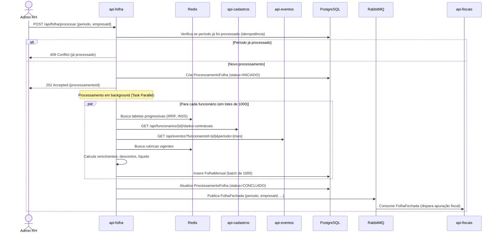
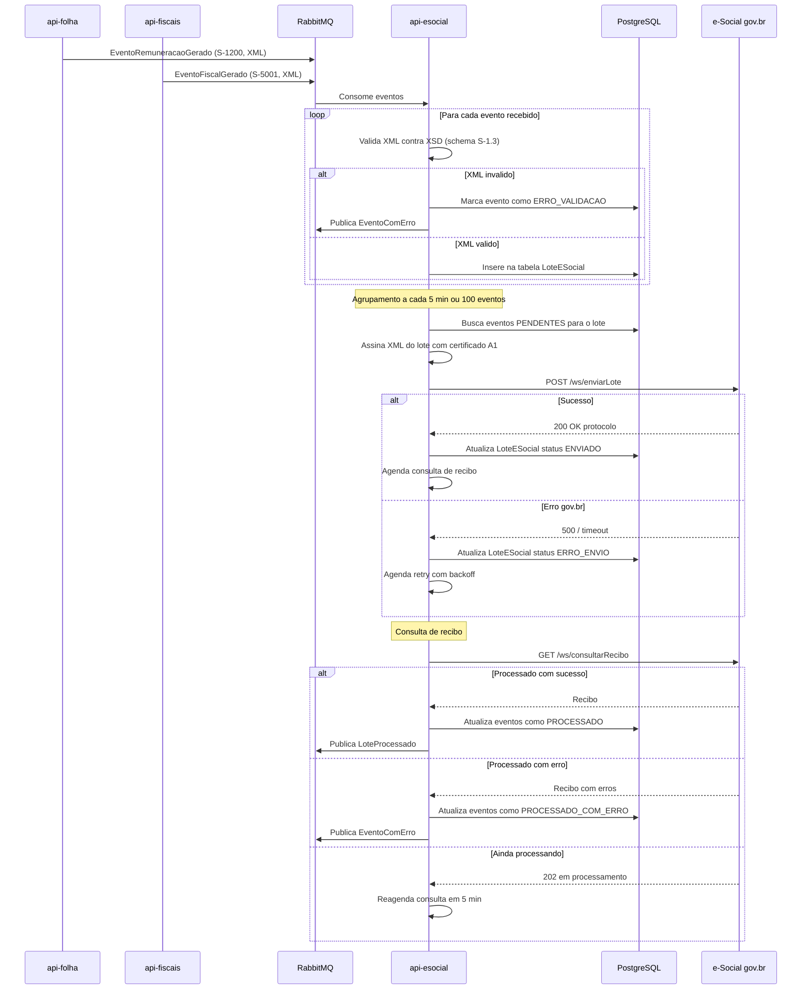
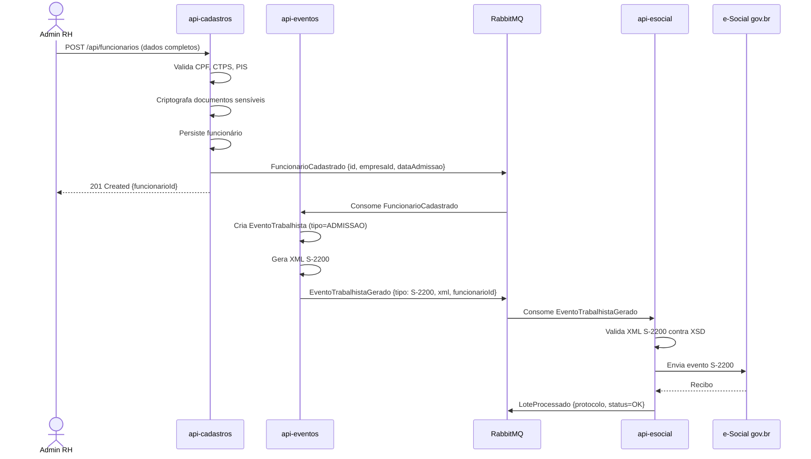

# Runtime View — Folha360

## Summary
Descrição dos principais fluxos de execução do Folha360, incluindo interações síncronas e assíncronas, componentes envolvidos em tempo de execução, pontos de falha e estratégias de recuperação. Foco nos dois fluxos mais críticos: **Processamento da Folha Mensal** e **Envio de Eventos ao e-Social**.

---

## Fluxo 1: Processamento da Folha Mensal

### Sequência Principal

### Elementos em Tempo de Execução

| Elemento | Papel no Fluxo | Escala |
|---|---|---|
| **api-folha** | Orquestrador do cálculo; processamento paralelo | 3+ réplicas; cada uma processa N lotes |
| **Redis** | Cache de tabelas progressivas (IRRF, INSS) e rubricas | Hit rate esperado > 95% |
| **api-cadastros** | Fornece dados contratuais dos funcionários | Consultas em cache local |
| **api-eventos** | Fornece eventos trabalhistas do período | Consultas em cache local |
| **PostgreSQL** | Persiste folhas calculadas e status do processamento | Batch insert otimizado |
| **RabbitMQ** | Notifica conclusão para módulo fiscal | 1 mensagem por empresa/período |

### Interações Síncronas
- Admin → api-folha: `POST /api/folha/processar` (resposta imediata com 202)
- api-folha → api-cadastros: consulta de dados contratuais (HTTP)
- api-folha → api-eventos: consulta de eventos do período (HTTP)
- api-folha → Redis: leitura de tabelas/rubricas

### Interações Assíncronas
- api-folha → RabbitMQ → api-fiscais: evento `FolhaFechada`

### Pontos de Falha

| Ponto | Falha | Impacto | Recuperação |
|---|---|---|---|
| **api-cadastros indisponível** | Não consegue ler dados de funcionários | Cálculo não inicia para funcionários órfãos | Retry 3x com backoff; marca como `PENDENTE_CADASTRO`; reprocessa após recuperação |
| **Redis indisponível** | Cache miss → consulta PostgreSQL | Degradação de performance (3-5x mais lento) | Fallback para PostgreSQL; recalcula tabelas em memória |
| **Timeout no batch insert** | Lote de 1000 registros falha | Perda parcial do processamento | Rollback do lote; retry com lote menor (500); marca lote como `ERRO` |
| **Estouro de memória** | 100K funcionários carregados simultaneamente | OOM kill no container | Streaming/batch processing; limite de 1000 funcionários por vez |
| **Processamento excede 2h** | SLA não atendido | Atraso no fechamento e envio e-Social | Alerta em 1h30; escala horizontal (HPA); particionar por empresa |

---

## Fluxo 2: Envio de Eventos ao e-Social

### Sequência Principal

### Elementos em Tempo de Execução

| Elemento | Papel no Fluxo | Escala |
|---|---|---|
| **api-esocial** | Validação, assinatura, envio, consulta de recibos | 2+ réplicas; fila consumida com concurrency |
| **RabbitMQ** | Fila de eventos a enviar; fila de retry; dead-letter | Cluster 2+ nós; mensagens persistentes |
| **PostgreSQL** | Armazena lotes, status, recibos | Primary para escrita |
| **e-Social gov.br** | Endpoint externo do governo | Fora do nosso controle |

### Interações Síncronas
- api-esocial → e-Social gov.br: HTTPS POST (envio) e GET (consulta)

### Interações Assíncronas
- api-folha → RabbitMQ → api-esocial: eventos de remuneração
- api-fiscais → RabbitMQ → api-esocial: eventos fiscais
- api-esocial → RabbitMQ → api-folha/api-fiscais: status de processamento

### Pontos de Falha

| Ponto | Falha | Impacto | Recuperação |
|---|---|---|---|
| **e-Social indisponível** | Portal gov.br fora do ar | Eventos acumulam na fila; risco de atraso legal | Retry com backoff exponencial (até 24h); dead-letter queue; alerta operacional |
| **Certificado expirado** | TLS handshake falha | Nenhum evento é enviado | Alerta 30 dias antes; procedimento de renovação documentado |
| **Schema XSD rejeitado** | Layout desatualizado | Lote inteiro rejeitado | Validação pré-envio; CI/CD monitora portal e-Social; rollback de schema |
| **Perda de mensagens RMQ** | RabbitMQ crash sem persistência | Eventos perdidos | Mensagens persistentes; publisher confirm; reconciliação batch diária |
| **Lote rejeitado por erro em 1 evento** | Evento inválido no lote | Lote inteiro rejeitado | Isolar evento com erro; reenviar lote sem ele; corrigir e reenviar evento isolado |

---

## Fluxo 3: Admissão de Funcionário (Cadeia Completa)

---

## Failure Points Consolidados

| # | Failure Point | Fluxo | Severidade | Recovery Strategy |
|---|---|---|---|---|
| FP1 | api-cadastros indisponível | Folha, Admissão | Alta | Circuit breaker; cache local; retry |
| FP2 | e-Social gov.br indisponível | Envio e-Social | Crítica | Retry 24h; dead-letter; alerta |
| FP3 | Certificado A1 expirado | Envio e-Social | Crítica | Monitor proativo; renovação |
| FP4 | Timeout cálculo > 2h | Folha | Média | HPA; particionamento; alerta |
| FP5 | Inconsistência de dados entre módulos | Todos | Média | Reconciliação batch; eventos de domínio |
| FP6 | RabbitMQ crash | Todos (assíncrono) | Alta | Cluster; persistent messages; replay |

## Evidence vs Assumptions

**Evidências**:
- e-Social define fluxos S-2200 (admissão), S-1200 (remuneração), S-5001 (fiscais)
- Processamento de folha é batch por natureza (mensal)

**Assumptions**:
- Volume de 100K funcionários processados em lotes de 1000 é viável
- RabbitMQ suporta o throughput de eventos (estimado: ~200K eventos/mês)
- e-Social responde em < 30s por lote

## Recommended Next Skill
`quality-attribute-scenario-writer` — para definir cenários concretos de qualidade (performance, disponibilidade, segurança).
