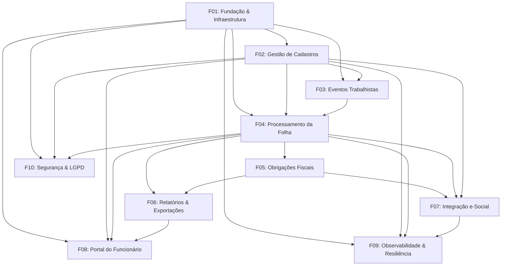

# 🚀 Features do Folha360 — Ordem de Implementação

Este documento define a ordem de implementação do software Folha360, organizada em **features incrementais** que entregam valor de negócio a cada iteração. Cada feature possui seu próprio PRD (Product Requirements Document).

A ordenação segue os princípios:
1. **Fundação primeiro** — infraestrutura e módulos sem dependências
2. **Cadeia de valor** — features que geram valor de negócio o mais cedo possível
3. **Dependências arquiteturais** — respeitar a ordem: Cadastros → Eventos Trabalhistas → Cálculo da Folha → Obrigações Fiscais → Relatórios + e-Social
4. **Mitigação de riscos** — antecipar itens críticos (Saga Orchestrator, failover DB, certificado digital)

---

## 📋 Resumo das Features

| # | Feature | Módulo(s) | Depende de | Complexidade | Prazo Estimado |
|---|---|---|---|---|---|
| F01 | Fundação & Infraestrutura | Infra | — | 🔴 Alta | 3-4 semanas |
| F02 | Gestão de Cadastros | Cadastros | F01 | 🟡 Média | 4-5 semanas |
| F03 | Gestão de Eventos Trabalhistas | Eventos Trab. | F01, F02 | 🟡 Média | 3-4 semanas |
| F04 | Processamento da Folha | Cálculo Folha | F01, F02, F03 | 🔴 Alta | 5-6 semanas |
| F05 | Obrigações Fiscais | Fiscais | F01, F02, F04 | 🔴 Alta | 4-5 semanas |
| F06 | Relatórios & Exportações | Relatórios | F01, F04, F05 | 🟡 Média | 3-4 semanas |
| F07 | Integração e-Social | e-Social | F01, F02, F04, F05 | 🔴 Alta | 5-6 semanas |
| F08 | Portal do Funcionário | Frontend | F01, F02, F04, F06 | 🟡 Média | 3-4 semanas |
| F09 | Observabilidade & Resiliência | Infra/Cross | F01-F08 | 🟢 Baixa | 2-3 semanas |
| F10 | Segurança & Conformidade LGPD | Cross | F01-F08 | 🟡 Média | 2-3 semanas |

---

## 🔄 Fluxo de Dependências



---

## 📦 Features Detalhadas

---

### F01 — Fundação & Infraestrutura

**PRD**: `prd-f01-fundacao-infraestrutura.md`

**Objetivo**: Estabelecer toda a infraestrutura base sobre a qual os módulos serão construídos. Sem esta feature, nenhum outro módulo pode ser iniciado.

**Escopo**:
- Estrutura do monólito modular (.NET 10 solution com 6 projetos)
- Docker Compose com todos os serviços de infra:
  - PostgreSQL 16 (primary + replica)
  - Redis 7
  - RabbitMQ 3.13 (com dead-letter queues)
  - Nginx (reverse proxy + TLS)
  - MinIO (object storage)
  - Seq (logging)
  - Prometheus + Grafana
- Pipeline CI/CD (GitHub Actions)
- Scripts de migração inicial (schema `public` + tenant template)
- Configuração de multi-tenancy (schema por tenant)
- Autenticação JWT (auth gateway, perfis: admin, operador, contador, consulta)
- Middleware cross-cutting (logging, correlation ID, error handling)
- Padrões de código, convenções, code style

**Entregáveis**:
- Solução .NET compilando com 6 projetos vazios
- `docker-compose.yml` funcional com todos os serviços
- Migrations iniciais aplicadas
- Endpoint `GET /health` em cada API retornando 200
- JWT auth funcional com login mock
- CI/CD pipeline executando build + testes

**Riscos Mitigados**:
- Single point of failure no PostgreSQL (ADR: Patroni + etcd — configurado, não ativado ainda)
- Inconsistência de ambiente entre dev/prod

---

### F02 — Gestão de Cadastros

**PRD**: `prd-f02-gestao-cadastros.md`

**Objetivo**: Implementar o módulo raiz de cadastros — a fonte da verdade para todos os dados mestres do sistema. Nenhum outro módulo de negócio funciona sem este.

> ⚠️ **Impacto da atualização de rubricas (Junho 2026)**: O subsistema de rubricas foi significativamente expandido. A implementação original do F02 cobria apenas o CRUD básico da tabela `rubrica`. O [plano de ação de rubricas](../outputs/rubricas/plano-acao-rubricas.md) introduz 7 tabelas, 13 sprints de trabalho e 11 tipos de cálculo. **É necessária uma tarefa de refatoração/expansão do F02** para implementar as Fases 1-2 do plano (Fundação + Composição e Fórmulas). Ver tarefa `refactor-f02-rubricas-expandido`.

**Escopo**:
- CRUD completo de:
  - Empresas (com configurações de tenant)
  - Funcionários (com dados sensíveis criptografados AES-256)
  - Cargos e salários
  - Rubricas (conforme Tabela 03 e-Social) — **expandido**: incluir `grupo_rubrica`, `rubrica_composicao`, `rubrica_formula`, `rubrica_incidencia`, `rubrica_tabela_progressiva`, `rubrica_historico`
  - Lotações/departamentos
  - Dependentes
  - Documentos (CTPS, PIS/PASEP, RG, CPF)
- Validação com FluentValidation (incluindo validador de unicidade `(empresa_id, codigo)` e validador de `tipo_esocial`)
- Criptografia de dados sensíveis (CPF, CTPS, PIS/PASEP)
- Soft delete + auditoria (`audit_log` imutável)
- Eventos de domínio via RabbitMQ: `FuncionarioCadastrado`, `EmpresaCadastrada`, `RubricaAlterada`, `RubricaCriada`, `TabelaProgressivaAtualizada`
- API RESTful documentada (Swagger/OpenAPI)
- Testes unitários + integração
- Seed data com rubricas padrão (Tabela 03 e-Social) e tabelas progressivas oficiais (IRRF 2026, INSS 2026)

**Entregáveis**:
- CRUD completo de todas as entidades de cadastro
- Dados sensíveis criptografados em repouso
- Eventos de domínio publicados no RabbitMQ
- Swagger documentando todos os endpoints
- Cobertura de testes > 80%

**Dependências**: F01 (Infraestrutura)

---

### F03 — Gestão de Eventos Trabalhistas

**PRD**: `prd-f03-eventos-trabalhistas.md`

**Objetivo**: Implementar o registro de eventos da vida funcional do trabalhador, essenciais para o cálculo correto da folha e conformidade com e-Social.

**Escopo**:
- Registro de eventos trabalhistas:
  - Admissão (S-2200)
  - Férias (S-2230)
  - Afastamentos temporários (S-2231)
  - Desligamentos (S-2299)
  - Alterações contratuais (S-2206)
- Consumo de eventos `FuncionarioCadastrado` do módulo de Cadastros
- Validação de prazos legais (ex.: 30 dias para admissão, 15 dias para férias)
- Geração de XML preliminar para cada evento (schema e-Social S-1.3)
- API RESTful para CRUD de eventos
- Publicação de eventos: `FuncionarioAdmitido`, `FeriasConcedidas`, `FuncionarioDesligado`

**Entregáveis**:
- CRUD de eventos trabalhistas com validações legais
- Consumo de eventos do módulo Cadastros
- Geração de XML e-Social (validado contra XSD, mas não enviado)
- Testes de integração com Cadastros

**Dependências**: F01 (Infraestrutura), F02 (Cadastros)

---

### F04 — Processamento da Folha

**PRD**: `prd-f04-processamento-folha.md`

**Objetivo**: Implementar o core do sistema — o cálculo da folha de pagamento mensal. Esta é a feature de maior valor de negócio e maior complexidade técnica.

> ⚠️ **Impacto da atualização de rubricas (Junho 2026)**: O motor de cálculo foi expandido para suportar 4 fases de processamento e 11 tipos de cálculo. A implementação original do F04 cobria apenas o cálculo mensal básico. **É necessária uma tarefa de refatoração/expansão do F04** para implementar as Fases 3 do plano de ação (Motor de Cálculo completo). Ver tarefa `refactor-f04-motor-calculo-expandido`.

**Escopo**:
- Cálculo completo da folha mensal:
  - **Fase 1 — Vencimentos**: salário base, horas extras, adicionais, comissões, DSR
  - **Fase 2 — Bases**: BASE-INSS, BASE-FGTS, BASE-IRRF, BASE-DISSIDIO, BASE-MATERNIDADE
  - **Fase 3 — Descontos**: IRRF (tabela progressiva), INSS (tabela progressiva), pensão alimentícia, faltas, atrasos, vale-transporte, vale-refeição
  - **Fase 4 — Totais**: TOTAL-VENCIMENTOS, TOTAL-DESCONTOS, LÍQUIDO
- Suporte a 11 tipos de cálculo: mensal, férias, 13º, rescisão, dissídio, complementar, auxílio-doença, salário-maternidade, acordo, estágio, RPA
- Motor de cálculo com componentes especializados:
  - `MotorCalculo` — orquestrador das 4 fases
  - `AvaliadorExpressao` — NCalc + sandbox (timeout 100ms)
  - `ResolvedorComposicao` — composição hierárquica com detecção de ciclos
  - `AplicadorTabelaProgressiva` — IRRF/INSS com versionamento anual
  - `CalculadorMedia` — médias móveis (12 meses)
  - `AvaliadorCondicional` — rubricas condicionais
- Processamento assíncrono (ADR-004):
  - `POST /api/folha/processar` → `202 Accepted` + `processamentoId`
  - Background job com Task Parallel (batches de 1000 funcionários)
  - Progresso via SignalR (tempo real)
- Idempotência: `UNIQUE(empresa_id, periodo)`
- Cache Redis para tabelas progressivas (IRRF, INSS), rubricas, composições e fórmulas (ADR-005); invalidação via pub/sub
- Consumo de eventos: `FuncionarioAdmitido`, `FeriasConcedidas`, `FuncionarioDesligado`
- Publicação de eventos: `FolhaFechada`, `EventoRemuneracaoGerado` (S-1200/S-1210)
- Geração de holerites
- **Saga Orchestrator de Fechamento** (recomendação crítica):
  - Tabela `CadeiaFechamento` cross-módulo
  - Garantia de consistência na cadeia Folha → Fiscais → e-Social

**Entregáveis**:
- API de processamento da folha com resposta assíncrona
- Cálculo correto de todas as rubricas para 100K funcionários em < 2h
- Progresso em tempo real via SignalR
- Cache Redis funcional com invalidação pub/sub
- Saga Orchestrator de fechamento
- Testes de carga com 100K funcionários
- Testes de integração com Cadastros + Eventos Trabalhistas

**Dependências**: F01 (Infraestrutura), F02 (Cadastros), F03 (Eventos Trabalhistas)

---

### F05 — Obrigações Fiscais

**PRD**: `prd-f05-obrigacoes-fiscais.md`

**Objetivo**: Implementar a apuração de tributos e geração de guias fiscais. Depende diretamente dos valores calculados na folha.

**Escopo**:
- Apuração de tributos:
  - IRRF (Imposto de Renda Retido na Fonte)
  - INSS (contribuição previdenciária — empresa + funcionário)
  - FGTS (Fundo de Garantia)
  - Contribuições sindicais e assistenciais
  - PIS/PASEP
- Geração de guias:
  - GPS (Guia da Previdência Social)
  - DARF (Documento de Arrecadação de Receitas Federais)
  - GRF (Guia de Recolhimento do FGTS)
- Regras fiscais versionadas com Strategy Pattern (mudam anualmente)
- Consumo do evento `FolhaFechada` para disparar apuração
- Publicação de eventos: `ObrigacoesApuradas`, `EventoFiscalGerado` (S-5001/S-5002)
- Geração de XML e-Social para eventos fiscais
- Exportação de lançamentos contábeis (CSV/SFTP)

**Entregáveis**:
- Apuração fiscal completa pós-folha
- Guias GPS, DARF, GRF geradas
- Strategy Pattern para versionamento de regras fiscais
- Exportação CSV para sistema contábil
- Testes de integração com Cálculo da Folha

**Dependências**: F01 (Infraestrutura), F02 (Cadastros), F04 (Processamento da Folha)

---

### F06 — Relatórios & Exportações

**PRD**: `prd-f06-relatorios-exportacoes.md`

**Objetivo**: Implementar o módulo de relatórios gerenciais e exportações. Módulo read-only que consolida dados de múltiplas fontes.

**Escopo**:
- Relatórios:
  - Holerites individuais e em lote
  - Resumo mensal/anual por empresa
  - DIRF (Declaração do Imposto de Renda Retido na Fonte)
  - RAIS (Relação Anual de Informações Sociais)
  - Folha analítica e sintética
- Exportação: PDF, CSV, Excel
- Materialized views no PostgreSQL read replica:
  - `vw_resumo_folha_mensal`
  - `vw_dirf_anual`
- Armazenamento de arquivos no MinIO (S3)
- Envio de relatórios por email (SMTP)
- Agendamento de relatórios recorrentes

**Entregáveis**:
- Todos os relatórios listados funcionais
- Exportação PDF/CSV/Excel
- Materialized views com refresh automático
- Integração com MinIO e SMTP
- Testes com read replica

**Dependências**: F01 (Infraestrutura), F04 (Processamento da Folha), F05 (Obrigações Fiscais)

---

### F07 — Integração e-Social

**PRD**: `prd-f07-integracao-esocial.md`

**Objetivo**: Implementar a integração completa com o ambiente nacional do e-Social (gov.br). Esta é a feature de maior risco regulatório — atrasos ou falhas geram multas.

**Escopo**:
- Validação de XML contra XSD (schema e-Social S-1.3)
- Agrupamento de eventos em lotes (a cada 5 min ou 100 eventos)
- Assinatura digital com certificado A1 (ICP-Brasil)
- Envio de lotes: `POST /ws/enviarLote` (HTTPS + SOAP)
- Consulta de recibos: `GET /ws/consultarRecibo`
- Retry com exponential backoff (até 24h)
- Dead-letter queue para falhas permanentes
- Consumo de eventos: `EventoRemuneracaoGerado` (S-1200), `EventoFiscalGerado` (S-5001)
- Publicação de eventos: `LoteProcessado`, `EventoComErro`
- Tabelas: `LoteESocial`, `evento_esocial`, `ReciboGoverno`
- Monitoramento de certificado digital (alerta 30 dias antes da expiração)
- CI/CD monitora portal e-Social para atualizações de schema

**Entregáveis**:
- Envio e consulta de lotes ao e-Social gov.br funcional
- Validação XSD completa (schema S-1.3)
- Assinatura com certificado A1
- Retry com backoff e dead-letter queue
- Alerta de expiração de certificado
- Testes com ambiente de homologação (quando disponível)

**Dependências**: F01 (Infraestrutura), F02 (Cadastros), F04 (Processamento da Folha), F05 (Obrigações Fiscais)

---

### F08 — Portal do Funcionário

**PRD**: `prd-f08-portal-funcionario.md`

**Objetivo**: Implementar o frontend web (React SPA) com dashboards e autoatendimento para funcionários.

**Escopo**:
- Dashboard administrativo:
  - Visão geral da folha (totais, gráficos)
  - Gestão de funcionários (CRUD visual)
  - Acompanhamento de processamento
  - Status de envios e-Social
- Portal do funcionário:
  - Visualização de holerites
  - Consulta de férias e saldo
  - Atualização de dados cadastrais
  - Download de informes de rendimento
- Design responsivo (desktop + mobile)
- Tema claro/escuro
- Componentes com shadcn/ui

**Entregáveis**:
- SPA React funcional com todos os dashboards
- Portal do funcionário com autoatendimento
- Design responsivo
- Integração com SignalR para progresso em tempo real
- Testes E2E com Playwright

**Dependências**: F01 (Infraestrutura), F02 (Cadastros), F04 (Processamento da Folha), F06 (Relatórios)

---

### F09 — Observabilidade & Resiliência

**PRD**: `prd-f09-observabilidade-resiliencia.md`

**Objetivo**: Implementar monitoramento, logging estruturado, tracing distribuído e padrões de resiliência em todos os módulos.

**Escopo**:
- Logging estruturado com Serilog → Seq
- Métricas com Prometheus (latência, throughput, erros)
- Dashboards Grafana (saúde do sistema, negócio)
- Tracing distribuído (correlation ID entre módulos)
- Alertas:
  - Latência p95 > 2s
  - Erro rate > 1%
  - Certificado digital expirando
  - Filas RabbitMQ acumulando
- Resiliência:
  - Polly: retry + circuit breaker em chamadas REST
  - Health checks em todos os serviços
  - Kubernetes: liveness/readiness probes, HPA
- Runbooks para cenários de falha

**Entregáveis**:
- Dashboards Grafana operacionais
- Alertas configurados
- Circuit breaker e retry policies
- Health checks em todos os serviços
- Runbooks documentados

**Dependências**: F01-F08 (todos os módulos)

---

### F10 — Segurança & Conformidade LGPD

**PRD**: `prd-f10-seguranca-lgpd.md`

**Objetivo**: Garantir conformidade com LGPD e hardening de segurança em todos os módulos.

**Escopo**:
- LGPD:
  - Termo de consentimento no cadastro
  - Exportação de dados do titular
  - Anonimização/soft delete de dados pessoais
  - Relatório de dados armazenados por titular
  - Retenção: 5 anos fiscais, anonimização após
- Segurança:
  - Rate limiting no Nginx
  - SQL injection prevention (EF Core parameterizado)
  - XSS/CSRF protection
  - CORS configurado
  - Secrets management (Vault ou Kubernetes Secrets)
  - Scan de vulnerabilidades (dependências + containers)
  - Penetration testing
- Auditoria:
  - `audit_log` imutável (já implementado em F02)
  - Log de acessos e alterações
  - Relatório de conformidade

**Entregáveis**:
- Funcionalidades LGPD implementadas
- Rate limiting e proteções de segurança
- Scan de vulnerabilidades limpo
- Relatório de penetration test
- Documentação de conformidade

**Dependências**: F01-F08 (todos os módulos)

---

## 🗓️ Cronograma Sugerido

```
Semanas 1-4:   F01 — Fundação & Infraestrutura
Semanas 5-9:   F02 — Gestão de Cadastros
Semanas 10-13: F03 — Gestão de Eventos Trabalhistas
Semanas 14-19: F04 — Processamento da Folha (crítico)
Semanas 20-24: F05 — Obrigações Fiscais
Semanas 25-28: F06 — Relatórios & Exportações
Semanas 29-34: F07 — Integração e-Social (crítico)
Semanas 35-38: F08 — Portal do Funcionário
Semanas 39-41: F09 — Observabilidade & Resiliência
Semanas 42-44: F10 — Segurança & Conformidade LGPD
```

**Total estimado**: 44 semanas (~11 meses) para MVP completo.

**Marcos críticos**:
- 🎯 **Semana 9**: Primeiro deploy funcional (Cadastros)
- 🎯 **Semana 19**: Core do sistema funcional (Folha calculando)
- 🎯 **Semana 34**: Conformidade e-Social (obrigação legal)
- 🎯 **Semana 44**: MVP completo com segurança e observabilidade

---

## ⚠️ Riscos e Recomendações por Feature

| Feature | Risco Principal | Mitigação |
|---|---|---|
| F01 | Infra complexa demora para estabilizar | Começar com Docker Compose simples, evoluir para K8s depois |
| F02 | Modelo de dados incompleto | Validar com contador/DP antes de codificar |
| F04 | Performance < 2h para 100K func. | Prova de conceito de performance na semana 1 da feature |
| F05 | Regras fiscais erradas = multas | Validar com contador; testes com casos reais |
| F07 | Indisponibilidade do ambiente gov.br | Mock server para testes; dead-letter queue |
| F07 | Certificado A1 vencido | Alerta 30 dias antes; procedimento documentado |
| F04-F07 | Saga de fechamento inconsistente | Implementar Saga Orchestrator na F04 (recomendação crítica) |

---

## 📎 Templates de PRD

Cada feature terá seu PRD criado usando o [template de PRD](../templates/) com a seguinte estrutura:

1. Visão Geral e Objetivos
2. Requisitos Funcionais
3. Requisitos Não-Funcionais
4. Critérios de Aceite
5. Dependências
6. Riscos e Suposições
7. Definições de Pronto (DoD)
