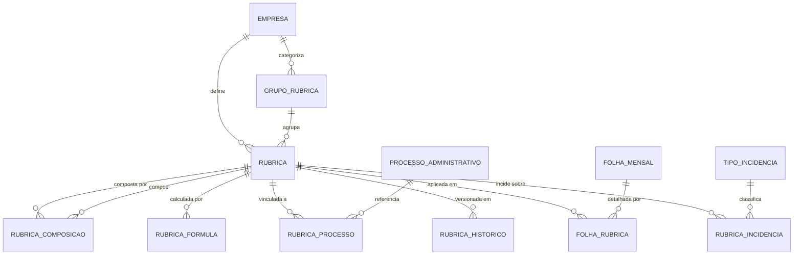

# Modelo de Dados — Rubricas e Composição da Folha

## Summary
Modelo de dados relacional expandido para o subsistema de **rubricas** do Folha360. Este artefato detalha as tabelas necessárias para suportar o cadastro de rubricas (vencimentos, descontos, benefícios, informativos), sua composição hierárquica (rubricas que derivam de outras rubricas), fórmulas de cálculo parametrizáveis, e a compatibilidade com a Tabela 03 do e-Social (S-1010). O modelo estende o `database-model.md` existente, adicionando tabelas de apoio para composição, fórmulas, e histórico de alterações de rubricas.

---

## Entity-Relationship Diagram — Subsistema Rubricas



---

## Tabelas do Subsistema de Rubricas

### Schema: `tenant_XXX` (por empresa)

### Tabela: `rubrica` (Estendida)

| Column | Type | Constraints | Description |
|---|---|---|---|
| `id` | `uuid` | PK | Identificador único |
| `empresa_id` | `uuid` | FK → `public.empresa(id)` | Empresa proprietária |
| `grupo_rubrica_id` | `uuid` | FK → `grupo_rubrica(id)`, nullable | Agrupamento categórico |
| `codigo` | `varchar(20)` | NOT NULL, UNIQUE(empresa_id, codigo) | Código único por empresa (ex.: "001", "SAL-BASE") |
| `descricao` | `varchar(200)` | NOT NULL | Descrição legível (ex.: "Salário Base Mensal") |
| `descricao_abreviada` | `varchar(50)` | NULL | Descrição curta para holerite |
| `natureza` | `varchar(20)` | NOT NULL, CHECK IN ('Vencimento','Desconto','Beneficio','Informativo','Provisao','Base','Complemento','Reembolso','Estagio') | Natureza da rubrica |
| `tipo_esocial` | `varchar(10)` | NULL | Código da Tabela 03 e-Social (S-1010). NULL = rubrica gerencial (não enviada) |
| `enviar_esocial` | `boolean` | NOT NULL DEFAULT true | Se false, rubrica é apenas gerencial (ex.: provisões) |
| `incide_inss` | `boolean` | NOT NULL DEFAULT false | Compõe base de cálculo do INSS |
| `incide_irrf` | `boolean` | NOT NULL DEFAULT false | Compõe base de cálculo do IRRF |
| `incide_fgts` | `boolean` | NOT NULL DEFAULT false | Compõe base de cálculo do FGTS |
| `incide_contribuicao_sindical` | `boolean` | NOT NULL DEFAULT false | Compõe base de contribuição sindical |
| `incide_decimo_terceiro` | `boolean` | NOT NULL DEFAULT false | Compõe base do 13º salário |
| `incide_ferias` | `boolean` | NOT NULL DEFAULT false | Compõe base de férias |
| `incide_aviso_previo` | `boolean` | NOT NULL DEFAULT false | Compõe base de aviso prévio |
| `incide_rescisao` | `boolean` | NOT NULL DEFAULT false | Compõe base de rescisão |
| `incide_dissidio` | `boolean` | NOT NULL DEFAULT false | Compõe base de dissídio coletivo |
| `incide_salario_maternidade` | `boolean` | NOT NULL DEFAULT false | Compõe base de salário-maternidade |
| `incide_auxilio_doenca` | `boolean` | NOT NULL DEFAULT false | Compõe base de complemento auxílio-doença |
| `incide_adiantamento` | `boolean` | NOT NULL DEFAULT false | Compõe base de adiantamento salarial |
| `tipo_calculo` | `varchar(30)` | NOT NULL DEFAULT 'VALOR_FIXO' | Tipo de cálculo: VALOR_FIXO, PERCENTUAL, HORA, FORMULA, COMPOSICAO, TABELA_PROGRESSIVA, UNIDADE, DIA, MEDIA, TETO, CONDICIONAL |
| `formula_calculo` | `text` | NULL | Expressão de cálculo (ex.: `{SALARIO_BASE} * 0.10`) |
| `valor_fixo` | `numeric(18,4)` | NULL | Valor fixo quando tipo_calculo = VALOR_FIXO |
| `percentual` | `numeric(7,4)` | NULL | Percentual quando tipo_calculo = PERCENTUAL (ex.: 10.0000 = 10%) |
| `rubrica_base_id` | `uuid` | FK → `rubrica(id)`, nullable | Rubrica de referência para percentual (ex.: 10% DO salário base) |
| `ordem_calculo` | `int` | NOT NULL DEFAULT 0 | Ordem de processamento no cálculo da folha |
| `ordem_exibicao` | `int` | NOT NULL DEFAULT 0 | Ordem de exibição no holerite |
| `prioridade_desconto` | `int` | NULL | Ordem de aplicação dos descontos (1=primeiro) |
| `teto_maximo` | `numeric(18,2)` | NULL | Valor máximo que a rubrica pode atingir |
| `piso_minimo` | `numeric(18,2)` | NULL | Valor mínimo garantido |
| `ativo` | `boolean` | NOT NULL DEFAULT true | Rubrica ativa para uso |
| `data_inicio_vigencia` | `date` | NULL | Início da vigência |
| `data_fim_vigencia` | `date` | NULL | Fim da vigência (NULL = sem fim) |
| `observacao` | `text` | NULL | Notas internas |
| `created_at` | `timestamptz` | NOT NULL DEFAULT NOW() | Data de criação |
| `updated_at` | `timestamptz` | NOT NULL DEFAULT NOW() | Data de última atualização |
| `deleted_at` | `timestamptz` | NULL | Soft delete |

**Índices**:
- `idx_rub_empresa` (empresa_id)
- `idx_rub_codigo` (empresa_id, codigo) UNIQUE
- `idx_rub_natureza` (empresa_id, natureza)
- `idx_rub_esocial` (tipo_esocial) WHERE tipo_esocial IS NOT NULL
- `idx_rub_grupo` (grupo_rubrica_id)
- `idx_rub_ativa` (empresa_id, ativo) WHERE ativo = true

---

### Tabela: `grupo_rubrica`

Agrupamento categórico de rubricas para organização e relatórios.

| Column | Type | Constraints | Description |
|---|---|---|---|
| `id` | `uuid` | PK | Identificador único |
| `empresa_id` | `uuid` | FK → `public.empresa(id)` | Empresa proprietária |
| `codigo` | `varchar(20)` | NOT NULL, UNIQUE(empresa_id, codigo) | Código do grupo |
| `descricao` | `varchar(100)` | NOT NULL | Ex.: "Vencimentos Fixos", "Descontos Legais", "Benefícios" |
| `natureza` | `varchar(20)` | NOT NULL | Natureza predominante do grupo |
| `ordem_exibicao` | `int` | NOT NULL DEFAULT 0 | Ordem no holerite |
| `created_at` | `timestamptz` | NOT NULL DEFAULT NOW() | Data de criação |

---

### Tabela: `rubrica_composicao`

Define a composição hierárquica entre rubricas. Uma rubrica pode ser composta por múltiplas outras rubricas (ex.: "Remuneração Total" = "Salário Base" + "Horas Extras" + "Adicional Noturno").

| Column | Type | Constraints | Description |
|---|---|---|---|
| `id` | `uuid` | PK | Identificador único |
| `rubrica_principal_id` | `uuid` | FK → `rubrica(id)` NOT NULL | Rubrica que é composta |
| `rubrica_componente_id` | `uuid` | FK → `rubrica(id)` NOT NULL | Rubrica componente |
| `operador` | `varchar(5)` | NOT NULL DEFAULT '+' | Operador: '+', '-', '*', '/' (para fórmulas simples) |
| `percentual_composicao` | `numeric(7,4)` | NULL | Se informado, aplica % sobre o componente antes de compor |
| `ordem` | `int` | NOT NULL DEFAULT 0 | Ordem de composição |
| `obrigatorio` | `boolean` | NOT NULL DEFAULT true | Se o componente é obrigatório na composição |
| `created_at` | `timestamptz` | NOT NULL DEFAULT NOW() | Data de criação |

**Índices**:
- `idx_rc_principal` (rubrica_principal_id)
- `idx_rc_componente` (rubrica_componente_id)
- UNIQUE(rubrica_principal_id, rubrica_componente_id)

**Regras**:
- Não permite ciclo (trigger ou validação em aplicação)
- `rubrica_principal_id` deve ter `tipo_calculo = 'COMPOSICAO'`

---

### Tabela: `rubrica_formula`

Armazena fórmulas de cálculo parametrizáveis para rubricas com `tipo_calculo = 'FORMULA'`.

| Column | Type | Constraints | Description |
|---|---|---|---|
| `id` | `uuid` | PK | Identificador único |
| `rubrica_id` | `uuid` | FK → `rubrica(id)` UNIQUE | Rubrica associada |
| `expressao` | `text` | NOT NULL | Expressão da fórmula (ex.: `{SALARIO_BASE} * {PERCENTUAL} / 100`) |
| `parametros` | `jsonb` | NULL | Parâmetros da fórmula: `{"SALARIO_BASE": "rubrica:001", "PERCENTUAL": 10}` |
| `descricao_formal` | `text` | NULL | Descrição matemática/legal da fórmula |
| `versao` | `int` | NOT NULL DEFAULT 1 | Versão da fórmula |
| `created_at` | `timestamptz` | NOT NULL DEFAULT NOW() | Data de criação |
| `updated_at` | `timestamptz` | NOT NULL DEFAULT NOW() | Data de atualização |

**Exemplo de `parametros` JSONB**:
```json
{
  "SALARIO_BASE": {"tipo": "rubrica", "valor": "uuid-rubrica-salario-base"},
  "PERCENTUAL_HORA_EXTRA": {"tipo": "constante", "valor": 50},
  "QUANTIDADE_HORAS": {"tipo": "variavel", "valor": "horas_extras_mes"}
}
```

---

### Tabela: `rubrica_incidencia`

Define sobre quais bases uma rubrica incide (ex.: INSS incide sobre salário base + horas extras + adicional noturno).

| Column | Type | Constraints | Description |
|---|---|---|---|
| `id` | `uuid` | PK | Identificador único |
| `rubrica_id` | `uuid` | FK → `rubrica(id)` NOT NULL | Rubrica que incide |
| `tipo_incidencia_id` | `uuid` | FK → `tipo_incidencia(id)` NOT NULL | Tipo de incidência (INSS, IRRF, FGTS...) |
| `rubrica_base_id` | `uuid` | FK → `rubrica(id)`, nullable | Rubrica específica sobre a qual incide. NULL = todas da natureza |
| `natureza_base` | `varchar(20)` | NULL | Se rubrica_base_id for NULL, filtra por natureza |
| `grupo_rubrica_base_id` | `uuid` | FK → `grupo_rubrica(id)`, nullable | Se informado, incide sobre todas do grupo |
| `percentual_incidencia` | `numeric(7,4)` | NOT NULL DEFAULT 100.0000 | % de incidência (ex.: 100% = integral) |
| `created_at` | `timestamptz` | NOT NULL DEFAULT NOW() | Data de criação |

---

### Tabela: `tipo_incidencia`

Catálogo de tipos de incidência para cálculo.

| Column | Type | Constraints | Description |
|---|---|---|---|
| `id` | `uuid` | PK | Identificador único |
| `codigo` | `varchar(20)` | NOT NULL UNIQUE | Código: INSS, IRRF, FGTS, SINDICAL, FERIAS, DECIMO_TERCEIRO, RESCISAO, AVISO_PREVIO, DISSIDIO, SALARIO_MATERNIDADE, AUXILIO_DOENCA, ADIANTAMENTO, ESTAGIO |
| `descricao` | `varchar(100)` | NOT NULL | Descrição legível |
| `tributo_esocial` | `varchar(10)` | NULL | Código do tributo no e-Social |
| `ordem_calculo` | `int` | NOT NULL DEFAULT 0 | Ordem de processamento |

---

### Tabela: `rubrica_processo`

Vincula rubricas a processos administrativos (S-1070 do e-Social).

| Column | Type | Constraints | Description |
|---|---|---|---|
| `id` | `uuid` | PK | Identificador único |
| `rubrica_id` | `uuid` | FK → `rubrica(id)` NOT NULL | Rubrica vinculada |
| `processo_administrativo_id` | `uuid` | FK → `processo_administrativo(id)` NOT NULL | Processo administrativo |
| `tipo_acao` | `varchar(30)` | NOT NULL | Tipo: 'ORIGEM', 'ALTERACAO', 'SUSPENSAO', 'EXTINCAO' |
| `data_inicio` | `date` | NOT NULL | Data de início do efeito |
| `data_fim` | `date` | NULL | Data de fim do efeito |
| `created_at` | `timestamptz` | NOT NULL DEFAULT NOW() | Data de criação |

---

### Tabela: `rubrica_media`

Configuração de rubricas com `tipo_calculo = 'MEDIA'`. Calcula a média de uma ou mais rubricas nos últimos N meses (ex.: média de horas extras para férias, média de comissões para 13º).

| Column | Type | Constraints | Description |
|---|---|---|---|
| `id` | `uuid` | PK | Identificador único |
| `rubrica_id` | `uuid` | FK → `rubrica(id)` UNIQUE | Rubrica associada |
| `quantidade_meses` | `int` | NOT NULL DEFAULT 12 | Período de apuração da média (ex.: 12 meses) |
| `tipo_media` | `varchar(20)` | NOT NULL DEFAULT 'ARITMETICA' | Tipo: ARITMETICA, PONDERADA, MAIOR_VALOR |
| `rubricas_origem` | `jsonb` | NOT NULL | Lista de rubricas que compõem a média: `[{"rubrica_id": "uuid", "peso": 1.0}]` |
| `considerar_meses_zerados` | `boolean` | NOT NULL DEFAULT true | Se false, ignora meses sem valor na média |
| `arredondamento` | `int` | NOT NULL DEFAULT 2 | Casas decimais de arredondamento |
| `created_at` | `timestamptz` | NOT NULL DEFAULT NOW() | Data de criação |

**Exemplo de `rubricas_origem` JSONB**:
```json
[
  {"rubrica_id": "uuid-hora-extra-50", "peso": 1.0},
  {"rubrica_id": "uuid-hora-extra-100", "peso": 1.0},
  {"rubrica_id": "uuid-comissao", "peso": 1.0}
]
```

---

### Tabela: `rubrica_condicional`

Configuração de rubricas com `tipo_calculo = 'CONDICIONAL'`. Aplica regras condicionais do tipo "se X então Y senão Z".

| Column | Type | Constraints | Description |
|---|---|---|---|
| `id` | `uuid` | PK | Identificador único |
| `rubrica_id` | `uuid` | FK → `rubrica(id)` UNIQUE | Rubrica associada |
| `condicao` | `text` | NOT NULL | Expressão condicional (ex.: `{SALARIO_BASE} > {TETO_INSS}`) |
| `valor_se_verdadeiro` | `text` | NOT NULL | Expressão se condição verdadeira (ex.: `{TETO_INSS} * 0.14`) |
| `valor_se_falso` | `text` | NULL | Expressão se condição falsa (ex.: `{SALARIO_BASE} * 0.09`) |
| `prioridade_avaliacao` | `int` | NOT NULL DEFAULT 0 | Ordem de avaliação da condição |
| `created_at` | `timestamptz` | NOT NULL DEFAULT NOW() | Data de criação |

**Exemplo**:
```
condicao: {BASE-INSS} > 7786.02
valor_se_verdadeiro: 7786.02 * 0.14
valor_se_falso: {BASE-INSS} * 0.14
```

---

### Tabela: `rubrica_dissidio`

Configuração de dissídio coletivo (data-base) vinculado a rubricas.

| Column | Type | Constraints | Description |
|---|---|---|---|
| `id` | `uuid` | PK | Identificador único |
| `empresa_id` | `uuid` | FK → `public.empresa(id)` | Empresa |
| `sindicato_id` | `uuid` | FK → `sindicato(id)`, nullable | Sindicato da categoria |
| `data_base` | `date` | NOT NULL | Data-base do dissídio (ex.: 2026-05-01) |
| `percentual_reajuste` | `numeric(7,4)` | NOT NULL | Percentual de reajuste (ex.: 5.0000 = 5%) |
| `data_inicio_vigencia` | `date` | NOT NULL | Início da vigência do reajuste |
| `data_fim_vigencia` | `date` | NULL | Fim da vigência |
| `meses_retroativos` | `int` | NOT NULL DEFAULT 0 | Quantos meses de retroativo |
| `status` | `varchar(20)` | NOT NULL DEFAULT 'PENDENTE' | Status: PENDENTE, APLICADO, CANCELADO |
| `observacao` | `text` | NULL | Observações |
| `created_at` | `timestamptz` | NOT NULL DEFAULT NOW() | Data de criação |

---

### Tabela: `rubrica_dissidio_rubrica`

Vincula rubricas afetadas por um dissídio (N:N).

| Column | Type | Constraints | Description |
|---|---|---|---|
| `id` | `uuid` | PK | Identificador único |
| `rubrica_dissidio_id` | `uuid` | FK → `rubrica_dissidio(id)` NOT NULL | Dissídio |
| `rubrica_id` | `uuid` | FK → `rubrica(id)` NOT NULL | Rubrica afetada |
| `valor_anterior` | `numeric(18,4)` | NOT NULL | Valor antes do dissídio |
| `valor_novo` | `numeric(18,4)` | NOT NULL | Valor após dissídio |
| `created_at` | `timestamptz` | NOT NULL DEFAULT NOW() | Data de criação |

---

### Tabela: `processo_administrativo`

Registro de processos administrativos/judiciais que afetam rubricas (S-1070).

| Column | Type | Constraints | Description |
|---|---|---|---|
| `id` | `uuid` | PK | Identificador único |
| `empresa_id` | `uuid` | FK → `public.empresa(id)` | Empresa |
| `numero_processo` | `varchar(30)` | NOT NULL | Número do processo |
| `tipo` | `varchar(30)` | NOT NULL | Tipo: 'ADMINISTRATIVO', 'JUDICIAL' |
| `orgao` | `varchar(100)` | NULL | Órgão emissor |
| `data_decisao` | `date` | NULL | Data da decisão |
| `descricao` | `text` | NULL | Descrição do processo |
| `created_at` | `timestamptz` | NOT NULL DEFAULT NOW() | Data de criação |

---

### Tabela: `rubrica_historico`

Histórico de alterações em rubricas para auditoria e versionamento.

| Column | Type | Constraints | Description |
|---|---|---|---|
| `id` | `uuid` | PK | Identificador único |
| `rubrica_id` | `uuid` | FK → `rubrica(id)` NOT NULL | Rubrica versionada |
| `campo_alterado` | `varchar(50)` | NOT NULL | Nome do campo alterado |
| `valor_anterior` | `text` | NULL | Valor antes da alteração |
| `valor_novo` | `text` | NULL | Valor após a alteração |
| `motivo` | `text` | NULL | Motivo da alteração |
| `alterado_por` | `uuid` | NOT NULL | Usuário que alterou |
| `created_at` | `timestamptz` | NOT NULL DEFAULT NOW() | Data da alteração |

---

## Tabela: `rubrica_tabela_progressiva`

Para rubricas com `tipo_calculo = 'TABELA_PROGRESSIVA'` (ex.: IRRF, INSS).

| Column | Type | Constraints | Description |
|---|---|---|---|
| `id` | `uuid` | PK | Identificador único |
| `rubrica_id` | `uuid` | FK → `rubrica(id)` NOT NULL | Rubrica associada |
| `faixa_inicio` | `numeric(18,2)` | NOT NULL | Valor inicial da faixa |
| `faixa_fim` | `numeric(18,2)` | NULL | Valor final da faixa (NULL = sem limite) |
| `aliquota` | `numeric(7,4)` | NOT NULL | Alíquota da faixa |
| `deducao` | `numeric(18,2)` | NOT NULL DEFAULT 0 | Parcela a deduzir |
| `ordem` | `int` | NOT NULL DEFAULT 0 | Ordem da faixa |
| `data_vigencia` | `date` | NOT NULL | Data de vigência |
| `created_at` | `timestamptz` | NOT NULL DEFAULT NOW() | Data de criação |

---

## Seed Data: Rubricas Padrão (Tabela 03 e-Social)

Rubricas iniciais a serem populadas no schema `template_tenant`:

### Vencimentos

| Código | Descrição | Natureza | Tipo e-Social | INSS | IRRF | FGTS | 13º | Férias | Tipo Cálculo |
|---|---|---|---|---|---|---|---|---|---|
| `SAL-BASE` | Salário Base Mensal | Vencimento | 1000 | Sim | Sim | Sim | Sim | Sim | VALOR_FIXO |
| `HORA-EXTRA-50` | Horas Extras 50% | Vencimento | 1005 | Sim | Sim | Sim | Sim | Sim | HORA |
| `HORA-EXTRA-100` | Horas Extras 100% | Vencimento | 1005 | Sim | Sim | Sim | Sim | Sim | HORA |
| `ADIC-NOTURNO` | Adicional Noturno | Vencimento | 1010 | Sim | Sim | Sim | Sim | Sim | PERCENTUAL |
| `ADIC-PERICULOSIDADE` | Adicional Periculosidade 30% | Vencimento | 1015 | Sim | Sim | Sim | Sim | Sim | PERCENTUAL |
| `ADIC-INSALUBRIDADE-10` | Adicional Insalubridade 10% | Vencimento | 1015 | Sim | Sim | Sim | Sim | Sim | PERCENTUAL |
| `ADIC-INSALUBRIDADE-20` | Adicional Insalubridade 20% | Vencimento | 1015 | Sim | Sim | Sim | Sim | Sim | PERCENTUAL |
| `ADIC-INSALUBRIDADE-40` | Adicional Insalubridade 40% | Vencimento | 1015 | Sim | Sim | Sim | Sim | Sim | PERCENTUAL |
| `COMISSAO` | Comissões | Vencimento | 1020 | Sim | Sim | Sim | Sim | Não | PERCENTUAL |
| `DSR` | Descanso Semanal Remunerado | Vencimento | 1025 | Sim | Sim | Sim | Sim | Sim | FORMULA |
| `SALARIO-FAMILIA` | Salário Família | Vencimento | 1030 | Não | Não | Não | Não | Não | TABELA_PROGRESSIVA |
| `DIARIAS-VIAGEM` | Diárias de Viagem | Vencimento | 1035 | Sim* | Sim* | Sim* | Não | Não | VALOR_FIXO |
| `AJUDA-CUSTO` | Ajuda de Custo | Vencimento | 1040 | Não | Não | Não | Não | Não | VALOR_FIXO |
| `ADIC-TRANSFERENCIA` | Adicional Transferência | Vencimento | 1050 | Sim | Sim | Sim | Sim | Sim | PERCENTUAL |
| `GRATIFICACAO` | Gratificação | Vencimento | 1060 | Sim | Sim | Sim | Sim | Sim | VALOR_FIXO |
| `PARTICIPACAO-LUCROS` | Participação nos Lucros | Vencimento | 1070 | Não | Sim** | Não | Não | Não | PERCENTUAL |

> * Diárias acima de 50% do salário incidem INSS/IRRF/FGTS.
> ** PLR tem tributação exclusiva na fonte.

### Descontos

| Código | Descrição | Natureza | Tipo e-Social | INSS | IRRF | FGTS | 13º | Férias | Tipo Cálculo |
|---|---|---|---|---|---|---|---|---|---|
| `INSS` | INSS | Desconto | 2000 | — | — | — | Sim | Sim | TABELA_PROGRESSIVA |
| `IRRF` | Imposto de Renda Retido na Fonte | Desconto | 2005 | — | — | — | Sim | Sim | TABELA_PROGRESSIVA |
| `PENSAO-ALIMENTICIA` | Pensão Alimentícia | Desconto | 2010 | — | — | — | Sim | Sim | PERCENTUAL |
| `FALTA` | Faltas Injustificadas | Desconto | 2015 | — | — | — | Sim | Sim | HORA |
| `ATRASO` | Atrasos | Desconto | 2020 | — | — | — | Sim | Sim | HORA |
| `VALE-TRANSPORTE` | Vale Transporte (6%) | Desconto | 2025 | — | — | — | Não | Não | PERCENTUAL |
| `VALE-REFEICAO` | Vale Refeição (20%) | Desconto | 2030 | — | — | — | Não | Não | PERCENTUAL |
| `PLANO-SAUDE` | Plano de Saúde (coparticipação) | Desconto | 2035 | — | — | — | Não | Não | VALOR_FIXO |
| `CONTRIBUICAO-SINDICAL` | Contribuição Sindical | Desconto | 2040 | — | — | — | Não | Não | VALOR_FIXO |
| `ADIANTAMENTO-SALARIAL` | Adiantamento Salarial | Desconto | 2050 | — | — | — | Não | Não | VALOR_FIXO |
| `EMPRESTIMO-CONSIGNADO` | Empréstimo Consignado | Desconto | 2060 | — | — | — | Não | Não | VALOR_FIXO |

### Benefícios (Informativos)

| Código | Descrição | Natureza | Tipo e-Social | INSS | IRRF | FGTS | 13º | Férias | Tipo Cálculo |
|---|---|---|---|---|---|---|---|---|---|
| `VT-CONCEDIDO` | Vale Transporte Concedido | Benefício | 3000 | Não | Não | Não | Não | Não | UNIDADE |
| `VR-CONCEDIDO` | Vale Refeição Concedido | Benefício | 3005 | Não | Não | Não | Não | Não | UNIDADE |
| `PLANO-SAUDE-EMPRESA` | Plano de Saúde (parte empresa) | Benefício | 3010 | Não | Não | Não | Não | Não | VALOR_FIXO |
| `SEGURO-VIDA` | Seguro de Vida | Benefício | 3015 | Não | Não | Não | Não | Não | VALOR_FIXO |
| `AUXILIO-CRECHE` | Auxílio Creche | Benefício | 3020 | Não | Não | Não | Não | Não | VALOR_FIXO |
| `AUXILIO-EDUCACAO` | Auxílio Educação | Benefício | 3025 | Não | Não | Não | Não | Não | VALOR_FIXO |
| `CESTA-BASICA` | Cesta Básica | Benefício | 3030 | Não | Não | Não | Não | Não | VALOR_FIXO |

### Complementos (Diferenças e Ajustes)

| Código | Descrição | Natureza | Tipo e-Social | INSS | IRRF | FGTS | 13º | Férias | Tipo Cálculo |
|---|---|---|---|---|---|---|---|---|---|
| `COMPL-AUX-DOENCA` | Complemento Auxílio-Doença (15+ dias) | Complemento | 1080 | Sim | Sim | Sim | Sim | Sim | FORMULA |
| `COMPL-SAL-MATERNIDADE` | Complemento Salário-Maternidade | Complemento | 1085 | Sim | Sim | Sim | Sim | Sim | FORMULA |
| `COMPL-AUX-ACIDENTE` | Complemento Auxílio-Acidente | Complemento | 1090 | Sim | Sim | Sim | Sim | Sim | FORMULA |
| `DIF-SALARIAL` | Diferença Salarial (correção) | Complemento | 1095 | Sim | Sim | Sim | Sim | Sim | VALOR_FIXO |
| `DIF-DISSIDIO` | Diferença Dissídio Retroativo | Complemento | 1100 | Sim | Sim | Sim | Sim | Sim | FORMULA |
| `DIF-FERIAS` | Diferença Férias (correção) | Complemento | 1105 | Sim | Sim | Sim | Não | Sim | VALOR_FIXO |
| `DIF-13` | Diferença 13º Salário (correção) | Complemento | 1110 | Sim | Sim | Sim | Sim | Não | VALOR_FIXO |
| `ACORDO-TRABALHISTA` | Acordo Trabalhista (homologação) | Complemento | 1115 | Sim | Sim | Sim | Não | Não | FORMULA |

### Reembolsos

| Código | Descrição | Natureza | Tipo e-Social | INSS | IRRF | FGTS | 13º | Férias | Tipo Cálculo |
|---|---|---|---|---|---|---|---|---|---|
| `REEMB-KM` | Reembolso Quilometragem | Reembolso | 4000 | Não | Não | Não | Não | Não | UNIDADE |
| `REEMB-DESP-MEDICA` | Reembolso Despesas Médicas | Reembolso | 4005 | Não | Não | Não | Não | Não | VALOR_FIXO |
| `REEMB-EDUCACAO` | Reembolso Educação | Reembolso | 4010 | Não | Não | Não | Não | Não | VALOR_FIXO |
| `REEMB-HOSPEDAGEM` | Reembolso Hospedagem (viagem) | Reembolso | 4015 | Não | Não | Não | Não | Não | VALOR_FIXO |
| `REEMB-ALIMENTACAO` | Reembolso Alimentação (viagem) | Reembolso | 4020 | Não | Não | Não | Não | Não | VALOR_FIXO |

### Estagiários / Aprendizes

| Código | Descrição | Natureza | Tipo e-Social | INSS | IRRF | FGTS | 13º | Férias | Tipo Cálculo |
|---|---|---|---|---|---|---|---|---|---|
| `BOLSA-ESTAGIO` | Bolsa Estágio | Estagio | 5000 | Não | Sim* | Não | Não | Não | VALOR_FIXO |
| `BOLSA-APRENDIZ` | Salário Aprendiz | Estagio | 5005 | Sim | Sim* | Sim** | Sim | Sim | VALOR_FIXO |
| `RECESSO-ESTAGIO` | Recesso Remunerado (estágio) | Estagio | 5010 | Não | Sim* | Não | Não | Não | DIA |
| `SEGURO-ESTAGIO` | Seguro Contra Acidentes (estágio) | Estagio | 5015 | Não | Não | Não | Não | Não | VALOR_FIXO |

> * IRRF conforme tabela progressiva se bolsa > limite de isenção.
> ** FGTS para aprendiz: alíquota reduzida de 2%.

### Autônomos / PJ (RPA)

| Código | Descrição | Natureza | Tipo e-Social | INSS | IRRF | FGTS | 13º | Férias | Tipo Cálculo |
|---|---|---|---|---|---|---|---|---|---|
| `RPA-SERVICO` | RPA — Serviços Prestados | Vencimento | 6000 | Sim* | Sim* | Não | Não | Não | VALOR_FIXO |
| `RPA-INSS` | RPA — Retenção INSS (11%) | Desconto | 6005 | — | — | — | Não | Não | PERCENTUAL |
| `RPA-IRRF` | RPA — Retenção IRRF | Desconto | 6010 | — | — | — | Não | Não | TABELA_PROGRESSIVA |
| `RPA-ISS` | RPA — Retenção ISS | Desconto | 6015 | — | — | — | Não | Não | PERCENTUAL |

> * Retenção de 11% INSS (até teto) + IRRF conforme tabela.

### Descontos Adicionais

| Código | Descrição | Natureza | Tipo e-Social | INSS | IRRF | FGTS | 13º | Férias | Tipo Cálculo |
|---|---|---|---|---|---|---|---|---|---|
| `CONTRIBUICAO-ASSISTENCIAL` | Contribuição Assistencial | Desconto | 2065 | — | — | — | Não | Não | PERCENTUAL |
| `CONTRIBUICAO-CONFEDERATIVA` | Contribuição Confederativa | Desconto | 2070 | — | — | — | Não | Não | PERCENTUAL |
| `MULTA-CLT` | Multa Art. 477/467 CLT | Desconto | 2075 | — | — | — | Não | Não | VALOR_FIXO |
| `SEGURO-VIDA-FUNC` | Seguro de Vida (parte funcionário) | Desconto | 2080 | — | — | — | Não | Não | VALOR_FIXO |
| `PREVIDENCIA-PRIVADA` | Previdência Privada (PGBL/VGBL) | Desconto | 2085 | — | — | — | Não | Não | PERCENTUAL |

### Rubricas de Média (para Férias, 13º, Rescisão)

| Código | Descrição | Natureza | Enviar e-Social | Tipo Cálculo |
|---|---|---|---|---|
| `MEDIA-HE-FERIAS` | Média Horas Extras p/ Férias (12m) | Base | Não | MEDIA |
| `MEDIA-HE-13` | Média Horas Extras p/ 13º (12m) | Base | Não | MEDIA |
| `MEDIA-HE-RESCISAO` | Média Horas Extras p/ Rescisão (12m) | Base | Não | MEDIA |
| `MEDIA-COMISSOES-FERIAS` | Média Comissões p/ Férias (12m) | Base | Não | MEDIA |
| `MEDIA-COMISSOES-13` | Média Comissões p/ 13º (12m) | Base | Não | MEDIA |
| `MEDIA-COMISSOES-RESCISAO` | Média Comissões p/ Rescisão (12m) | Base | Não | MEDIA |
| `MEDIA-ADIC-NOTURNO` | Média Adicional Noturno (12m) | Base | Não | MEDIA |

### Rubricas Condicionais

| Código | Descrição | Natureza | Enviar e-Social | Tipo Cálculo |
|---|---|---|---|---|
| `INSS-TETO` | INSS com Aplicação de Teto | Desconto | Não | CONDICIONAL |
| `IRRF-DED-DEP` | IRRF com Dedução por Dependente | Desconto | Não | CONDICIONAL |
| `FGTS-RESCISAO` | FGTS Rescisão (40% multa) | Desconto | Não | CONDICIONAL |

### Informativos / Gerenciais (NÃO enviados ao e-Social)

| Código | Descrição | Natureza | Enviar e-Social | Tipo Cálculo |
|---|---|---|---|---|
| `PROV-13` | Provisão 13º Salário | Provisao | Não | FORMULA |
| `PROV-FERIAS` | Provisão Férias | Provisao | Não | FORMULA |
| `PROV-1-3-FERIAS` | Provisão 1/3 Férias | Provisao | Não | FORMULA |
| `PROV-RESCISAO` | Provisão Rescisão | Provisao | Não | FORMULA |
| `PROV-INSS-13` | Provisão INSS s/ 13º | Provisao | Não | FORMULA |
| `PROV-FGTS-13` | Provisão FGTS s/ 13º | Provisao | Não | FORMULA |
| `PROV-DISSIDIO` | Provisão Dissídio Coletivo | Provisao | Não | FORMULA |
| `PROV-PLR` | Provisão Participação nos Lucros | Provisao | Não | FORMULA |
| `TOTAL-VENCIMENTOS` | Total de Vencimentos | Base | Não | COMPOSICAO |
| `TOTAL-DESCONTOS` | Total de Descontos | Base | Não | COMPOSICAO |
| `BASE-INSS` | Base de Cálculo INSS | Base | Não | COMPOSICAO |
| `BASE-IRRF` | Base de Cálculo IRRF | Base | Não | COMPOSICAO |
| `BASE-FGTS` | Base de Cálculo FGTS | Base | Não | COMPOSICAO |
| `LIQUIDO` | Salário Líquido | Informativo | Não | FORMULA |

---

## Visão de Composição das Rubricas

```mermaid
graph TD
    subgraph "Vencimentos"
        SAL["SAL-BASE<br/>Salário Base"]
        HE50["HORA-EXTRA-50<br/>Horas Extras 50%"]
        HE100["HORA-EXTRA-100<br/>Horas Extras 100%"]
        AN["ADIC-NOTURNO<br/>Adicional Noturno"]
        AP["ADIC-PERICULOSIDADE<br/>30%"]
        AI["ADIC-INSALUBRIDADE<br/>10/20/40%"]
        COM["COMISSAO<br/>Comissões"]
        DSR["DSR<br/>Descanso Semanal"]
    end

    subgraph "Descontos"
        INSS["INSS<br/>Tabela Progressiva"]
        IRRF["IRRF<br/>Tabela Progressiva"]
        PENS["PENSAO-ALIMENTICIA<br/>% sobre base"]
        FALTA["FALTA<br/>Horas não trabalhadas"]
        VT["VALE-TRANSPORTE<br/>6% sobre salário"]
        VR["VALE-REFEICAO<br/>20% coparticipação"]
    end

    subgraph "Bases de Cálculo"
        B_INSS["BASE-INSS<br/>Soma vencimentos INSS"]
        B_IRRF["BASE-IRRF<br/>BASE-INSS - INSS - Pensão - Dependentes"]
        B_FGTS["BASE-FGTS<br/>Soma vencimentos FGTS"]
    end

    subgraph "Totais"
        TOT_V["TOTAL-VENCIMENTOS<br/>Soma de todos vencimentos"]
        TOT_D["TOTAL-DESCONTOS<br/>Soma de todos descontos"]
        LIQ["LIQUIDO<br/>TOTAL-VENCIMENTOS - TOTAL-DESCONTOS"]
    end

    SAL -->|"compoe"| B_INSS
    HE50 -->|"compoe"| B_INSS
    HE100 -->|"compoe"| B_INSS
    AN -->|"compoe"| B_INSS
    AP -->|"compoe"| B_INSS
    AI -->|"compoe"| B_INSS
    COM -->|"compoe"| B_INSS
    DSR -->|"compoe"| B_INSS

    SAL -->|"compoe"| B_FGTS
    HE50 -->|"compoe"| B_FGTS
    HE100 -->|"compoe"| B_FGTS
    AN -->|"compoe"| B_FGTS
    AP -->|"compoe"| B_FGTS
    AI -->|"compoe"| B_FGTS
    COM -->|"compoe"| B_FGTS
    DSR -->|"compoe"| B_FGTS

    B_INSS -->|"base para"| INSS
    B_INSS -->|"compoe"| B_IRRF
    INSS -->|"deduz de"| B_IRRF
    PENS -->|"deduz de"| B_IRRF

    SAL -->|"compoe"| TOT_V
    HE50 -->|"compoe"| TOT_V
    HE100 -->|"compoe"| TOT_V
    AN -->|"compoe"| TOT_V
    AP -->|"compoe"| TOT_V
    AI -->|"compoe"| TOT_V
    COM -->|"compoe"| TOT_V
    DSR -->|"compoe"| TOT_V

    INSS -->|"compoe"| TOT_D
    IRRF -->|"compoe"| TOT_D
    PENS -->|"compoe"| TOT_D
    FALTA -->|"compoe"| TOT_D
    VT -->|"compoe"| TOT_D
    VR -->|"compoe"| TOT_D

    TOT_V -->|"compoe"| LIQ
    TOT_D -->|"deduz de"| LIQ
```



---

## Estratégia de Multi-Tenant

- **Strategy**: Schema por Tenant (ADR-003) — mesmo padrão do resto do sistema
- **Template**: `template_tenant` contém as rubricas padrão da Tabela 03 (seed data acima)
- **Criação de tenant**: Ao criar novo tenant, clonar schema `template_tenant` com suas rubricas padrão
- **Customização**: Cada empresa pode criar, alterar ou desativar rubricas no seu próprio schema

---

## Sensitive Data & LGPD

| Column | Table | Sensitivity | Protection |
|---|---|---|---|
| `formula_calculo` | `rubrica` | Média | Pode conter referências a valores — armazenado como texto simples |
| `valor_fixo` | `rubrica` | Baixa | Valores de rubrica não são dados pessoais |
| `expressao` | `rubrica_formula` | Média | Fórmulas podem revelar lógica de negócio sensível |

- **Audit trail**: `rubrica_historico` registra toda alteração em rubricas com valores anterior/novo
- **Data retention**: Histórico de rubricas retido por 10 anos (exigência fiscal)

---

## Index Strategy Adicional

| Index | Table | Columns | Type | Reason |
|---|---|---|---|---|
| **P1** | `rubrica` | `(empresa_id, ativo, natureza)` | B-tree | Listar rubricas ativas por natureza |
| **P1** | `rubrica_composicao` | `(rubrica_principal_id)` | B-tree | Resolver composição de rubrica |
| **P2** | `rubrica_incidencia` | `(tipo_incidencia_id, rubrica_base_id)` | B-tree | Cálculo de bases de incidência |
| **P2** | `rubrica_historico` | `(rubrica_id, created_at)` | B-tree | Auditoria de alterações |
| **P3** | `rubrica_processo` | `(processo_administrativo_id)` | B-tree | Consulta de rubricas por processo |

---

## Evidence vs Assumptions

**Evidence**:
- Baseado no PRD F02.4 (Gestão de Cadastros — Rubricas)
- Compatível com Tabela 03 do e-Social v. S-1.3 (S-1010)
- Alinhado com ADR-003 (schema por tenant) e ADR-005 (cache Redis para rubricas)
- Campos de incidência definidos no `database-model.md` existente

**Assumptions**:
- Fórmulas de cálculo serão avaliadas por um motor de expressões (ex.: NCalc, DynamicExpresso ou parser customizado)
- Tabelas progressivas (IRRF, INSS) serão mantidas em `rubrica_tabela_progressiva` e cacheadas em Redis
- Processos administrativos (S-1070) são cadastrados separadamente e vinculados às rubricas
- Cada empresa terá em média 50-200 rubricas cadastradas

---

## Risks or Tradeoffs

| Risk | Severity | Mitigation |
|---|---|---|
| **Fórmulas maliciosas** | Alta | Sanitização de expressões; whitelist de funções permitidas; sandbox de execução |
| **Ciclo em composição** | Alta | Validação em aplicação + constraint trigger no banco |
| **Inconsistência entre rubrica e e-Social** | Média | Validação de `tipo_esocial` contra catálogo oficial; testes de conformidade |
| **Performance com muitas rubricas** | Baixa | Cache Redis (ADR-005); índices otimizados; batch processing |

---

## Referências Cruzadas

- [PRD-F02 — Gestão de Cadastros](../../tasks/prd-f02-gestao-cadastros/prd.md) — Seção F02.4: CRUD de Rubricas
- [Database Model — Folha360](../arquitetura/database-model.md) — Tabela `rubrica` original
- [ADR-005 — Redis Cache](../arquitetura/adr-005-redis-cache-tabelas.md) — Estratégia de cache de rubricas
- [Component Boundaries](../arquitetura/component-boundaries.md) — Fronteira Cadastros → Cálculo Folha
- [Integration Boundaries](../arquitetura/integration-boundaries.md) — Fronteira #2: Cadastros → Cálculo Folha
- [Runtime View](../arquitetura/runtime-view.md) — Fluxo de processamento da folha
