# Diagrama de Composição e Dependência — Rubricas

## Summary
Este artefato apresenta os diagramas de composição e dependência do subsistema de rubricas do Folha360. Inclui: (1) o diagrama de dependência entre módulos no contexto das rubricas, (2) o diagrama de composição hierárquica das rubricas para cada tipo de cálculo (mensal, férias, 13º, rescisão), e (3) o fluxo de dependência entre rubricas para o cálculo da folha.

---

## Diagrama de Dependência entre Módulos (Contexto Rubricas)

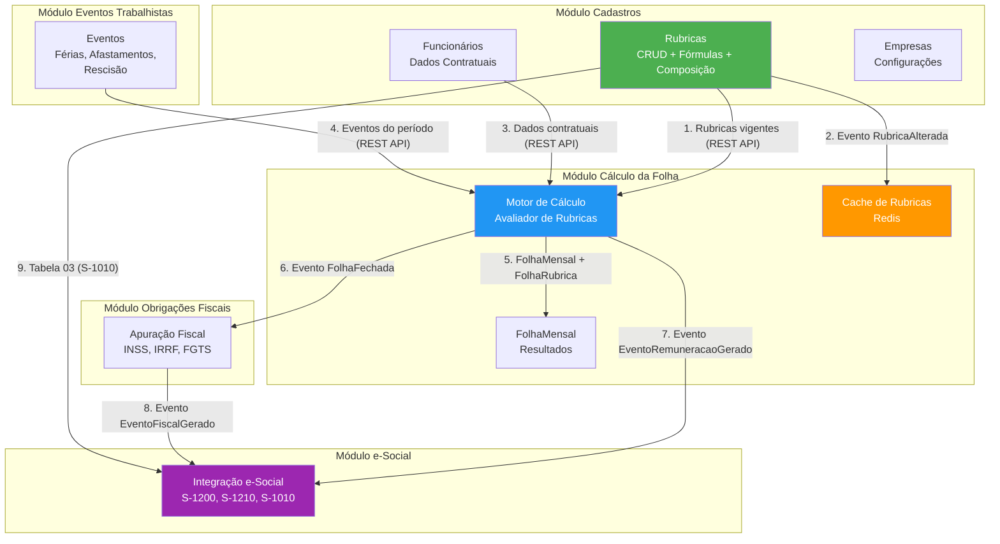

---

## Diagrama de Composição: Cálculo Mensal

```mermaid
graph TD
    subgraph "Vencimentos"
        SAL["SAL-BASE<br/>Salário Base Mensal<br/>VALOR_FIXO"]
        HE50["HORA-EXTRA-50<br/>Horas Extras 50%<br/>HORA"]
        HE100["HORA-EXTRA-100<br/>Horas Extras 100%<br/>HORA"]
        AN["ADIC-NOTURNO<br/>20% sobre Salário Base<br/>PERCENTUAL"]
        AP["ADIC-PERICULOSIDADE<br/>30% sobre Salário Base<br/>PERCENTUAL"]
        AI["ADIC-INSALUBRIDADE<br/>10/20/40% sobre Salário Mínimo<br/>PERCENTUAL"]
        COM["COMISSAO<br/>% sobre vendas<br/>PERCENTUAL"]
        DSR["DSR<br/>Média horas extras / dias úteis<br/>FORMULA"]
    end

    subgraph "Bases de Cálculo"
        B_INSS["BASE-INSS<br/>SAL+HE50+HE100+AN+AP+AI+COM+DSR<br/>COMPOSICAO"]
        B_FGTS["BASE-FGTS<br/>SAL+HE50+HE100+AN+AP+AI+COM+DSR<br/>COMPOSICAO"]
        B_IRRF["BASE-IRRF<br/>BASE-INSS - INSS - PENSAO - DED_DEP<br/>FORMULA"]
    end

    subgraph "Descontos"
        INSS["INSS<br/>Tabela Progressiva sobre BASE-INSS<br/>TABELA_PROGRESSIVA"]
        IRRF["IRRF<br/>Tabela Progressiva sobre BASE-IRRF<br/>TABELA_PROGRESSIVA"]
        PENSAO["PENSAO-ALIMENTICIA<br/>% sobre BASE-INSS<br/>PERCENTUAL"]
        FALTA["FALTA<br/>Horas não trabalhadas × valor_hora<br/>HORA"]
        ATRASO["ATRASO<br/>Horas atraso × valor_hora<br/>HORA"]
        VT["VALE-TRANSPORTE<br/>6% sobre Salário Base<br/>PERCENTUAL"]
        VR["VALE-REFEICAO<br/>20% coparticipação<br/>PERCENTUAL"]
    end

    subgraph "Totais"
        TOT_V["TOTAL-VENCIMENTOS<br/>Soma Fase 1<br/>COMPOSICAO"]
        TOT_D["TOTAL-DESCONTOS<br/>Soma Fase 3<br/>COMPOSICAO"]
        LIQ["LIQUIDO<br/>TOTAL-VENCIMENTOS - TOTAL-DESCONTOS<br/>FORMULA"]
    end

    SAL --> B_INSS
    HE50 --> B_INSS
    HE100 --> B_INSS
    AN --> B_INSS
    AP --> B_INSS
    AI --> B_INSS
    COM --> B_INSS
    DSR --> B_INSS

    SAL --> B_FGTS
    HE50 --> B_FGTS
    HE100 --> B_FGTS
    AN --> B_FGTS
    AP --> B_FGTS
    AI --> B_FGTS
    COM --> B_FGTS
    DSR --> B_FGTS

    B_INSS --> INSS
    B_INSS --> B_IRRF
    INSS -->|"deduz"| B_IRRF
    PENSAO -->|"deduz"| B_IRRF

    SAL --> TOT_V
    HE50 --> TOT_V
    HE100 --> TOT_V
    AN --> TOT_V
    AP --> TOT_V
    AI --> TOT_V
    COM --> TOT_V
    DSR --> TOT_V

    INSS --> TOT_D
    IRRF --> TOT_D
    PENSAO --> TOT_D
    FALTA --> TOT_D
    ATRASO --> TOT_D
    VT --> TOT_D
    VR --> TOT_D

    TOT_V --> LIQ
    TOT_D -->|"deduz"| LIQ
```

---

## Diagrama de Composição: 13º Salário

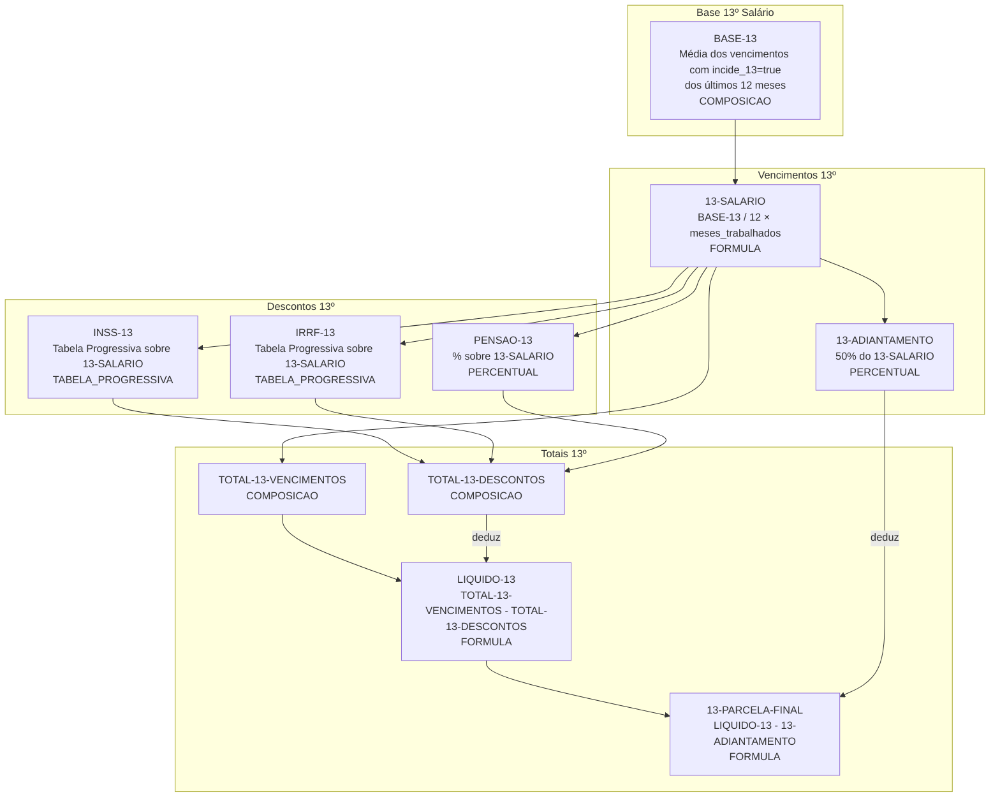

---

## Diagrama de Composição: Férias

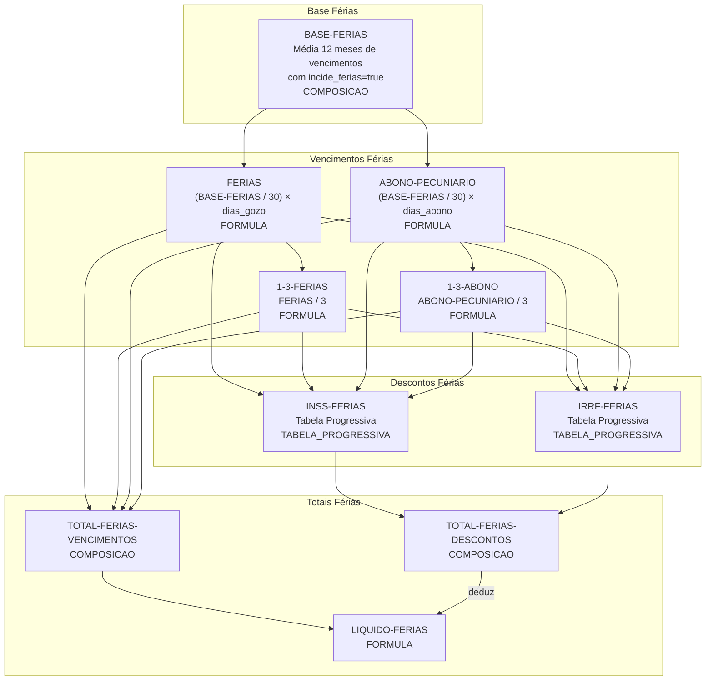

---

## Diagrama de Composição: Rescisão

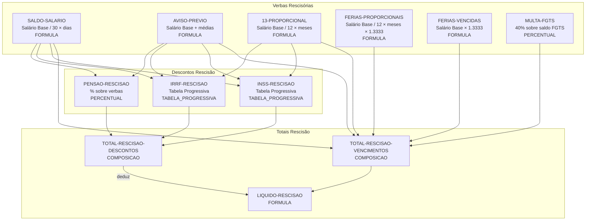

---

## Diagrama de Dependência: Incidências

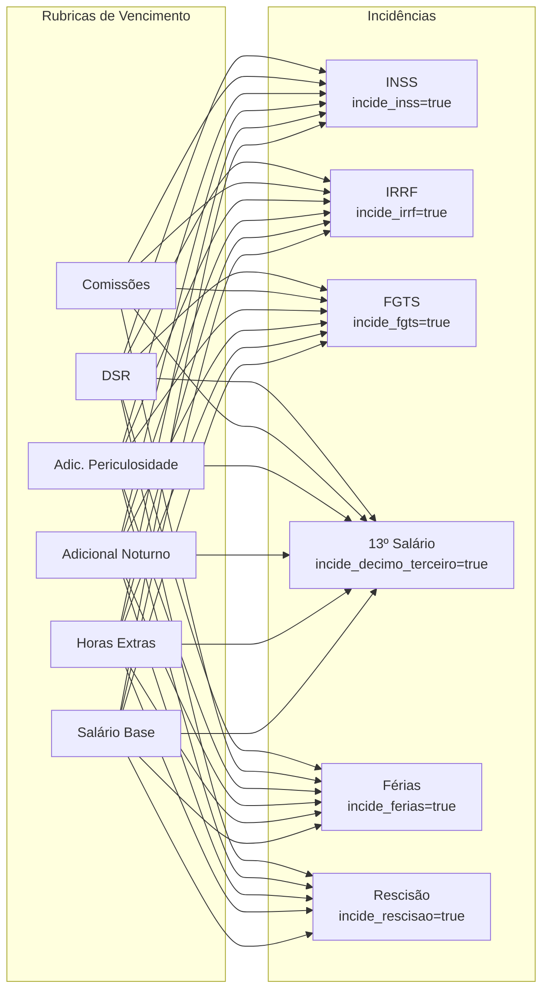

---

## Diagrama de Composição: Dissídio Coletivo

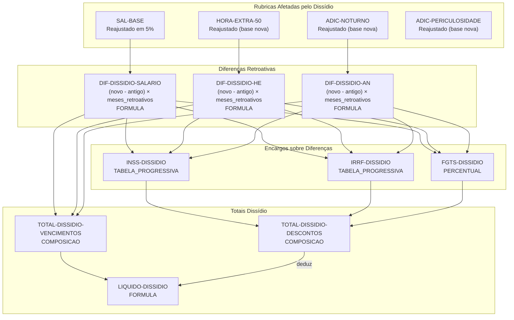

---

## Diagrama de Composição: Folha Complementar

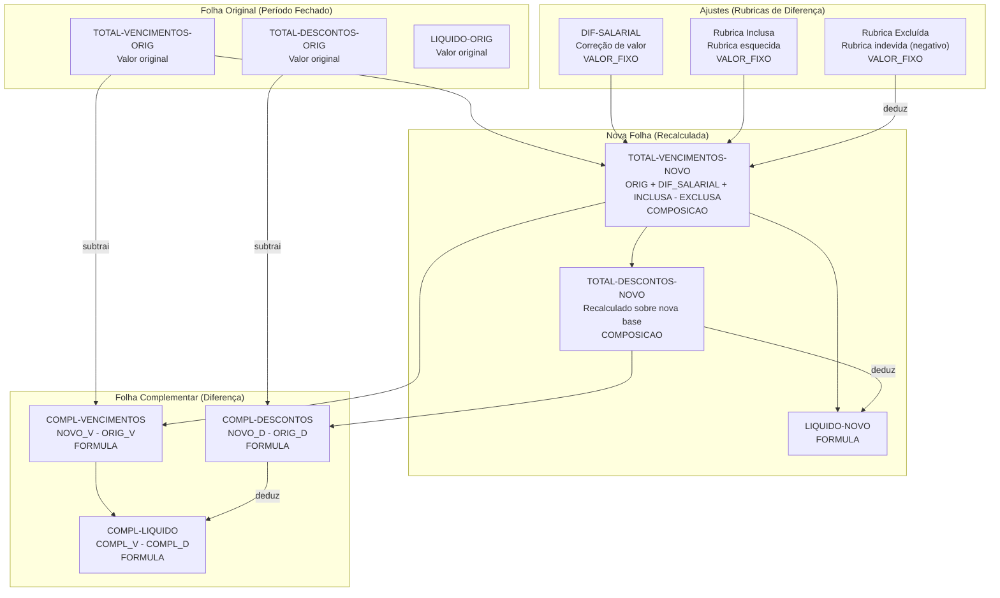

---

## Diagrama de Composição: Salário-Maternidade

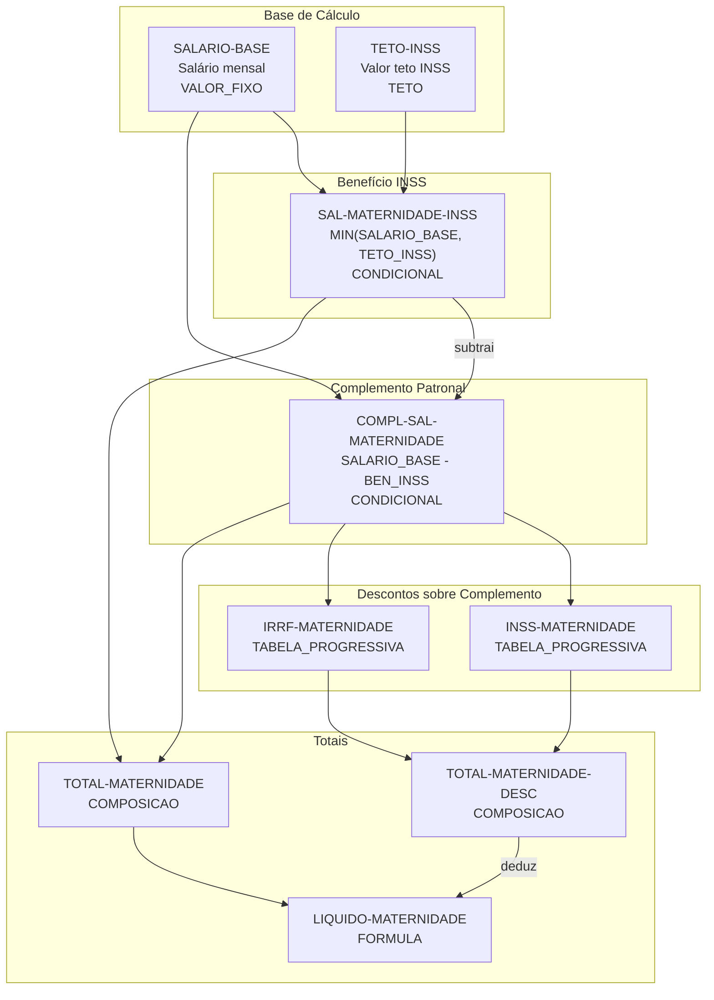

---

## Diagrama de Composição: Acordo Trabalhista

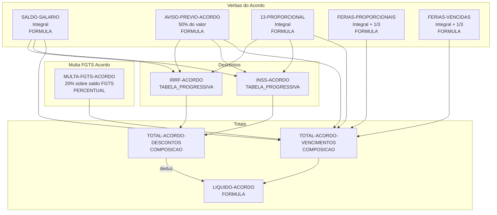

---

## Diagrama de Dependência: Incidências (Completo)

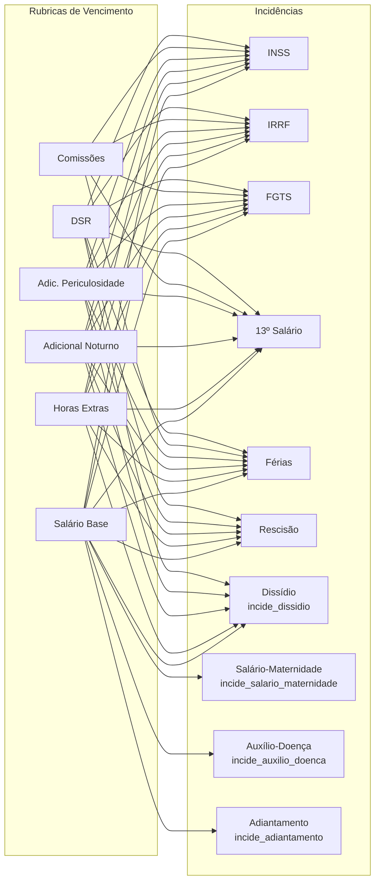

---

## Diagrama de Fluxo: Cadastro e Atualização de Rubrica

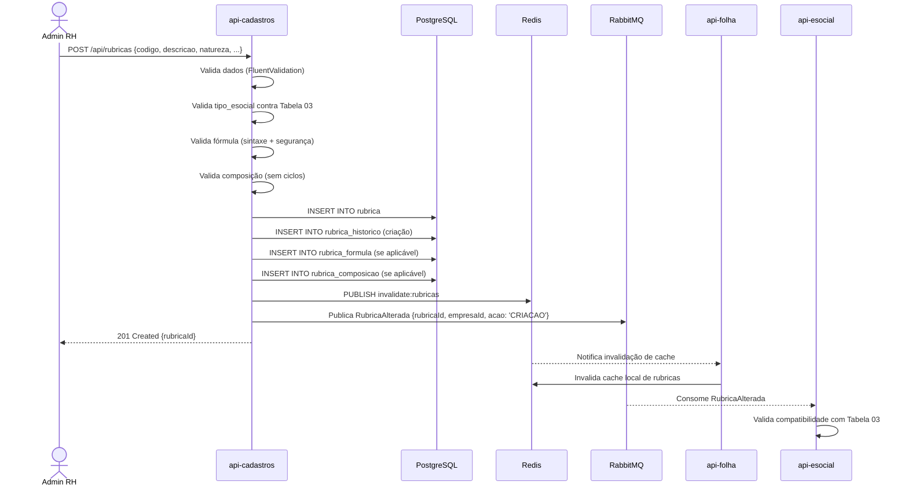

---

## Análise de Impacto: Alteração de Rubrica

| Alteração | Impacto | Módulos Afetados | Mitigação |
|---|---|---|---|
| Alterar `incide_inss` | Muda base de cálculo INSS para todos os funcionários | Cálculo Folha, Obrigações Fiscais | Versionar rubrica; aplicar a partir do próximo período |
| Alterar `incide_dissidio` | Afeta base de cálculo de dissídio | Cálculo Folha | Validar contra convenção coletiva; publicar `RubricaAlterada` |
| Alterar `incide_salario_maternidade` | Altera complemento de salário-maternidade | Cálculo Folha | Revisar impacto em licenças ativas |
| Alterar `formula_calculo` | Muda valor calculado para funcionários | Cálculo Folha | Invalidar cache; reprocessar período atual se necessário |
| Alterar `tipo_esocial` | Muda classificação no e-Social | Integração e-Social | Validar contra Tabela 03; publicar `RubricaAlterada` |
| Desativar rubrica (`ativo=false`) | Remove rubrica dos cálculos futuros | Cálculo Folha | Soft disable; manter em períodos já fechados |
| Alterar `rubrica_base_id` | Muda referência para cálculo percentual | Cálculo Folha | Validar existência da nova base; invalidar cache |
| Alterar composição | Muda valor de rubricas compostas | Cálculo Folha | Recalcular totais; invalidar cache |
| Alterar `tipo_calculo` | Muda completamente a lógica da rubrica | Cálculo Folha, e-Social | Versionar como nova rubrica; manter histórico da anterior |
| Criar dissídio | Reajusta múltiplas rubricas com retroativo | Cálculo Folha, Obrigações Fiscais | Gerar folha complementar; recalcular impostos retroativos |

---

## Tipos de Cálculo do Motor (Catálogo Completo)

| Tipo | Descrição | Exemplo de Uso | Parâmetros |
|---|---|---|---|
| `VALOR_FIXO` | Valor monetário fixo | Salário Base, Gratificação, Auxílio Creche | `valor_fixo` |
| `UNIDADE` | Valor unitário × quantidade | Vale Transporte (R$ 5,00 × 44), Vale Refeição | `valor_fixo`, variável `QUANTIDADE` |
| `HORA` | Quantidade de horas × valor hora × percentual | Horas Extras 50%, Horas Extras 100% | `percentual`, variável `QUANTIDADE_HORAS` |
| `DIA` | Quantidade de dias × valor dia | Saldo de Salário, Recesso Estágio, Licença | variável `QUANTIDADE_DIAS` |
| `PERCENTUAL` | Percentual sobre rubrica base | Adicional Noturno, Periculosidade, Comissão | `percentual`, `rubrica_base_id` |
| `MEDIA` | Média de rubricas nos últimos N meses | Média HE p/ Férias, Média Comissões p/ 13º | `rubrica_media` (qtd_meses, tipo, rubricas_origem) |
| `FORMULA` | Expressão matemática parametrizável | DSR, Provisões, Diferenças | `rubrica_formula` (expressao, parametros) |
| `COMPOSICAO` | Soma/subtração de rubricas componentes | Total Vencimentos, Base INSS, Base IRRF | `rubrica_composicao` (componentes, operadores) |
| `TABELA_PROGRESSIVA` | Alíquota progressiva por faixa | INSS, IRRF, Salário Família | `rubrica_tabela_progressiva` (faixas, aliquotas, deduções) |
| `TETO` | Aplica valor máximo (teto legal) | Teto INSS (R$ 7.786,02), Teto Salário Família | `teto_maximo`, `rubrica_base_id` |
| `CONDICIONAL` | Se condição X então Y senão Z | INSS com teto, IRRF com dedução dependente, FGTS rescisão | `rubrica_condicional` (condicao, valor_se_verdadeiro, valor_se_falso) |

---

## Referências Cruzadas

- [Database Model — Rubricas](./database-model-rubricas.md)
- [Runtime View — Cálculo com Rubricas](./runtime-view-calculo-rubricas.md)
- [Plano de Ação — Rubricas](./plano-acao-rubricas.md)
- [PRD-F02 — Gestão de Cadastros](../../tasks/prd-f02-gestao-cadastros/prd.md)
- [Component Boundaries](../arquitetura/component-boundaries.md)
