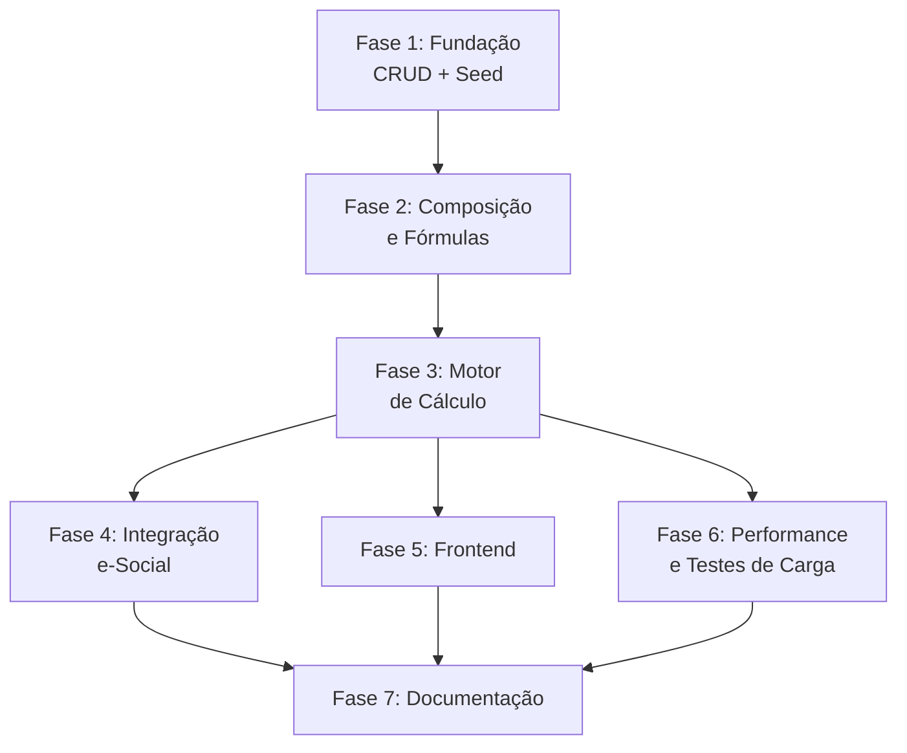

# Plano de Ação — Rubricas do Folha360

## Summary
Plano de ação para garantir a aderência das rubricas ao processo de cálculo de folha de pagamento e à compatibilidade com o e-Social (Tabela 03 / S-1010). Este plano cobre desde a modelagem inicial até a validação em produção, passando por cadastro, fórmulas, composições, testes de conformidade e integração com o e-Social.

---

## Objetivos

1. **Completude**: Garantir que todas as rubricas necessárias para TODOS os tipos de cálculo de um DP (mensal, férias, 13º, rescisão, dissídio, complementar, auxílio-doença, salário-maternidade, acordo, estágio, RPA) estejam modeladas
2. **Conformidade**: Garantir aderência à Tabela 03 do e-Social (S-1010) para rubricas enviadas ao governo
3. **Flexibilidade**: Permitir que cada empresa customize rubricas sem quebrar a compatibilidade com e-Social
4. **Rastreabilidade**: Toda alteração em rubrica deve ser auditada e versionada
5. **Performance**: Cálculo de 100K funcionários com todas as rubricas em < 2 horas

---

## Fases do Plano

### Fase 1: Fundação (Sprint 1-2) ⬜

**Objetivo**: Estabelecer a base de dados e o CRUD de rubricas.

| # | Ação | Responsável | Prazo | Status | Entregável |
|---|---|---|---|---|---|
| 1.1 | Criar migration inicial das tabelas do subsistema de rubricas | Backend | 3 dias | ⬜ Pendente | Script SQL + EF Core migration |
| 1.2 | Implementar CRUD completo de `rubrica` (com validações) | Backend | 5 dias | ⬜ Pendente | API endpoints + FluentValidation |
| 1.3 | Implementar CRUD de `grupo_rubrica` | Backend | 2 dias | ⬜ Pendente | API endpoints |
| 1.4 | Popular seed data com rubricas padrão (Tabela 03 e-Social) | Backend | 2 dias | ⬜ Pendente | Script de seed no `template_tenant` |
| 1.5 | Criar migration de `template_tenant` com todas as tabelas + seed | Backend | 1 dia | ⬜ Pendente | Script SQL |
| 1.6 | Implementar `rubrica_historico` (trilha de auditoria) | Backend | 2 dias | ⬜ Pendente | Trigger/Interceptor EF Core |
| 1.7 | Implementar validação de unicidade `(empresa_id, codigo)` | Backend | 1 dia | ⬜ Pendente | Constraint + FluentValidation |
| 1.8 | Implementar validação de `tipo_esocial` contra catálogo da Tabela 03 | Backend | 2 dias | ⬜ Pendente | Enum/Catálogo + validação |

**Critério de Aceite**: CRUD funcional de rubricas com seed data, validações e histórico de alterações.

---

### Fase 2: Composição e Fórmulas (Sprint 3-4) ⬜

**Objetivo**: Implementar a composição hierárquica e o motor de fórmulas.

| # | Ação | Responsável | Prazo | Status | Entregável |
|---|---|---|---|---|---|
| 2.1 | Implementar CRUD de `rubrica_composicao` | Backend | 3 dias | ⬜ Pendente | API endpoints |
| 2.2 | Implementar detecção de ciclos em composição | Backend | 2 dias | ⬜ Pendente | Algoritmo de detecção (DFS) |
| 2.3 | Implementar CRUD de `rubrica_formula` | Backend | 2 dias | ⬜ Pendente | API endpoints |
| 2.4 | Implementar validador de sintaxe de fórmulas | Backend | 3 dias | ⬜ Pendente | Parser + whitelist de funções |
| 2.5 | Implementar sandbox de execução de fórmulas (timeout 100ms) | Backend | 3 dias | ⬜ Pendente | NCalc com timeout |
| 2.6 | Implementar CRUD de `rubrica_incidencia` | Backend | 2 dias | ⬜ Pendente | API endpoints |
| 2.7 | Implementar CRUD de `rubrica_tabela_progressiva` | Backend | 2 dias | ⬜ Pendente | API endpoints |
| 2.8 | Popular tabelas progressivas padrão (IRRF 2026, INSS 2026) | Backend | 1 dia | ⬜ Pendente | Script de seed |
| 2.9 | Implementar cache Redis para rubricas + invalidação pub/sub | Backend | 3 dias | ⬜ Pendente | CacheService + Redis pub/sub |

**Critério de Aceite**: Composições e fórmulas funcionais; cache Redis operando com invalidação.

---

### Fase 3: Motor de Cálculo (Sprint 5-7) ⬜

**Objetivo**: Implementar o motor de cálculo que aplica as rubricas na folha, cobrindo TODOS os tipos de cálculo de um DP.

| # | Ação | Responsável | Prazo | Status | Entregável |
|---|---|---|---|---|---|
| 3.1 | Implementar `MotorCalculo` com as 4 fases (vencimentos, bases, descontos, totais) | Backend | 5 dias | ⬜ Pendente | Classe MotorCalculo |
| 3.2 | Implementar `AvaliadorExpressao` para fórmulas (NCalc + sandbox) | Backend | 3 dias | ⬜ Pendente | Avaliador com NCalc |
| 3.3 | Implementar `ResolvedorComposicao` para rubricas compostas | Backend | 2 dias | ⬜ Pendente | Classe ResolvedorComposicao |
| 3.4 | Implementar `AplicadorTabelaProgressiva` para IRRF/INSS | Backend | 2 dias | ⬜ Pendente | Classe AplicadorTabelaProgressiva |
| 3.5 | Implementar `CalculadorMedia` para rubricas de média (12m) | Backend | 3 dias | ⬜ Pendente | Classe CalculadorMedia |
| 3.6 | Implementar `AvaliadorCondicional` para rubricas condicionais | Backend | 2 dias | ⬜ Pendente | Classe AvaliadorCondicional |
| 3.7 | Implementar cálculo de férias com rubricas | Backend | 3 dias | ⬜ Pendente | Método CalcularFerias |
| 3.8 | Implementar cálculo de 13º salário com rubricas | Backend | 2 dias | ⬜ Pendente | Método CalcularDecimoTerceiro |
| 3.9 | Implementar cálculo de rescisão com rubricas | Backend | 4 dias | ⬜ Pendente | Método CalcularRescisao |
| 3.10 | Implementar cálculo de dissídio coletivo (retroativo) | Backend | 4 dias | ⬜ Pendente | Método AplicarDissidio |
| 3.11 | Implementar cálculo de folha complementar | Backend | 3 dias | ⬜ Pendente | Método CalcularComplementar |
| 3.12 | Implementar cálculo de auxílio-doença (complemento 15+ dias) | Backend | 3 dias | ⬜ Pendente | Método CalcularAuxilioDoenca |
| 3.13 | Implementar cálculo de salário-maternidade | Backend | 2 dias | ⬜ Pendente | Método CalcularSalarioMaternidade |
| 3.14 | Implementar cálculo de acordo trabalhista | Backend | 3 dias | ⬜ Pendente | Método CalcularAcordo |
| 3.15 | Implementar cálculo de estagiário (bolsa + recesso) | Backend | 2 dias | ⬜ Pendente | Método CalcularEstagiario |
| 3.16 | Implementar cálculo de RPA (autônomo/PJ) | Backend | 2 dias | ⬜ Pendente | Método CalcularRPA |
| 3.17 | Implementar testes unitários do motor de cálculo | Backend | 5 dias | ⬜ Pendente | Cobertura > 90% |
| 3.18 | Implementar testes de integração com cenários reais | Backend | 4 dias | ⬜ Pendente | Casos de teste com dados reais |

**Critério de Aceite**: Motor de cálculo funcional para TODOS os 11 tipos de cálculo; testes passando.

---

### Fase 4: Integração e-Social (Sprint 7-8) ⬜

**Objetivo**: Garantir que as rubricas estejam em conformidade com o e-Social.

| # | Ação | Responsável | Prazo | Status | Entregável |
|---|---|---|---|---|---|
| 4.1 | Mapear todas as rubricas do seed para a Tabela 03 do e-Social | Backend + DP | 2 dias | ⬜ Pendente | Documento de mapeamento |
| 4.2 | Implementar validação de conformidade e-Social (S-1010) | Backend | 3 dias | ⬜ Pendente | Validador S-1010 |
| 4.3 | Implementar geração de XML S-1010 (Tabela de Rubricas) | Backend | 3 dias | ⬜ Pendente | Gerador XML S-1010 |
| 4.4 | Implementar CRUD de `processo_administrativo` (S-1070) | Backend | 3 dias | ⬜ Pendente | API endpoints |
| 4.5 | Implementar vinculação `rubrica_processo` (S-1070) | Backend | 2 dias | ⬜ Pendente | API endpoints |
| 4.6 | Implementar geração de XML S-1070 (Processos Administrativos) | Backend | 3 dias | ⬜ Pendente | Gerador XML S-1070 |
| 4.7 | Implementar testes de validação XSD para S-1010 e S-1070 | Backend | 2 dias | ⬜ Pendente | Testes automatizados |
| 4.8 | Implementar endpoint de consulta de conformidade de rubricas | Backend | 2 dias | ⬜ Pendente | GET /api/rubricas/conformidade |

**Critério de Aceite**: Rubricas validadas contra Tabela 03; XML S-1010 e S-1070 gerados corretamente.

---

### Fase 5: Frontend (Sprint 9-10) ⬜

**Objetivo**: Interface de usuário para gestão de rubricas.

| # | Ação | Responsável | Prazo | Status | Entregável |
|---|---|---|---|---|---|
| 5.1 | Tela de listagem de rubricas com filtros (natureza, grupo, ativo) | Frontend | 3 dias | ⬜ Pendente | Componente React |
| 5.2 | Tela de cadastro/edição de rubrica (formulário completo) | Frontend | 4 dias | ⬜ Pendente | Componente React |
| 5.3 | Editor visual de composição de rubricas (drag-and-drop) | Frontend | 5 dias | ⬜ Pendente | Componente React |
| 5.4 | Editor de fórmulas com syntax highlighting e validação | Frontend | 4 dias | ⬜ Pendente | Componente React |
| 5.5 | Visualizador de árvore de dependências entre rubricas | Frontend | 3 dias | ⬜ Pendente | Componente React |
| 5.6 | Tela de simulação de cálculo (aplicar rubricas em funcionário teste) | Frontend | 4 dias | ⬜ Pendente | Componente React |
| 5.7 | Dashboard de conformidade e-Social (rubricas não mapeadas) | Frontend | 3 dias | ⬜ Pendente | Componente React |

**Critério de Aceite**: Interface funcional para CRUD de rubricas, composição visual e simulação.

---

### Fase 6: Performance e Testes de Carga (Sprint 11) ⬜

**Objetivo**: Garantir que o motor de cálculo atenda ao SLA de 2 horas para 100K funcionários.

| # | Ação | Responsável | Prazo | Status | Entregável |
|---|---|---|---|---|---|
| 6.1 | Teste de carga: cálculo de 100K funcionários com 50 rubricas cada | QA | 3 dias | ⬜ Pendente | Relatório de performance |
| 6.2 | Otimização de consultas (índices, N+1, batch processing) | Backend | 3 dias | ⬜ Pendente | Código otimizado |
| 6.3 | Teste de cache Redis (hit rate, latência, invalidação) | QA | 2 dias | ⬜ Pendente | Relatório de cache |
| 6.4 | Teste de resiliência (Redis indisponível, timeout em fórmulas) | QA | 2 dias | ⬜ Pendente | Relatório de resiliência |
| 6.5 | Ajuste de parâmetros (tamanho de lote, grau de paralelismo) | Backend | 2 dias | ⬜ Pendente | Configurações otimizadas |

**Critério de Aceite**: 100K funcionários processados em < 2 horas; cache hit rate > 95%.

---

### Fase 7: Documentação e Treinamento (Sprint 12) ⬜

**Objetivo**: Documentar o subsistema de rubricas para o time e clientes.

| # | Ação | Responsável | Prazo | Status | Entregável |
|---|---|---|---|---|---|
| 7.1 | Documentar catálogo de rubricas padrão (manual do usuário) | DP + Tech Writer | 3 dias | ⬜ Pendente | Documento PDF/MD |
| 7.2 | Documentar guia de customização de rubricas | DP | 2 dias | ⬜ Pendente | Documento |
| 7.3 | Documentar referência de fórmulas (funções disponíveis, sintaxe) | Backend | 2 dias | ⬜ Pendente | Documento |
| 7.4 | Criar vídeos tutoriais de cadastro de rubricas | DP | 3 dias | ⬜ Pendente | Vídeos |
| 7.5 | Treinamento do time de suporte/implantação | DP + Backend | 1 dia | ⬜ Pendente | Sessão de treinamento |

---

## Resumo de Prazos

| Fase | Descrição | Duração | Sprints |
|---|---|---|---|
| Fase 1 | Fundação (CRUD + Seed) | 2 sprints | Sprint 1-2 |
| Fase 2 | Composição e Fórmulas | 2 sprints | Sprint 3-4 |
| Fase 3 | Motor de Cálculo (11 tipos) | 3 sprints | Sprint 5-7 |
| Fase 4 | Integração e-Social | 2 sprints | Sprint 8-9 |
| Fase 5 | Frontend | 2 sprints | Sprint 10-11 |
| Fase 6 | Performance e Testes | 1 sprint | Sprint 12 |
| Fase 7 | Documentação | 1 sprint | Sprint 13 |
| **Total** | | **13 sprints** | **~26 semanas** |

> **Nota**: As fases 1-3 são sequenciais. As fases 4 e 5 podem ser paralelizadas com times separados. A fase 6 depende da conclusão da fase 3.

---

## Dependências entre Fases

---

## Riscos e Mitigações

| Risco | Probabilidade | Impacto | Mitigação |
|---|---|---|---|
| Mudança na Tabela 03 do e-Social (NT) | Média | Alto | Monitorar portal e-Social; CI/CD com alerta de NT; versionamento de catálogo |
| Complexidade excessiva de fórmulas | Média | Médio | Limitar funções disponíveis; timeout de 100ms; sandbox |
| Performance insuficiente com muitas rubricas | Baixa | Alto | Cache Redis; índices otimizados; batch processing; HPA |
| Inconsistência entre rubricas e e-Social | Média | Alto | Validação automatizada; testes de conformidade; relatório de divergências |
| Resistência do usuário a fórmulas complexas | Média | Baixo | Editor visual; simulador; documentação clara; suporte |
| Cálculo de média incorreto | Média | Alto | Testes com dados históricos reais; validação cruzada com sistema anterior |
| Dissídio com retroativo errado | Média | Alto | Simulação prévia; aprovação do sindicato; rollback se necessário |
| Condição mal avaliada | Baixa | Médio | Validador de sintaxe; testes exaustivos de borda; fallback seguro |
| Folha complementar duplicada | Baixa | Alto | Idempotência por (periodo, tipo, funcionario_id); trava de processamento |
| Complexidade de 11 tipos de cálculo | Média | Médio | Documentação extensa; testes automatizados; treinamento do time |

---

## Métricas de Sucesso

| Métrica | Alvo | Como Medir |
|---|---|---|
| Rubricas padrão cadastradas | 100% da Tabela 03 | Contagem no seed data |
| Cobertura de testes do motor | > 90% | Relatório de cobertura |
| Tempo de cálculo (100K func.) | < 2 horas | Teste de carga |
| Cache hit rate | > 95% | Métricas Redis |
| Conformidade e-Social | 100% rubricas mapeadas | Relatório de conformidade |
| Tempo de cadastro de rubrica | < 2 minutos | Teste de usabilidade |

---

## Benchmark: Concorrentes de Mercado

Análise de como outros fornecedores de folha de pagamento abordam o cadastro de rubricas:

| Fornecedor | Abordagem | Pontos Fortes | Pontos Fracos |
|---|---|---|---|
| **Totvs RM** | Rubricas fixas com código e-Social; customização limitada | Conformidade garantida; simples | Pouca flexibilidade; difícil criar rubricas específicas |
| **Senior** | Rubricas parametrizáveis com fórmulas; editor visual | Flexível; bom para empresas complexas | Curva de aprendizado alta; risco de erro em fórmulas |
| **ADP** | Rubricas pré-definidas por país; regras fiscais automáticas | Conformidade global; atualização automática de tabelas | Pouca customização para regras locais específicas |
| **e-Social Simples** | Rubricas básicas pré-definidas; sem customização | Extremamente simples; barato | Não atende empresas médias/grandes |
| **Folha360 (proposto)** | **Híbrido**: seed padrão e-Social + customização com fórmulas e composição | Conformidade + flexibilidade; composição hierárquica; auditoria | Complexidade de implementação; risco de fórmulas maliciosas |

**Diferenciais do Folha360**:
1. **Composição hierárquica**: Nenhum concorrente oferece composição visual drag-and-drop de rubricas
2. **Simulador integrado**: Testar rubricas em funcionário fictício antes de aplicar
3. **Conformidade automatizada**: Validação contínua contra Tabela 03 com alertas
4. **Versionamento**: Histórico completo de alterações com motivo e rollback

---

## Referências Cruzadas

- [Database Model — Rubricas](./database-model-rubricas.md)
- [Runtime View — Cálculo com Rubricas](./runtime-view-calculo-rubricas.md)
- [Diagrama de Composição e Dependência](./diagrama-composicao-dependencia-rubricas.md)
- [PRD-F02 — Gestão de Cadastros](../../tasks/prd-f02-gestao-cadastros/prd.md)
- [Features — Folha360](../../docs/outputs/features/Features.md)
