# Runtime View — Processo de Cálculo com Rubricas

## Summary
Visão de runtime detalhada do fluxo de **cálculo da folha de pagamento** com foco na aplicação das rubricas. Este artefato descreve a ordem de processamento das rubricas, a resolução de composições hierárquicas, a aplicação de incidências (INSS, IRRF, FGTS), e o fluxo de eventos entre os módulos. Complementa o [runtime-view.md](../arquitetura/runtime-view.md) existente com o detalhamento específico do motor de cálculo de rubricas.

---

## Fluxo Principal: Cálculo da Folha Mensal com Rubricas

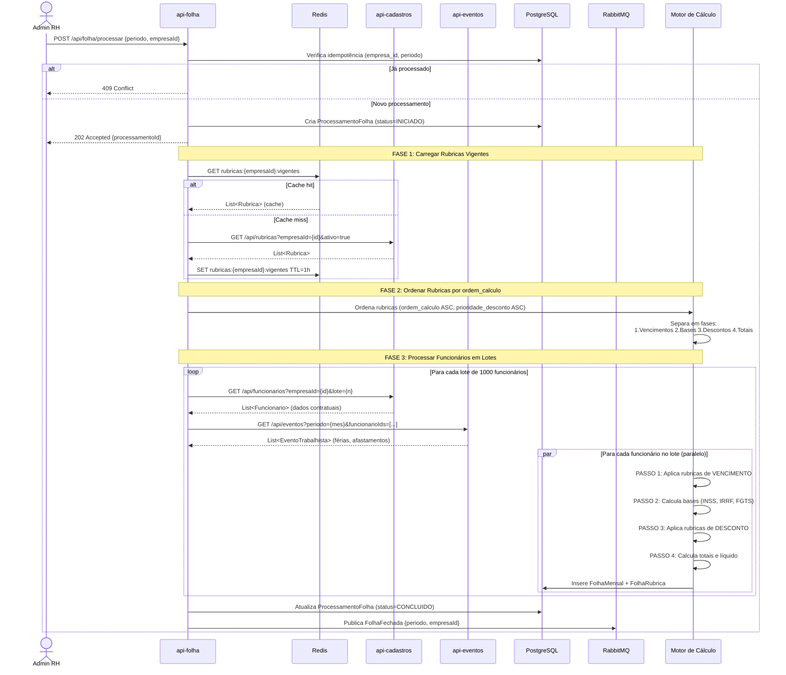
```mermaid
sequenceDiagram
    actor Admin as Admin RH
    participant API as api-folha
    participant Cache as Redis
    participant CAD as api-cadastros
    participant EVT as api-eventos
    participant DB as PostgreSQL
    participant RMQ as RabbitMQ
    participant Engine as Motor de Cálculo

    Admin->>API: POST /api/folha/processar {periodo, empresaId}
    API->>DB: Verifica idempotência (empresa_id, periodo)
    alt Já processado
        API-->>Admin: 409 Conflict
    else Novo processamento
        API->>DB: Cria ProcessamentoFolha (status=INICIADO)
        API-->>Admin: 202 Accepted {processamentoId}

        Note over API,Engine: FASE 1: Carregar Rubricas Vigentes

        API->>Cache: GET rubricas:{empresaId}:vigentes
        alt Cache hit
            Cache-->>API: List<Rubrica> (cache)
        else Cache miss
            API->>CAD: GET /api/rubricas?empresaId={id}&ativo=true
            CAD-->>API: List<Rubrica>
            API->>Cache: SET rubricas:{empresaId}:vigentes TTL=1h
        end

        Note over API,Engine: FASE 2: Ordenar Rubricas por ordem_calculo

        API->>Engine: Ordena rubricas (ordem_calculo ASC, prioridade_desconto ASC)
        Engine->>Engine: Separa em fases:<br/>1.Vencimentos 2.Bases 3.Descontos 4.Totais

        Note over API,Engine: FASE 3: Processar Funcionários em Lotes

        loop Para cada lote de 1000 funcionários
            API->>CAD: GET /api/funcionarios?empresaId={id}&lote={n}
            CAD-->>API: List<Funcionario> (dados contratuais)
            API->>EVT: GET /api/eventos?periodo={mes}&funcionarioIds=[...]
            EVT-->>API: List<EventoTrabalhista> (férias, afastamentos)

            par Para cada funcionário no lote (paralelo)
                Engine->>Engine: PASSO 1: Aplica rubricas de VENCIMENTO
                Engine->>Engine: PASSO 2: Calcula bases (INSS, IRRF, FGTS)
                Engine->>Engine: PASSO 3: Aplica rubricas de DESCONTO
                Engine->>Engine: PASSO 4: Calcula totais e líquido
                Engine->>DB: Insere FolhaMensal + FolhaRubrica
            end
        end

        API->>DB: Atualiza ProcessamentoFolha (status=CONCLUIDO)
        API->>RMQ: Publica FolhaFechada {periodo, empresaId}
    end
```

---

## Motor de Cálculo: Algoritmo de Aplicação de Rubricas

### Ordem de Processamento

```
┌─────────────────────────────────────────────────────────┐
│                  MOTOR DE CÁLCULO                        │
│                                                          │
│  FASE 1: VENCIMENTOS (ordem_calculo 1-99)                │
│  ┌──────────────────────────────────────────────────┐   │
│  │ 1.1 Rubricas de VALOR_FIXO                       │   │
│  │ 1.2 Rubricas de UNIDADE (qtd × valor_unitario)   │   │
│  │ 1.3 Rubricas de HORA (qtd × valor_hora)          │   │
│  │ 1.4 Rubricas de DIA (qtd_dias × valor_dia)       │   │
│  │ 1.5 Rubricas de PERCENTUAL (sobre rubrica_base)  │   │
│  │ 1.6 Rubricas de MEDIA (média N meses)            │   │
│  │ 1.7 Rubricas de FORMULA (avalia expressão)       │   │
│  │ 1.8 Rubricas de COMPOSICAO (soma componentes)    │   │
│  └──────────────────────────────────────────────────┘   │
│                      ↓                                   │
│  FASE 2: BASES DE CÁLCULO (ordem_calculo 100-199)       │
│  ┌──────────────────────────────────────────────────┐   │
│  │ 2.1 BASE-INSS: Soma vencimentos com incide_inss  │   │
│  │ 2.2 BASE-FGTS: Soma vencimentos com incide_fgts  │   │
│  │ 2.3 BASE-IRRF: BASE-INSS - INSS - Pensão - Dep.  │   │
│  │ 2.4 BASE-DISSIDIO: Soma com incide_dissidio      │   │
│  │ 2.5 BASE-MATERNIDADE: Soma com incide_mat        │   │
│  └──────────────────────────────────────────────────┘   │
│                      ↓                                   │
│  FASE 3: DESCONTOS (ordem_calculo 200-299)              │
│  ┌──────────────────────────────────────────────────┐   │
│  │ 3.1 INSS (TABELA_PROGRESSIVA sobre BASE-INSS)    │   │
│  │ 3.2 IRRF (TABELA_PROGRESSIVA sobre BASE-IRRF)    │   │
│  │ 3.3 Pensão Alimentícia (% sobre base)            │   │
│  │ 3.4 Faltas/Atrasos (HORA × valor_hora)           │   │
│  │ 3.5 Vale Transporte (6% sobre salário base)      │   │
│  │ 3.6 Descontos CONDICIONAIS (aval. condição)      │   │
│  │ 3.7 Outros descontos (prioridade_desconto)       │   │
│  └──────────────────────────────────────────────────┘   │
│                      ↓                                   │
│  FASE 4: TOTAIS (ordem_calculo 300-399)                 │
│  ┌──────────────────────────────────────────────────┐   │
│  │ 4.1 TOTAL-VENCIMENTOS (soma fase 1)              │   │
│  │ 4.2 TOTAL-DESCONTOS (soma fase 3)                │   │
│  │ 4.3 LIQUIDO = TOTAL-VENCIMENTOS - TOTAL-DESCONTOS│   │
│  └──────────────────────────────────────────────────┘   │
└─────────────────────────────────────────────────────────┘
```

### Pseudocódigo do Motor

```csharp
// Motor de Cálculo de Rubricas
public async Task<FolhaCalculada> CalcularFolha(
    Funcionario funcionario,
    List<Rubrica> rubricas,
    List<EventoTrabalhista> eventos,
    Periodo periodo)
{
    var contexto = new ContextoCalculo {
        Funcionario = funcionario,
        Eventos = eventos,
        Periodo = periodo,
        ValoresCalculados = new Dictionary<Guid, decimal>(),
        Variaveis = new Dictionary<string, decimal>()
    };

    // Inicializa variáveis do contexto
    contexto.Variaveis["SALARIO_BASE"] = funcionario.SalarioBase;
    contexto.Variaveis["HORAS_MES"] = funcionario.JornadaHorasSemanais * 4.33m;
    contexto.Variaveis["VALOR_HORA"] = funcionario.SalarioBase / contexto.Variaveis["HORAS_MES"];
    contexto.Variaveis["DIAS_MES"] = 30;
    contexto.Variaveis["NUM_DEPENDENTES_IRRF"] = funcionario.Dependentes.Count(d => d.DependenteIRRF);

    // FASE 1: Vencimentos (ordem_calculo 1-99)
    var vencimentos = rubricas
        .Where(r => r.Natureza == "Vencimento")
        .OrderBy(r => r.OrdemCalculo);

    foreach (var rubrica in vencimentos)
    {
        var valor = await CalcularRubrica(rubrica, contexto);
        contexto.ValoresCalculados[rubrica.Id] = valor;
    }

    // FASE 2: Bases de Cálculo (ordem_calculo 100-199)
    var bases = rubricas
        .Where(r => r.Natureza == "Base")
        .OrderBy(r => r.OrdemCalculo);

    foreach (var baseCalc in bases)
    {
        var valor = await CalcularRubrica(baseCalc, contexto);
        contexto.ValoresCalculados[baseCalc.Id] = valor;
        contexto.Variaveis[baseCalc.Codigo] = valor; // Ex.: BASE-INSS → variável
    }

    // FASE 3: Descontos (ordem_calculo 200-299)
    var descontos = rubricas
        .Where(r => r.Natureza == "Desconto")
        .OrderBy(r => r.OrdemCalculo)
        .ThenBy(r => r.PrioridadeDesconto ?? 999);

    foreach (var desconto in descontos)
    {
        var valor = await CalcularRubrica(desconto, contexto);
        contexto.ValoresCalculados[desconto.Id] = valor;
    }

    // FASE 4: Totais (ordem_calculo 300-399)
    var totais = rubricas
        .Where(r => r.Natureza == "Informativo" || r.Codigo == "LIQUIDO")
        .OrderBy(r => r.OrdemCalculo);

    foreach (var total in totais)
    {
        var valor = await CalcularRubrica(total, contexto);
        contexto.ValoresCalculados[total.Id] = valor;
    }

    return new FolhaCalculada {
        FuncionarioId = funcionario.Id,
        Rubricas = contexto.ValoresCalculados,
        TotalVencimentos = contexto.Variaveis["TOTAL-VENCIMENTOS"],
        TotalDescontos = contexto.Variaveis["TOTAL-DESCONTOS"],
        Liquido = contexto.Variaveis["LIQUIDO"]
    };
}

private async Task<decimal> CalcularRubrica(Rubrica rubrica, ContextoCalculo ctx)
{
    switch (rubrica.TipoCalculo)
    {
        case "VALOR_FIXO":
            return AplicarTetoPiso(rubrica.ValorFixo ?? 0, rubrica);

        case "UNIDADE":
            // Ex.: vale-transporte: R$ 5,00 × 44 unidades
            var qtdUnidades = ObterVariavel(rubrica, ctx, "QUANTIDADE");
            var valorUnitario = rubrica.ValorFixo ?? 0;
            return AplicarTetoPiso(qtdUnidades * valorUnitario, rubrica);

        case "HORA":
            var qtdHoras = ObterVariavel(rubrica, ctx, "QUANTIDADE_HORAS");
            var valorHora = ctx.Variaveis["VALOR_HORA"];
            var percentualHe = rubrica.Percentual ?? 100;
            return AplicarTetoPiso(qtdHoras * valorHora * (percentualHe / 100), rubrica);

        case "DIA":
            // Ex.: salário-maternidade: salário / 30 × dias_licenca
            var qtdDias = ObterVariavel(rubrica, ctx, "QUANTIDADE_DIAS");
            var valorDia = ctx.Variaveis["SALARIO_BASE"] / ctx.Variaveis["DIAS_MES"];
            return AplicarTetoPiso(qtdDias * valorDia, rubrica);

        case "PERCENTUAL":
            var baseRef = rubrica.RubricaBaseId != null
                ? ctx.ValoresCalculados[rubrica.RubricaBaseId.Value]
                : ctx.Variaveis["SALARIO_BASE"];
            return AplicarTetoPiso(baseRef * ((rubrica.Percentual ?? 0) / 100), rubrica);

        case "MEDIA":
            return await CalcularMedia(rubrica, ctx);

        case "FORMULA":
            return await AvaliarFormula(rubrica, ctx);

        case "COMPOSICAO":
            return await CalcularComposicao(rubrica, ctx);

        case "TABELA_PROGRESSIVA":
            return await AplicarTabelaProgressiva(rubrica, ctx);

        case "TETO":
            // Aplica teto legal a uma rubrica (ex.: INSS limitado ao teto)
            var valorBase = ctx.ValoresCalculados[rubrica.RubricaBaseId!.Value];
            var teto = rubrica.TetoMaximo ?? decimal.MaxValue;
            return Math.Min(valorBase, teto);

        case "CONDICIONAL":
            return await AvaliarCondicional(rubrica, ctx);

        default:
            return 0;
    }
}
```

---

## Fluxo: Resolução de Composição de Rubricas

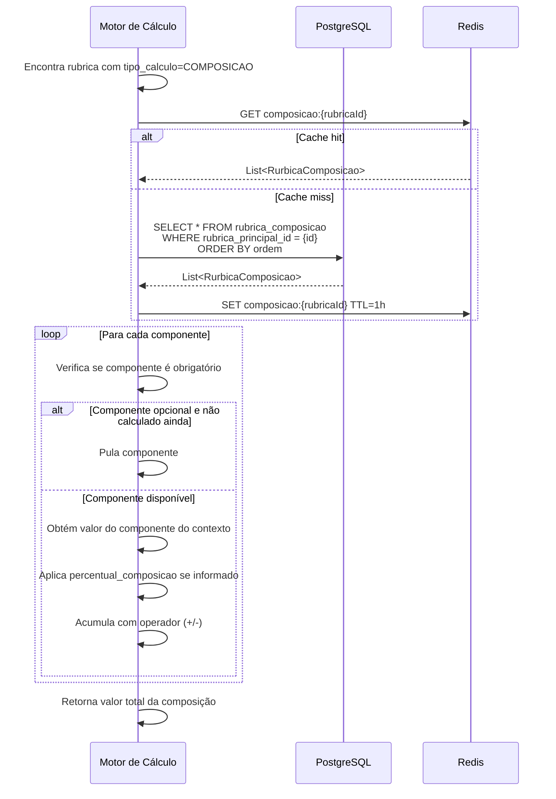
```mermaid
sequenceDiagram
    participant Engine as Motor de Cálculo
    participant DB as PostgreSQL
    participant Cache as Redis

    Engine->>Engine: Encontra rubrica com tipo_calculo=COMPOSICAO
    Engine->>Cache: GET composicao:{rubricaId}
    alt Cache hit
        Cache-->>Engine: List<RurbicaComposicao>
    else Cache miss
        Engine->>DB: SELECT * FROM rubrica_composicao<br/>WHERE rubrica_principal_id = {id}<br/>ORDER BY ordem
        DB-->>Engine: List<RurbicaComposicao>
        Engine->>Cache: SET composicao:{rubricaId} TTL=1h
    end

    loop Para cada componente
        Engine->>Engine: Verifica se componente é obrigatório
        alt Componente opcional e não calculado ainda
            Engine->>Engine: Pula componente
        else Componente disponível
            Engine->>Engine: Obtém valor do componente do contexto
            Engine->>Engine: Aplica percentual_composicao se informado
            Engine->>Engine: Acumula com operador (+/-)
        end
    end

    Engine->>Engine: Retorna valor total da composição
```

---

## Fluxo: Aplicação de Tabela Progressiva (IRRF/INSS)

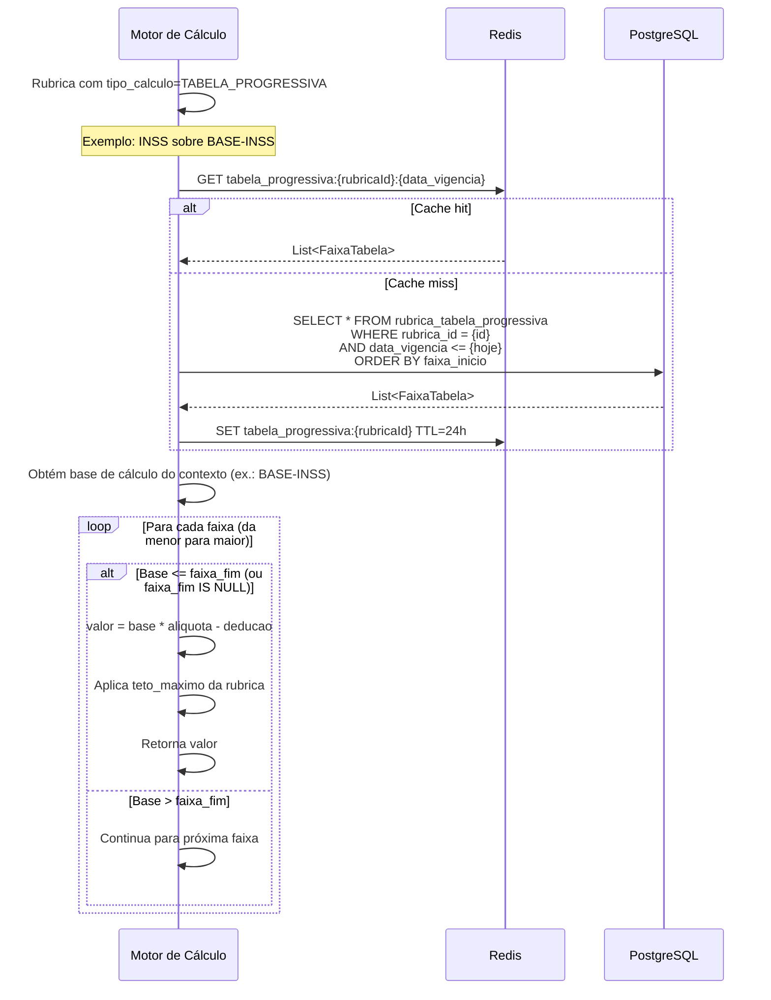
```mermaid
sequenceDiagram
    participant Engine as Motor de Cálculo
    participant Cache as Redis
    participant DB as PostgreSQL

    Engine->>Engine: Rubrica com tipo_calculo=TABELA_PROGRESSIVA

    Note over Engine: Exemplo: INSS sobre BASE-INSS

    Engine->>Cache: GET tabela_progressiva:{rubricaId}:{data_vigencia}
    alt Cache hit
        Cache-->>Engine: List<FaixaTabela>
    else Cache miss
        Engine->>DB: SELECT * FROM rubrica_tabela_progressiva<br/>WHERE rubrica_id = {id}<br/>AND data_vigencia <= {hoje}<br/>ORDER BY faixa_inicio
        DB-->>Engine: List<FaixaTabela>
        Engine->>Cache: SET tabela_progressiva:{rubricaId} TTL=24h
    end

    Engine->>Engine: Obtém base de cálculo do contexto (ex.: BASE-INSS)

    loop Para cada faixa (da menor para maior)
        alt Base <= faixa_fim (ou faixa_fim IS NULL)
            Engine->>Engine: valor = base * aliquota - deducao
            Engine->>Engine: Aplica teto_maximo da rubrica
            Engine->>Engine: Retorna valor
        else Base > faixa_fim
            Engine->>Engine: Continua para próxima faixa
        end
    end
```

---

## Fluxo: Avaliação de Fórmulas

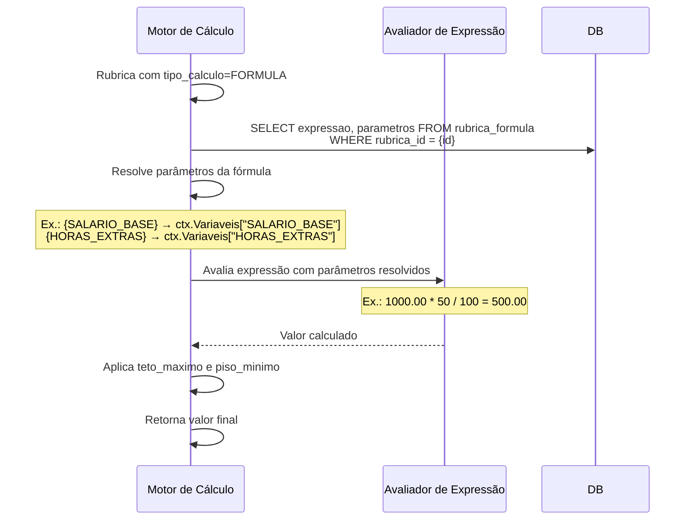
```mermaid
sequenceDiagram
    participant Engine as Motor de Cálculo
    participant Formula as Avaliador de Expressão

    Engine->>Engine: Rubrica com tipo_calculo=FORMULA

    Engine->>DB: SELECT expressao, parametros FROM rubrica_formula<br/>WHERE rubrica_id = {id}

    Engine->>Engine: Resolve parâmetros da fórmula
    Note over Engine: Ex.: {SALARIO_BASE} → ctx.Variaveis["SALARIO_BASE"]<br/>{HORAS_EXTRAS} → ctx.Variaveis["HORAS_EXTRAS"]

    Engine->>Formula: Avalia expressão com parâmetros resolvidos
    Note over Formula: Ex.: 1000.00 * 50 / 100 = 500.00

    Formula-->>Engine: Valor calculado

    Engine->>Engine: Aplica teto_maximo e piso_minimo
    Engine->>Engine: Retorna valor final
```

---

## Fluxo: Cálculo de Férias com Rubricas

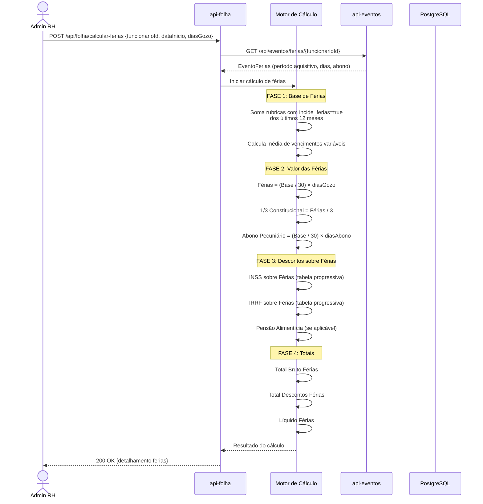
```mermaid
sequenceDiagram
    actor Admin as Admin RH
    participant API as api-folha
    participant Engine as Motor de Cálculo
    participant EVT as api-eventos
    participant DB as PostgreSQL

    Admin->>API: POST /api/folha/calcular-ferias {funcionarioId, dataInicio, diasGozo}

    API->>EVT: GET /api/eventos/ferias/{funcionarioId}
    EVT-->>API: EventoFerias (período aquisitivo, dias, abono)

    API->>Engine: Iniciar cálculo de férias

    Note over Engine: FASE 1: Base de Férias
    Engine->>Engine: Soma rubricas com incide_ferias=true<br/>dos últimos 12 meses
    Engine->>Engine: Calcula média de vencimentos variáveis

    Note over Engine: FASE 2: Valor das Férias
    Engine->>Engine: Férias = (Base / 30) × diasGozo
    Engine->>Engine: 1/3 Constitucional = Férias / 3
    Engine->>Engine: Abono Pecuniário = (Base / 30) × diasAbono

    Note over Engine: FASE 3: Descontos sobre Férias
    Engine->>Engine: INSS sobre Férias (tabela progressiva)
    Engine->>Engine: IRRF sobre Férias (tabela progressiva)
    Engine->>Engine: Pensão Alimentícia (se aplicável)

    Note over Engine: FASE 4: Totais
    Engine->>Engine: Total Bruto Férias
    Engine->>Engine: Total Descontos Férias
    Engine->>Engine: Líquido Férias

    Engine-->>API: Resultado do cálculo
    API-->>Admin: 200 OK {detalhamento ferias}
```

---

## Fluxo: Cálculo de Rescisão com Rubricas

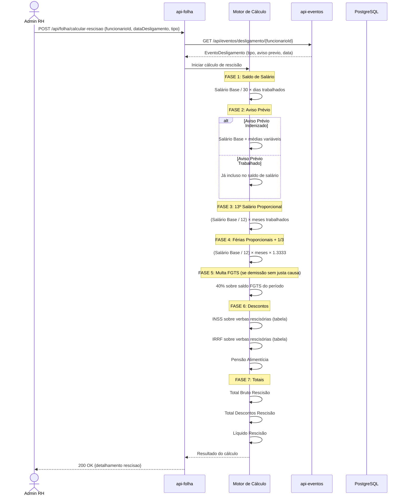
```mermaid
sequenceDiagram
    actor Admin as Admin RH
    participant API as api-folha
    participant Engine as Motor de Cálculo
    participant EVT as api-eventos
    participant DB as PostgreSQL

    Admin->>API: POST /api/folha/calcular-rescisao {funcionarioId, dataDesligamento, tipo}

    API->>EVT: GET /api/eventos/desligamento/{funcionarioId}
    EVT-->>API: EventoDesligamento (tipo, aviso previo, data)

    API->>Engine: Iniciar cálculo de rescisão

    Note over Engine: FASE 1: Saldo de Salário
    Engine->>Engine: Salário Base / 30 × dias trabalhados

    Note over Engine: FASE 2: Aviso Prévio
    alt Aviso Prévio Indenizado
        Engine->>Engine: Salário Base + médias variáveis
    else Aviso Prévio Trabalhado
        Engine->>Engine: Já incluso no saldo de salário
    end

    Note over Engine: FASE 3: 13º Salário Proporcional
    Engine->>Engine: (Salário Base / 12) × meses trabalhados

    Note over Engine: FASE 4: Férias Proporcionais + 1/3
    Engine->>Engine: (Salário Base / 12) × meses × 1.3333

    Note over Engine: FASE 5: Multa FGTS (se demissão sem justa causa)
    Engine->>Engine: 40% sobre saldo FGTS do período

    Note over Engine: FASE 6: Descontos
    Engine->>Engine: INSS sobre verbas rescisórias (tabela)
    Engine->>Engine: IRRF sobre verbas rescisórias (tabela)
    Engine->>Engine: Pensão Alimentícia

    Note over Engine: FASE 7: Totais
    Engine->>Engine: Total Bruto Rescisão
    Engine->>Engine: Total Descontos Rescisão
    Engine->>Engine: Líquido Rescisão

    Engine-->>API: Resultado do cálculo
    API-->>Admin: 200 OK {detalhamento rescisao}
```

---

## Fluxo: Cálculo de Média (para Férias, 13º, Rescisão)

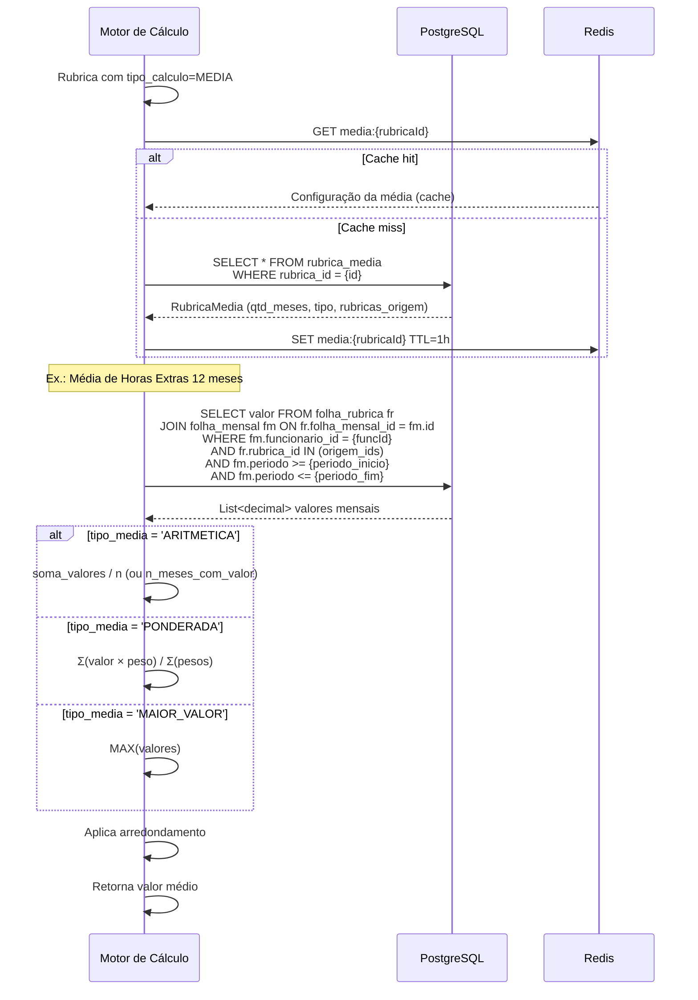
```mermaid
sequenceDiagram
    participant Engine as Motor de Cálculo
    participant DB as PostgreSQL
    participant Cache as Redis

    Engine->>Engine: Rubrica com tipo_calculo=MEDIA

    Engine->>Cache: GET media:{rubricaId}
    alt Cache hit
        Cache-->>Engine: Configuração da média (cache)
    else Cache miss
        Engine->>DB: SELECT * FROM rubrica_media<br/>WHERE rubrica_id = {id}
        DB-->>Engine: RubricaMedia (qtd_meses, tipo, rubricas_origem)
        Engine->>Cache: SET media:{rubricaId} TTL=1h
    end

    Note over Engine: Ex.: Média de Horas Extras 12 meses

    Engine->>DB: SELECT valor FROM folha_rubrica fr<br/>JOIN folha_mensal fm ON fr.folha_mensal_id = fm.id<br/>WHERE fm.funcionario_id = {funcId}<br/>AND fr.rubrica_id IN (origem_ids)<br/>AND fm.periodo >= {periodo_inicio}<br/>AND fm.periodo <= {periodo_fim}

    DB-->>Engine: List<decimal> valores mensais

    alt tipo_media = 'ARITMETICA'
        Engine->>Engine: soma_valores / n (ou n_meses_com_valor)
    else tipo_media = 'PONDERADA'
        Engine->>Engine: Σ(valor × peso) / Σ(pesos)
    else tipo_media = 'MAIOR_VALOR'
        Engine->>Engine: MAX(valores)
    end

    Engine->>Engine: Aplica arredondamento
    Engine->>Engine: Retorna valor médio
```

---

## Fluxo: Avaliação Condicional

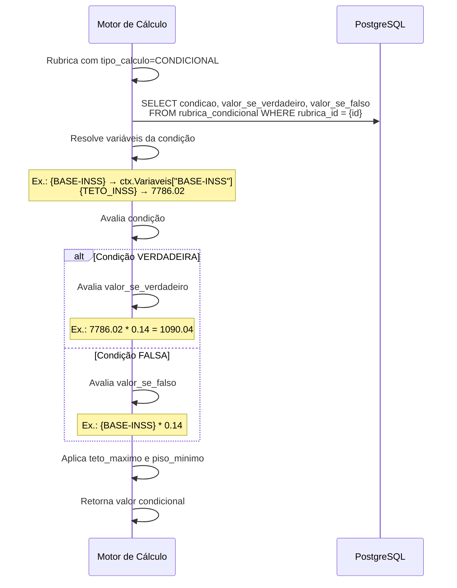
```mermaid
sequenceDiagram
    participant Engine as Motor de Cálculo
    participant DB as PostgreSQL

    Engine->>Engine: Rubrica com tipo_calculo=CONDICIONAL

    Engine->>DB: SELECT condicao, valor_se_verdadeiro, valor_se_falso<br/>FROM rubrica_condicional WHERE rubrica_id = {id}

    Engine->>Engine: Resolve variáveis da condição
    Note over Engine: Ex.: {BASE-INSS} → ctx.Variaveis["BASE-INSS"]<br/>{TETO_INSS} → 7786.02

    Engine->>Engine: Avalia condição
    alt Condição VERDADEIRA
        Engine->>Engine: Avalia valor_se_verdadeiro
        Note over Engine: Ex.: 7786.02 * 0.14 = 1090.04
    else Condição FALSA
        Engine->>Engine: Avalia valor_se_falso
        Note over Engine: Ex.: {BASE-INSS} * 0.14
    end

    Engine->>Engine: Aplica teto_maximo e piso_minimo
    Engine->>Engine: Retorna valor condicional
```

---

## Fluxo: Dissídio Coletivo (Data-Base)

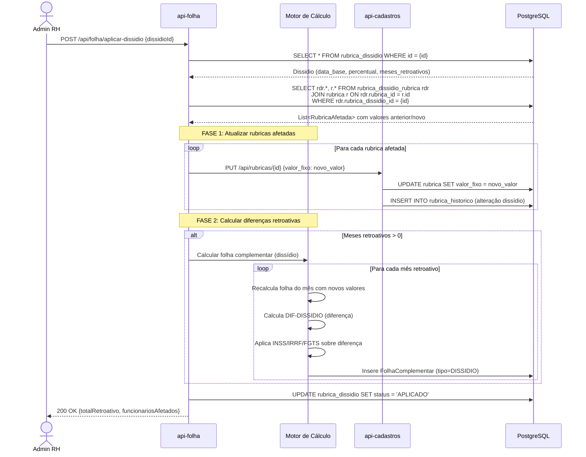
```mermaid
sequenceDiagram
    actor Admin as Admin RH
    participant API as api-folha
    participant Engine as Motor de Cálculo
    participant CAD as api-cadastros
    participant DB as PostgreSQL

    Admin->>API: POST /api/folha/aplicar-dissidio {dissidioId}

    API->>DB: SELECT * FROM rubrica_dissidio WHERE id = {id}
    DB-->>API: Dissidio (data_base, percentual, meses_retroativos)

    API->>DB: SELECT rdr.*, r.* FROM rubrica_dissidio_rubrica rdr<br/>JOIN rubrica r ON rdr.rubrica_id = r.id<br/>WHERE rdr.rubrica_dissidio_id = {id}
    DB-->>API: List<RubricaAfetada> com valores anterior/novo

    Note over API,Engine: FASE 1: Atualizar rubricas afetadas

    loop Para cada rubrica afetada
        API->>CAD: PUT /api/rubricas/{id} {valor_fixo: novo_valor}
        CAD->>DB: UPDATE rubrica SET valor_fixo = novo_valor
        CAD->>DB: INSERT INTO rubrica_historico (alteração dissídio)
    end

    Note over API,Engine: FASE 2: Calcular diferenças retroativas

    alt Meses retroativos > 0
        API->>Engine: Calcular folha complementar (dissídio)

        loop Para cada mês retroativo
            Engine->>Engine: Recalcula folha do mês com novos valores
            Engine->>Engine: Calcula DIF-DISSIDIO (diferença)
            Engine->>Engine: Aplica INSS/IRRF/FGTS sobre diferença
            Engine->>DB: Insere FolhaComplementar (tipo=DISSIDIO)
        end
    end

    API->>DB: UPDATE rubrica_dissidio SET status = 'APLICADO'
    API-->>Admin: 200 OK {totalRetroativo, funcionariosAfetados}
```

---

## Fluxo: Folha Complementar (Correções Pós-Fechamento)

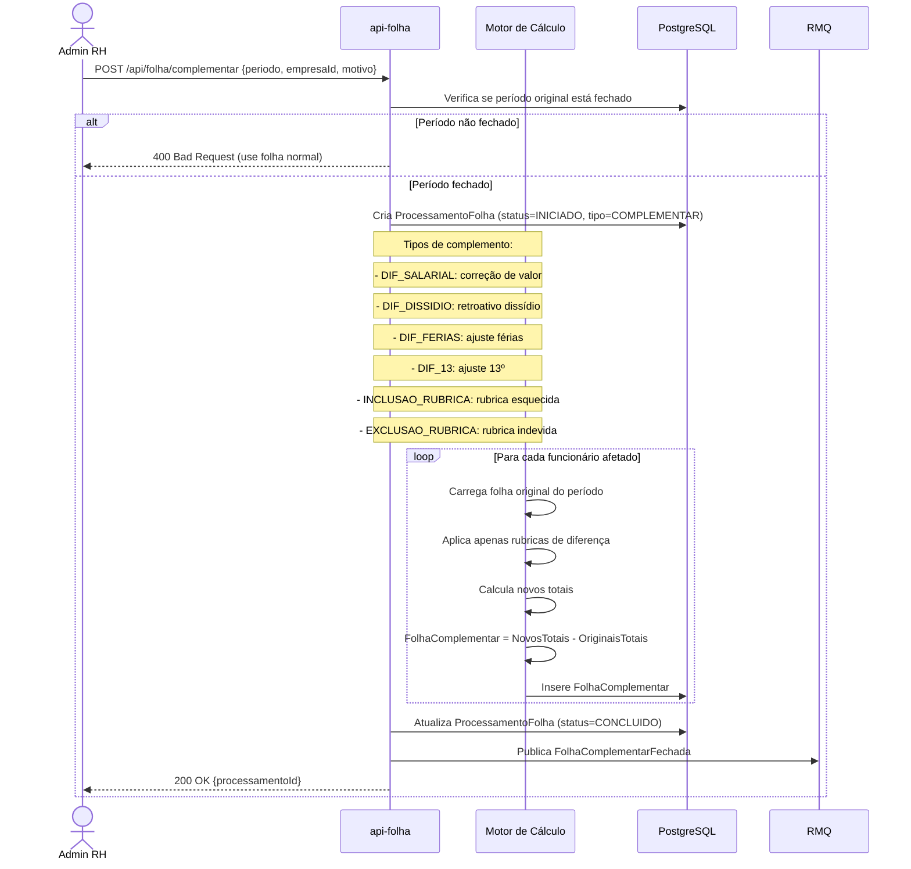
```mermaid
sequenceDiagram
    actor Admin as Admin RH
    participant API as api-folha
    participant Engine as Motor de Cálculo
    participant DB as PostgreSQL

    Admin->>API: POST /api/folha/complementar {periodo, empresaId, motivo}

    API->>DB: Verifica se período original está fechado
    alt Período não fechado
        API-->>Admin: 400 Bad Request (use folha normal)
    else Período fechado
        API->>DB: Cria ProcessamentoFolha (status=INICIADO, tipo=COMPLEMENTAR)

        Note over API,Engine: Tipos de complemento:
        Note over API,Engine: - DIF_SALARIAL: correção de valor
        Note over API,Engine: - DIF_DISSIDIO: retroativo dissídio
        Note over API,Engine: - DIF_FERIAS: ajuste férias
        Note over API,Engine: - DIF_13: ajuste 13º
        Note over API,Engine: - INCLUSAO_RUBRICA: rubrica esquecida
        Note over API,Engine: - EXCLUSAO_RUBRICA: rubrica indevida

        loop Para cada funcionário afetado
            Engine->>Engine: Carrega folha original do período
            Engine->>Engine: Aplica apenas rubricas de diferença
            Engine->>Engine: Calcula novos totais
            Engine->>Engine: FolhaComplementar = NovosTotais - OriginaisTotais
            Engine->>DB: Insere FolhaComplementar
        end

        API->>DB: Atualiza ProcessamentoFolha (status=CONCLUIDO)
        API->>RMQ: Publica FolhaComplementarFechada
        API-->>Admin: 200 OK {processamentoId}
    end
```

---

## Fluxo: Complemento Auxílio-Doença (15+ dias)

```mermaid
sequenceDiagram
    actor Admin as Admin RH
    participant API as api-folha
    participant Engine as Motor de Cálculo
    participant EVT as api-eventos
    participant DB as PostgreSQL

    Admin->>API: POST /api/folha/calcular-complemento-auxilio-doenca {funcionarioId, dataInicio, dataFim}

    API->>EVT: GET /api/eventos/afastamento/{funcionarioId}
    EVT-->>API: EventoAfastamento (CID, data_inicio, data_fim)

    Note over Engine: Empresa paga dias 1-15; INSS paga a partir do 16º dia

    Engine->>Engine: Dias pagos pela empresa = MIN(15, total_dias)
    Engine->>Engine: Dias pagos pelo INSS = MAX(0, total_dias - 15)

    Note over Engine: Cálculo do benefício INSS
    Engine->>Engine: Salário-de-benefício = média 12 meses
    Engine->>Engine: Renda mensal INSS = 91% × salário-de-benefício
    Engine->>Engine: Valor diário INSS = renda_mensal / 30

    Note over Engine: Complemento patronal (se houver acordo/convenção)
    Engine->>Engine: Complemento = salário_dia - valor_diario_INSS
    alt Complemento > 0
        Engine->>Engine: COMPL-AUX-DOENCA = complemento × dias_apos_15
    else Complemento <= 0
        Engine->>Engine: COMPL-AUX-DOENCA = 0
    end

    Engine-->>API: Resultado do complemento
    API-->>Admin: 200 OK {detalhamento auxilio doenca}
```

---

## Fluxo: Salário-Maternidade

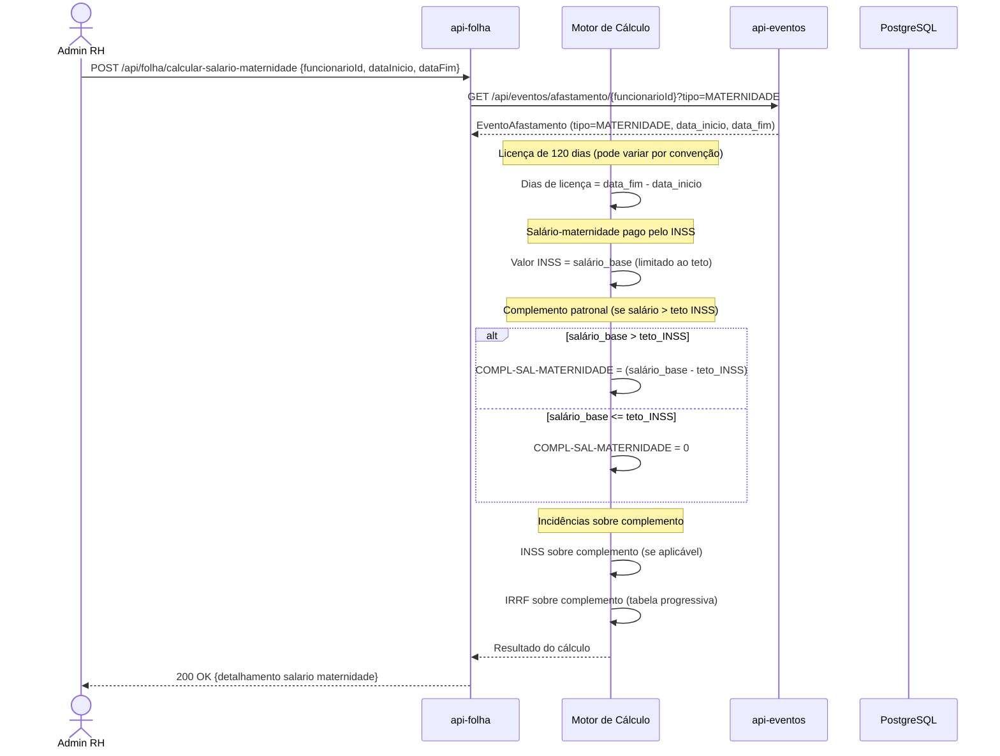
```mermaid
sequenceDiagram
    actor Admin as Admin RH
    participant API as api-folha
    participant Engine as Motor de Cálculo
    participant EVT as api-eventos
    participant DB as PostgreSQL

    Admin->>API: POST /api/folha/calcular-salario-maternidade {funcionarioId, dataInicio, dataFim}

    API->>EVT: GET /api/eventos/afastamento/{funcionarioId}?tipo=MATERNIDADE
    EVT-->>API: EventoAfastamento (tipo=MATERNIDADE, data_inicio, data_fim)

    Note over Engine: Licença de 120 dias (pode variar por convenção)

    Engine->>Engine: Dias de licença = data_fim - data_inicio

    Note over Engine: Salário-maternidade pago pelo INSS
    Engine->>Engine: Valor INSS = salário_base (limitado ao teto)

    Note over Engine: Complemento patronal (se salário > teto INSS)
    alt salário_base > teto_INSS
        Engine->>Engine: COMPL-SAL-MATERNIDADE = (salário_base - teto_INSS)
    else salário_base <= teto_INSS
        Engine->>Engine: COMPL-SAL-MATERNIDADE = 0
    end

    Note over Engine: Incidências sobre complemento
    Engine->>Engine: INSS sobre complemento (se aplicável)
    Engine->>Engine: IRRF sobre complemento (tabela progressiva)

    Engine-->>API: Resultado do cálculo
    API-->>Admin: 200 OK {detalhamento salario maternidade}
```

---

## Fluxo: Acordo Trabalhista (Homologação)

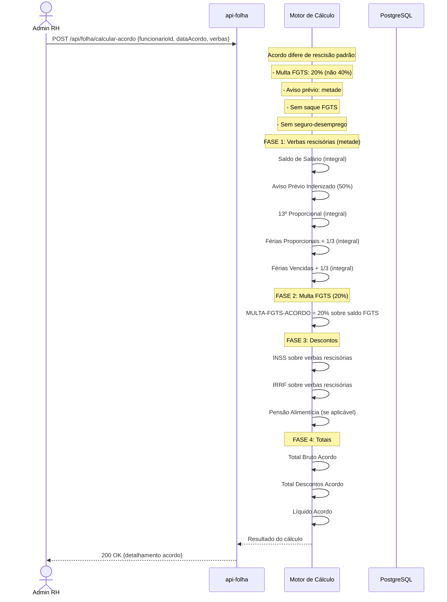
```mermaid
sequenceDiagram
    actor Admin as Admin RH
    participant API as api-folha
    participant Engine as Motor de Cálculo
    participant DB as PostgreSQL

    Admin->>API: POST /api/folha/calcular-acordo {funcionarioId, dataAcordo, verbas}

    Note over Engine: Acordo difere de rescisão padrão:
    Note over Engine: - Multa FGTS: 20% (não 40%)
    Note over Engine: - Aviso prévio: metade
    Note over Engine: - Sem saque FGTS
    Note over Engine: - Sem seguro-desemprego

    Note over Engine: FASE 1: Verbas rescisórias (metade)
    Engine->>Engine: Saldo de Salário (integral)
    Engine->>Engine: Aviso Prévio Indenizado (50%)
    Engine->>Engine: 13º Proporcional (integral)
    Engine->>Engine: Férias Proporcionais + 1/3 (integral)
    Engine->>Engine: Férias Vencidas + 1/3 (integral)

    Note over Engine: FASE 2: Multa FGTS (20%)
    Engine->>Engine: MULTA-FGTS-ACORDO = 20% sobre saldo FGTS

    Note over Engine: FASE 3: Descontos
    Engine->>Engine: INSS sobre verbas rescisórias
    Engine->>Engine: IRRF sobre verbas rescisórias
    Engine->>Engine: Pensão Alimentícia (se aplicável)

    Note over Engine: FASE 4: Totais
    Engine->>Engine: Total Bruto Acordo
    Engine->>Engine: Total Descontos Acordo
    Engine->>Engine: Líquido Acordo

    Engine-->>API: Resultado do cálculo
    API-->>Admin: 200 OK {detalhamento acordo}
```

---

## Fluxo: Estagiário (Bolsa + Recesso)

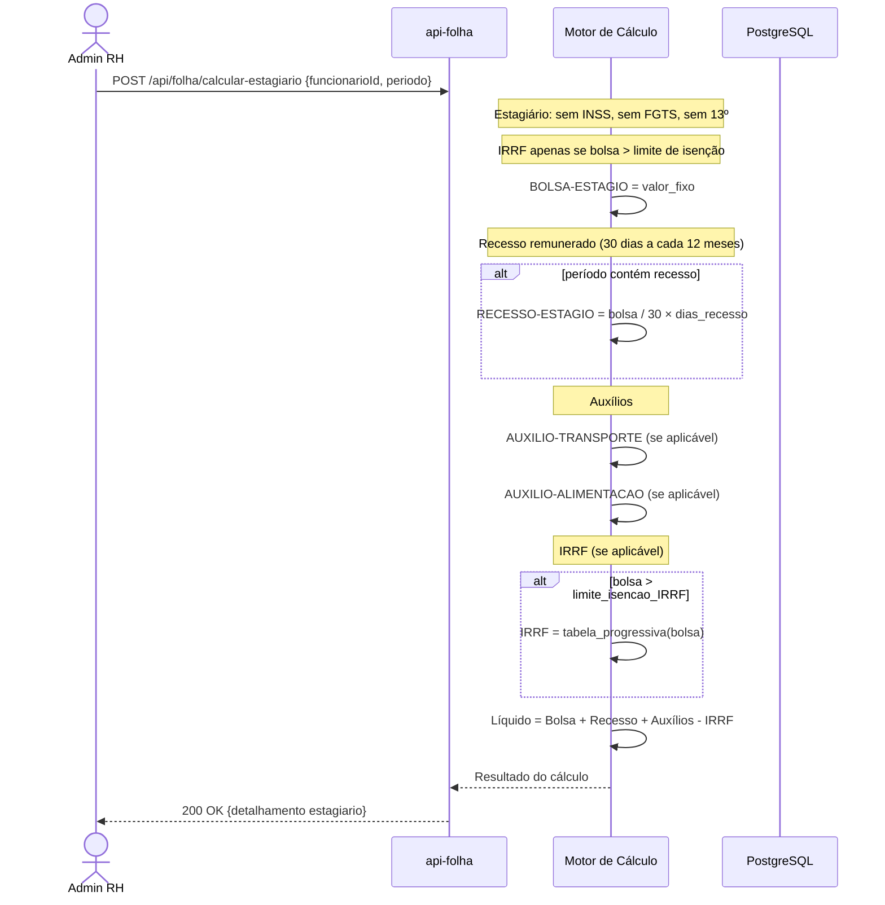
```mermaid
sequenceDiagram
    actor Admin as Admin RH
    participant API as api-folha
    participant Engine as Motor de Cálculo
    participant DB as PostgreSQL

    Admin->>API: POST /api/folha/calcular-estagiario {funcionarioId, periodo}

    Note over Engine: Estagiário: sem INSS, sem FGTS, sem 13º
    Note over Engine: IRRF apenas se bolsa > limite de isenção

    Engine->>Engine: BOLSA-ESTAGIO = valor_fixo

    Note over Engine: Recesso remunerado (30 dias a cada 12 meses)
    alt período contém recesso
        Engine->>Engine: RECESSO-ESTAGIO = bolsa / 30 × dias_recesso
    end

    Note over Engine: Auxílios
    Engine->>Engine: AUXILIO-TRANSPORTE (se aplicável)
    Engine->>Engine: AUXILIO-ALIMENTACAO (se aplicável)

    Note over Engine: IRRF (se aplicável)
    alt bolsa > limite_isencao_IRRF
        Engine->>Engine: IRRF = tabela_progressiva(bolsa)
    end

    Engine->>Engine: Líquido = Bolsa + Recesso + Auxílios - IRRF

    Engine-->>API: Resultado do cálculo
    API-->>Admin: 200 OK {detalhamento estagiario}
```

---

## Fluxo: Autônomo / PJ (RPA)

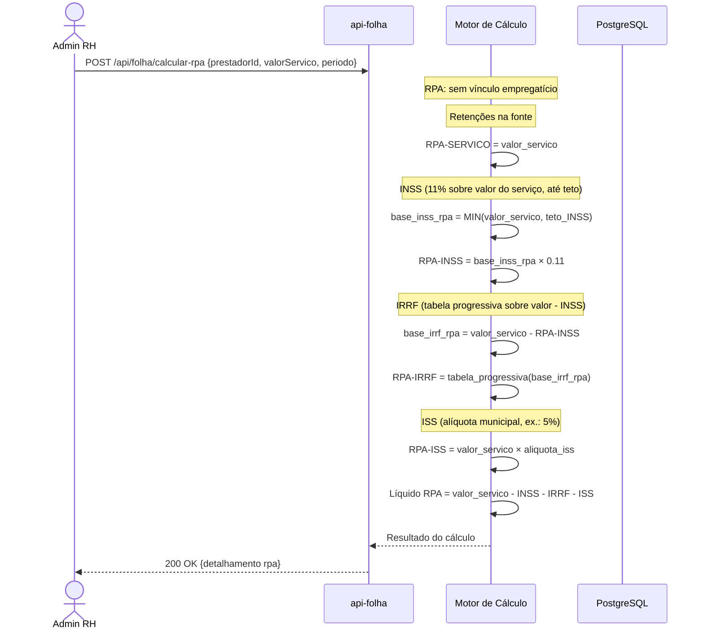
```mermaid
sequenceDiagram
    actor Admin as Admin RH
    participant API as api-folha
    participant Engine as Motor de Cálculo
    participant DB as PostgreSQL

    Admin->>API: POST /api/folha/calcular-rpa {prestadorId, valorServico, periodo}

    Note over Engine: RPA: sem vínculo empregatício
    Note over Engine: Retenções na fonte

    Engine->>Engine: RPA-SERVICO = valor_servico

    Note over Engine: INSS (11% sobre valor do serviço, até teto)
    Engine->>Engine: base_inss_rpa = MIN(valor_servico, teto_INSS)
    Engine->>Engine: RPA-INSS = base_inss_rpa × 0.11

    Note over Engine: IRRF (tabela progressiva sobre valor - INSS)
    Engine->>Engine: base_irrf_rpa = valor_servico - RPA-INSS
    Engine->>Engine: RPA-IRRF = tabela_progressiva(base_irrf_rpa)

    Note over Engine: ISS (alíquota municipal, ex.: 5%)
    Engine->>Engine: RPA-ISS = valor_servico × aliquota_iss

    Engine->>Engine: Líquido RPA = valor_servico - INSS - IRRF - ISS

    Engine-->>API: Resultado do cálculo
    API-->>Admin: 200 OK {detalhamento rpa}
```

---

## Elementos em Tempo de Execução

| Elemento | Papel no Fluxo | Escala | Tecnologia |
|---|---|---|---|
| **Motor de Cálculo** | Engine que avalia rubricas, fórmulas, composições e tabelas progressivas | Em memória (dentro da api-folha) | C# (.NET 10) |
| **Avaliador de Expressão** | Parser e executor de fórmulas matemáticas | Sandbox por thread | NCalc / DynamicExpresso |
| **Redis Cache** | Cache de rubricas, composições e tabelas progressivas | Compartilhado entre réplicas | Redis 7 |
| **PostgreSQL** | Persiste resultados (folha_mensal, folha_rubrica) | Primary + Read Replica | PostgreSQL 16 |
| **RabbitMQ** | Eventos de domínio (FolhaFechada) | Cluster 2+ nós | RabbitMQ 3.13 |

---

## Pontos de Falha Específicos das Rubricas

| Ponto | Falha | Impacto | Recuperação |
|---|---|---|---|
| **Fórmula inválida** | Expressão mal formada ou referência circular | Funcionário não calculado; lote marcado com erro | Validação prévia da sintaxe; sandbox com timeout; rollback do funcionário |
| **Rubrica base não encontrada** | `rubrica_base_id` aponta para rubrica inativa/excluída | Cálculo não conclui | Validação de integridade referencial no cadastro; fallback para 0 |
| **Tabela progressiva desatualizada** | Tabela IRRF/INSS do ano anterior | Cálculo incorreto de impostos | Alerta de vigência; versionamento de tabelas; cache com TTL |
| **Composição cíclica** | A → B → A | Loop infinito no cálculo | Detecção de ciclo na validação; profundidade máxima de 5 níveis |
| **Divisão por zero** | Fórmula com denominador zero | Erro no cálculo do funcionário | Tratamento de exceção; fallback para 0; log do erro |
| **Timeout em fórmula complexa** | Expressão muito pesada | Bloqueio da thread de cálculo | Timeout de 100ms por fórmula; kill da thread; marca funcionário para reprocessamento |
| **Média sem dados** | Nenhum valor nos últimos N meses | Média = 0 (subestimada) | Configurar `considerar_meses_zerados`; alerta se média zerada |
| **Condição inválida** | Expressão condicional mal formada | Rubrica condicional não avaliada | Validação de sintaxe na criação; fallback para `valor_se_falso` |
| **Dissídio parcial** | Algumas rubricas não atualizadas | Inconsistência salarial | Transação atômica; rollback completo se falha parcial |
| **Folha complementar duplicada** | Mesmo ajuste aplicado 2x | Pagamento em duplicidade | Idempotência por (periodo, tipo_complemento, funcionario_id) |

---

## Métricas e SLAs

| Métrica | Alvo | Alerta |
|---|---|---|
| Tempo de cálculo por funcionário | < 10ms | > 50ms |
| Tempo total para 100K funcionários | < 2 horas | > 1h30 (alerta preventivo) |
| Cache hit rate (rubricas) | > 95% | < 90% |
| Erro em avaliação de fórmula | < 0.1% | > 0.5% |
| Funcionários com erro | < 1% | > 3% |

---

## Evidence vs Assumptions

**Evidence**:
- Baseado no PRD F04 (Processamento da Folha) e F02.4 (Rubricas)
- Alinhado com ADR-004 (processamento assíncrono) e ADR-005 (cache Redis)
- Ordem de cálculo compatível com exigências fiscais brasileiras (INSS antes de IRRF)

**Assumptions**:
- Motor de expressão (NCalc) é suficiente para fórmulas de rubricas; não requer engine de script completo
- Tabelas progressivas são atualizadas anualmente e versionadas no banco
- Processamento paralelo por funcionário é seguro (cada funcionário é independente)

---

## Referências Cruzadas

- [Database Model — Rubricas](./database-model-rubricas.md)
- [Runtime View — Folha360](../arquitetura/runtime-view.md)
- [ADR-004 — Processamento Assíncrono da Folha](../arquitetura/adr-004-processamento-assincrono-folha.md)
- [ADR-005 — Redis Cache](../arquitetura/adr-005-redis-cache-tabelas.md)
- [PRD-F04 — Processamento da Folha](../../tasks/prd-f04-processamento-folha/prd.md)
