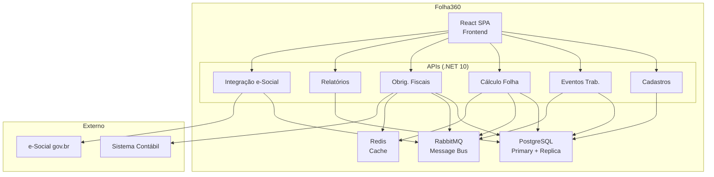

# Arquitetura do Folha360

Bem-vindo à documentação de arquitetura de software do **Folha360** — sistema de folha de pagamento compatível com e-Social v. S-1.3.

## 🎯 Visão Geral

O Folha360 é um sistema distribuído e modular para processamento de folha de pagamento, desenvolvido em **.NET 10 + React + PostgreSQL**, projetado para suportar **100.000+ funcionários** com processamento mensal em **menos de 2 horas**.

### Stack Tecnológica
| Camada | Tecnologia |
|---|---|
| Backend | .NET 10 (C#) — APIs RESTful |
| Frontend | React SPA (Vite) |
| Banco de Dados | PostgreSQL 16 |
| Cache | Redis 7 |
| Mensageria | RabbitMQ 3.13 |
| Containerização | Docker + Kubernetes |
| Observabilidade | Seq + Prometheus + Grafana |

### Módulos do Sistema
1. **Cadastros** — Funcionários, empresas, cargos, rubricas
2. **Eventos Trabalhistas** — Admissão, férias, afastamentos, desligamentos (S-2200, S-2230, S-2299)
3. **Cálculo da Folha** — Remuneração, descontos, holerites (S-1200/S-1210)
4. **Obrigações Fiscais** — IRRF, INSS, FGTS (S-5001/S-5002)
5. **Relatórios** — Holerites, DIRF, RAIS, exportações
6. **Integração e-Social** — Envio de eventos, consulta de recibos

---

## � Ordem de Implementação

Consulte a página **[Features & Roadmap](./Features)** para:
- Ordem de implementação das 10 features
- Dependências entre features
- Cronograma estimado (44 semanas)
- Riscos e mitigações por feature

---

## �📚 Estrutura da Documentação

### 🏛️ Visões Arquiteturais (C4)
- [Visão em Camadas](./layered-architecture) — Arquitetura em 4 camadas lógicas
- [Fronteiras de Componentes](./component-boundaries) — Bounded contexts e responsabilidades
- [Fronteiras de Integração](./integration-boundaries) — Contratos, mensageria e riscos
- [Visão de Deployment](./deployment-view) — Infraestrutura e containers
- [Visão de Runtime](./runtime-view) — Fluxos de execução e sequências

### ✅ Decisões de Arquitetura (ADRs)
- [ADR-001: Monólito Modular](./adr-001-monolito-modular)
- [ADR-002: RabbitMQ como Message Broker](./adr-002-rabbitmq-message-broker)
- [ADR-003: Schema por Tenant](./adr-003-schema-por-tenant)
- [ADR-004: Processamento Assíncrono da Folha](./adr-004-processamento-assincrono-folha)
- [ADR-005: Redis para Cache de Tabelas](./adr-005-redis-cache-tabelas)

### 🔍 Análises e Avaliações
- [Cenários de Atributos de Qualidade](./quality-attribute-scenarios) — Performance, segurança, disponibilidade
- [Registro de Riscos](./architecture-risk-register) — Heatmap e mitigações
- [Matriz de Tradeoffs](./tradeoff-matrix) — Análise comparativa de decisões
- [Opções Arquiteturais](./architecture-options) — Decisões em aberto

### 📋 Boas Práticas de Desenvolvimento
- [Backend .NET 10](./instrucoes-backend) — Convenções de código, MediatR, EF Core
- [Frontend React](./instrucoes-frontend) — TypeScript, Tailwind, TanStack Query
- [Design Patterns](./instrucoes-design-patterns) — Repository, Strategy, Saga, CQRS
- [Princípios SOLID](./instrucoes-solid) — SRP, OCP, LSP, ISP, DIP com exemplos
- [DevOps e FinOps](./instrucoes-devops-finops) — CI/CD, Docker, K8s, custos
- [Banco de Dados](./instrucoes-database) — PostgreSQL, multi-tenant, migrations
- [Segurança](./instrucoes-seguranca) — LGPD, OWASP, criptografia, auth

---

## 🚀 Comece Por Aqui

| Perfil | Leitura Recomendada |
|---|---|
| **Desenvolvedor Backend** | [Layered Architecture](./layered-architecture) → [Component Boundaries](./component-boundaries) → [ADR-001](./adr-001-monolito-modular) → [Boas Práticas Backend](./instrucoes-backend) |
| **Desenvolvedor Frontend** | [Layered Architecture](./layered-architecture) → [Runtime View](./runtime-view) → [Boas Práticas Frontend](./instrucoes-frontend) |
| **DevOps / SRE** | [Deployment View](./deployment-view) → [Quality Scenarios](./quality-attribute-scenarios) → [Boas Práticas DevOps](./instrucoes-devops-finops) |
| **Arquiteto / Tech Lead** | Leitura completa na ordem da sidebar |
| **Product Owner / PM** | Home → [Quality Scenarios](./quality-attribute-scenarios) → [Risk Register](./architecture-risk-register) |

---

## 📊 Diagrama Geral da Arquitetura

---

## 🔗 Links Rápidos
- [Contexto do Projeto](../inputs/prompts/folha360.md)
- [Templates de Arquitetura](../../../templates/)
- [Skills de Arquitetura](../../../agents/skills/)

---

*Última atualização: Junho 2026 | Versão dos layouts e-Social: S-1.3 (cons. até NT 06.2026)*
